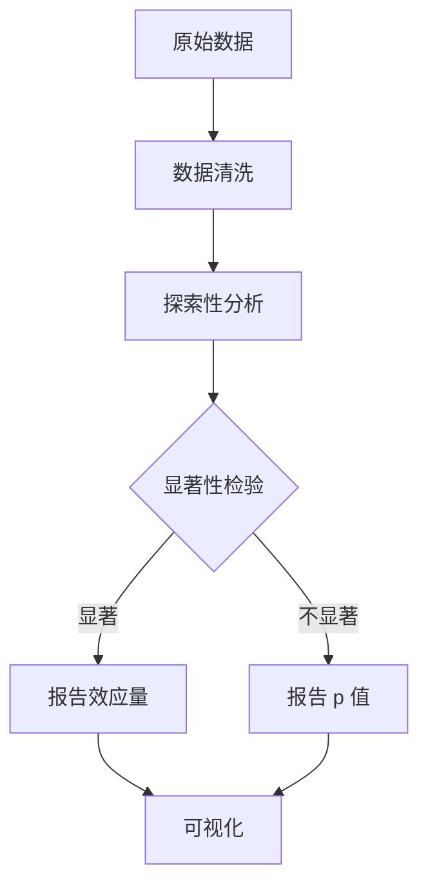

---
aliases:
  - IMRaD 结构
  - 论文写作框架
  - 学术论文结构
tags:
created: 2026-05-17
updated: 2026-05-17
  - academic-writing
  - paper-structure
  - research-methodology
  - IMRaD
---

# IMRaD 论文结构

## 概述

**IMRaD** 是学术论文最常见的结构组织方式，代表 **Introduction（引言）**、**Methods（方法）**、**Results（结果）** 和 **Discussion（讨论）**。这一结构广泛应用于自然科学、工程学、医学和社会科学领域的实证研究论文。

## 历史沿革

IMRaD 结构并非凭空产生，而是经历了长期的演化过程：

| 时期 | 典型结构 | 说明 |
|------|----------|------|
| 17—18 世纪 | 叙述式 | 按实验时间顺序叙述 |
| 19 世纪 | 理论—实验二分 | 开始区分理论框架与实验 |
| 20 世纪初期 | 逐步结构化 | 期刊开始要求标准化格式 |
| 1950s—1970s | IMRaD 成形 | 受自然科学期刊推动 |
| 1980s 至今 | IMRaD 主导 | 成为"黄金标准" |

## 各部分详解

### 1. Introduction（引言）

引言的目的是回答 **"为什么要做这项研究？"**。通常采用 **漏斗式结构**（funnel structure）——从广泛背景逐步聚焦到具体研究问题。

$$
\text{背景} \rightarrow \text{文献空白} \rightarrow \text{研究问题} \rightarrow \text{假设}
$$

#### 引言的 CARS 模型

Swales（1990）提出的 **CARS（Create A Research Space）** 模型包含三个语步：

1. **建立领域**（Establishing a territory）—— 声明研究领域的重要性
2. **确立空白**（Establishing a niche）—— 指出已有研究不足
3. **占据空白**（Occupying the niche）—— 提出研究目的和方法

### 2. Methods（方法）

方法部分的目的是回答 **"研究是怎样做的？"**。核心要求是 **可重复性**（reproducibility），即读者应能根据描述完全重复实验或分析。

$$
P(\text{repeat}) \propto \text{clarity}(\text{methods}) \times \text{completeness}(\text{protocol})
$$

#### 方法部分的要点

- **研究对象**（participants / samples）：来源、数量、纳入排除标准
- **实验设计**（experimental design）：分组、随机化、盲法
- **数据收集**（data collection）：仪器、指标、流程
- **数据分析**（data analysis）：统计方法、软件版本
- **伦理声明**（ethical approval）：伦理委员会批准编号

### 3. Results（结果）

结果部分回答 **"发现了什么？"**。应客观呈现研究发现，不包含解释和讨论。

#### 结果呈现原则

- 先文字概述，再图表展示
- 图表独立自明（self-explanatory）
- 统计结果标准化报告：$t(df) = x.xx, p < .05$

### 4. Discussion（讨论）

讨论部分回答 **"结果意味着什么？"**。这是全文最体现学术深度的章节。

#### 讨论的结构

$$
\text{主要发现} \rightarrow \text{与文献比较} \rightarrow \text{局限性} \rightarrow \text{意义与展望}
$$

### 5. Conclusion（结论）

并非所有论文都需要独立的结论部分。如果需要，应：

- 总结核心发现（1—2 句话）
- 阐明理论和实践意义
- 指出未来研究方向

## 变体与扩展

| 变体名称 | 结构 | 适用场景 |
|----------|------|----------|
| IMRaD+C | + Conclusion | 实证研究 |
| IMRaRD | + Results + Discussion 分离 | 复杂多实验论文 |
| AIMRaD | + Abstract | 正式期刊投稿 |
| IRDaM | 次序调整 | 某些社会科学期刊 |
| 叙事综述 | 无固定结构 | 文献综述类 |

## 写作策略

### 标题写作

- Hook Principle（钩子原则）：前 5—7 词抓住读者
- 信息密度：每个词都应承载信息
- 句式选择：名词短语 > 完整句 > 问句

### 摘要写作

$$
\text{摘要} = B + P + M + R + C
$$

其中 $B$ = 背景，$P$ = 问题，$M$ = 方法，$R$ = 结果，$C$ = 结论。

### 过渡与衔接

各部分之间的过渡至关重要。例如：

- Introduction → Methods：**"To address this gap, we conducted..."**
- Methods → Results：**"A total of X participants were included..."**
- Results → Discussion：**"These findings suggest that..."**

## 常见错误

1. **引言过长**—— 超过全文 20% 通常不恰当
2. **方法缺乏细节**—— 未提供版本号、参数设置等
3. **结果包含讨论**—— 在结果段使用"surprisingly"等评价词
4. **讨论重复结果**—— 应解释而非复述
5. **忽略局限性**—— 评审人常见批评点

## 推荐工具

| 工具 | 用途 |
|------|------|
| Overleaf | 在线 LaTeX 写作 |
| Zotero | 参考文献管理 |
| Grammarly | 语法与风格检查 |
| ChatGPT / Claude | 辅助写作与润色 |

## 延伸阅读

- Swales, J. (1990). *Genre Analysis: English in Academic and Research Settings*
- Day, R. A. (1988). *How to Write and Publish a Scientific Paper*
- Gopen, G. D., & Swan, J. A. (1990). The Science of Scientific Writing
