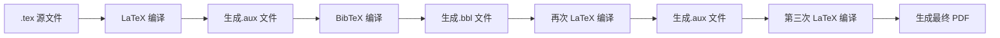

# BibTeX 安装与使用 (BibTeX Installation and Usage)

> BibTeX 是 LaTeX 的标准参考文献管理工具，用于生成和管理书目引用。它与 LaTeX 配合使用，支持自动格式化参考文献列表。

## 一、BibTeX 概述 (Overview)

### 1.1 什么是 BibTeX

BibTeX 是由 Oren Patashnik 和 Leslie Lamport 于 1985 年为 LaTeX 设计的参考文献管理工具。它允许用户将参考文献存储在一个独立的 `.bib` 文件中，然后在文档中通过 `\cite{}` 命令引用，由 BibTeX 自动排序和格式化。

**核心文件类型**：

| 文件扩展名 (Extension) | 作用 (Purpose) |
|----------------------|--------------|
| `.bib` | 参考文献数据库，存储书目信息 |
| `.bst` | 参考文献样式文件，定义格式化规则 |
| `.bbl` | BibTeX 生成的格式化参考文献列表 |
| `.blg` | BibTeX 运行日志文件 |

### 1.2 工作流程 (Workflow)



**编译命令序列**：

```bash
latex document.tex
bibtex document
latex document.tex
latex document.tex
```

或使用现代工具链：

```bash
pdflatex document.tex
bibtex document
pdflatex document.tex
pdflatex document.tex
```

## 二、BibTeX 安装 (Installation)

### 2.1 TeX 发行版安装

BibTeX 通常随 TeX 发行版一起安装。推荐以下发行版：

| 发行版 (Distribution) | 平台 (Platform) | 特点 (Features) |
|---------------------|---------------|----------------|
| TeX Live | Linux/Windows/macOS | 全面完整，官方推荐 |
| MiKTeX | Windows | 轻量级，按需安装包 |
| MacTeX | macOS | 基于 TeX Live，macOS 优化 |

**安装命令**：

```bash
# Ubuntu/Debian
sudo apt-get install texlive texlive-bibtex-extra

# macOS (Homebrew)
brew install --cask mactex

# Windows — 下载 MiKTeX 安装包，或通过包管理器 winget
winget install MiKTeX.MiKTeX
```

### 2.2 验证安装

```bash
# 检查 BibTeX 是否可用
bibtex --version

# 检查 LaTeX 是否可用
pdflatex --version
```

## 三、BibTeX 文件格式 (File Format)

### 3.1 基本结构

`.bib` 文件使用简单的文本格式，每条记录以 `@` 开头，指定文献类型和引用键 (cite key)。

```bibtex
@article{key2024,
  author    = {作者名字},
  title     = {文章标题},
  journal   = {期刊名称},
  year      = {2024},
  volume    = {卷号},
  number    = {期号},
  pages     = {起始页--结束页},
  doi       = {DOI 编号}
}
```

### 3.2 常用文献类型

| 类型 (Type) | 说明 (Description) | 必需字段 (Required Fields) |
|------------|------------------|--------------------------|
| `@article` | 期刊文章 | author, title, journal, year |
| `@book` | 书籍 | author/editor, title, publisher, year |
| `@inproceedings` | 会议论文 | author, title, booktitle, year |
| `@incollection` | 书籍中的章节 | author, title, booktitle, publisher, year |
| `@phdthesis` | 博士论文 | author, title, school, year |
| `@mastersthesis` | 硕士论文 | author, title, school, year |
| `@techreport` | 技术报告 | author, title, institution, year |
| `@misc` | 其他类型 | 无必需字段，推荐提供 title |

### 3.3 常用字段

| 字段 (Field) | 说明 (Description) | 示例 (Example) |
|-------------|------------------|---------------|
| `author` | 作者（多个作者用 `and` 分隔） | `author = {张三 and 李四}` |
| `title` | 标题 | `title = {标题文本}` |
| `journal` | 期刊名 | `journal = {Nature}` |
| `year` | 年份 | `year = {2024}` |
| `volume` | 卷号 | `volume = {42}` |
| `number` | 期号 | `number = {3}` |
| `pages` | 页码 | `pages = {123--145}` |
| `publisher` | 出版社 | `publisher = {科学出版社}` |
| `doi` | DOI 编号 | `doi = {10.1000/xyz123}` |
| `url` | 网址 | `url = {https://example.com}` |
| `note` | 附加说明 | `note = {accessed: 2024-01-01}` |

### 3.4 特殊字符处理

```bibtex
% 重音字符
author = {J{\"o}rg M{\"u}ller}

% 中文作者（使用 UTF-8 编码）
author = {王明 and 李华}

% 特殊符号
title   = {The \LaTeX\ Companion}
```

## 四、在 LaTeX 中引用 (Citation in LaTeX)

### 4.1 基本引用命令

```latex
\documentclass{article}
\usepackage{cite}  % 或使用 natbib

\begin{document}
\section{引言}
如文献~\cite{key2024}所示，BibTeX 是强大的文献管理工具。
多篇文献同时引用~\cite{key2023, key2024}。

\bibliographystyle{plain}
\bibliography{references}  % references.bib 文件

\end{document}
```

### 4.2 使用 natbib 宏包

`natbib` 提供更强大的引用控制：

```latex
\usepackage[numbers,sort&compress]{natbib}
% 选项: numbers（数字编号）, authoryear（作者-年份）
% sort&compress（排序并压缩连续编号）

% 引用命令
\citet{key2024}    % 文本内引用: Author (2024)
\citep{key2024}    % 括号引用: (Author, 2024)
\citeauthor{key2024} % 仅作者: Author
\citeyear{key2024}   % 仅年份: 2024
```

### 4.3 使用 biblatex 宏包

```latex
\usepackage[backend=biber, style=ieee]{biblatex}
\addbibresource{references.bib}

\begin{document}
\cite{key2024}
\printbibliography
\end{document}
```

## 五、参考文献样式 (Bibliography Styles)

### 5.1 常用内置样式

| 样式 (Style) | 特点 (Features) | 适用领域 (Field) |
|-------------|---------------|----------------|
| `plain` | 按字母排序，数字编号 | 通用 |
| `unsrt` | 按引用顺序编号 | 论文、报告 |
| `alpha` | 作者缩写+年份作为标签 | 人文社科 |
| `abbrv` | 缩写形式的 plain 样式 | 自然科学 |
| `ieeetr` | IEEE 格式 | 工程、计算机 |
| `acm` | ACM 格式 | 计算机科学 |
| `apalike` | APA 风格 | 心理学、社会科学 |

### 5.2 自定义样式

创建自定义 `.bst` 文件，或使用 `custom-bib` 工具生成：

```bash
# 使用 makebst 工具交互式创建
latex makebst
```

## 六、BibTeX 与中文支持 (Chinese Support)

### 6.1 中文配置

使用 `ctex` 宏包并采用 UTF-8 编码：

```latex
\documentclass[UTF8]{ctexart}
\usepackage[sort&compress]{natbib}
\bibliographystyle{plain}

\begin{document}
中文文献引用~\cite{王明2024}。
\bibliography{references}
\end{document}
```

### 6.2 中文参考文献格式

```bibtex
@book{王明2024,
  author    = {王明 and 李华},
  title     = {现代数据库系统},
  publisher = {清华大学出版社},
  year      = {2024},
  address   = {北京},
  isbn      = {978-7-302-xxxxx-x}
}

@article{张伟2023,
  author  = {张伟 and 赵强 and 刘芳},
  title   = {深度学习在自然语言处理中的应用综述},
  journal = {计算机学报},
  year    = {2023},
  volume  = {46},
  number  = {5},
  pages   = {1001--1025}
}
```

## 七、管理工具 (Management Tools)

| 工具 (Tool) | 平台 (Platform) | 特点 (Features) |
|------------|---------------|----------------|
| JabRef | Java 跨平台 | 开源强大，支持搜索和导入 |
| Zotero | 浏览器扩展+桌面 | 自动抓取网页文献信息 |
| Mendeley | 桌面+Web | PDF 管理与文献引用一体化 |
| EndNote | Windows/macOS | 商业软件，功能全面 |

## 八、常见问题 (FAQ)

| 错误信息 (Error) | 可能原因 (Cause) | 解决方法 (Solution) |
|-----------------|----------------|-------------------|
| "I couldn't open file name.bib" | .bib 文件不存在或路径错误 | 确认文件名和路径正确 |
| "Warning -- entry type not defined" | 文献类型拼写错误 | 检查 @ 后的类型名 |
| "Warning -- no author" | 缺少 author 字段 | 补全必填字段 |
| "Citation undefined" | 引用键不匹配 | 检查 cite key 是否正确 |
| "Multiple citations" | 引用键重复 | 确保每个引用键唯一 |

## 相关条目 (Related Entries)

- [[LaTeX]], [[BibliographyManagement]], [[AcademicWriting]]
- [[常用格式指南]], [[../INDEX|00_KnowledgeFramework 索引]]
