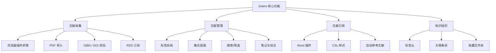

---
aliases:
  - Zotero使用
  - 文献管理
  - 参考文献管理
tags:
  - reference-management
  - zotero
  - citation
  - research-tools
---

# Zotero 使用指南

## 概述

**Zotero**（发音 /zoʊˈtɛroʊ/）是一款开源、免费的参考文献管理软件，由乔治·梅森大學的 **Roy Rosenzweig Center for History and New Media** 开发。Zotero 支持文献条目的收集、组织、标注和引用，是学术研究的重要工具。

## 核心功能架构



## 安装与配置

### 安装方式

| 平台 | 推荐方式 | 说明 |
|------|----------|------|
| Windows | 安装包 | 从官网下载 `.exe` 安装器 |
| macOS | DMG | 拖入 Applications 文件夹 |
| Linux | 压缩包 | 解压后运行 `zotero` 可执行文件 |
| 便携版 | Portable | 用于 U 盘携带 |

### 浏览器连接器

Zotero 需要安装浏览器连接器（Connector）来实现一键抓取网页文献：

- **Chrome / Edge**：Zotero Connector 扩展
- **Firefox**：Zotero Connector 附加组件
- **Safari**：Zotero Connector 扩展

连接器可自动识别网页中的文献元数据（metadata），包括期刊文章、图书、学位论文、网页等多种类型。

## 文献收集

### 1. 由浏览器抓取

在学术数据库页面（如 Google Scholar、PubMed、CNKI、Web of Science），点击浏览器工具栏的 Zotero 图标即可一键保存文献信息。

### 2. 由标识符导入

Zotero 支持通过标识符自动导入：

$$
\text{Identifier} \in \{\text{ISBN}, \text{DOI}, \text{PMID}, \text{arXiv ID}\}
$$

点击工具栏的"通过标识符添加"按钮，输入对应编号即可。

### 3. 批量导入

- **BibTeX 导入**：将 `.bib` 文件拖入 Zotero
- **RIS 导入**：数据库导出 RIS 格式后导入
- **CSV 导入**：使用 Zotero 的 CSV 导入功能（需安装 Better BibTeX 插件）

## 文献组织

### 集合（Collections）

集合是 Zotero 的文件夹系统，支持：

- 层级嵌套（**无限制深度**）
- 同一条目可属于多个集合（通过链接而非复制）
- 支持动态搜索的"已保存搜索"（saved searches）

### 标签（Tags）

标签是跨集合组织的核心手段。推荐做法：

- 使用 **层级标签**：`方法论/定量/问卷`
- 统一 **标签命名**：避免"AI"与"Artificial Intelligence"并存
- 利用 **自动标签**：来自数据库的关键词自动添加

### 高级搜索

Zotero 支持组合条件搜索：

$$
\text{search} = \bigcup_{i} \text{(条件_1 AND 条件_2 ... OR 条件_n)}
$$

可搜索字段：标题、作者、日期、标签、笔记内容等。

## 文献引用与参考文献

### CSL 样式

Zotero 使用 **CSL（Citation Style Language）** 来定义引用格式。内置超过 10000 种样式：

- APA 7th / MLA 9th / Chicago 17th
- GB/T 7714（中国国家标准）
- Nature / Science / IEEE 等期刊自定义样式

### 在 Word 中使用

Zotero Word 插件提供：

- **Add/Edit Citation**：光标处插入引用
- **Add/Edit Bibliography**：生成参考文献表
- **Document Preferences**：切换引用样式
- **Unlink Citations**：取消链接（定稿前操作）

### 与 LaTeX 协作

通过 Better BibTeX 插件，Zotero 可与 Overleaf 或本地 LaTeX 环境同步：

$$
\text{Zotero} \xrightarrow{\text{自动导出 .bib}} \text{LaTeX} \xrightarrow{\text{\textbackslash cite\{\}}} \text{PDF}
$$

## 插件生态

| 插件名称 | 功能 |
|----------|------|
| Better BibTeX | 增强 BibTeX/BibLaTeX 支持 |
| ZotFile | PDF 自动重命名与移动 |
| Zotero Scholar Citations | 抓取 Google Scholar 被引数 |
| Zotero OCR | PDF 文字识别 |
| Paper Machines | 文献计量分析 |
| **插件管理工具** | 一键安装/更新插件 |

## 同步与协作

### 存储方案对比

| 方案 | 存储空间 | 费用 | 同步速度 |
|------|----------|------|----------|
| Zotero 官方同步 | 300 MB 免费，2GB 付费 | \$20/年（6GB） | 一般 |
| WebDAV | 自定义 | 按服务商定价 | 取决于服务器 |
| Zotero 群组 | 与个人共享配额 | 免费 | 同上 |

### 群组协作

Zotero 的群组（Group）功能支持：

- **公开群组**：任何人可查看
- **封闭群组**：邀请制
- **成员权限**：只读 / 读写 / 管理员

适合：课题组文献库、读书会阅读列表、跨机构协作项目。

## 数据管理

### 备份策略

1. 定期导出 `.zotero` 数据库备份
2. 同步附件到云存储（OneDrive / Dropbox）
3. 导出 `BibTeX` 格式作为纯文本备份

### 数据迁移

跨平台迁移步骤：

```bash
1. 在旧设备：Zotero → 导出为 Zotero RDF
2. 复制存储文件夹（zotero/storage）
3. 在新设备：Zotero → 导入 → 选择 RDF 文件
4. 覆盖存储文件夹路径
```

## 常见问题解决

| 问题 | 解决方案 |
|------|----------|
| 浏览器连接器无法识别 | 检查页面是否为纯数据库页面 |
| 引用样式缺失 | 在 CSL 仓库搜索安装 |
| PDF 无法自动抓取元数据 | 手动添加 DOI 或重命名 PDF |
| 同步冲突 | 检查冲突条目，保留最新版本 |
| Word 插件不显示 | 重新安装 Zotero，运行修复 |

## 高效工作流

### 个人推荐流程

```
发现文献 → 浏览器一键保存 → 添加 PDF → 阅读标注 → 提取笔记 → 撰写时引用 → 自动生成参考文献
```

### 定期维护

- 每周合并重复条目
- 每月清理未附件的条目
- 每季度导出全库备份

## 延伸资源

- [Zotero 官方文档](https://www.zotero.org/support/)
- [Better BibTeX 插件文档](https://retorque.re/zotero-better-bibtex/)
- [CSL 样式编辑器](https://editor.citationstyles.org/)
