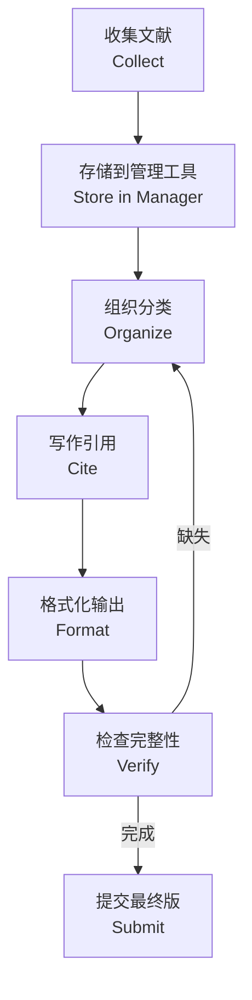

---
aliases: [常用格式指南, CommonFormatGuide, CitationStyles, 引用格式]
tags: ['BibTeX', 'LaTeX', 'CitationStyles', 'AcademicWriting', 'Bibliography']
---

# 常用格式指南 (Common Format Guide)

## 一、什么是引用格式 (What are Citation Styles)

引用格式 (Citation Style) 是学术写作中用于标注文献来源的标准化规则体系。常见的格式包括 APA、MLA、Chicago、IEEE 等，不同学科领域有各自的偏好：

| 领域 (Field) | 常用格式 | 特点 |
|------------|---------|------|
| 心理学、教育学 | APA (7th ed.) | 作者-年份制，强调时效性 |
| 人文学科 | MLA (9th ed.) | 作者-页码制，注重版本信息 |
| 历史学、出版业 | Chicago (17th ed.) | 提供注释-书目和作者-日期两种体系 |
| 工程、计算机 | IEEE | 数字编号制，简洁高效 |
| 医学 | AMA / Vancouver | 数字编号，按引用顺序排列 |
| 法学 | Bluebook | 脚注为主，格式严谨 |
| 化学 | ACS | 数字或作者-年份均可 |

## 二、正文引用方式 (In-text Citations)

### 2.1 作者-年份制 (Author-Year)

```latex
% APA 风格
根据 Smith (2020) 的研究... \citep{smith2020}
多项研究证实了此结论 \citep{smith2020, jones2019, lee2018}
```

### 2.2 数字编号制 (Numbered)

```latex
% IEEE 风格
如文献 [1] 所示... \cite{smith2020}
多项研究证实 [1]–[3]...
```

### 2.3 脚注制 (Footnote)

```latex
% Chicago 脚注风格
事实表明。\footnote{Author Name, \emph{Book Title} (Place: Publisher, Year), page.}
```

### 2.4 引用类型对比

| 引用类型 | APA 示例 | IEEE 示例 | Chicago 示例 |
|---------|---------|---------|------------|
| 直接引用 | (Smith, 2020, p. 42) | [1, p. 42] | 脚注^1 |
| 间接引用 | (Smith, 2020) | [1] | 脚注^1 |
| 多位作者 | (Smith et al., 2020) | [1]–[3] | Smith et al., \emph{Title} |
| 多篇文献 | (Smith, 2020; Jones, 2019) | [1], [4], [7] | 分别脚注 |

## 三、参考文献格式 (Reference List Formats)

### 3.1 期刊文章 (Journal Article)

**APA**：
```bibtex
@article{smith2020,
  author  = {Smith, J. and Jones, M.},
  title   = {Title of the Article},
  journal = {Journal Name},
  volume  = {42},
  number  = {3},
  pages   = {123--145},
  year    = {2020},
  doi     = {10.1000/xyz123}
}
```

**IEEE**：
```bibtex
@article{smith2020_ieee,
  author  = {J. Smith and M. Jones},
  title   = {Title of the Article},
  journal = {Journal Name},
  volume  = {42},
  number  = {3},
  pages   = {123--145},
  year    = {2020}
}
```

### 3.2 书籍 (Book)

```bibtex
@book{author2020,
  author    = {Author, A.},
  title     = {Book Title},
  publisher = {Publisher Name},
  address   = {Location},
  year      = {2020},
  edition   = {2}
}
```

### 3.3 会议论文 (Conference Paper)

```bibtex
@inproceedings{author2020_conf,
  author    = {Author, A. and Coauthor, B.},
  title     = {Paper Title},
  booktitle = {Proceedings of the Conference Name},
  year      = {2020},
  pages     = {100--110},
  address   = {Conference Location},
  publisher = {Publisher}
}
```

### 3.4 网站与在线资源 (Web Resources)

```bibtex
@misc{author2020_web,
  author  = {Organization Name},
  title   = {Page Title},
  year    = {2020},
  url     = {https://example.com},
  urldate = {2020-01-15}
}
```

## 四、格式规范对比 (Format Comparison)

| 字段 | APA | MLA | Chicago | IEEE |
|------|-----|-----|---------|------|
| 作者名 | Smith, J. | Smith, John | Smith, John | J. Smith |
| 日期位置 | 作者后 | 文末 | 作者后/脚注 | 文末 |
| 标题大小写 | 首句大写 | 标题大写 | 标题大写 | 首句大写 |
| DOI 要求 | 推荐 | 推荐 | 推荐 | 不必须 |
| 访问日期 | 在线资源需注明 | 可选 | 在线资源需注明 | 可选 |

## 五、格式化原则 (Formatting Principles)

### 5.1 一致性 (Consistency)

文献格式必须在整篇文档中保持统一。避免混用不同格式风格。

### 5.2 完整性 (Completeness)

每条文献应包含足够的识别信息，使读者能够准确找到原始文献。

### 5.3 准确性 (Accuracy)

核对所有字段的正确性，特别是作者姓名、出版年份、卷期页码、DOI。

### 5.4 易用性 (Accessibility)

- 优先使用 DOI 而非 URL
- 避免使用失效链接
- 标注非英文文献的语言信息

## 六、中英文混排 (Chinese-English Mixed Formatting)

### 6.1 中文文献格式规范

| 文献类型 | 格式示例 |
|---------|---------|
| 期刊文章 | 作者. 标题[J]. 期刊名, 年份, 卷(期): 页码. |
| 图书 | 作者. 书名[M]. 出版地: 出版社, 年份. |
| 学位论文 | 作者. 标题[D]. 学校所在地: 学校名称, 年份. |
| 会议论文 | 作者. 标题[C]. 会议名, 地点, 年份. |

### 6.2 GB/T 7714 国家标准格式

中国国家标准 GB/T 7714-2015《信息与文献 参考文献著录规则》：

```bibtex
@article{张三2024,
  author  = {张三 and 李四},
  title   = {论文标题},
  journal = {期刊名称},
  year    = {2024},
  volume  = {42},
  number  = {3},
  pages   = {123--145}
}
```

## 七、引用管理最佳实践 (Best Practices)



### 7.1 管理工具推荐

| 工具 (Tool) | 支持格式 | 协作功能 | 价格 |
|------------|---------|---------|:----:|
| Zotero | APA, MLA, Chicago, GB/T 7714 | 支持 | 免费 |
| Mendeley | 多种 | 支持 | 免费/付费 |
| EndNote | 6000+ | 支持 | 付费 |
| JabRef | BibTeX | 有限 | 免费 |
| Cite This For Me | 多种 | 有限 | 免费/付费 |

### 7.2 避免常见错误

- 作者名的大小写、简写不一致
- 缺失的出版信息（出版社所在地、DOI）
- 未区分同名不同作者
- 引用与参考文献列表不匹配
- 中英文标点混用

## 八、格式转换 (Format Conversion)

从一种格式转换为另一种格式：
- 使用 Zotero 的"Item → Export"功能
- 使用 `bibutils` 命令行工具
- 使用 Pandoc 的 `--bibliography` 和 `--csl` 选项

```bash
# Bibutils 示例：BibTeX 转 MODS
bib2xml references.bib > references.xml
xml2mods references.xml > references_mods.xml
```

## 相关条目 (Related Entries)

[[BibTeX 安装与使用]], [[05_ComputerScience/DigitalNotes/LaTeX/LaTeX|LaTeX]], [[BibliographyManagement]], [[13_Others/AcademicWriting/AcademicWriting|AcademicWriting]], [[GB7714]], [[../INDEX|00_KnowledgeFramework 索引]]

