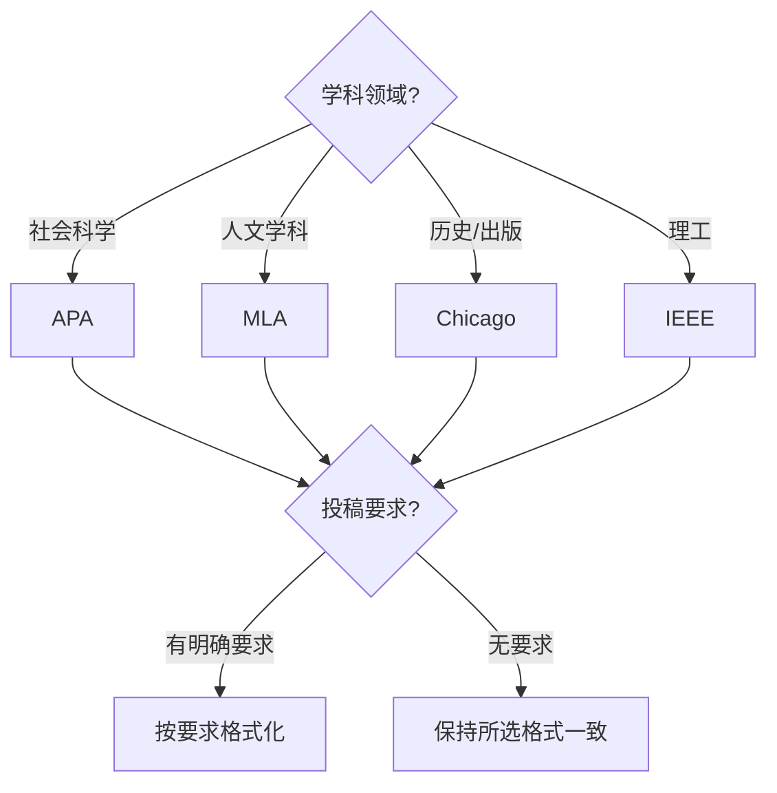

# 引用格式指南

引用格式指南（Citation Style Guide）系统介绍了学术界常见的引用规范体系，帮助研究者在学术写作中正确标注信息来源，维护学术诚信和可追溯性。

## 为什么需要遵守引用格式

学术引用规范服务于多个核心目的：

1. **学术诚信**：尊重他人智力成果，避免抄袭（Plagiarism）的学术不端行为
2. **可追溯性**：读者可根据引用找到原始文献，验证论据
3. **学科规范**：不同学科形成了各自的引用传统，是"行话"的一部分
4. **评价指标**：引用频次是学术影响力的重要度量指标

## 三大主流引用格式对比

### 主流格式对比表

| 特征 | APA 7th | MLA 9th | Chicago 17th |
|------|---------|---------|-------------|
| 学科领域 | 社会科学 | 人文学科 | 历史/出版 |
| 正文引用方式 | (Author, Year) | (Author Page) | 脚注 或 (Author Year) |
| 参考文献标题 | References | Works Cited | Bibliography |
| DOI 格式要求 | 强烈推荐，完整 URL 格式 | 推荐 | 推荐 |
| 作者名称格式 | 姓, 名首字母 | 姓, 名 | 姓, 名 |

### 引用格式选择流程

## 正文引用格式详解

### APA（作者-年份制）

基本格式：

$$ \text{叙述式: Author (Year)} $$
$$ \text{括号式: (Author, Year)} $$
$$ \text{直接引用加页码: (Author, Year, p. X)} $$

### MLA（作者-页码制）

$$ \text{括号式: (Author Page)} $$
$$ \text{示例: (Smith 42)} $$

### Chicago 注释-参考文献制

正文使用上标数字标注脚注：

$$ ^{1} \text{Author, Title (Place: Publisher, Year), Page.} $$

后续引用简化为：

$$ ^{2} \text{Author, Short Title, Page.} $$

## 参考文献格式示例

### 期刊文章

$$ \text{APA: Smith, J. (2020). Article title. \textit{Journal Name}, 12(3), 45-67.} $$
$$ \text{MLA: Smith, John. "Article Title." \textit{Journal Name}, vol. 12, no. 3, 2020, pp. 45-67.} $$
$$ \text{Chicago: Smith, John. "Article Title." \textit{Journal Name} 12, no. 3 (2020): 45-67.} $$

### 书籍

$$ \text{APA: Smith, J. (2020). \textit{Book Title}. Publisher.} $$
$$ \text{MLA: Smith, John. \textit{Book Title}. Publisher, 2020.} $$
$$ \text{Chicago: Smith, John. \textit{Book Title}. Place: Publisher, 2020.} $$

### 网页

$$ \text{APA: Author. (Year, Month Day). \textit{Title}. Site. URL} $$
$$ \text{MLA: Author. "Title." \textit{Site Name}, Date, URL} $$
$$ \text{Chicago: Author. "Title." Site Name. Last modified Date. URL} $$

## 中国国家标准 GB/T 7714-2015

中文学术论文的参考文献著录标准：

### 基本格式

$$ \text{期刊: 作者. 文章标题[J]. 刊名, 年, 卷(期): 起止页码.} $$
$$ \text{书籍: 作者. 书名[M]. 版本. 出版地: 出版社, 出版年.} $$
$$ \text{学位论文: 作者. 论文题名[D]. 所在城市: 学位授予单位, 年份.} $$

### GB/T 7714 的文献类型标识

| 标识 | 文献类型 |
|------|---------|
| [J] | 期刊文章 |
| [M] | 专著/书籍 |
| [D] | 学位论文 |
| [C] | 会议论文 |
| [N] | 报纸文章 |
| [P] | 专利 |
| [S] | 标准 |
| [DB] | 数据库 |
| [EB] | 电子资源 |

## IEEE 引用格式

IEEE 格式主要用于工程技术领域：

- **正文引用**：使用方括号数字编号 [1], [2], [3]
- **参考文献**：按引用顺序编号排列
- **期刊格式**：A. Author, "Title," *Journal Name*, vol. x, no. x, pp. xx-xx, Year.
- **会议格式**：A. Author, "Title," in *Proc. Conference Name*, Year, pp. xx-xx.

## 引用管理最佳实践

1. **尽早开始**：研究项目启动时就建立引用管理习惯
2. **管理工具辅助**：使用 Zotero / EndNote 自动管理
3. **完整记录元数据**：不要遗漏 DOI、卷期号、出版年
4. **注意检索日期**：网页和动态内容的引用需标注访问日期
5. **遵循期刊要求**：投稿前必须按照目标期刊的规范检查格式

## 常见引用错误

1. 引文与参考文献列表不匹配
2. 作者姓名大小写、拼写错误
3. 缺少 DOI 或 URL
4. 出版年错误
5. 标题大小写格式不统一
6. 混用不同格式
7. 同一出版物在不同位置参考文献格式不一致
8. 缺少页码或页码范围格式错误
9. 电子资源缺少访问日期
10. 多次引用同一文献时格式混乱

## 软件与数据引用的注意事项

在数字时代，软件和数据集也需要被正确引用：

- **软件**：作者 (年份). 软件名 (版本号) [Computer software]. 发布者. URL
- **数据集**：作者 (年份). 数据集名称 [Data set]. 存储库. DOI/URL
- **AI 模型**：越来越多的期刊要求标注使用了何种 AI 工具及使用方法
- **代码仓库**：作者, "仓库名称," GitHub. URL (accessed Date).

## 跨学科投稿的格式选择

多学科交叉研究可能面临格式选择困境：

1. 目标期刊优先 — 以投稿期刊的格式为准
2. 学科惯例优先 — 主要贡献领域的引用格式
3. 混合处理 — 正文使用统一格式，但不同部分参照不同学科惯例（需谨慎）
4. 使用引用管理软件 — 一键切换格式，减少手动调整

## 相关条目

- [[APA 格式]]
- [[Zotero]]
- [[学术写作]]
- [[文献综述]]
- [[INDEX|当前目录索引]]
