---
aliases: [UNESCOFramework, UNESCO 学科分类, UNESCO Basic Sciences Classification]
tags: ['ClassificationMappings', 'UNESCO', 'KnowledgeFramework', 'Taxonomy']
created: 2026-05-17
updated: 2026-05-17
---

# 联合国教科文组织基础科学分类体系 (UNESCO Basic Sciences Classification Framework)

## 概述

联合国教科文组织（United Nations Educational, Scientific and Cultural Organization, UNESCO）建立的国际通用学科分类标准是全球学术交流、教育合作和科技统计的基础性框架。该分类体系将基础科学（Basic Sciences）划分为七大核心学科领域，每个领域进一步细分为子学科和研究方向。该体系广泛应用于全球高等教育专业设置、科研经费分配、学术出版分类、国际人才流动统计以及联合国可持续发展目标（SDGs）的监测评估。

## 分类体系结构

```mermaid
graph TD
  A[UNESCO 基础科学分类<br/>Basic Sciences] --> B[数学<br/>Mathematics]
  A --> C[逻辑学<br/>Logic]
  A --> D[天文学<br/>Astronomy]
  A --> E[物理学<br/>Physics]
  A --> F[化学<br/>Chemistry]
  A --> G[生物学<br/>Biology]
  A --> H[地球科学<br/>Earth Sciences]
  B --> B1[代数学 Algebra]
  B --> B2[分析学 Analysis]
  B --> B3[几何学 Geometry]
  B --> B4[拓扑学 Topology]
  B --> B5[概率论 Probability]
  B --> B6[数论 Number Theory]
  E --> E1[经典力学<br/>Classical Mechanics]
  E --> E2[电磁学<br/>Electromagnetism]
  E --> E3[热力学<br/>Thermodynamics]
  E --> E4[量子力学<br/>Quantum Mechanics]
  E --> E5[相对论<br/>Relativity]
  G --> G1[分子生物学<br/>Molecular Biology]
  G --> G2[细胞生物学<br/>Cell Biology]
  G --> G3[遗传学<br/>Genetics]
  G --> G4[生态学<br/>Ecology]
  H --> H1[地质学 Geology]
  H --> H2[气象学 Meteorology]
  H --> H3[海洋学 Oceanography]
  H --> H4[地理学 Geography]
```

## 七大基础科学详解

### 1. 数学 (Mathematics)

数学研究数量（Quantity）、结构（Structure）、空间（Space）和变化（Change）等抽象概念的学科，是自然科学和工程技术的基础语言。

**研究方法论**：公理化方法（Axiomatic Method）、逻辑证明（Logical Proof）、抽象建模（Abstraction Modeling）、数值计算（Numerical Computation）

**主要分支和核心公式**：
- 代数学（Algebra）：群论 $G = \{g_1, g_2, \dots\}$，环论、域论、线性代数
- 分析学（Analysis）：微积分基本定理 $\frac{d}{dx}\int_a^x f(t)dt = f(x)$，实分析、复分析
- 几何学（Geometry）：欧氏几何、微分几何、黎曼几何、代数几何
- 拓扑学（Topology）：点集拓扑、代数拓扑 $H_n(X)$、微分拓扑
- 概率论与数理统计（Probability and Statistics）：$P(A|B) = \frac{P(A \cap B)}{P(B)}$，大数定律
- 数论（Number Theory）：素数定理 $\pi(x) \sim \frac{x}{\ln x}$，哥德巴赫猜想

### 2. 逻辑学 (Logic)

逻辑学研究有效推理形式（Valid Reasoning）和思维规律（Laws of Thought）的学科，是数学和计算机科学的共同基础。

**研究方法论**：符号化（Symbolization）、形式化（Formalization）、公理化（Axiomatization）、元逻辑分析（Metalogical Analysis）

**主要分支**：
- 命题逻辑（Propositional Logic）：$\neg p$、$p \land q$、$p \lor q$、$p \rightarrow q \equiv \neg p \lor q$
- 谓词逻辑（Predicate Logic）：$\forall x (P(x) \rightarrow Q(x))$，$\exists x P(x)$
- 模态逻辑（Modal Logic）：$\Box p$（必然）、$\Diamond p$（可能）、$\Box p \rightarrow p$
- 数理逻辑（Mathematical Logic）：哥德尔不完备定理、可计算性理论
- 非经典逻辑（Non-Classical Logic）：直觉主义逻辑、模糊逻辑、时态逻辑、描述逻辑

### 3. 天文学 (Astronomy)

天文学研究天体和宇宙的自然科学，探索宇宙的起源、结构、演化和最终命运。

**研究方法论**：天文观测（Observation）、理论建模（Theoretical Modeling）、数值模拟（Numerical Simulation）、统计分析

**主要分支**：
- 天体物理学（Astrophysics）：恒星结构与演化、核合成理论
- 宇宙学（Cosmology）：$\Lambda CDM$ 模型、宇宙微波背景辐射、暗能量与暗物质
- 行星科学（Planetary Science）：行星地质学、大气科学、系外行星探测
- 射电天文学（Radio Astronomy）：射电干涉测量、脉冲星定时

**核心公式**：
- 史瓦西半径：$R_s = \frac{2GM}{c^2}$
- 哈勃定律：$v = H_0 d$，$H_0 \approx 70 \text{ km/s/Mpc}$
- 开普勒第三定律：$T^2 = \frac{4\pi^2}{GM} a^3$
- 恒星光度：$L = 4\pi R^2 \sigma T_{\text{eff}}^4$

### 4. 物理学 (Physics)

物理学研究物质（Matter）、能量（Energy）及其相互作用（Interaction）的基础科学，是工程技术的核心理论源泉。

**研究方法论**：实验验证（Experimental Verification）、理论推导（Theoretical Derivation）、数学建模（Mathematical Modeling）、计算机模拟

**主要分支和核心方程**：
- 经典力学（Classical Mechanics）：牛顿定律 $\sum \mathbf{F} = m\mathbf{a}$，拉格朗日方程 $\frac{d}{dt}\frac{\partial L}{\partial \dot{q}_i} - \frac{\partial L}{\partial q_i} = 0$
- 电磁学（Electromagnetism）：麦克斯韦方程组 $\nabla \cdot \mathbf{E} = \frac{\rho}{\varepsilon_0}$，$\nabla \times \mathbf{E} = -\frac{\partial \mathbf{B}}{\partial t}$
- 热力学与统计物理（Thermodynamics）：$\Delta U = Q - W$，$S = k \ln \Omega$
- 量子力学（Quantum Mechanics）：薛定谔方程 $\hat{H}|\psi\rangle = i\hbar\frac{\partial}{\partial t}|\psi\rangle$，不确定性原理 $\Delta x \Delta p \geq \frac{\hbar}{2}$
- 相对论（Relativity）：$E = mc^2$，$G_{\mu\nu} + \Lambda g_{\mu\nu} = \frac{8\pi G}{c^4} T_{\mu\nu}$
- 粒子物理（Particle Physics）：标准模型、希格斯机制、规范场论

### 5. 化学 (Chemistry)

化学研究物质的组成（Composition）、结构（Structure）、性质（Properties）及其变化规律的科学，被誉为"中心科学"。

**研究方法论**：实验分析（Experimental Analysis）、合成制备（Synthesis）、结构表征（Characterization）、理论计算

**主要分支**：
- 无机化学（Inorganic Chemistry）：配位化学、固体化学、金属有机化学
- 有机化学（Organic Chemistry）：官能团转化、立体化学、全合成
- 物理化学（Physical Chemistry）：化学热力学 $\Delta G = \Delta H - T\Delta S$、化学动力学
- 分析化学（Analytical Chemistry）：色谱法、质谱法、光谱法、电化学分析
- 高分子化学（Polymer Chemistry）：自由基聚合、缩聚反应、高分子表征
- 生物化学（Biochemistry）：酶催化、代谢途径、蛋白质结构与功能

**核心方程**：
- 化学平衡：$K = \frac{[C]^c[D]^d}{[A]^a[B]^b}$，$\Delta G^0 = -RT \ln K$
- 能斯特方程：$E = E^0 - \frac{RT}{nF}\ln Q$
- 阿伦尼乌斯方程：$k = A e^{-E_a/RT}$

### 6. 生物学 (Biology)

生物学研究生命现象（Life Phenomena）和生命活动规律（Laws of Life Activities）的科学。

**研究方法论**：观察（Observation）、实验（Experiment）、比较（Comparison）、系统分析（Systems Analysis）、组学技术

**主要分支**：
- 分子生物学（Molecular Biology）：中心法则（DNA → RNA → Protein），DNA 双螺旋结构 AT-GC 碱基配对
- 细胞生物学（Cell Biology）：细胞膜流动镶嵌模型、细胞器结构与功能、信号转导通路
- 遗传学（Genetics）：孟德尔分离定律和自由组合定律，基因表达调控
- 进化生物学（Evolutionary Biology）：自然选择、遗传漂变、物种形成
- 生态学（Ecology）：种群动态 $dN/dt = rN(1 - N/K)$，生态系统能量流动、生物地球化学循环
- 神经生物学（Neurobiology）：神经元动作电位 $\Delta V_m = I \cdot R$，突触可塑性

### 7. 地球科学 (Earth Sciences)

地球科学研究地球系统（Earth System）及其圈层相互作用（Interaction of Spheres）的科学，涵盖岩石圈、水圈、大气圈和生物圈。

**研究方法论**：野外观测（Field Observation）、实验室分析（Laboratory Analysis）、数值模拟（Numerical Modeling）、遥感监测

**主要分支**：
- 地质学（Geology）：板块构造理论、岩石循环、地层层序律、地质年代学
- 气象学与气候学（Meteorology and Climatology）：大气环流、天气系统、$CO_2$ 温室效应、气候变化
- 海洋学（Oceanography）：热盐环流、大洋环流、海气相互作用、海洋酸化
- 地理学（Geography）：自然地理、人文地理、地理信息系统（GIS）、遥感
- 环境科学（Environmental Science）：环境化学、污染控制、生态修复、环境管理

## UNESCO 学科分类的历史演变

| 时期 | 主要事件 | 影响与意义 |
|:----|:---------|:-----------|
| 1946年 | UNESCO 成立，建立国际学科分类标准 | 奠定全球学术交流基础 |
| 1950年代 | 发布自然科学分类目录 | 划分数学、物理、化学、生物、地学五大基础科学 |
| 1960年代 | 首版 ISCED 发布 | 统一全球教育统计口径 |
| 1970年代 | 扩展社会科学和人文学科分类 | 形成完整的知识体系框架 |
| 1980年代 | 引入交叉学科分类 | 适应跨学科研究趋势 |
| 1990年代 | ISCED-97 修订，增加信息技术分类 | 响应计算机和互联网时代 |
| 2000年代 | 纳入纳米技术、生物技术前沿领域 | 跟进现代科技发展 |
| 2010年代 | ISCED-2011 发布，强化交叉整合 | 促进学科融合与创新教育 |
| 2020年代 | 人工智能和数据科学分类讨论 | 适应 AI 时代的学科重构 |

## 与其他学科分类体系的对比

| 比较维度 | UNESCO 分类 | ISCED 分类 | OECD Frascati 分类 | 中国学科分类 (GB/T 13745) |
|:---------|:------------|:-----------|:-------------------|:--------------------------|
| 发布机构 | UNESCO | UNESCO | OECD | 中国国家标准委 |
| 目的定位 | 学术交流与教育 | 教育统计 | 科技研发统计 | 科研管理与学科建设 |
| 分类原则 | 学科知识体系 | 教育阶段与领域 | 研发活动类型 | 学科门类与层次 |
| 一级学科数量 | 7 (基础科学) | 11 (教育领域) | 6 (科技领域) | 14 (学科门类) |
| 更新频率 | 约 10~15 年 | 约 10 年 | 约 5 年 | 约 5~8 年 |
| 跨学科支持 | 有限 | 有限 | 较强 | 逐步加强 |
| 应用范围 | 国际学术组织 | 全球教育数据 | OECD 国家 | 中国教育科研体系 |

## 交叉学科与新兴领域

| 交叉领域 | 涉及的基础学科 | 典型研究方向 |
|:---------|:--------------|:-------------|
| 生物信息学 | 生物学 + 数学 + 计算机科学 | 基因组分析、蛋白质结构预测 |
| 量子信息科学 | 物理学 + 数学 + 计算机科学 | 量子计算、量子密钥分发 |
| 地球系统科学 | 地球科学 + 物理 + 化学 + 生物 | 气候变化模拟、碳循环 |
| 神经科学 | 生物学 + 物理 + 计算机 + 心理学 | 脑机接口、认知计算 |
| 材料科学与工程 | 物理 + 化学 + 工程 | 纳米材料、智能材料、超材料 |
| 环境化学 | 化学 + 地球科学 + 生物学 | 污染物迁移转化、环境修复 |
| 合成生物学 | 生物学 + 化学 + 工程 | 基因回路设计、生物制造 |

## 在教育与科技政策中的应用

UNESCO 分类体系是全球教育统计（Education Statistics）和科技统计的核心工具，主要用于：
- 全球高等教育学科布局分析
- 国际学生流动方向和专业的统计
- 科研产出（论文、专利）的学科分类
- 国家科技竞争力评价指标设计
- 联合国可持续发展目标（SDGs）的科学指标监测
- UNESCO 科技资助项目的学科归属

## 参考文献

- UNESCO《国际教育标准分类法》(ISCED-2011), UNESCO Institute for Statistics
- UNESCO《科技统计手册》, UNESCO Publishing
- OECD《Frascati 手册：研究与实验发展调查标准实践》, OECD Publishing
- 中华人民共和国国家标准《学科分类与代码》GB/T 13745-2009
- 中国教育部《学位授予和人才培养学科目录》
- 国务院学位委员会《博士、硕士学位授权学科和专业学位授权类别目录》

## 相关条目

- [[00_KnowledgeFramework/KnowledgeGraph/INDEX|KnowledgeGraph]]
- [[00_KnowledgeFramework/KnowledgeGraph/CrossDisciplinaryLinks|CrossDisciplinaryLinks]]
- [[InformationArchitecture]]
- [[OECDClassification]]
- [[Taxonomy]]
- [[11_ManagementSciences/LibraryAndArchive/KnowledgeManagement|KnowledgeManagement]]
- [[ISCED]]

