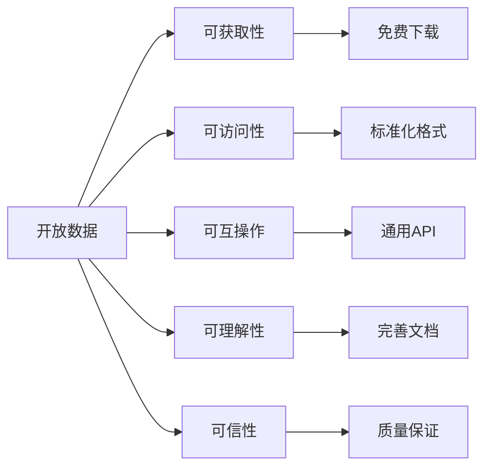
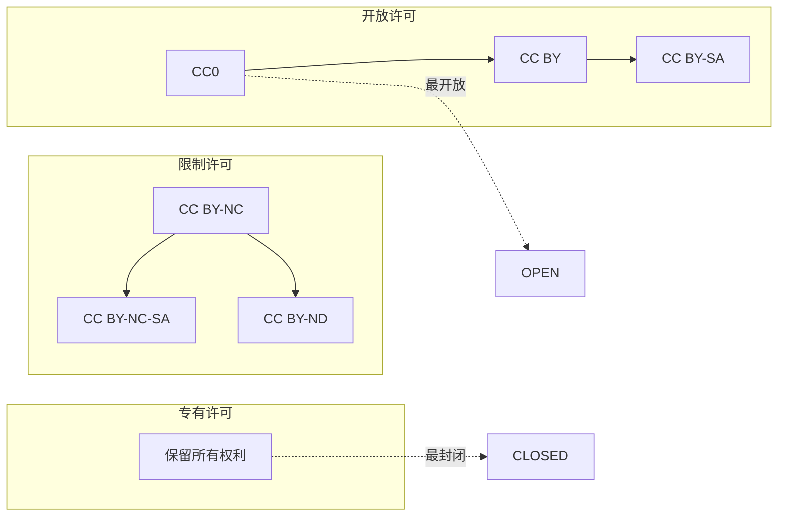

---
aliases:
  - 数据集
  - Datasets
  - 开放数据
  - OpenData
  - 科学数据集
tags:
  - datasets
  - open-data
  - scientific-data
  - data-repositories
  - data-licensing
  - data-science
---

# 数据集（Datasets）

数据集是数据科学和人工智能的基础资源。本文涵盖开放数据运动、科学数据集、数据存储库和数据许可等核心主题。

## 一、开放数据运动

### 1.1 开放数据原则

根据**开放定义**（Open Definition），开放数据必须满足：

1. **可获取性**（Availability）：数据应以方便且可修改的形式提供
2. **再分发**（Redistribution）：允许自由再分发
3. **再利用**（Reuse）：允许修改和衍生作品
4. **无歧视**（No Discrimination）：对任何人或团体平等
5. **互操作性**（Interoperability）：无格式锁定

**开放数据五大支柱**：



### 1.2 开放数据生态系统

| 层面 | 参与者 | 职责 |
|------|--------|------|
| 数据生产者 | 政府、科研机构、企业 | 采集和发布数据 |
| 数据存储库 | Zenodo, Figshare, Dryad | 托管和归档 |
| 数据索引 | Google Dataset Search, DataCite | 发现和关联 |
| 数据消费者 | 研究人员、开发者、公众 | 使用和分析 |
| 资助者 | NSF, NIH, 欧盟Horizon | 提供资金和强制要求 |

## 二、科学数据集

### 2.1 数据管理生命周期

```
研究规划 → 数据采集 → 数据处理 → 数据分析 → 
数据归档 → 数据发布 → 数据重用 → 
                      ↑         ↓
                  数据引用 ← 数据更新
```

**FAIR数据原则**：

| 原则 | 全称 | 要求 |
|:----:|------|------|
| F | Findable（可发现） | 分配唯一标识（DOI） |
| A | Accessible（可访问） | 通过标准协议获取 |
| I | Interoperable（可互操作） | 使用标准格式和词汇 |
| R | Reusable（可重用） | 提供清晰许可和元数据 |

### 2.2 科学数据存储库

**通用存储库**：

| 存储库 | 托管机构 | 容量 | 特色 | 费用 |
|--------|---------|:----:|------|:----:|
| Zenodo | CERN | 50GB/数据集 | DOI分配、GitHub集成 | 免费 |
| Figshare | Digital Science | 不限 | 数据+代码+图表 | 免费（有限） |
| Dryad | 学术联盟 | 不限 | 期刊集成 | 出版费 |
| OSF | Center for Open Science | 不限 | 项目全生命周期 | 免费 |
| Mendeley Data | Elsevier | 10GB | 基于云的平台 | 免费 |

**领域专用存储库**：

| 领域 | 存储库 | 特点 |
|------|--------|------|
| 生物信息学 | NCBI GenBank | DNA序列、基因表达 |
| 神经科学 | NeuroVault | 脑成像数据 |
| 地球科学 | PANGAEA | 地球与环境数据 |
| 社会科学 | ICPSR | 社会调查数据 |
| 天文学 | NASA ADS | 天文目录与图像 |
| 材料科学 | Materials Project | 材料性质计算数据 |
| 化学 | PubChem | 化学分子数据 |

## 三、数据引用与归属

### 3.1 数据引用格式

推荐采用**JDDCP（Joint Declaration of Data Citation Principles）**格式：

```
Author(s). (Year). Title of Dataset (Version). Publisher.
Identifier (e.g., DOI).
```

示例：
```
Deng, J., et al. (2009). ImageNet (v1.0). Stanford Vision Lab.
https://doi.org/10.1145/3065386
```

### 3.2 数据引用度量

$$ \text{Data Impact} = \sum_{i} w_i \cdot \text{Citation}_i + \text{Download}_i + \text{View}_i $$

**替代指标（Altmetrics）**：
- Crossref Event Data
- PlumX Metrics
- Altmetric.com

## 四、数据许可详解

### 4.1 数据共享协议谱系



### 4.2 数据许可选择指南

| 使用场景 | 推荐许可 | 原因 |
|---------|---------|------|
| 公共研究数据 | CC0 | 最大程度促进再利用 |
| 要求署名 | CC BY 4.0 | 保留作者归属权 |
| 确保衍生作品开放 | CC BY-SA 4.0 | 防止闭源衍生 |
| 非商业研究 | CC BY-NC 4.0 | 限制商业用途 |
| 数据库共享 | ODbL | 专为数据库设计 |
| 敏感数据 | 限制访问协议 | 保护隐私和安全 |

## 五、数据质量管理

### 5.1 质量评估框架

$$ \text{DQ}_{\text{score}} = \sum_{i=1}^{n} w_i \cdot \text{metric}_i $$

其中 $w_i$ 为各维度权重，需根据应用场景设定。

**评估维度**：

| 维度 | 指标 | 权重（推荐） | 评估方法 |
|------|------|:-----------:|---------|
| 完整性 | 缺失率 | 25% | 统计缺失值 |
| 一致性 | 矛盾记录比 | 20% | 约束验证 |
| 准确性 | 错误率 | 25% | 抽样核查 |
| 时效性 | 数据年龄 | 15% | 检查时间戳 |
| 独特性 | 重复记录比 | 15% | 重复检测 |

### 5.2 数据清洗流程

```
原始数据 → 解析与导入 → 格式标准化 → 
缺失值处理 → 异常值检测 → 重复记录处理 →
数据转换 → 特征工程 → 质量验证 → 清洗完成
```

**常用清洗工具**：

| 工具 | 类型 | 语言 | 特点 |
|------|------|:----:|------|
| pandas | 库 | Python | 数据框操作 |
| dplyr | 包 | R | 数据操作 |
| OpenRefine | GUI应用 | Java | 交互式清洗 |
| Trifacta | 商业工具 | — | 智能清洗建议 |
| Great Expectations | 库 | Python | 数据质量测试 |

## 六、数据治理

### 6.1 治理框架

数据治理包含以下关键组件：

1. **数据策略**：明确数据所有权和使用规则
2. **数据标准**：格式、命名、文档规范
3. **数据安全**：访问控制、加密、审计日志
4. **数据质量**：持续监控和改进机制
5. **数据合规**：遵守GDPR、HIPAA等法规
6. **数据伦理**：确保公平性、透明度和问责

### 6.2 伦理考量

**数据隐私保护**：

| 技术 | 原理 | 隐私保障 | 效用损失 |
|------|------|:--------:|:--------:|
| 匿名化 | 移除个人标识符 | 低 | 低 |
| 差分隐私 | 添加校准噪声 | 高 | 中 |
| k-匿名化 | 泛化准标识符 | 中 | 中 |
| 合成数据 | 生成人工数据 | 高 | 高 |
| 联邦学习 | 不共享原始数据 | 高 | 低 |

**伦理审查清单**：

- 数据采集是否获得知情同意？
- 数据中是否存在群体偏见？
- 数据使用是否可能造成歧视？
- 是否记录了数据来源和处理步骤？
- 是否提供了数据弃用机制？

## 七、未来趋势

1. **数据市场与数据交易**：数据即商品的经济模式
2. **联邦数据**：分布式数据管理
3. **AI驱动数据管理**：自动标注、清洗、增强
4. **数据可追溯性**：区块链+数据血缘
5. **实时数据管道**：流式数据处理
6. **合成数据普及**：隐私保护的替代方案
7. **数据民主化**：低代码/无代码数据工具

## 参考资源

- Wilkinson, M. D., et al. (2016). The FAIR Guiding Principles. *Scientific Data*, 3, 160018.
- Open Data Institute: https://theodi.org
- DataCite: https://datacite.org
- re3data (Registry of Research Data Repositories): https://www.re3data.org
- Creative Commons Data: https://creativecommons.org/about/program-areas/data

## 相关条目

[[数据集选择指南]], [[OpenData]], [[DataScience]], [[ResearchMethods]], [[LicenseAndCopyright]]
