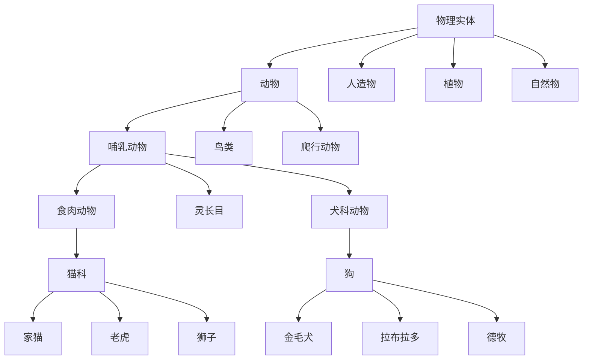

# ImageNet

ImageNet 是一个大规模图像数据集（Large-Scale Image Dataset），由斯坦福大学李飞飞（Fei-Fei Li）团队于 2009 年创建。它包含超过 1400 万张手工标注的图像，涵盖 21841 个类别（synsets），是计算机视觉领域最具影响力的基准数据集之一，也是深度学习革命的催化剂。

## 数据集概况

| 指标 | 数值 |
|------|------|
| 图像总数 | 14,197,122 |
| 类别数（Synsets） | 21,841 |
| 图像平均分辨率 | 约 500 × 400 像素（可变） |
| 标注方式 | 人工标注 + Amazon Mechanical Turk |
| 数据来源 | 从主流搜索引擎（Google、Bing、Yahoo）爬取的网络图像 |
| 首次发布年份 | 2009（ILSVRC 2010 启动） |
| 标注语言 | 英语，基于 WordNet 语义网络 |
| 许可证 | 非商业用途免费 |

## 数据组织与 WordNet 层次结构

ImageNet 基于普林斯顿大学开发的 WordNet 语义词典组织图像。WordNet 中的每个同义词集（Synset）对应一个语义概念，ImageNet 为每个 Synset 收集约 500-1000 张图像。

## ILSVRC（ImageNet Large Scale Visual Recognition Challenge）

ILSVRC 是 ImageNet 组织的年度图像识别竞赛（2010-2017），深刻影响了计算机视觉和深度学习的发展。

### ILSVRC 的任务设置

ILSVRC 使用 ImageNet 的子集（约 120 万张训练图像，1000 个类别），设置以下任务：
- **图像分类**（Classification）：预测图像所属类别
- **目标检测**（Object Detection）：定位并识别图像中的物体
- **目标定位**（Object Localization）：找到目标位置
- **场景分类**（Scene Classification）：识别场景类型

### 历年竞赛成绩

| 年份 | 冠军模型 | Top-5 错误率 | 关键创新 |
|------|---------|-------------|---------|
| 2010 | NEC/UIUC（线性 SVM） | 28.2% | 基准模型 |
| 2011 | XRCE/INRIA | 25.8% | Fisher 向量 |
| 2012 | **AlexNet**（Krizhevsky） | **15.3%** | **深度学习爆发** |
| 2013 | Clarifai（ZFNet） | 11.2% | 改进卷积、可解释性 |
| 2014 | GoogLeNet（Inception）/ VGG | 6.7% | 更深的网络（22/19层） |
| 2015 | **ResNet**（He et al.） | **3.57%** | **残差连接（Residual）** |
| 2016 | SENet（Hu et al.） | 2.99% | 通道注意力（Squeeze-and-Excitation） |
| 2017 | SENet（集成） | 2.25% | 多模型融合 |

## 图像分类任务的数学表述

训练目标是最小化交叉熵损失（Cross-Entropy Loss）：

$$ L = -\frac{1}{N}\sum_{i=1}^{N}\sum_{j=1}^{C} y_{ij} \log(p_{ij}) $$

- $N$ = 样本数
- $C$ = 类别数（ILSVRC = 1000）
- $y_{ij}$ = one-hot 编码的真实标签
- $p_{ij}$ = 模型预测的概率（softmax 输出）

**Top-1 准确率**：模型预测的第一个类别与真实标签一致的比例。
**Top-5 准确率**：真实标签出现在预测前五名中的比例。

## 对深度学习的重要影响

ImageNet 作为"深度学习诞生的摇篮"之一，在以下方面产生了深远影响：

1. **预训练范式**：ImageNet 预训练 + 下游微调（Fine-tuning）成为视觉领域的标准流程
2. **架构创新驱动**：从 AlexNet 到 Vision Transformer（ViT），几乎每代模型都在 ImageNet 上验证性能
3. **迁移学习**：在 ImageNet 上训练的特征可迁移到医学影像、遥感、工业质检等下游任务
4. **学术基准**：研究者比较模型时，ImageNet 准确率是首要参考指标

## 局限性与争议

| 问题 | 说明 |
|------|------|
| 标注噪声 | 部分图像标签存在错误，影响评估准确性 |
| 类别偏差 | 各类别样本数量和质量不均匀 |
| 文化偏见 | 图像主要反映西方互联网生态（场景、服饰、习俗） |
| 饱和问题 | Top-5 准确率已达 99%+，区分能力的边际空间极小 |
| 隐私问题 | 部分图像包含未经许可的人物肖像 |
| 静态基准 | 模型可能在 ImageNet 上过拟合，泛化能力被高估 |

## 衍生基准数据集

为解决 ImageNet 的局限性，研究者开发了一系列衍生数据集：

- **ImageNet-V2**：重新独立采样，测试模型的真实泛化能力
- **ImageNet-C**：添加自然干扰（噪声、模糊、天气），测试鲁棒性
- **ImageNet-A**：对抗性样本集合，暴露模型的脆弱性
- **ImageNet-R**：渲染图像（素描、油画、卡通），测试风格泛化
- **ImageNet-Sketch**：手绘素描版本
- **ImageNet-Real**：使用真实标签纠正标注错误
- **ImageNet-O**：分布外检测基准

## 未来方向

尽管 ImageNet 仍是最重要的基准之一，领域趋势已转向：
- 更大规模的数据集（LAION-5B, JFT-300M）
- 更注重鲁棒性和分布外泛化
- 少样本和零样本评估（如 CLIP benchmark）
- 视频理解（Kinetics, Something-Something）

## 相关条目

- [[深度学习]]
- [[INDEX|当前目录索引]]
