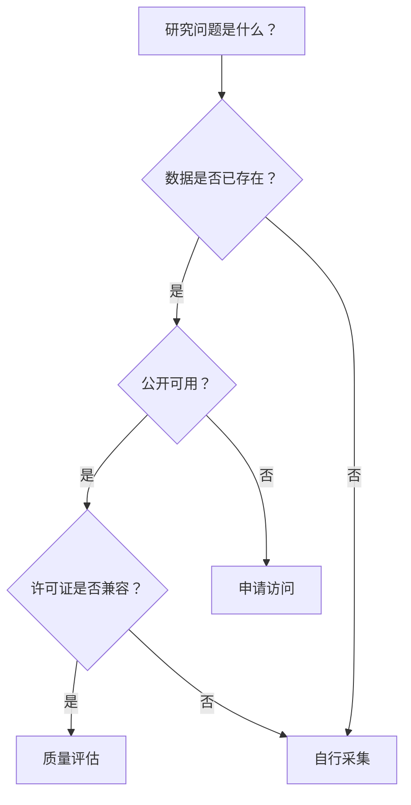

---
aliases:
  - 数据集选择
  - DatasetSelection
  - DataSelectionGuide
tags:
  - datasets
  - data-quality
  - data-science
  - preprocessing
  - metadata
---

# 数据集选择指南（Dataset Selection Guide）

选择合适的数据集是数据科学和机器学习项目的关键第一步。本指南涵盖数据来源、质量评估、预处理方法、元数据管理和伦理考量。

## 一、数据集分类体系

### 1.1 按数据类型分类

| 类型 | 特征 | 典型维度 | 存储格式 |
|------|------|---------|---------|
| 表格数据 | 结构化行-列 | 样本×特征 | CSV, Parquet |
| 图像数据 | 像素矩阵 | H×W×C | JPEG, PNG, TFRecord |
| 文本数据 | 自然语言序列 | 文档×词数 | TXT, JSONL |
| 音频数据 | 时序信号 | 采样点×通道 | WAV, MP3, FLAC |
| 视频数据 | 帧序列 | T×H×W×C | MP4, AVI |
| 时间序列 | 有序观测 | 时间步×变量 | CSV, TSV |
| 图数据 | 节点-边结构 | 节点×邻接矩阵 | GraphML, GEXF |

### 1.2 按学习范式分类

- **监督学习**：带标签数据集（分类、回归）
- **无监督学习**：无标签数据集（聚类、降维）
- **半监督学习**：少量标签+大量无标签
- **自监督学习**：自动生成伪标签
- **强化学习**：环境交互序列

## 二、公开数据集资源库

### 2.1 综合平台

| 平台 | 规模 | 特点 |
|------|:----:|------|
| Kaggle | 50,000+ | 竞赛+社区+Kernel |
| UCI ML Repository | 600+ | 经典数据集、学术起源 |
| Hugging Face Datasets | 5,000+ | NLP为主、多模态扩展 |
| Google Dataset Search | 25,000,000+ | 跨库搜索引擎 |
| Papers with Code | 5,000+ | 论文+数据集+SOTA |
| Zenodo | 200,000+ | 学术数据、CERN托管 |

### 2.2 领域特定数据集

**计算机视觉（CV）**：

| 数据集 | 任务 | 规模 | 年份 |
|--------|------|:----:|:----:|
| ImageNet | 分类 | 14M图像, 21K类别 | 2009 |
| MS COCO | 检测/分割 | 330K图像, 80类别 | 2014 |
| CIFAR-10/100 | 分类 | 60K图像, 10/100类别 | 2009 |
| MNIST | 手写数字识别 | 70K图像, 10类别 | 1998 |

**自然语言处理（NLP）**：

| 数据集 | 任务 | 规模 | 指标 |
|--------|------|:----:|:----:|
| GLUE | 多任务理解 | 9个子任务 | 综合得分 |
| SQuAD 2.0 | 阅读理解 | 150K问答对 | EM/F1 |
| Common Crawl | 网页文本 | PB级 | — |

**医学领域**：

| 数据集 | 任务 | 规模 |
|--------|------|:----:|
| MIMIC-III | 临床记录 | 40K患者 |
| CheXpert | 胸部X光 | 224K图像 |
| TCGA | 癌症基因组 | 11K样本 |

### 2.3 数据集选择决策树

## 三、数据质量评估

### 3.1 质量维度

$$ \text{Data Quality} = f(\text{Completeness}, \text{Consistency}, \text{Accuracy}, \text{Timeliness}, \text{Uniqueness}) $$

| 维度 | 定义 | 评估方法 |
|------|------|---------|
| 完整性 | 数据是否缺失 | 缺失率统计 |
| 一致性 | 数据是否矛盾 | 逻辑约束验证 |
| 准确性 | 数据是否正确 | 抽样核查 |
| 时效性 | 数据是否过时 | 时间戳检查 |
| 独特性 | 是否存在重复 | 重复检测 |

### 3.2 数据偏差审计

- **采样偏差**：样本不能代表总体
- **标注偏差**：标注者之间的不一致
- **标签偏差**：标签定义模糊或错误
- **时间偏差**：数据采集时间影响结果
- **报告偏差**：选择性报告正面结果

## 四、数据标注方法

| 方法 | 成本 | 质量 | 速度 | 适用场景 |
|------|:----:|:----:|:----:|---------|
| 专家标注 | 高 | 最高 | 慢 | 医学、法律 |
| 众包标注 | 低 | 中等 | 快 | 通用标注 |
| 主动学习 | 中等 | 高 | 中等 | 标签稀疏 |
| 半监督 | 低 | 中等 | 很快 | 大量无标签数据 |

**标注质量评估**：

$$ \kappa = \frac{p_o - p_e}{1 - p_e} $$

## 五、数据预处理

### 5.1 常见操作

| 操作 | 描述 | 公式 |
|------|------|------|
| 缺失值处理 | 删除/填充/插值 | $x' = \text{impute}(x)$ |
| 标准化 | Z-score | $x' = \frac{x - \mu}{\sigma}$ |
| 归一化 | Min-Max | $x' = \frac{x - x_{\min}}{x_{\max} - x_{\min}}$ |
| 数据增强 | 旋转变换/噪声添加 | — |

### 5.2 数据增强技术

$$ \text{增强图像} = T_{\theta}(I), \quad T \in \{\text{旋转, 翻转, 裁剪, 色彩抖动}\} $$

- **图像**：Random Crop, Flip, Rotation, Color Jitter, CutMix
- **文本**：回译（Back Translation）、同义词替换
- **音频**：SpecAugment（频率-时间掩码）、噪声添加
- **表格**：SMOTE（合成少数类过采样）

## 六、数据版本控制

| 工具 | 类型 | 优点 |
|------|------|------|
| DVC | 数据版本管理 | Git集成、S3/GCS兼容 |
| Git LFS | 大文件存储 | Git原生 |
| Hugging Face Datasets | 数据集版本管理 | 缓存/流式加载 |

## 七、数据文档

### 7.1 Datasheets for Datasets

推荐文档结构（Gebru et al., 2021）：

1. **动机**：为何创建此数据集？
2. **组成**：数据来源、格式、规模
3. **收集过程**：采集方法、时间、地点
4. **预处理**：清洗/过滤/标注流程
5. **用途**：适合的任务、已知限制
6. **分布**：数据的统计摘要
7. **伦理**：隐私、同意、偏见
8. **维护**：版本更新、联系人

## 八、数据许可

| 许可证 | 允许商业使用 | 要求署名 | 要求相同方式共享 |
|--------|:----------:|:--------:|:--------------:|
| CC0 | ✅ | ❌ | ❌ |
| CC BY 4.0 | ✅ | ✅ | ❌ |
| CC BY-SA 4.0 | ✅ | ✅ | ✅ |
| ODbL | ✅ | ✅ | ✅ |

## 九、合成数据生成

$$ G(z) \rightarrow x_{\text{synthetic}}, \quad z \sim \mathcal{N}(0, I) $$

| 方法 | 原理 | 应用场景 |
|------|------|---------|
| GANs | 对抗训练 | 图像、表格 |
| 扩散模型 | 逐步去噪 | 图像（SOTA） |
| VAE | 变分自编码器 | 连续潜在空间 |

## 十、数据存储格式对比

| 格式 | 类型 | 压缩率 | 读性能 | 写性能 |
|------|------|:------:|:------:|:------:|
| CSV | 文本 | 低 | 中 | 高 |
| Parquet | 列式二进制 | 高 | 高 | 中 |
| TFRecord | 二进制 | 中 | 中 | 低 |
| HDF5 | 层级二进制 | 中 | 高 | 中 |
| Feather | 二进制 | 中 | 极高 | 高 |

## 十一、数据伦理

### 11.1 隐私保护技术

| 技术 | 原理 | 隐私保障 | 效用损失 |
|------|------|:--------:|:--------:|
| 匿名化 | 移除标识符 | 低 | 低 |
| 差分隐私 | 添加校准噪声 | 高 | 中 |
| k-匿名化 | 泛化准标识符 | 中 | 中 |
| 合成数据 | 生成人工数据 | 高 | 高 |

### 11.2 伦理审查清单

- 数据采集是否获得知情同意？
- 数据中是否存在群体偏见？
- 数据使用是否可能造成歧视？

## 参考资源

- Gebru, T., et al. (2021). Datasheets for Datasets. *Communications of the ACM*, 64(12), 86-92.
- Kaggle Datasets: https://www.kaggle.com/datasets
- Hugging Face Datasets: https://huggingface.co/datasets

## 相关条目

[[DataSets]], [[DataScience]], [[OpenData]], [[ResearchMethods]]
