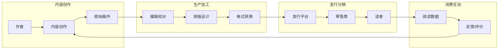

---
aliases:
  - 电子书
  - Ebook
  - DigitalBook
  - Ebook资源
tags:
  - ebooks
  - digital-publishing
  - drm
  - open-access
  - self-publishing
  - distribution
---

# 电子书（Ebooks）

电子书是数字出版的核心载体，正在深刻改变知识的生产、传播和消费方式。本文涵盖数字出版生态、DRM、开放获取、自助出版和全球发行策略。

## 一、数字出版生态

### 1.1 产业链结构



**市场规模**（2024年数据）：

| 市场 | 规模（亿美元） | 年增长率 | 市场份额 |
|------|:------------:|:--------:|:--------:|
| 全球 | 250 | 4.2% | 100% |
| 北美 | 95 | 3.1% | 38% |
| 欧洲 | 70 | 3.8% | 28% |
| 亚太 | 55 | 7.5% | 22% |
| 其他 | 30 | 5.0% | 12% |

### 1.2 出版模式对比

| 维度 | 传统出版 | 自助出版 | 开放获取 | 按需出版 |
|------|---------|---------|---------|---------|
| 控制权 | 出版商主导 | 作者主导 | 作者/机构 | 灵活 |
| 周期 | 6-24个月 | 数天至数周 | 可变 | 即时 |
| 成本 | 出版商承担 | 作者自费 | APC/机构补贴 | 单本成本高 |
| 收入分成 | 5-15%版税 | 35-70% | 无/机构支付 | 40-60% |
| 质量控制 | 专业编辑 | 自费编辑/外包 | 同行评审 | 模板化 |
| 发行渠道 | 全面 | 有限（线上为主） | 开放平台 | 线上 |

## 二、DRM与版权保护

### 2.1 DRM技术原理

$$ \text{DRM加密} = E_{\text{key}}(\text{Content}) $$

第三方平台：
$$ \text{Access} = \text{Verify}(\text{UserCredential}) \times \text{DeviceBinding} $$

常用的加密算法：
- **AES-256**：对称加密，用于内容加密
- **RSA**：非对称加密，用于密钥分发
- **专有算法**：Amazon、Apple等使用自研方案

### 2.2 DRM的利与弊

| 维度 | 支持DRM | 无DRM |
|------|---------|--------|
| 版权保护 | 强 | 无 |
| 用户便利性 | 受限 | 自由使用 |
| 格式转换 | 不允许 | 允许 |
| 跨平台共享 | 受限 | 自由 |
| 长期保存 | 危险（服务器关闭） | 安全 |
| 二手交易 | 禁止 | 允许/受限 |
| 图书馆借阅 | 支持（有限制） | 完全支持 |

### 2.3 无DRM出版案例

- **Tor Books**：2012年起所有电子书无DRM
- **O'Reilly Media**：早期技术书先驱
- **Baen Books**：无DRM科幻出版
- **许多学术出版社**：CC协议出版的书籍

## 三、开放获取（Open Access）

### 3.1 OA出版模式

**金色OA（Gold OA）**：最终版本立即开放
- 作者支付APC（Article Processing Charge）
- 典型费用：$500-$3000
- 期刊：PLOS ONE, eLife, MDPI

**绿色OA（Green OA）**：作者自存档
- 在机构知识库中存档
- 可能有embargo期（6-12个月）
- 典型：arXiv预印本、机构库

**钻石OA（Diamond OA）**：完全免费
- 作者和读者均不付费
- 由机构或学会资助
- 期刊：许多小型学术期刊

### 3.2 OA图书平台

| 平台 | 规模 | 内容类型 | 访问方式 |
|--------|:----:|---------|---------|
| Project Gutenberg | 70,000+ | 公版文学作品 | 免费下载 |
| Internet Archive | 10,000,000+ | 书籍/音频/视频 | 借阅+下载 |
| Open Library | 1,000,000+ | 现代书籍 | 借阅 |
| OAPEN | 20,000+ | 学术开放图书 | 免费阅读 |
| DOAB | 50,000+ | 同行评审学术图书 | 免费下载 |
| Directory of Open Access Books | 60,000+ | 多学科OA图书 | 免费阅读 |
| 国学大师 | 100,000+ | 中国古籍 | 在线阅读 |

### 3.3 OA质量标准

质量控制机制的演进：

| 机制 | 描述 | 认可度 |
|------|------|:------:|
| 传统同行评审 | 单盲/双盲评审 | 高 |
| 发表后评审 | 公开评论+评分 | 中 |
| 开放同行评审 | 评审报告公开 | 中高 |
| 格式评审 | 仅检查格式 | 低（掠夺性期刊） |

**掠夺性期刊特征**：
- 快速接受（未充分评审）
- 主动发送大量约稿邮件
- 隐藏或夸大APC费用
- 伪造影响因子
- 期刊名称与知名期刊相似

## 四、自助出版（Self-Publishing）

### 4.1 主要平台对比

| 平台 | 分成模式 | 独家要求 | 格式要求 | DRM选项 | 市场覆盖 |
|------|---------|:--------:|---------|:-------:|---------|
| Amazon KDP | 35%-70% | KDP Select可选 | MOBI/EPUB | 可选 | 全球 |
| Google Play Books | 52%-80% | 无 | EPUB/PDF | 可选 | 全球 |
| Apple Books | 70% | 无 | EPUB | 可选 | Apple设备 |
| Smashwords | 60%-80% | 无 | EPUB | 可选 | 多零售商 |
| 豆瓣阅读 | 50%-70% | 无 | EPUB | 无 | 中国 |
| 微信读书 | 分成协商 | 有时 | EPUB | 无 | 中国 |
| Lulu | 80%-90% | 无 | 多种 | 无 | 全球+纸质 |

### 4.2 自助出版流程

```
写作完成 → 编辑校对（自费/外包）→ 封面设计 → 
格式转换 → ISBN获取 → 多平台上架 → 营销推广 → 
销售跟踪 → 读者反馈 → 更新版本
```

**关键成功因素**：
- 专业封面设计（点击率提升40-70%）
- 精准关键词和分类
- 早期读者评价（Launch团队）
- 价格策略（$0.99-$9.99常规区间）
- 系列化出版（提高整体销量）

## 五、发行与分销

### 5.1 电子书定价模型

$$ \text{作者收入} = \text{定价} \times \text{分成比例} \times \text{销量} $$

**定价策略**：

| 价格区间 | 策略 | 适用场景 |
|---------|------|---------|
| $0.99-$2.99 | 促销/亏本引流 | 新作者、系列第一卷 |
| $3.99-$5.99 | 标准定价 | 中等长度、中档书籍 |
| $6.99-$9.99 | 高端定价 | 长篇、权威作品 |
| $10.00+ | 专业定价 | 学术、技术专业书 |

### 5.2 营销渠道

- **Amazon广告**：AMS（Amazon Marketing Services）
- **社交媒体**：BookTok（TikTok图书社区）、Goodreads
- **邮件列表**：Newsletter营销
- **价格促销**：限时免费、Countdown Deals
- **交叉推广**：同类型作者互推
- **书评博客**：联系Book Blogger

## 六、学术电子书

| 平台 | 学科覆盖 | 访问模式 | 特点 |
|------|---------|---------|------|
| SpringerLink | STEM | 机构订阅/购买 | Lecture Notes系列 |
| Cambridge Core | 全学科 | 机构订阅 | 剑桥大学出版社 |
| Oxford Scholarship Online | 人文社科 | 机构订阅 | 专题合集 |
| JSTOR | 人文社科 | 机构订阅 | 过刊+电子书 |
| 中国知网（CNKI） | 全学科 | 按页付费 | 中文学位论文 |
| 读秀 | 全学科 | 机构订阅 | 中文图书搜索 |

## 七、未来趋势

1. **有声书与电子书捆绑**：Whispersync for Voice
2. **交互式电子书**：嵌入视频、测验、3D模型
3. **AI辅助创作**：AI写作/翻译辅助工具
4. **区块链版权**：NFT图书、智能合约版税
5. **订阅模式**：Kindle Unlimited, Scribd等
6. **多模态阅读**：图文音视频融合

## 参考资源

- 中国新闻出版研究院(2024). *中国数字出版产业年度报告*.
- *Publishing Perspectives*: https://publishingperspectives.com
- *The Self-Publishing Advice*: https://selfpublishingadvice.org
- O'Reilly, T. (2020). 数字出版发展趋势分析.

## 相关条目

[[电子书管理与工具]], [[DigitalLibrary]], [[OpenAccess]], [[LicenseAndCopyright]]
