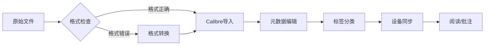

---
aliases:
  - 电子书管理
  - Ebook管理
  - EbookTools
tags:
  - ebooks
  - tools
  - calibre
  - reading
  - library-management
---

# 电子书管理与工具

电子书管理涵盖格式转换、元数据编辑、图书馆组织和跨设备同步。选择正确的工具和工作流可以显著提升阅读体验和知识管理效率。

## 一、主流格式对比

### 1.1 格式技术参数

| 格式 | 全称 | 开发者 | 排版方式 | DRM支持 | 压缩率 | 适用平台 |
|------|------|--------|:--------:|:-------:|:------:|---------|
| EPUB | Electronic Publication | IDPF/W3C | 重排 | Adobe ADEPT | 高 | 通用（除Kindle） |
| MOBI | Mobipocket | Amazon | 重排 | Kindle DRM | 中 | Kindle旧设备 |
| AZW3/KF8 | Kindle Format 8 | Amazon | 重排+固定 | Kindle DRM | 中 | Kindle新设备 |
| PDF | Portable Document Format | Adobe | 固定 | 多种 | 低 | 通用 |
| CBZ/CBR | Comic Book Archive | 社区 | 固定图像 | 无 | 取决于图像 | 漫画阅读器 |

**格式选择决策树**：

```
需要重排？→ 是 → 需要交互式元素？→ 是 → EPUB3
                │                    └→ 否 → EPUB2
                └→ 否 → 包含复杂排版？→ 是 → PDF
                                     └→ 否 → 需要DRM？→ 是 → AZW3
                                                          └→ 否 → EPUB
```

### 1.2 格式互转

$$ \text{Source} \xrightarrow{\text{Pandoc/Calibre}} \text{Target} $$

转换过程中可能丢失的信息包括：CSS排版细节、嵌入字体、交互式元素、脚本内容。

| 转换工具 | 支持格式 | 特点 |
|---------|-----------|------|
| Pandoc | 30+格式 | 命令行、精确控制、学术首选 |
| Calibre | 20+格式 | GUI+命令行、批量转换、元数据管理 |
| KindlePreviewer | MOBI/AZW3 | Amazon官方、模拟Kindle设备 |
| epubcheck | EPUB验证 | W3C官方校验工具 |

## 二、Calibre深度使用

### 2.1 核心功能

Calibre是开源电子书管理瑞士军刀：

| 功能模块 | 描述 | 使用场景 |
|---------|------|---------|
| 格式转换 | 支持20+格式互转 | 跨设备阅读 |
| 元数据编辑 | 自动抓取豆瓣/Amazon/Google信息 | 图书馆标准化 |
| 标签管理 | 自定义标签+分类 | 知识组织 |
| 内容服务器 | 局域网无线访问 | 家庭图书馆共享 |
| 新闻下载 | 自动抓取RSS转为电子书 | 离线阅读 |
| 批量操作 | 批量转换/编辑/重命名 | 大型图书馆维护 |

### 2.2 元数据编辑建议

- 统一书名和作者格式（姓, 名）
- 添加标签，如 #编程, #Python, #数据科学
- 填写ISBN便于检索
- 添加封面图像（统一尺寸：600×800px）
- 设置语言标签（zh, en, ja）

### 2.3 Calibre插件生态

| 插件名称 | 功能 |
|---------|------|
| DeDRM | 移除DRM限制 |
| QualityCheck | 自动质量检查 |
| Count Pages | 统计页数 |
| Goodreads Sync | 同步阅读进度 |

### 2.4 工作流程示意



## 三、阅读设备生态

### 3.1 硬件设备对比

| 设备 | 屏幕技术 | 屏幕尺寸 | 优点 | 缺点 |
|------|---------|:--------:|------|------|
| Kindle | E-ink Carta | 6"-10" | 护眼、续航长 | 格式封闭 |
| Kobo | E-ink Carta | 6"-8" | EPUB原生、开放 | 中文生态弱 |
| Remarkable | E-ink Canvas | 10.3" | 手写笔记 | 价格高 |
| iPad Mini | LCD | 8.3" | 彩色、App丰富 | 伤眼、重 |
| 文石Boox | E-ink Mobius | 6"-13.3" | Android开放 | 价格高 |

### 3.2 阅读软件对比

| 软件 | 平台 | 特色功能 |
|------|------|---------|
| Kindle App | iOS/Android/PC | Whispersync同步 |
| GooglePlayBooks | iOS/Android/Web | 云存储、PDF上传 |
| Apple Books | iOS/macOS | 美观、iCloud同步 |
| 微信读书 | iOS/Android | 社交阅读、中文生态 |
| Moon+ Reader | Android | TTS、手势、格式支持广 |

## 四、数字版权管理（DRM）

### 4.1 DRM方案对比

| DRM方案 | 提供方 | 加密方法 | 设备限制 |
|---------|--------|---------|:--------:|
| Kindle DRM | Amazon | 专有加密 | 6台设备 |
| Adobe ADEPT | Adobe | AES-256 | 6台设备 |
| Apple FairPlay | Apple | 专有加密 | 生态内 |
| LCP | Readium | AES-256 | 灵活 |

## 五、图书馆组织策略

### 5.1 目录结构建议

- 📂 非虚构/计算机科学/
- 📂 非虚构/商业管理/
- 📂 虚构/科幻/
- 📂 学术/期刊/
- 📂 待分类/

### 5.2 标签系统最佳实践

推荐采用层级标签（多对多关系）：
- #编程/Python, #编程/Java
- #格式/EPUB, #格式/PDF
- #状态/未读, #状态/已读

## 六、无障碍访问

| 特性 | EPUB3支持 |
|------|:---------:|
| 屏幕阅读器兼容（NVDA, VoiceOver） | ✅ |
| 文字重排（字体/大小/间距） | ✅ |
| 高对比度模式 | ✅ |
| 替代文本（Alt Text） | ✅ |

WCAG 2.1 AA是电子书无障碍的基本标准。


## 六、自动化工作流

### 6.1 元数据抓取

calibredb命令行工具示例：
- calibredb add book.epub --library=F:/CalibreLibrary
- calibredb set_metadata 1 --field=tags:编程,Python

### 6.2 定时任务

- 每周整理待分类文件夹
- 自动备份Calibre数据库
- 同步阅读进度

## 七、电子书创建流程

### 7.1 写作与转换

Markdown -> Pandoc -> EPUB/PDF -> Calibre -> MOBI/AZW3

### 7.2 CSS样式定制

body { font-family: serif; line-height: 1.8; margin: 5%%; }
h1 { text-align: center; }
img { max-width: 100%%; }

## 八、学术电子书平台

| 平台 | 学科覆盖 | 访问模式 |
|------|---------|---------|
| SpringerLink | STEM | 机构订阅 |
| Cambridge Core | 全学科 | 机构订阅 |
| JSTOR | 人文社科 | 机构订阅 |
| 中国知网(CNKI) | 全学科 | 按页付费 |

## 参考资源

- 中国皮书网(2024). *数字出版产业年度报告*.
- Project Gutenberg: https://www.gutenberg.org
- Calibre官方: https://calibre-ebook.com
- Pandoc文档: https://pandoc.org/MANUAL.html

## 相关条目

[[Ebooks]], [[NoteTaking]], [[KnowledgeManagement]], [[DigitalLibrary]]
