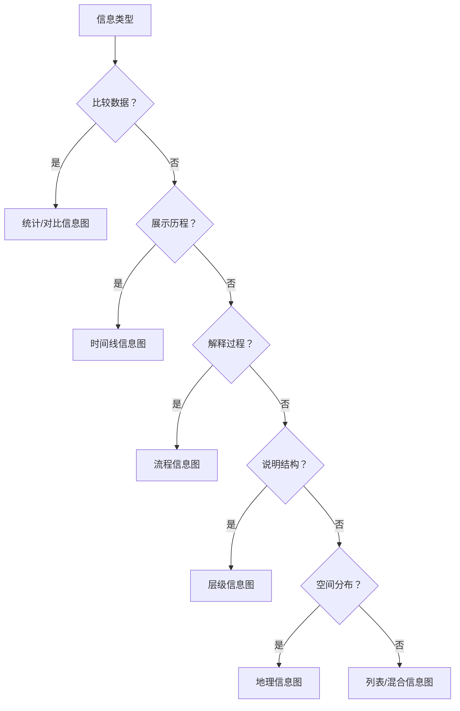

---
aliases:
  - 信息图
  - Infographic
  - 数据可视化
  - 数据故事
  - InformationGraphics
tags:
  - infographics
  - data-visualization
  - data-storytelling
  - design
  - visual-communication
  - information-design
---

# 信息图（Infographics）

信息图是将数据、信息或知识以视觉化方式呈现的图形媒介，其核心目的是通过视觉叙事增强理解与记忆。研究表明，视觉信息处理速度比文本快60,000倍，图文结合的信息保留率比纯文本高65%。

## 一、信息图定义与目的

### 1.1 核心公式

$$ \text{有效信息图} = \text{数据准确性} \times \text{视觉吸引力} \times \text{叙事逻辑} $$

**三大支柱**：

1. **数据准确性**：所有视觉元素必须忠实反映数据
2. **视觉吸引力**：通过色彩、排版、布局提升审美
3. **叙事逻辑**：引导读者按预期顺序理解信息

### 1.2 信息图的认知优势

| 认知维度 | 文本 | 信息图 |
|---------|:----:|:------:|
| 识别速度 | 慢（线性阅读） | 快（整体感知） |
| 记忆保持（1小时后） | 10% | 65% |
| 模式识别 | 需要推理 | 直观可见 |
| 注意力吸引 | 弱 | 强 |
| 情感共鸣 | 间接 | 直接 |

## 二、信息图类型

### 2.1 八大类型

| 类型 | 用途 | 典型结构 |
|------|------|---------|
| 统计信息图 | 展示数据统计结果 | 图表+数字+说明文字 |
| 时间线信息图 | 展示事件发展历程 | 水平/垂直时间轴 |
| 流程信息图 | 说明步骤或过程 | 箭头/编号连接的流程图 |
| 对比信息图 | 比较两个或多个对象 | 左右分栏或并列卡片 |
| 层级信息图 | 展示层级结构 | 金字塔/树状图 |
| 地理信息图 | 展示地理分布 | 地图+标注+统计 |
| 列表信息图 | 列举要点 | 图标+标题+简要说明 |
| 混合信息图 | 综合多种形式 | 模块化组合 |

### 2.2 类型选择决策



## 三、设计原则

### 3.1 视觉层次

视觉层次引导读者按设计者意图顺序阅读信息：

1. **主标题**（最突出）：吸引注意，传达核心主题
2. **副标题/核心数据**：强化关键信息
3. **次级标题/分节**：组织内容结构
4. **正文/说明文字**：提供细节
5. **来源/脚注**：提供可信度支持

### 3.2 色彩理论

$$ \text{HSL色彩空间}: H \in [0^\circ, 360^\circ], S \in [0\%, 100\%], L \in [0\%, 100\%] $$

**色彩搭配方案**：

| 方案 | 定义 | 示例 | 适用场景 |
|------|------|------|---------|
| 互补色 | 色环180°相对 | 蓝-橙 | 高对比、强调 |
| 类似色 | 色环30°-60°邻近 | 蓝-蓝绿-绿 | 和谐、专业 |
| 三角色 | 色环120°等距 | 红-黄-蓝 | 丰富、活泼 |
| 单色 | 同一色相不同明度 | 深蓝-浅蓝 | 简约、统一 |
| 分裂互补 | 基色+两侧互补色 | 蓝+黄橙+红橙 | 对比+丰富 |

**无障碍色彩**：避免仅靠颜色传递信息，使用ColorBrewer 2.0的色盲友好调色板。

### 3.3 字体排版

| 字体类型 | 推荐字体 | 用途 |
|---------|---------|------|
| 衬线体 | Noto Serif, Source Han Serif | 正文（印刷感） |
| 无衬线体 | Noto Sans, Source Han Sans | 标题、数字、屏幕显示 |
| 展示字体 | Playfair Display, Oswald | 主标题装饰 |
| 等宽字体 | JetBrains Mono, Fira Code | 数据、代码 |

**字体配对原则**：
- 衬线+无衬线（最安全）
- 同字族不同字重（最统一）
- 最多使用2-3种字族
- 标题与正文字号比例推荐2:1至3:1

### 3.4 留白与平衡

- **留白**（负空间）：元素之间至少保留主体尺寸25%的空间
- **对称平衡**：左右镜像，正式感
- **不对称平衡**：通过色彩/大小/位置达成视觉重量均衡，更具动感
- **黄金比例**：$\phi = \frac{1+\sqrt{5}}{2} \approx 1.618$

## 四、数据可视化基础

### 4.1 图表选择指南

| 数据类型 | 推荐图表 | 不推荐 |
|---------|---------|--------|
| 分类比较 | 柱状图 | 饼图（类别>5） |
| 时间趋势 | 折线图 | 柱状图（连续数据） |
| 构成比例 | 饼图/环形图/堆叠柱状图 | 3D饼图 |
| 相关性 | 散点图+趋势线 | 柱状图 |
| 分布 | 箱线图/直方图 | 饼图 |
| 地理数据 | 地图/热力图 | — |
| 流程关系 | 桑基图/流程图 | 饼图 |
| 层级结构 | 树图/旭日图 | 表格 |

### 4.2 可视化最佳实践

$$ \text{数据-墨水比} = \frac{\text{数据相关墨水}}{\text{总墨水用量}} \rightarrow \text{最大化} $$

- **Edward Tufte原则**：最大化数据-墨水比，删除非数据墨水和冗余数据墨水
- **避免垃圾信息**（Chartjunk）：3D效果、不必要的渐变、过度装饰
- **坐标轴**：从零开始（柱状图），适当截断（折线图需标注）
- **颜色**：使用ColorBrewer 2.0的顺序/发散/定性调色板

## 五、设计工具对比

| 工具 | 适用人群 | 价格 | 学习曲线 | 核心优势 |
|------|---------|:----:|:--------:|---------|
| Canva | 初学者 | 免费/Pro $12.99/月 | 低 | 模板丰富、拖拽操作 |
| Adobe Illustrator | 专业设计师 | $20.99/月(CC) | 高 | 矢量图形、无限定制 |
| Figma | 团队协作 | 免费/专业$12/月 | 中 | 实时协作、原型设计 |
| Piktochart | 信息图专用 | 免费/Pro $29/月 | 低 | 预设信息图模板 |
| Visme | 展示+信息图 | 免费/Pro $29/月 | 中 | 动画、交互元素 |
| Tableau | 数据驱动 | $70/月起 | 中高 | 连接数据库、交互仪表盘 |
| Power BI | 数据驱动 | 免费/Pro $10/月 | 中 | Microsoft生态集成 |
| RawGraphs | 数据可视化 | 免费 | 低 | 直接生成SVG |
| D3.js | 开发人员 | 免费 | 高 | 定制化程度最高 |

## 六、数据叙事

### 6.1 叙事结构

**线性叙事结构**：
```
铺垫（Context）→ 冲突（Conflict）→ 解决（Resolution）
背景与数据设置    核心发现/对比      结论/行动号召
```

**三大叙事模式**：

| 模式 | 结构 | 适用场景 |
|------|------|---------|
| 马丁·路德式 | 问题→解决方案 | 商业案例 |
| 倒金字塔 | 结论→支撑细节 | 新闻式报告 |
| 互动探索 | 引导→自由探索 | 交互仪表盘 |

### 6.2 行动号召（CTA）

每个信息图应包含明确的CTA（Call to Action），例如：
- "了解更多→[URL]"
- "扫码查看完整报告"
- "分享此信息图"
- "立即注册"

### 6.3 隐喻与类比

使用读者熟悉的视觉隐喻降低认知负荷：

| 隐喻 | 含义 |
|------|------|
| 漏斗 | 筛选/转化过程 |
| 桥梁 | 连接/沟通 |
| 树 | 分类/成长 |
| 温度计 | 进度/程度 |
| 天平 | 权衡/对比 |
| 金字塔 | 层级/基础 |
| 灯泡 | 创意/解决方案 |

## 七、信息图布局

### 7.1 网格系统

推荐的布局结构：

| 栏数 | 特点 | 适用场景 |
|:----:|------|---------|
| 1栏 | 线性阅读 | 流程/时间线 |
| 2栏 | 并列对比 | 比较信息图 |
| 3栏 | 模块化 | 统计/列表信息图 |
| 自由式 | 灵活创意 | 杂志风格 |

### 7.2 布局元素

- **页眉区**：主标题+副标题+视觉锚点
- **内容区**：图表/图标/文字按视觉层次排列
- **页脚区**：数据来源、版权信息、品牌Logo
- **QR码**：引导读者访问在线资源

### 7.3 图标选择

推荐使用统一风格图标集（FontAwesome、Material Icons、Noun Project），线条粗细保持一致，与整体设计风格匹配。

## 八、无障碍设计

| 要求 | 实现方法 |
|------|---------|
| 色盲友好 | 使用ColorBrewer色盲安全调色板 |
| 高对比度 | 文字与背景对比度≥4.5:1 |
| 文本替代 | 为图表提供Alt Text描述 |
| 屏幕阅读器 | 合理使用标题层级（h1→h2→h3） |
| 可缩放 | SVG格式的信息图可无限缩放 |
| 文字版 | 提供信息图的纯文本版本 |

> 信息图的无障碍不是可选项，而是基本设计要求。遵循WCAG 2.1 AA标准，确保信息对所有人可达。

## 参考资源

- Tufte, E. (2001). *The Visual Display of Quantitative Information* (2nd ed.). Graphics Press.
- Cairo, A. (2012). *The Functional Art*. New Riders.
- Krum, R. (2013). *Cool Infographics*. Wiley.
- McCandless, D. (2012). *Information is Beautiful*. Collins.
- ColorBrewer 2.0: https://colorbrewer2.org
- Canva设计学院: https://www.canva.com/learn/design
- WCAG 2.1标准: https://www.w3.org/TR/WCAG21

## 相关条目

[[DataVisualization]], [[InformationDesign]], [[GraphicDesign]], [[VisualCommunication]]
