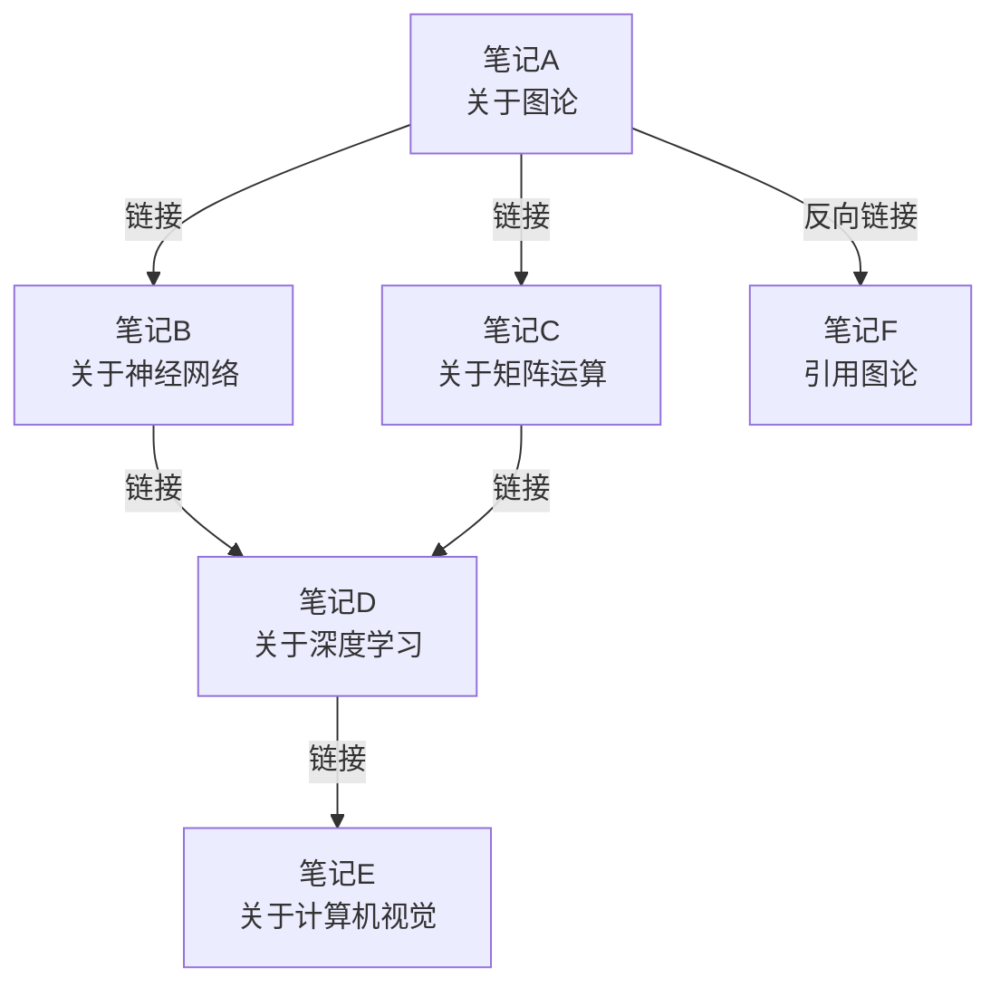
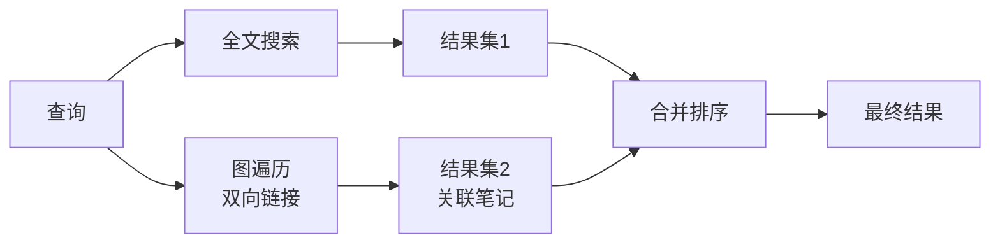

# 双向链接（Bidirectional Links）

双向链接是知识图谱和第二大脑系统中的核心概念，允许笔记之间建立可逆的关联。与传统的超链接不同，双向链接会自动在目标页面中创建反向引用，形成互联的知识网络。

## 一、理论基础

### 1.1 图论基础

双向链接的数学基础来自**图论（Graph Theory）**。每个笔记是一个节点（Node），每个链接是一条边（Edge）。双向链接构成无向图或有向图的镜像：

$$ G = (V, E) \quad \text{其中} \quad V = \text{笔记节点}, E = \text{链接边} $$

$$ \text{最短路径} \; dist(v_i, v_j) = \min_{p \in P(v_i, v_j)} |p| $$

### 1.2 双向链接 vs 单向链接

| 特性 | 单向链接（Unidirectional） | 双向链接（Bidirectional） |
|------|---------------------------|-------------------------|
| 反向可见性 | 仅源页面可见 | 自动在目标页面生成反向链接 |
| 图结构 | 有向图（Directed Graph） | 无向图或双向有向图 |
| 知识发现 | 需手动遍历 | 自动发现关联 |
| 维护成本 | 低 | 低（自动） |
| 典型工具 | Wiki、HTML a标签 | Roam Research、Obsidian、Logseq |

### 1.3 小世界网络

笔记库的双向链接网络往往呈现**小世界（Small-World）**特性：



$$ L \approx \frac{\ln N}{\ln \langle k \rangle}, \quad C \gg C_{\text{random}} $$

## 二、实现技术

### 2.1 实时反向链接索引

当笔记 A 添加指向 B 的链接时，系统立即在 B 的索引中记录反向引用：

```
A.md → [B, C, D]
B.md → [A]
C.md → [A]
D.md → [A, E]
```

### 2.2 链接图谱可视化

| 技术 | 原理 | 应用 |
|------|------|------|
| 力导向布局 | 模拟物理弹簧力 | Obsidian Graph View |
| 径向布局 | 以当前节点为中心展开 | Roam Research |
| 分层布局 | 按层级排列 | Logseq 大纲视图 |

### 2.3 全文搜索与图形遍历

双向链接与全文搜索结合，形成混合检索系统：



## 三、实践应用

### 1. 项目管理（Project Notes）

- 每个项目作为中心节点，子任务、会议记录、参考资料通过双向链接连接
- 反向链接视图展示所有涉及某个主题的上下文
- 链接层级反映项目结构，支持自底向上的归纳

### 2. 学术研究（Research Workflow）

- 文献笔记之间通过概念链接形成知识网络
- 反向链接展示所有引用某篇论文的笔记
- 标签 + 双向链接构建多维分类体系
- 渐进式总结将原始笔记提炼为永久笔记

### 3. 个人知识管理（PKM）

- 每日笔记通过双向链接关联到长期项目
- 反向链接揭示潜意识中的连接模式
- Zettelkasten 卡片通过链接产生涌现想法
- MOC（Map of Content）作为导航枢纽

### 4. 团队协作（Team PKM）

- 共享知识库中双向链接促进信息共享
- 反向链接显示谁在关注什么话题
- 避免信息孤岛，促进跨团队协作

## 四、高级技巧

1. **结构笔记（Structure Notes）**：创建 MOC 笔记作为目录，使用双向链接连接子主题
2. **孤立节点检测（Orphan Detection）**：定期检查无链接节点，促进知识连接
3. **链接类型标记（Typed Links）**：使用 `is-a`、`part-of`、`related-to` 等关系标签
4. **图谱分析（Graph Analysis）**：计算中心度、社区发现识别核心知识
5. **嵌入索引（Embedding Index）**：结合向量嵌入实现语义双向链接

## 五、工具对比

| 工具 | 链接类型 | 图谱视图 | 反向链接面板 | 特色功能 |
|------|---------|---------|------------|---------|
| Obsidian | Wiki链接 | 力导向图 | 侧边栏 | 插件生态丰富 |
| Roam Research | Block-level | 无 | 右侧面板 | 块级引用、大纲编辑 |
| Logseq | 大纲链接 | 有 | 底部面板 | 开源、Markdown优先 |
| Notion | 页面链接 | 无 | 反向链接列表 | 数据库联动 |
| TiddlyWiki | Transclusion | 无 | 链接列表 | 单HTML便携 |

## 六、挑战与局限

1. **链接过载**：过多链接导致信息噪音
2. **孤岛问题**：部分节点始终无链接
3. **维护成本**：链接结构需定期清理重构
4. **可视化限制**：大图渲染性能瓶颈
5. **语义缺失**：普通链接缺乏类型语义

## 七、未来方向

1. **语义双向链接**：链接携带关系类型
2. **AI 辅助链接**：机器学习推荐潜在链接
3. **跨库链接**：不同知识库之间的双向引用
4. **动态链接**：链接内容随源笔记自动更新

## 参考资源

- Roam Research: https://roamresearch.com
- Obsidian: https://obsidian.md
- Zettelkasten Method: https://zettelkasten.de

## 相关条目

[[DigitalNoteTaking]], [[SecondBrain]], [[GraphTheory]], [[INDEX|知识库索引]]
