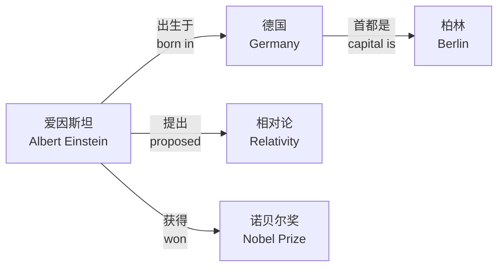
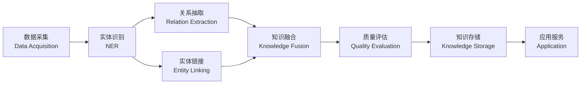

# 知识图谱基础

> 知识图谱（Knowledge Graph）是一种用图结构建模知识和实体间关系的技术体系。本文件覆盖核心概念、建模语言、查询技术、存储方案及应用场景。

---

## 一、核心概念

### 1. 实体与关系

知识图谱的基本单元是**实体（Entity）**和**关系（Relation）**。

| 概念 | 英文 | 定义 | 示例 |
|------|------|------|------|
| 实体 | Entity | 现实世界中的对象或概念 | 北京、爱因斯坦、人工智能 |
| 关系 | Relation | 实体之间的语义连接 | 位于、出生于、研究领域 |
| 属性 | Property | 实体的特征描述 | 人口、出生年份、别名 |
| 三元组 | Triple | (头实体, 关系, 尾实体) | (北京, 位于, 中国) |

### 2. 三元组（Triple）

三元组是知识图谱的最基本表达形式：

```
(头实体, 关系, 尾实体)
```

例如：
- (爱因斯坦, 出生于, 德国)
- (北京, 是首都, 中国)
- (机器学习, 是子领域, 人工智能)



### 3. 本体（Ontology）

本体是对知识图谱结构的显式形式化规范定义。

| 层次 | 说明 | 示例 |
|------|------|------|
| 模式层 | 定义类、属性、关系的结构 | Person 类有 name 属性 |
| 数据层 | 具体的实体实例 | 爱因斯坦是 Person 的实例 |
| 推理层 | 基于规则推导新知识 | 若 A 是 B 的子类，B 的实例也是 A 的实例 |

---

## 二、RDF（资源描述框架）

### 1. RDF 基础

RDF（Resource Description Framework）是 W3C 制定的知识表示标准框架。

**RDF 序列化格式**：

| 格式 | 全称 | 特点 |
|------|------|------|
| RDF/XML | XML 语法表示 | 标准规范，可读性差 |
| Turtle | Terse RDF Triple Language | 简洁易读，推荐使用 |
| N-Triples | 每行一个三元组 | 最简格式，适合大规模 |
| JSON-LD | JSON for Linked Data | Web 友好，JSON 集成 |

**Turtle 示例**：

```turtle
@prefix ex: <http://example.org/> .
@prefix rdfs: <http://www.w3.org/2000/01/rdf-schema#> .

ex:AlbertEinstein a ex:Scientist ;
    ex:name "阿尔伯特·爱因斯坦" ;
    ex:bornIn ex:Germany ;
    ex:discovered ex:Relativity .
```

### 2. RDFS 与 OWL

| 语言 | 用途 | 表达能力 |
|------|------|---------|
| RDFS | 基础类层次和属性约束 | 弱 |
| OWL | 复杂推理和约束表达 | 强 |

**OWL 公理类型**：
- 等价关系：`equivalentClass`, `equivalentProperty`
- 属性特征：`transitiveProperty`, `symmetricProperty`
- 值约束：`allValuesFrom`, `someValuesFrom`
- 基数约束：`cardinality`, `minCardinality`

---

## 三、SPARQL 查询语言

### 1. 基本语法

SPARQL 是 RDF 数据的标准查询语言，其结构类似 SQL。

```sparql
# 查询所有科学家的名字
PREFIX ex: <http://example.org/>
SELECT ?name ?birthplace
WHERE {
    ?person a ex:Scientist .
    ?person ex:name ?name .
    ?person ex:bornIn ?birthplace .
}
ORDER BY DESC(?name)
LIMIT 10
```

### 2. SPARQL 查询类型

| 类型 | 关键字 | 返回结果 |
|------|--------|---------|
| SELECT | `SELECT ?x` | 变量绑定表 |
| CONSTRUCT | `CONSTRUCT { ... }` | RDF 图 |
| ASK | `ASK` | 布尔值 |
| DESCRIBE | `DESCRIBE ?x` | 描述资源的 RDF 图 |

### 3. 复杂查询模式

```sparql
# 查找共同获奖者
PREFIX ex: <http://example.org/>
SELECT ?person1 ?person2 ?prize
WHERE {
    ?person1 ex:awarded ?prize .
    ?person2 ex:awarded ?prize .
    FILTER(?person1 != ?person2)
}
```

```sparql
# 可选匹配与条件过滤
PREFIX ex: <http://example.org/>
SELECT ?name ?birth ?death
WHERE {
    ?person a ex:Scientist ;
            ex:name ?name .
    OPTIONAL { ?person ex:birthDate ?birth . }
    OPTIONAL { ?person ex:deathDate ?death . }
    FILTER(?birth > "1900-01-01"^^xsd:date)
}
```

---

## 四、图数据库

### 1. 图数据库 vs 关系数据库

| 维度 | 图数据库 | 关系数据库 |
|------|---------|-----------|
| 数据模型 | 图结构（节点+边） | 表结构（行+列） |
| 关系处理 | 天然支持，高效遍历 | 需要 JOIN 操作 |
| 模式灵活性 | Schema-less 或灵活模式 | 固定模式 |
| 查询语言 | Cypher, Gremlin, SPARQL | SQL |
| 适用场景 | 社交网络、推荐、知识图谱 | 事务处理、报表 |

### 2. 主流图数据库

| 产品 | 类型 | 查询语言 | 特点 |
|------|------|---------|------|
| Neo4j | 原生图数据库 | Cypher | 社区活跃，生态完善 |
| JanusGraph | 分布式图数据库 | Gremlin | 可扩展，支持大数据 |
| Amazon Neptune | 托管图数据库 | SPARQL/Gremlin | 云原生，全托管 |
| ArangoDB | 多模型数据库 | AQL | 文档+图+KV 三合一 |

**Cypher 查询示例**：

```cypher
// 创建节点和关系
CREATE (einstein:Person {name: '爱因斯坦', born: 1879})
CREATE (germany:Country {name: '德国'})
CREATE (einstein)-[:BORN_IN]->(germany)

// 查询关系路径
MATCH (p:Person)-[:BORN_IN]->(c:Country)
WHERE c.name = '德国'
RETURN p.name AS scientist
```

### 3. 图算法

| 算法类别 | 算法 | 用途 |
|---------|------|------|
| 路径查找 | 最短路径、全最短路径 | 导航、网络分析 |
| 中心性 | PageRank、Betweenness | 重要节点识别 |
| 社区发现 | Louvain、Label Propagation | 社群划分 |
| 相似度 | Jaccard、余弦相似度 | 推荐系统 |

---

## 五、知识图谱构建流程



### 各阶段说明

| 阶段 | 任务 | 关键技术 |
|------|------|---------|
| 数据采集 | 结构化/半结构化/非结构化数据 | 爬虫、API、文档解析 |
| 实体识别 | 识别文本中的命名实体 | BiLSTM-CRF, BERT |
| 关系抽取 | 抽取实体间的语义关系 | 远程监督、Prompt 学习 |
| 实体链接 | 将提及链接到知识库实体 | 向量检索、排序模型 |
| 知识融合 | 合并多源知识，消除冲突 | 实体对齐、冲突消解 |
| 质量评估 | 评估三元组的正确性 | 置信度打分、规则校验 |

---

## 六、应用场景

| 场景 | 说明 | 典型案例 |
|------|------|---------|
| 搜索引擎 | 增强搜索结果语义理解 | Google Knowledge Graph |
| 问答系统 | 基于图谱的智能问答 | IBM Watson, 小度 |
| 推荐系统 | 利用实体关系改善推荐 | 美团、LinkedIn |
| 风险控制 | 关联分析发现欺诈模式 | 银行风控系统 |
| 医疗健康 | 药物发现、辅助诊断 | IBM Watson Health |
| 教育 | 知识点图谱、个性化学习 | Khan Academy |

---

## 七、数学基础

### 图表示学习

知识图谱嵌入（Knowledge Graph Embedding）将实体和关系映射到低维向量空间：

对于三元组 $(h, r, t)$，TransE 模型的得分函数为：

$$ f(h, r, t) = -\| \mathbf{h} + \mathbf{r} - \mathbf{t} \|_2 $$

其中 $\mathbf{h}, \mathbf{r}, \mathbf{t} \in \mathbb{R}^d$ 分别是头实体、关系、尾实体的嵌入向量。

**损失函数（Margin-based Ranking Loss）**：

$$ \mathcal{L} = \sum_{(h,r,t) \in S} \sum_{(h',r,t') \in S'} \max\left(0, \gamma + f(h,r,t) - f(h',r,t')\right) $$

其中 $\gamma$ 是间隔超参数，$S'$ 是负样本集合。

### 相似度度量

| 度量 | 公式 | 用途 |
|------|------|------|
| 余弦相似度 | $\cos(\mathbf{a}, \mathbf{b}) = \frac{\mathbf{a} \cdot \mathbf{b}}{\|\mathbf{a}\| \|\mathbf{b}\|}$ | 向量相似度 |
| 欧氏距离 | $d(\mathbf{a}, \mathbf{b}) = \|\mathbf{a} - \mathbf{b}\|_2$ | 空间距离 |
| 点积 | $\langle \mathbf{a}, \mathbf{b} \rangle = \sum_i a_i b_i$ | 匹配分数 |

---

## 八、知识图谱与传统学科交叉

知识图谱可与各学科结合，形成学科知识网络：

- **数学**：公式之间的关系推导图
- **物理**：物理定律、公式、实验之间的关联
- **历史**：事件、人物、时间线之间的网状关系
- **语文**：文言文字词演变、作者作品流派网络
- **英语**：词汇语义网络、语法规则图谱

## 相关条目

[[SemanticWeb]], [[ConceptMapping]], [[CrossDisciplinaryLinks]], [[双向链接]], DataScience
