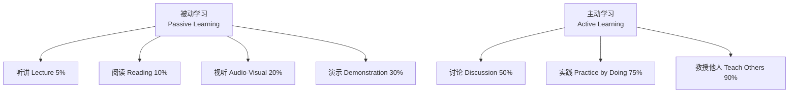
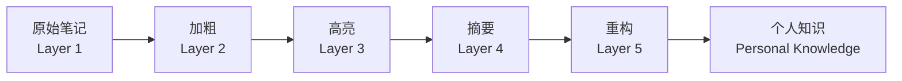
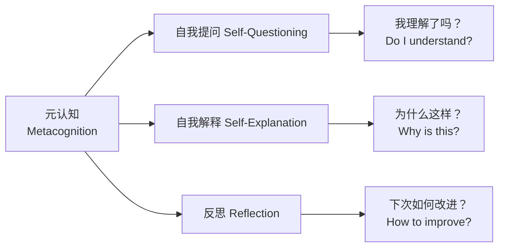
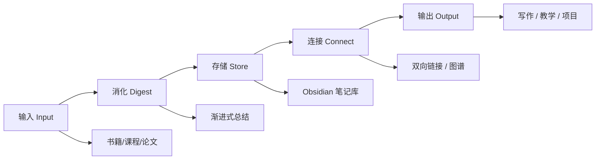

# 学习路径：知识体系框架 Learning Path: Knowledge Framework

## 概述 Overview

学习路径（Learning Path）是系统化构建知识体系的路线图。本框架提供从学习方法论到知识管理、从学科分类到个人规划的全链路指导，帮助学习者建立结构化、可扩展的个人知识库。

$$ \text{Knowledge} = \text{Information} \times \text{Context} \times \text{Connection} $$

## 学习金字塔 Learning Pyramid



## 方法论 Methodology

### 费曼学习法 Feynman Technique

1. **选择概念**：确定要学习的目标
2. **教授他人**：用最简单的语言解释给不懂的人听
3. **发现盲区**：找出解释不清的部分
4. **简化类比**：用生活化类比重述

### 间隔重复 Spaced Repetition

艾宾浩斯遗忘曲线（Ebbinghaus Forgetting Curve）揭示了记忆衰减规律：

$$ R = e^{-t/S} $$

其中 $R$ 为记忆保留率，$t$ 为时间，$S$ 为相对记忆强度。

| 复习次数 | 最佳间隔 | 保留率 |
|---------|---------|--------|
| 首次学习 | — | 100% |
| 第一次复习 | 1 天 | 70% |
| 第二次复习 | 7 天 | 85% |
| 第三次复习 | 16 天 | 92% |
| 第四次复习 | 35 天 | 96% |

### 主动回忆 Active Recall

- 关闭笔记，尝试回忆知识点
- 使用 Anki、RemNote 等 SRS 工具
- 从问题出发而非从答案出发

### 交错练习 Interleaving

交替练习不同类型的问题，而非集中练习单一类型。研究表明交错练习虽然在学习过程中感觉更困难，但长期保留效果显著优于集中练习。

## 笔记方法 Note-taking Methods

### Zettelkasten 卡片笔记法

$$ \text{Knowledge Network} = \bigcup_{i} \text{Atomic Note}_i + \bigcup_{j} \text{Link}_{j} $$

| 笔记类型 | 内容 | 特点 |
|---------|------|------|
| 文献笔记 Literature Note | 原文摘录 + 引用 | 忠实记录来源 |
| 概念笔记 Concept Note | 一个概念一个笔记 | 原子化、独立 |
| 索引笔记 Index Note | 集群入口点 | 导航结构 |
| 项目笔记 Project Note | 与特定项目相关 | 项目生命周期 |

### 渐进式总结 Progressive Summarization



## 知识管理 Knowledge Management

### DIKW 金字塔

$$ \text{Data} \to \text{Information} \to \text{Knowledge} \to \text{Wisdom} $$

| 层次 | 定义 | 示例 |
|------|------|------|
| 数据 Data | 原始符号 | 温度 23°C |
| 信息 Information | 有上下文的数据 | 今日北京温度 23°C |
| 知识 Knowledge | 有规律的信息 | 春季温度回升模式 |
| 智慧 Wisdom | 应用知识的能力 | 根据预测安排出行 |

### 知识图谱 Knowledge Graph

构建原则：
- **原子化 (Atomicity)**：一个笔记只讲一个概念
- **链接优先 (Link-first)**：强调笔记间的关联
- **渐进式发展 (Incremental Growth)**：不追求完美，逐步完善
- **结构化索引 (Structured Index)**：MOC (Map of Content) 导航

## 学科分类 Classification

### UNESCO 学科分类

| 类别 | 代码 | 示例 |
|------|------|------|
| 自然科学 | 21 | 数学、物理、化学、生物 |
| 工程与技术 | 22 | 机械、电子、计算机、土木 |
| 医学 | 31 | 基础医学、临床、药学 |
| 农业科学 | 31 | 农学、林学、畜牧 |
| 社会科学 | 51/52 | 经济、法律、教育、管理 |
| 人文科学 | 55/57 | 哲学、历史、语言、艺术 |

### 知识体系架构

```
00_KnowledgeFramework        ← 元知识：学习方法、知识管理
01_PhilosophyAndReligion     ← 哲学基础：认识论、方法论
02_SocialSciences            ← 人类社会：经济、法律、管理
03_NaturalSciences           ← 自然科学：物理、化学、生物
04_EngineeringAndTechnology  ← 工程技术：机械、电子、计算机
05_ComputerScience           ← 计算机：编程、算法、系统
06_MedicineAndHealth         ← 医学：基础、临床、预防
07_InterdisciplinarySciences ← 交叉学科：系统科学、认知
08_Humanities                ← 人文：历史、文学、艺术
12_SportsScience             ← 体育科学：训练、生理
```

## 学习规划 Planning

### 年度学习计划模板

| 阶段 | 时长 | 目标 | 产出 |
|------|------|------|------|
| 探索期 | 1-3 月 | 广泛阅读建立全局认知 | 50 张文献笔记 |
| 深耕期 | 4-6 月 | 深入学习核心领域 | 100 张概念笔记 |
| 连接期 | 7-9 月 | 建立跨领域链接 | MOC 索引 |
| 输出期 | 10-12 月 | 知识输出测试理解 | 文章、项目、教学 |

### 学习资源资源

| 类型 | 平台 | 特点 |
|------|------|------|
| MOOC | Coursera, edX, 中国大学MOOC | 系统课程、认证 |
| 视频 | YouTube, Bilibili | 直观、碎片化 |
| 书籍 | 专业教材、经典著作 | 体系完整 |
| 论文 | Google Scholar, 知网 | 前沿研究 |
| 社区 | GitHub, Stack Overflow | 实践交流 |
| 工具 | Obsidian, Anki, Zotero | 知识管理 |

### 知识输出检查清单

- [ ] 能否用一句话概括核心概念？
- [ ] 是否能用类比解释给外行人听？
- [ ] 能否写出 3 个实际应用场景？
- [ ] 是否建立了至少 3 个跨领域链接？
- [ ] 能否举出反例或边界情况？

## 推荐书籍 Recommended Books

| 领域 | 书名 | 作者 |
|------|------|------|
| 学习方法 | 《如何阅读一本书》 | Mortimer Adler |
| 笔记方法 | 《卡片笔记写作法》 | Sönke Ahrens |
| 思维模型 | 《思考，快与慢》 | Daniel Kahneman |
| 知识管理 | 《个人知识管理》 | 田志刚 |
| 学习科学 | 《剑桥学习科学手册》 | R. Keith Sawyer |
| 认知科学 | 《认知心理学及其启示》 | John R. Anderson |
| 系统思维 | 《系统之美》 | Donella Meadows |
| 自驱学习 | 《自学是门手艺》 | 李笑来 |

## 常见学习误区 Common Pitfalls

| 误区 | 表现 | 纠正方法 |
|------|------|---------|
| 收藏癖 Collecting | 收藏大量资源从不阅读 | 设置阅读计划，读完再看下一个 |
| 完美主义 Perfectionism | 笔记必须完美才输出 | 先完成再完美，渐进迭代 |
| 广度优先 Breadth-first | 什么都要学什么都不深 | 80/20 法则，聚焦核心 |
| 被动输入 Passive Input | 只看不做笔记不输出 | 费曼技巧强制输出 |
| 缺乏复习 No Review | 学完就忘 | SRS 间隔重复系统 |

## 知识复利 Knowledge Compound Interest

知识积累具有复利效应：每一点新知识都增加已有知识的价值，形成知识网络的正反馈循环。

$$ K_{\text{total}} = K_0 \times (1 + r)^t $$

其中 $r$ 是知识连接率，$t$ 是时间。提高 $r$ 的关键在于跨领域连接和主动输出。

## 元认知 Metacognition

元认知（Metacognition）是对认知过程的认知，包括：

- **计划 (Planning)**：明确学习目标、选择策略
- **监控 (Monitoring)**：检查理解程度、调整节奏
- **评估 (Evaluating)**：反思学习效果、优化方法



## 习惯养成 Habit Formation

### 习惯回路 Habit Loop

$$ \text{Cue} \to \text{Routine} \to \text{Reward} $$

### 学习习惯设计

| 习惯 | 提示 Cue | 行动 Routine | 奖励 Reward |
|------|---------|-------------|-------------|
| 每日阅读 | 早晨咖啡 | 阅读 10 页 | 记录笔记 |
| 笔记整理 | 每晚 21:00 | 整理 3 张卡片 | 绿色方块标记 |
| 每周复习 | 周日提醒 | 间隔重复 Anki | 完成进度条 |
| 知识输出 | 学完新主题 | 写 200 字解释 | 发布到博客 |

## 学习工具链 Learning Toolchain



## 相关条目

- [[InterdisciplinarySciences]]
- [[NoteTakingMethods]]
- [[Zettelkasten]]
- [[KnowledgeGraph]]
- [[Metacognition]]
