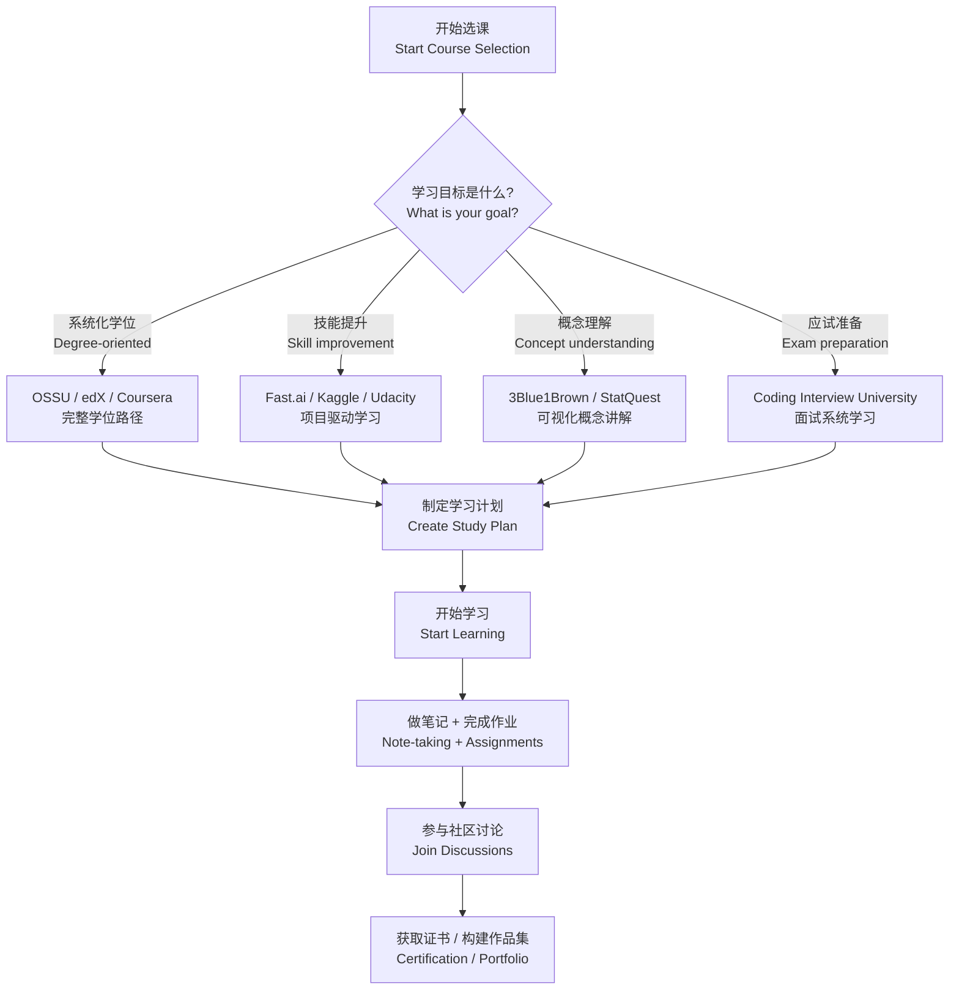

# 开放课程资源汇总 (Open Courseware Index)

开放课程资源汇总是一份系统性整理全球优质在线学习资源的索引文档。

涵盖国际主流 MOOC（Massive Open Online Course）平台、
国内开放课程平台以及垂直领域专业资源。

本索引旨在帮助学习者快速定位适合自身需求的课程平台，
提高自学（Self-Study）效率，
合理规划学习路径（Learning Path）。

内容按国际平台、国内平台和垂直资源三大部分组织，
每个部分附有平台对比表格和选课建议。

---

## 国际平台 (International Platforms)

### MOOC 平台对比

MOOC 平台是开放课程资源的核心载体。

不同平台在课程质量、费用模式和证书认可度上各有侧重。

下表对主流国际 MOOC 平台进行了横向对比：

| 平台 | 特点 | 代表课程方向 | 费用模式 |
|------|------|-------------|----------|
| Coursera | 大学合作、证书体系完善 | 计算机、商科、数据科学 | 免费旁听 / 付费证书 |
| edX | MIT 和哈佛主导，学术性强 | 计算机、工程、人文 | 免费旁听 / 付费证书 |
| Khan Academy | 完全免费，基础教育精品 | 数学、科学、编程 | 完全免费 |
| MIT OpenCourseWare | MIT 课程全部开放 | 工程、科学、管理 | 完全免费 |
| Stanford Online | 斯坦福官方课程平台 | CS、AI、医学 | 部分免费 / 付费 |
| Udacity | 企业合作、纳米学位 | AI、自动驾驶、云计算 | 付费为主 |
| FutureLearn | 英国大学联盟 | 人文、医学、法律 | 免费旁听 / 付费证书 |

### 视频与讲座平台对比

视频平台以短小精悍的概念讲解和可视化内容见长。

适合碎片化学习和概念突破：

| 平台 | 特点 | 适用场景 |
|------|------|----------|
| YouTube（教育频道） | 资源极其丰富 | 视频学习、找特定概念讲解 |
| TED Talks | 思想传播，18 分钟演讲 | 拓宽视野、获取灵感 |
| 3Blue1Brown | 数学可视化，深度讲解 | 线性代数、微积分、神经网络 |
| StatQuest | 统计学与机器学习通俗讲解 | 统计概念快速入门 |
| Computerphile | 计算机科学趣味讲解 | CS 概念理解 |
| MIT OpenCourseWare YouTube | MIT 课程视频全集 | 系统性学习 |
| Crash Course | 10-15 分钟快速课程 | 入门概览、复习回顾 |

### 专业教育资源 (Professional Educational Resources)

- **arXiv.org** — 最新学术论文预印本（Preprint），
  覆盖物理、数学、计算机等学科

- **Papers With Code** — 论文 + 代码实现 + 排行榜，
  适合机器学习研究者

- **Google Scholar** — 学术搜索引擎，
  可追踪引用和作者影响力

- **Stack Exchange / Stack Overflow** — 技术问答社区，
  近乎所有编程问题都有解答

- **GitHub** — 开源项目托管平台，
  大量课程资料和项目代码可供参考

- **ResearchGate** — 科研社交网络，
  可获取论文全文并与作者交流

---

## 国内平台 (Domestic Platforms)

### 国内 MOOC 平台对比

国内 MOOC 平台在课程本土化、学分互认和高校合作方面具有独特优势：

| 平台 | 特点 | 运营方 |
|------|------|--------|
| 学堂在线 | 清华大学主导，优质工科课程 | 清华大学 |
| 中国大学 MOOC | 网易 + 高教社，课程最全 | 网易 |
| 智慧树 | 跨校选课，学分互认体系 | 智慧树网 |
| 超星学习通 | 课程资源丰富，含图书期刊 | 超星集团 |
| 好大学在线 | 上海交通大学主导 | 上海交大 |
| 中国高校外语慕课平台 | 外语类课程专项 | 外研社 |

### 公开课与知识平台

- **网易公开课** — TED、可汗学院、国内外名校公开课的中文字幕翻译

- **哔哩哔哩（B 站）学习区** — 大量优质学习视频，
  支持弹幕互动和实时讨论

- **知乎** — 经验分享、知识问答、深度专栏文章

- **得到** — 知识付费、听书、精品课程

- **豆瓣** — 书籍评分推荐、课程评价参考

- **中国国家图书馆** — 数字资源库，含古籍、期刊、论文

---

## 垂直领域资源 (Vertical Domain Resources)

### 计算机科学 (Computer Science)

- **Teach Yourself CS** — 自学计算机科学经典路线图，
  涵盖编程、架构、网络等核心主题

- **OSSU (Open Source Society University)** —
  开源计算机科学学位课程，完整的本科程度课程体系

- **The Missing Semester of Your CS Education** —
  MIT 出品，讲授命令行、Git、调试等实用工具

- **Coding Interview University** — 面试准备系统学习计划，
  覆盖算法、数据结构、系统设计

- **Project Based Learning** — 项目驱动学习资源合集，
  为每个编程语言提供实战项目清单

### 数学 (Mathematics)

- **BetterExplained** — 用直观类比理解微积分、
  线性代数等抽象数学概念

- **Paul's Online Math Notes** — 免费且通俗易懂的
  大学数学讲义（微积分、微分方程等）

- **Brilliant.org** — 交互式数学与科学学习平台，
  强调动手探索和逻辑推理

- **Khan Academy 数学** — 从算术到线性代数的
  完整数学课程，完全免费

### 数据科学与机器学习 (Data Science & Machine Learning)

- **Kaggle** — 数据竞赛平台，含数据集、Notebook 和讨论区

- **Fast.ai** — 自顶向下的深度学习课程，
  强调实践优先的教学方法

- **d2l.ai（动手学深度学习）** — 李沐等合著，
  代码 + 理论并重的深度学习教材

- **DataCamp** — 交互式数据科学学习，
  覆盖 R、Python、SQL、Power BI

- **Hugging Face** — NLP 模型库和课程资源，
  Transformer 架构的权威学习平台

### 语言学 (Linguistics & Language Learning)

- **Duolingo** — 免费游戏化语言学习应用，支持 40+ 语言

- **Anki** — 基于间隔重复（Spaced Repetition）的记忆工具，
  适合背单词和知识点

- **Forvo** — 单词发音库，由母语者录制真实发音

- **Memrise** — 沉浸式语言学习，结合视频和记忆技巧

---

## 学习建议 (Learning Tips)

有效的在线学习需要结合合理规划、主动输出和持续反馈。

以下七条建议基于认知科学（Cognitive Science）
和大量学习者的实践经验总结而成：

1. **制定学习计划** — 先阅读课程大纲（Syllabus），
   预估每周所需时间（建议不少于 5 小时），
   合理排期并设置里程碑

2. **做好笔记** — 推荐结合 [[NoteTaking]] 中的
   Cornell Note-Taking System
   或 Zettelkasten（卡片盒笔记法）方法，
   建立知识之间的连接

3. **完成作业和测验** — 只看视频不练习效果大打折扣，
   务必完成所有编程作业（Programming Assignments）
   和测验（Quizzes）

4. **参与讨论** — 课程论坛、Reddit（如 r/learnprogramming）、
   知乎等平台可以解决大量疑惑，教学相长

5. **获取证书** — 如需证书以丰富简历，
   关注 Coursera/edX 的助学金（Financial Aid）政策，
   部分平台提供免费证书

6. **本地存档** — 重要课程视频、笔记和资料
   建议定期本地备份，防止平台内容下架

7. **建立连接** — 将新学知识与已有知识体系中的相关内容建立链接，
   使用 Obsidian 的双向链接（[[Bidirectional Linking]]）功能
   形成个人知识网络（Personal Knowledge Graph）

---

## 相关条目 (Related Notes)

- [[SelfStudy]] — 自学方法与实践，包含时间管理和学习策略

- [[CourseIndex]] — 具体课程索引，按学科分类整理推荐课程

- [[OnlineLearning]] — 在线学习策略，
  讨论如何最大化在线教育收益

- [[CareerPath]] — 职业发展路径，将学习成果转化为职业竞争力

- [[LearningPaths]] — 学习路径设计方法论

- [[NoteTaking]] — 笔记方法指南

- [[../../INDEX|TianshangKnowledgeBase 索引]]
