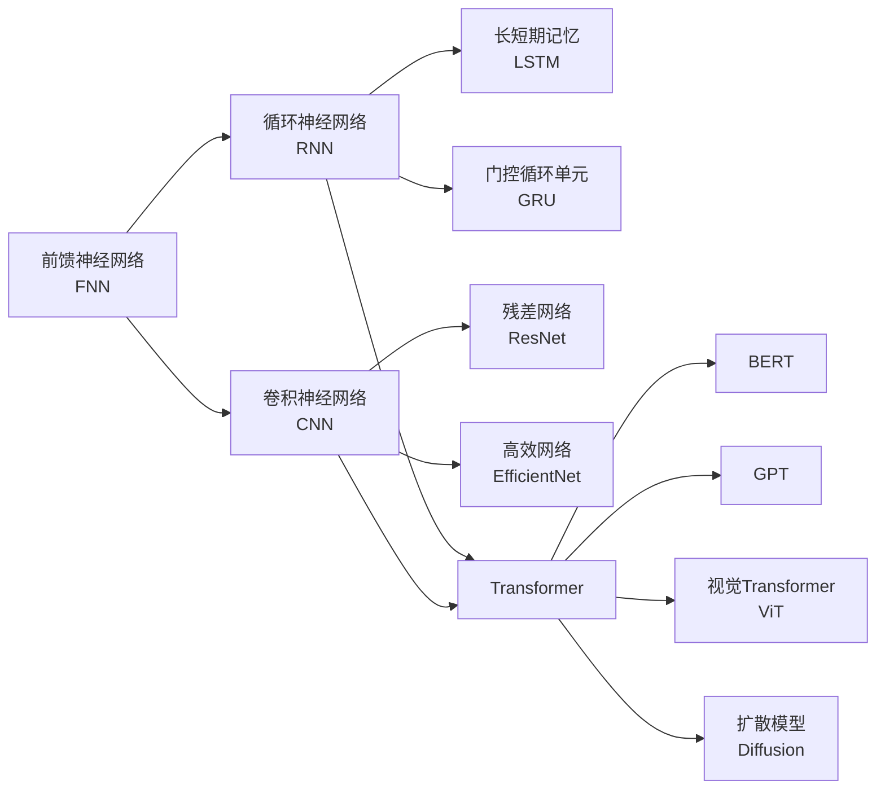

# 深度学习

深度学习（Deep Learning）是机器学习的一个子领域，基于多层人工神经网络（Artificial Neural Networks）的学习方法，通过层次化的特征提取（Hierarchical Feature Extraction）来学习数据的表示。自 2012 年 AlexNet 在 ImageNet 竞赛中取得突破以来，深度学习推动了人工智能的飞跃式发展。

## 深度学习的基本原理

### 神经网络的数学基础

一个前馈神经网络（Feedforward Neural Network, FNN）由输入层、若干隐藏层和输出层组成。每层对输入进行线性变换后应用非线性激活函数：

$$ z^{(l)} = W^{(l)} \cdot a^{(l-1)} + b^{(l)} $$
$$ a^{(l)} = f(z^{(l)}) $$

整体网络的预测输出为：

$$ y = f^{(L)}(W^{(L)} \cdot f^{(L-1)}(...f^{(1)}(W^{(1)} \cdot x + b^{(1)})...) + b^{(L)}) $$

其中 $f^{(l)}$ 为第 $l$ 层的激活函数，$W^{(l)}$ 为权重矩阵，$b^{(l)}$ 为偏置向量。

### 神经网络架构演进

## 训练过程

### 前向传播（Forward Propagation）

输入数据逐层传递，计算预测输出 $\hat{y}$ 和损失 $L$。

### 损失函数（Loss Functions）

常用损失函数的选择取决于任务类型：

$$ L_{MSE} = \frac{1}{n}\sum_{i=1}^{n}(y_i - \hat{y}_i)^2 \quad \text{(回归任务)} $$
$$ L_{CE} = -\frac{1}{n}\sum_{i=1}^{n}\sum_{j=1}^{C} y_{ij}\log(\hat{y}_{ij}) \quad \text{(分类任务)} $$
$$ L_{MAE} = \frac{1}{n}\sum_{i=1}^{n} |y_i - \hat{y}_i| \quad \text{(回归，对异常值鲁棒)} $$

### 反向传播（Backpropagation）

通过微分的链式法则（Chain Rule）计算损失关于所有参数的梯度：

$$ \frac{\partial L}{\partial W^{(l)}} = \frac{\partial L}{\partial y} \cdot \frac{\partial y}{\partial z^{(L)}} \cdot \frac{\partial z^{(L)}}{\partial z^{(L-1)}} \cdots \frac{\partial z^{(l+1)}}{\partial W^{(l)}} $$

### 梯度下降与优化器

参数更新的一般形式：

$$ W^{(l)} \leftarrow W^{(l)} - \eta \cdot \frac{\partial L}{\partial W^{(l)}} $$

| 优化器 | 特点 | 适用场景 |
|--------|------|---------|
| SGD（随机梯度下降） | 简单、稳定 | 基础训练 |
| SGD + Momentum | 加速收敛，跳出局部最优 | 通用 |
| Adam | 自适应学习率，最常用 | 大多数场景 |
| AdamW | Adam + 权重衰减 | Transformer 训练 |
| RMSProp | 自适应学习率 | RNN / 非平稳场景 |

## 主要架构详解

### CNN（卷积神经网络）

卷积操作是图像特征提取的核心：

$$ \text{Conv}(I, K)_{i,j} = \sum_{m=0}^{M-1} \sum_{n=0}^{N-1} I_{i+m, j+n} \cdot K_{m,n} $$

典型 CNN 架构：Input → Conv → ReLU → Pool → Conv → ReLU → Pool → FC → Softmax

### RNN 及其变体

循环神经网络处理序列数据，LSTM 通过门控机制解决长期依赖问题：

$$ f_t = \sigma(W_f \cdot [h_{t-1}, x_t] + b_f) \quad \text{(遗忘门)} $$
$$ i_t = \sigma(W_i \cdot [h_{t-1}, x_t] + b_i) \quad \text{(输入门)} $$
$$ o_t = \sigma(W_o \cdot [h_{t-1}, x_t] + b_o) \quad \text{(输出门)} $$

### Transformer

Transformer 完全基于注意力机制，是当前 NLP 和视觉领域的 SOTA 架构：

$$ \text{Attention}(Q, K, V) = \text{softmax}\left(\frac{QK^T}{\sqrt{d_k}}\right)V $$

## 学习范式

| 范式 | 数据需求 | 标签需求 | 典型应用 |
|------|---------|---------|---------|
| 监督学习 | 大 | 需要 | 分类、回归、检测 |
| 无监督学习 | 大 | 不需要 | 聚类、降维、生成 |
| 自监督学习 | 极大 | 不需要 | 预训练（BERT、SimCLR） |
| 强化学习 | 交互中收集 | 奖励信号 | 游戏、机器人控制 |
| 迁移学习 | 小（下游） | 少量 | 微调预训练模型 |
| 联邦学习 | 分布式 | 本地标注 | 隐私保护场景 |

## 关键挑战

| 挑战 | 现象 | 缓解策略 |
|------|------|---------|
| 过拟合 | 训练集很好，测试集很差 | Dropout、正则化、数据增强、早停 |
| 梯度消失/爆炸 | 深层网络无法训练 | BatchNorm、Residual Connection |
| 计算成本 | 模型训练成本高 | 分布式训练、量化、剪枝、蒸馏 |
| 可解释性 | 模型决策不透明 | Grad-CAM、LIME、SHAP、概念瓶颈模型 |
| 数据需求 | 需要大量标注 | 自监督、半监督、少样本学习 |
| 鲁棒性 | 对抗样本脆弱 | 对抗训练、数据增强、鲁棒优化 |

## 工具链

| 类别 | 工具/框架 |
|------|----------|
| 深度学习框架 | PyTorch、TensorFlow、JAX |
| 预训练模型库 | Hugging Face Transformers、TIMM |
| 模型部署 | ONNX、TensorRT、TorchScript |
| 实验管理 | MLflow、Weights & Biases、TensorBoard |
| 硬件加速 | NVIDIA CUDA GPU、Google TPU、Apple Neural Engine |

## 学习路径建议

1. **基础**：线性代数 + 概率统计 + Python + PyTorch
2. **入门**：动手实现简单 MLP，理解前向/反向传播
3. **进阶**：CNN → RNN/LSTM → Transformer
4. **深入**：GAN → VAE → Diffusion Models
5. **应用**：CV / NLP / 语音 / 推荐系统
6. **前沿**：大语言模型调优、多模态学习、AI Agent

## 相关条目

- [[ImageNet]]
- [[INDEX|当前目录索引]]
