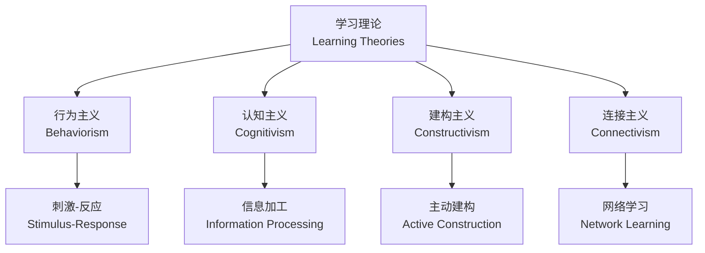

---
aliases: [终身学习, LifelongLearning, ContinuousEducation, SelfDirectedLearning, 持续教育]
tags: ['LearningPaths', 'LifelongLearning', 'SelfDevelopment', 'Education', 'SkillDevelopment']
---

# 终身学习 (Lifelong Learning)

终身学习是指个人在整个生命周期中持续获取知识、技能和能力的过程。在知识更新加速的时代，终身学习已从个人选择变为时代必需。

## 一、理论基础 (Theoretical Foundations)

### 1.1 学习理论 (Learning Theories)



### 1.2 成人学习原则 (Andragogy)

Malcolm Knowles 提出的成人学习六大原则：

| 原则 (Principle) | 说明 (Description) | 实践应用 (Application) |
|-----------------|-------------------|----------------------|
| 自主学习 (Self-Concept) | 成人需要自我导向 | 设定个人学习目标 |
| 经验 (Experience) | 成人拥有丰富经验 | 将新知识与经验连接 |
| 准备度 (Readiness) | 按需学习最有效 | 在需要时学习相关技能 |
| 应用导向 (Orientation) | 问题中心而非内容中心 | 以任务驱动学习 |
| 内在动机 (Motivation) | 内在驱动力更强 | 追求个人成长而非外部奖励 |
| 需要知道 (Need to Know) | 需要知道"为什么学" | 明确学习的价值 |

### 1.3 学习曲线 (Learning Curve)

**学习曲线**描述了效率随重复次数增加而提升的规律：

$$ T_n = T_1 \times n^{-b} \quad \text{其中 } b = \frac{\log(\text{学习率})}{\log 2} $$

**遗忘曲线 (Ebbinghaus Forgetting Curve)**：

$$ R = e^{-\frac{t}{S}} $$

其中 $R$ 为保留率 (retention rate)，$t$ 为时间，$S$ 为记忆强度 (memory strength)。

## 二、学习方法论 (Learning Methodology)

### 2.1 学习方法对比

| 方法 (Method) | 原理 (Principle) | 适用场景 (Scenario) | 效率 (Efficiency) |
|--------------|-----------------|-------------------|:----------------:|
| 费曼技巧 (Feynman Technique) | 以教代学 | 概念理解 | 高 |
| 间隔重复 (Spaced Repetition) | 优化遗忘曲线 | 记忆型知识 | 极高 |
| 主动回忆 (Active Recall) | 测试效应 | 考试准备 | 高 |
| 交错练习 (Interleaving) | 混合不同类型 | 技能迁移 | 高 |
| SQ3R 阅读法 | 调查-提问-阅读-复述-复习 | 教材阅读 | 中 |
| 刻意练习 (Deliberate Practice) | 目标明确的重复练习 | 技能精通 | 极高 |

### 2.2 知识管理流程 (Knowledge Management Flow)

```
输入 (Input) → 处理 (Process) → 存储 (Storage) → 输出 (Output) → 反馈 (Feedback)
   ↓                 ↓                ↓               ↓               ↓
 阅读/听课         整理/总结        笔记系统        写作/讲授       测试/反思
```

### 2.3 第二大脑方法论 (Second Brain Methods)

| 方法 (Method) | 创建者 (Creator) | 核心理念 (Core Idea) |
|--------------|-----------------|---------------------|
| Zettelkasten | Niklas Luhmann | 卡片笔记，双向链接 |
| PARA | Tiago Forte | 项目-领域-资源-归档 |
| CODE | Tiago Forte | 捕获-组织-提炼-表达 |
| GTD | David Allen | 清空大脑，任务管理 |

## 三、技能体系构建 (Skill System Building)

### 3.1 T 型人才模型 (T-shaped Skills)

$$ \text{深度 (Depth)} \times \text{广度 (Breadth)} = \text{T 型竞争力} $$

```mermaid
graph TD
    subgraph 广度 (Breadth)
        B1[市场营销] --- B2[产品设计]
        B2 --- B3[项目管理]
        B3 --- B4[数据分析]
        B4 --- B5[沟通协作]
    end
    subgraph 深度 (Depth)
        C1[编程核心]
        C2[系统设计]
        C3[算法]
    end
    B2 --- C1
```

### 3.2 技能分类架构 (Skill Taxonomy)

| 类别 (Category) | 定义 (Definition) | 示例 (Example) | 获取方式 (Acquisition) |
|----------------|-----------------|---------------|----------------------|
| 硬技能 (Hard Skills) | 可量化的专业技能 | 编程、会计、外语 | 系统学习 |
| 软技能 (Soft Skills) | 人际与认知能力 | 沟通、领导力 | 实践反思 |
| 元技能 (Meta Skills) | 学习能力本身 | 信息检索、批判思维 | 训练积累 |
| 横向技能 (Transferable) | 跨领域通用 | 写作、项目管理 | 多场景应用 |

### 3.3 Dreyfus 技能获取模型 (Dreyfus Model)

```
新手 (Novice) → 高级新手 (Advanced Beginner) → 胜任 (Competent)
    → 精通 (Proficient) → 专家 (Expert)
```

| 阶段 (Stage) | 特征 (Characteristics) | 学习策略 (Strategy) |
|:------------:|----------------------|-------------------|
| 新手 | 依赖规则，缺乏判断 | 结构化教程，Step-by-Step |
| 高级新手 | 能处理多情境，但缺全局观 | 项目实践，代码审查 |
| 胜任者 | 能有意识决策，承担更多责任 | 独立项目，指导他人 |
| 精通者 | 直觉判断，整体把握 | 研究前沿，知识输出 |
| 专家 | 自动化的直觉，创新贡献 | 原创研究，社区领导 |

## 四、知识体系建设 (Knowledge System Building)

### 4.1 个人知识管理工具 (PKM Tools)

| 工具 (Tool) | 核心功能 (Core Feature) | 适合人群 (Target) | 价格 (Price) |
|------------|----------------------|-----------------|:-----------:|
| Obsidian | 本地 Markdown + 图谱 | 知识工作者 | 免费 |
| Notion | 数据库 + 文档 + 协作 | 团队协作 | 免费/付费 |
| Roam Research | 块级引用 + 大纲 | 研究者 | 付费 |
| Logseq | 开源 + 大纲 + 图谱 | 技术用户 | 免费 |
| Anki | 间隔重复记忆 | 语言学习者 | 免费 |

### 4.2 四层次阅读策略 (Four Levels of Reading)

| 层次 (Level) | 目标 (Goal) | 速度 (Speed) | 方法 (Method) |
|:-----------:|------------|:-----------:|-------------|
| 检视阅读 | 判断价值 | 极快 | 目录+索引+摘要 |
| 分析阅读 | 深入理解 | 慢 | 主动提问，批判思考 |
| 主题阅读 | 横向比较 | 变速 | 多书同读，比较观点 |
| 笔记阅读 | 知识提取 | 适中 | 摘录+批注+转述 |

## 五、时间与精力管理 (Time and Energy Management)

### 5.1 学习时间分配 (Time Allocation)

$$ \text{理想分配: 50\% 实践 + 25\% 学习 + 15\% 社交 + 10\% 反思} $$

### 5.2 番茄工作法 (Pomodoro Technique)

| 周期 (Cycle) | 时长 (Duration) | 活动 (Activity) |
|:-----------:|:--------------:|----------------|
| 1 番茄 | 25 分钟 | 专注学习 |
| 短休息 | 5 分钟 | 放松 |
| 4 番茄后 | 15-30 分钟 | 长休息 |

### 5.3 专注力管理 (Focus Management)

- **深度工作 (Deep Work)**：Cal Newport 提出的无干扰专注状态
- **单任务 (Single-tasking)**：避免多任务切换导致的效率损失
- **环境设计**：创造有利于学习的环境，减少干扰源

## 六、评估与反思 (Evaluation and Reflection)

### 6.1 学习效果评估 (Learning Assessment)

| 方法 (Method) | 描述 (Description) | 频率 (Frequency) |
|--------------|------------------|:--------------:|
| 自我测试 | 主动回忆 | 每日 |
| 输出检查 | 写作/教学 | 每周 |
| 项目评审 | 回顾完成的项目 | 每月 |
| 技能审计 | 评估技能矩阵 | 每季度 |
| 年度总结 | 年度学习回顾 | 每年 |

### 6.2 学习日志模板 (Learning Log Template)

```
日期 (Date): 2025-01-15
主题 (Topic): 图神经网络
学习时长 (Duration): 2h
方法 (Method): 论文阅读 + 代码实践
收获 (Key Takeaways): 理解了 GCN 的消息传递机制
疑问 (Questions): DropEdge 的正则化效果如何验证？
下一步 (Next Steps): 在 Cora 数据集上复现结果
```

## 七、未来趋势 (Future Trends)

### 7.1 技术驱动学习 (Technology-driven Learning)

| 技术 (Technology) | 应用场景 (Application) | 影响 (Impact) |
|-----------------|---------------------|--------------|
| AI 个性化学习 | 自适应学习路径 | 提高学习效率 |
| VR/AR 沉浸学习 | 技能模拟训练 | 降低实践成本 |
| 微认证 (Micro-credentials) | 技能证书化 | 替代传统学历 |
| 学习分析 (Learning Analytics) | 数据驱动优化 | 精准反馈 |

### 7.2 学习社区与网络 (Learning Communities)

- **社群学习**：知识在社区中共同建构
- **导师制 (Mentorship)**：资深者指导新手
- **学习小组 (Study Group)**：同伴互助
- **开源贡献**：在真实项目中学习

## 参考资源 (References)

- Knowles, M. S. (1980). *The Modern Practice of Adult Education*.
- Ericsson, K. A. (2016). *Peak: Secrets from the New Science of Expertise*.
- Newport, C. (2016). *Deep Work: Rules for Focused Success*.
- Oakley, B. (2014). *A Mind for Numbers*.

## 相关条目 (Related Entries)

[[SelfDirectedLearning]], [[SkillDevelopment]], [[PKM]], [[00_KnowledgeFramework/Methodology/CriticalThinking|CriticalThinking]], [[LearningHowToLearn]], [[11_ManagementSciences/LibraryAndArchive/KnowledgeManagement|KnowledgeManagement]]

