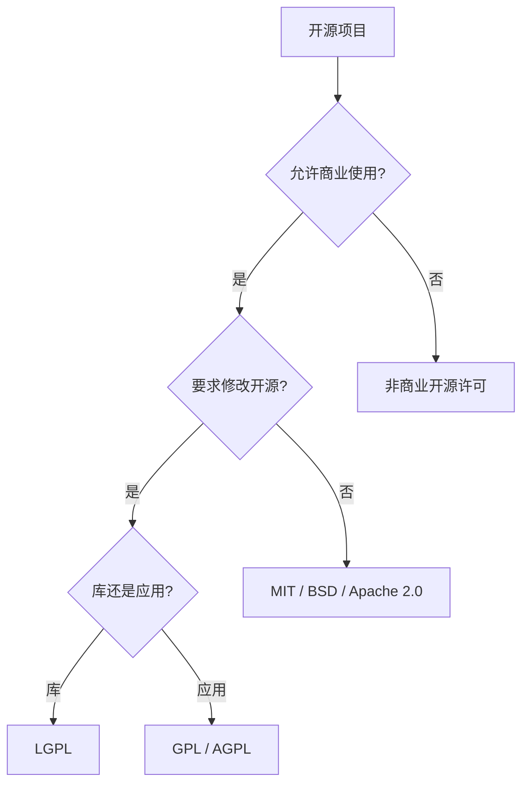

# 许可与版权指南
## 一、版权基本原理
### 1.1 专有权利

版权（Copyright）赋予创作者对其原创作品的一系列专有权利：
| 权利类型 | 说明 | 对应场景 |
|---------|------|---------|
| 复制权 | 制作作品副本 | 复印、扫描、下载 |
| 发行权 | 向公众提供作品 | 出版、销售、分发 |
| 演绎权 | 创作衍生作品 | 翻译、改编、改编电影 |
| 公开展示权 | 公开陈列作品 | 展览、放映 |
| 公开表演权 | 公开演出作品 | 音乐会、朗诵 |
| 广播权 | 通过无线/有线传播 | 电视、网络直播 |

### 1.2 保护期限

$$ \text{版权期限} = \text{作者终身} + \text{70 年（死后）} $$

| 国家/地区 | 一般期限 | 匿名作品 | 法人作品 |
|-----------|:--------:|:--------:|:--------:|
| 中国 | 作者终身 + 50 年 | 发表后 50 年 | 发表后 50 年 |
| 美国 | 作者终身 + 70 年 | 发表后 95 年 | 发表后 95 年 |
| 欧盟 | 作者终身 + 70 年 | 发表后 70 年 | 发表后 70 年 |
| 伯尔尼公约 | 作者终身 + 50 年（最低）| 发表后 50 年 | 发表后 50 年 |

### 1.3 合理使用（Fair Use）
美国版权法第 107 条规定的四个考量因素：
| 因素 | 说明 | 有利于合理使用 | 不利于合理使用 |
|------|------|:-------------:|:--------------:|
| 使用目的与性质 | 商业 vs. 非营利教育 | 教育/评论/研究 | 商业利用 |
| 原作品性质 | 事实性 vs. 创意性 | 事实性作品 | 高度创意作品 |
| 使用比例 | 使用量占原作品比重 | 少量/非核心 | 大量/核心部分 |
| 市场影响 | 对原作品市场的影响 | 无替代效果 | 直接替代市场 |

**中国合理使用**（《著作权法》第 24 条）：列举式规定，包括个人学习、适当引用、课堂教学、执行公务等情形，适用范围较美国更窄。
## 二、开源软件许可证

### 2.1 许可证分类
| 类别 | 许可证 | 特点 | 商业友好 | 专利授权 | 兼容性 |
|:----:|--------|------|:--------:|:--------:|:------:|
| 宽松型 | MIT | 极简，只需保留版权声明 | ✓ | ✗ | 高 |
| 宽松型 | BSD 2-Clause | MIT 同类，无担保条款 | ✓ | ✗ | 高 |
| 宽松型 | BSD 3-Clause | 增加禁止背书条款 | ✓ | ✗ | 高 |
| 宽松型 | Apache 2.0 | 明确的专利授权 | ✓ | ✓ | 高 |
| 弱 copyleft | MPL 2.0 | 文件级 copyleft | ✓ | ✓ | 中 |
| 弱 copyleft | LGPL | 库级 copyleft（链接例外）| ✓ | ✓ | 中 |
| 强 copyleft | GPL v2 | 强制开源衍生作品 | ✓ | ✗ | 低 |
| 强 copyleft | GPL v3 | 增加专利/反 DRM 条款 | ✓ | ✓ | 低 |
| 网络 copyleft | AGPL v3 | 远程网络使用也触发 copyleft | ✓ | ✓ | 低 |

### 2.2 许可证兼容性矩阵
| 组合使用 | MIT | Apache 2.0 | GPL v2 | GPL v3 | AGPL v3 |
|---------|:---:|:----------:|:------:|:------:|:--------:|
| 使用 MIT 代码的衍生作品 | ✓ | ✓ | ✓ | ✓ | ✓ |
| 使用 Apache 2.0 代码的衍生作品 | ✓ | ✓ | ✓ | ✓ | ✓ |
| 使用 GPL v2 代码的衍生作品 | ✗ | ✗ | ✓ | ✗ | ✗ |
| 使用 GPL v3 代码的衍生作品 | ✗ | ✗ | ✗ | ✓ | ✓ |
| 使用 AGPL v3 代码的衍生作品 | ✗ | ✗ | ✗ | ✗ | ✓ |

> 组合不同许可证的代码时，必须遵守最严格的许可证条款（兼容性检查至关重要）。
### 2.3 许可证选择指南



## 三、知识共享许可证

### 3.1 六种核心许可证
| 许可证 | 缩写 | 署名 | 非商业 | 禁止演绎 | 相同方式共享 |
|--------|:----:|:----:|:------:|:--------:|:----------:|
| CC BY | BY | ✓ | ✗ | ✗ | ✗ |
| CC BY-SA | BY-SA | ✓ | ✗ | ✗ | ✓ |
| CC BY-NC | BY-NC | ✓ | ✓ | ✗ | ✗ |
| CC BY-NC-SA | BY-NC-SA | ✓ | ✓ | ✗ | ✓ |
| CC BY-ND | BY-ND | ✓ | ✗ | ✓ | ✗ |
| CC BY-NC-ND | BY-NC-ND | ✓ | ✓ | ✓ | ✗ |

### 3.2 CC0 与公共领域
CC0（Public Domain Dedication）允许作者完全放弃版权，作品进入公共领域。与 CC BY 的区别：

| 特性 | CC0 | CC BY |
|------|:---:|:-----:|
| 放弃所有版权 | ✓ | ✗ |
| 是否需要署名 | ✗ | ✓ |
| 商业使用 | 允许 | 允许 |
| 修改与演绎 | 允许 | 允许 |
| 不可撤销 | ✓ | 不可撤销（可停止许可）|

## 四、软件许可模式
### 4.1 许可模式对比

| 模式 | 定义 | 示例 | 收费 | 源代码 |
|:----:|------|------|:---:|:------:|
| 专有 | 保留全部权利，仅授予使用许可 | Windows, Office | ✓ | 不公开 |
| 免费软件（Freeware）| 免费使用，不提供源代码 | 7-Zip, CCleaner | ✗ | 通常不公开 |
| 共享软件 | 试用后付费 | WinRAR | 试用→付费 | 不公开 |
| 开源软件 | 开放源代码，多种许可 | Linux, Firefox | ✗ | ✓ |
| 公共领域 | 无版权限制 | 经典作品 | ✗ | — |

### 4.2 SaaS 与开源
SaaS（Software as a Service）对开源许可证提出新挑战。AGPL v3 是唯一明确覆盖网络服务场景的 copyleft 许可证。部分项目采用"Commons Clause"或"BSL"（Business Source License）限制商业云服务商。
## 五、学术出版版权
### 5.1 论文版本定义

| 版本 | 阶段 | 版权归属 |
|:----:|------|---------|
| Preprint | 投稿前手稿 | 作者 |
| Submitted Manuscript | 已投稿 | 作者 |
| Accepted Manuscript / Postprint | 已接受、同行评审后 | 通常归作者 |
| Version of Record (VoR) | 出版社最终排版 | 通常归出版社 |

### 5.2 Sherpa/RoMEO 颜色分类

| 颜色 | Preprint | Postprint | VoR | 说明 |
|:----:|:--------:|:---------:|:---:|------|
| 绿色 | ✓ | ✓ | ✓ | 最开放 |
| 蓝色 | ✓ | ✓ | ✗ | 允许预印本 |
| 黄色 | ✓ | ✗ | ✗ | 仅允许后印本 |
| 白色 | ✗ | ✗ | ✗ | 不认可自存档 |

### 5.3 开放获取模式
| 模式 | 定义 | 读者付费 | 作者付费 | 版权归属 |
|:----:|------|:--------:|:--------:|---------|
| 金色 OA | 出版社网站直接开放 | ✗ | ✓（APC）| CC BY 等 |
| 绿色 OA | 在机构库/预印本平台存档 | 订阅期限制 | ✗ | 出版社 |
| 混合 OA | 部分文章 OA，部分订阅 | 部分 OA | 部分需要 | 按协议 |
| 钻石 OA | 读者和作者均不付费 | ✗ | ✗ | 保留/CC |
| 青铜 OA | 出版社免费开放但不含正式许可 | ✗ | 不定 | 未明确 |

**APC（Article Processing Charge）**：金色 OA 的文章处理费，通常为 $500-$11,000。
## 六、数据许可证

| 许可证 | 缩写 | 适用对象 | 商业使用 | 署名 | 相同方式共享 |
|--------|:----:|---------|:--------:|:----:|:----------:|
| ODC Public Domain Dedication | PDDL | 数据库 | ✓ | ✗ | ✗ |
| ODC Attribution License | ODC-BY | 数据库 | ✓ | ✓ | ✗ |
| Open Database License | ODbL | 数据库 | ✓ | ✓ | ✓ |
| CC0 | CC0 | 数据集 | ✓ | ✗ | ✗ |
| CC BY 4.0 | CC BY | 数据集 | ✓ | ✓ | ✗ |

## 七、专利基础

### 7.1 专利类型

| 类型 | 保护对象 | 保护期限 | 示例 |
|:----:|---------|:--------:|------|
| 发明专利 | 技术方案 | 20 年 | 算法、化合物 |
| 实用新型 | 产品形状/结构 | 10 年 | 机械结构 |
| 外观设计 | 产品外观 | 15 年 | UI 界面 |

### 7.2 申请流程

```
临时申请（美国）→ 非临时申请 → 审查 → 授权
优先权申请 → PCT 国际申请 → 国家阶段 → 授权
```

**PCT（Patent Cooperation Treaty）**：通过单一国际申请，在 153 个缔约国中保留优先权，简化多国申请流程。
## 八、商标基础

| 标记 | 含义 | 注册要求 |
|:----:|------|---------|
| ™ | 未注册商标声明 | 无，使用即获得 |
| ® | 已注册商标声明 | 获得注册证书 |
| © | 版权声明 | 自动获得（非强制）|
| ℗ | 录音制品邻接权 | 自动获得 |

**商标侵权判定要素**：① 商标是否有效；② 双方商品/服务是否类似；③ 商标是否近似（音/形/义）；④ 是否可能导致混淆。
## 九、数字版权管理（DRM）
### 9.1 DRM 技术类型
| 技术 | 原理 | 应用 |
|------|------|------|
| 加密 | AES-128 加密内容 | 电子书、流媒体 |
| 数字水印 | 嵌入不可见标识 | 图像、视频 |
| 授权管理 | 限制设备/用户数量 | 软件许可 |
| 硬件绑定 | 锁定特定设备 | 游戏机 |

### 9.2 DMCA 反规避条款
美国 DMCA（Digital Millennium Copyright Act）第 1201 条禁止规避技术保护措施（DRM 破解），违反者可面临民事和刑事处罚。中国的《信息网络传播权保护条例》也有类似的反规避条款。
## 参考资料
- 中国《著作权法》（2020 修正）
- 中国《专利法》（2020 修正）
- *Open Source Licensing* by Lawrence Rosen
- Creative Commons: https://creativecommons.org
- Open Source Initiative: https://opensource.org/licenses
- Sherpa/RoMEO: https://v2.sherpa.ac.uk/romeo
- SPDX License List: https://spdx.org/licenses

## 相关条目

OpenSource, CreativeCommons, [[03_HumanitiesAndSocialSciences/Law/IntellectualProperty/INDEX|IntellectualProperty]], CopyrightLaw
