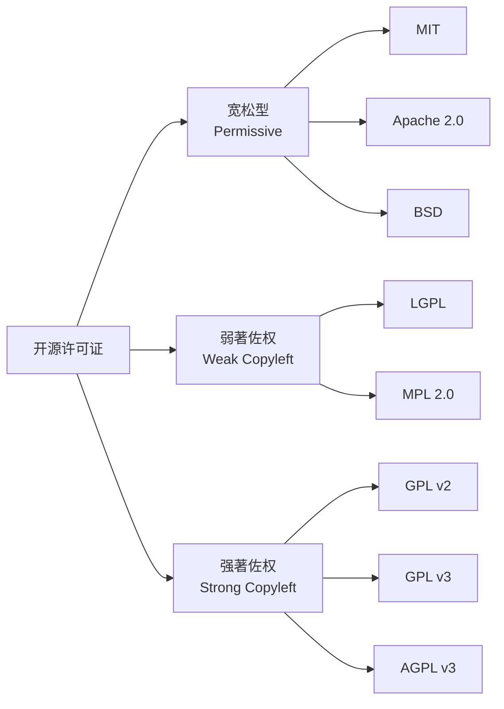

# 开源许可证指南（Open Source License Guide）

开源许可证（Open Source License）是软件开发者在授权他人使用、修改和分发其源代码的法律协议。选择正确的开源许可证对项目的健康发展至关重要。

## 一、许可证概述

### 1.1 许可证分类

开源许可证主要分为三大类：

- **宽松许可证（Permissive）**：允许使用者任意使用、修改和再分发，仅需保留版权声明。商业友好，兼容性强。
- **弱著佐权许可证（Weak Copyleft）**：要求对许可证覆盖的代码本身的修改保持开源，但允许与闭源代码链接。
- **强著佐权许可证（Strong Copyleft）**：要求基于该代码的所有衍生作品都必须以相同许可证开源。

### 1.2 许可证强度光谱

$$ \text{自由度} \quad \underbrace{\text{MIT} \rightarrow \text{BSD} \rightarrow \text{Apache 2.0} \rightarrow \text{MPL} \rightarrow \text{LGPL} \rightarrow \text{GPL} \rightarrow \text{AGPL}}_{\text{约束递增}} $$

## 二、主要许可证详解

### 2.1 MIT 许可证

最经典的宽松许可证，仅要求保留版权声明和许可证声明。

- 特点：最简单、限制最少、最流行
- 适用：希望代码被广泛采用的项目
- 兼容性：几乎与所有许可证兼容
- 注意事项：无专利授权条款，无担保条款

### 2.2 Apache License 2.0

比 MIT 更全面的宽松许可证，增加了专利授权和专利报复条款。

- 特点：明确专利授权、贡献者需授权专利、包含免责声明
- 适用：企业对专利风险敏感的项目
- 兼容性：与 GPL v3 兼容，与 GPL v2 不兼容
- 注意事项：所有修改文件需标注修改说明

### 2.3 BSD 许可证

包含 2-Clause（简化版）和 3-Clause（标准版）两种：

- BSD 2-Clause：与 MIT 类似，禁止使用作者名推广
- BSD 3-Clause：增加禁止使用作者名背书或推广的条款
- 适用：学术界、研究机构
- 兼容性：与大多数许可证兼容

### 2.4 GNU General Public License (GPL)

强著佐权许可证的代表，由自由软件基金会（FSF）维护。

**GPL v2**：

- 要求：衍生作品必须使用 GPL v2 发布
- 适用：希望确保软件永远保持开源的项目
- 兼容性：仅与兼容 GPL v2 的许可证兼容
- 注意：无专利条款，Tivoization 漏洞

**GPL v3**：

- 要求：与 GPL v2 相同，增加反 Tivoization 条款、专利报复
- 适用：关注用户自由的系统软件
- 兼容性：与 Apache 2.0 兼容，与 GPL v2 不完全兼容
- 新增：明确处理专利授权和硬件限制

### 2.5 GNU Lesser General Public License (LGPL)

弱著佐权许可证，允许闭源代码链接到 LGPL 库。

- 要求：修改 LGPL 代码本身需开源，但链接的程序可闭源
- 适用：库/框架，希望被广泛采用同时保持库本身开源
- 兼容性：与 GPL 系列兼容
- 版本：LGPL v2.1 最常用，LGPL v3 对应 GPL v3

### 2.6 GNU Affero General Public License (AGPL)

针对网络服务的强著佐权许可证，填补了 GPL 的"网络服务漏洞"。

- 要求：通过网络提供服务或修改代码也必须开源
- 适用：SaaS/云服务项目
- 兼容性：与 GPL v3 兼容
- 注意：对商业企业约束力最强

### 2.7 Mozilla Public License (MPL)

文件级别的弱著佐权许可证。

- 要求：修改 MPL 文件需开源，但可与其他许可证文件混合
- 适用：希望在库级别保持开源，同时允许与闭源代码混合的项目
- 兼容性：与 GPL/AGPL 兼容，与 Apache 2.0 兼容

## 三、许可证条款对比

| 许可证 | 商业使用 | 修改 | 分发 | 专利授权 | 专利报复 | 私有使用 | 商标限制 | 免责声明 | 兼容 GPL |
|-------|---------|------|------|---------|---------|---------|---------|---------|---------|
| MIT | 允许 | 允许 | 允许 | 无 | 无 | 允许 | 无 | 有 | 是 |
| Apache 2.0 | 允许 | 允许 | 允许 | 有 | 有 | 允许 | 无 | 有 | v3 兼容 |
| BSD 2-Clause | 允许 | 允许 | 允许 | 无 | 无 | 允许 | 有 | 有 | 是 |
| BSD 3-Clause | 允许 | 允许 | 允许 | 无 | 无 | 允许 | 有 | 有 | 是 |
| GPL v2 | 允许 | 允许 | 允许 | 无 | 无 | 允许 | 无 | 有 | 是 |
| GPL v3 | 允许 | 允许 | 允许 | 有 | 有 | 允许 | 无 | 有 | 是 |
| LGPL v2.1 | 允许 | 允许 | 允许 | 无 | 无 | 允许 | 无 | 有 | 是 |
| AGPL v3 | 允许 | 允许 | 允许 | 有 | 有 | 允许 | 无 | 有 | 是 |
| MPL 2.0 | 允许 | 允许 | 允许 | 有 | 有 | 允许 | 无 | 有 | 是 |

## 四、许可证选择决策流程

使用以下思考流程帮助选择许可证：

**步骤一**：是否需要专利保护？
- 是 → Apache 2.0 / GPL v3 / AGPL v3 / MPL 2.0
- 否 → 继续下一步

**步骤二**：是否希望代码被尽可能广泛采用（包括闭源项目）？
- 是 → MIT / Apache 2.0 / BSD
- 否 → 继续下一步

**步骤三**：是否需要确保衍生作品保持开源？
- 是 → GPL（分发型）/ AGPL（网络服务型）
- 否 → 继续下一步

**步骤四**：是否允许闭源代码链接到你的库？
- 是 → LGPL / MPL
- 否 → GPL

**步骤五**：项目是否为网络服务（SaaS）？
- 是 → AGPL
- 否 → GPL

**决策速查**：

| 场景 | 推荐许可证 |
|------|-----------|
| 个人小项目，希望简单易用 | MIT |
| 企业项目，需要专利保护 | Apache 2.0 |
| 学术研究、大学项目 | BSD 3-Clause |
| 确保修改保持开源 | GPL v3 |
| 库/框架（希望广泛采用） | MIT / Apache 2.0 或 LGPL / MPL |
| 云服务 SaaS 项目 | AGPL v3 |
| 文档、非软件作品 | CC BY 4.0 或 CC BY-SA 4.0 |

## 五、许可证兼容性

| 许可证 A | 许可证 B | 能否在 A 项目中使用 B 的代码 |
|---------|---------|---------------------------|
| MIT | 任意 | 可以（MIT 宽松） |
| Apache 2.0 | GPL v3 | 可以（单向兼容） |
| Apache 2.0 | GPL v2 | 不可以（不兼容） |
| GPL v3 | Apache 2.0 | 可以 |
| GPL v2 | GPL v3 | 仅可视为独立程序（不可合并） |
| LGPL | GPL | 可以（LGPL 可被 GPL 使用） |
| 任意 | MIT | 可以（MIT 代码可被任意项目使用） |

## 六、实践建议

1. **多个许可证并存**：可为项目提供"许可证例外"或使用多许可证策略（如 MySQL 使用 GPL v2 + 商业许可）
2. **许可证声明文件**：项目中应包含 LICENSE 或 COPYING 文件，每个源文件头部标注 SPDX 标识
3. **贡献者协议（CLA）**：大项目可要求贡献者签署 CLA，明确贡献的授权范围
4. **依赖项许可证检查**：使用工具（如 FOSSA、Black Duck）检查项目中所有依赖的许可证合规性
5. **修改记录**：Apache 2.0 要求修改文件头部标注修改说明，实践中建议所有项目均保持此习惯
6. **国际适用性**：开源许可证主要基于美国法律，在中国需考虑与著作权法的衔接，必要时咨询法律专业人士

## 参考资源

- Open Source Initiative (OSI): https://opensource.org/licenses
- Choose A License: https://choosealicense.com
- GNU Licenses: https://www.gnu.org/licenses/licenses.html
- SPDX License List: https://spdx.org/licenses
- FOSSA License Compatibility: https://fossa.com
- GitHub License Usage Guide: https://docs.github.com/en/repositories/managing-your-repositorys-settings-and-features/customizing-your-repository/licensing-a-repository
- 中国开源云联盟: https://www.coscl.org.cn

## 相关条目

OpenSource, CreativeCommons, [[03_HumanitiesAndSocialSciences/Law/IntellectualProperty/INDEX|IntellectualProperty]], CopyrightLaw
