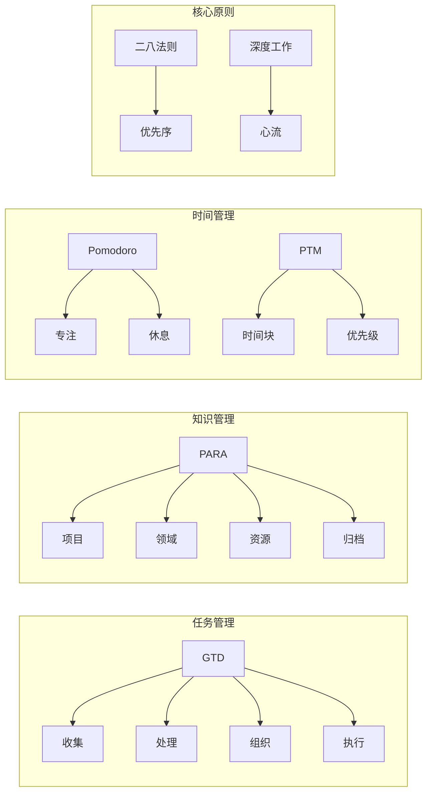
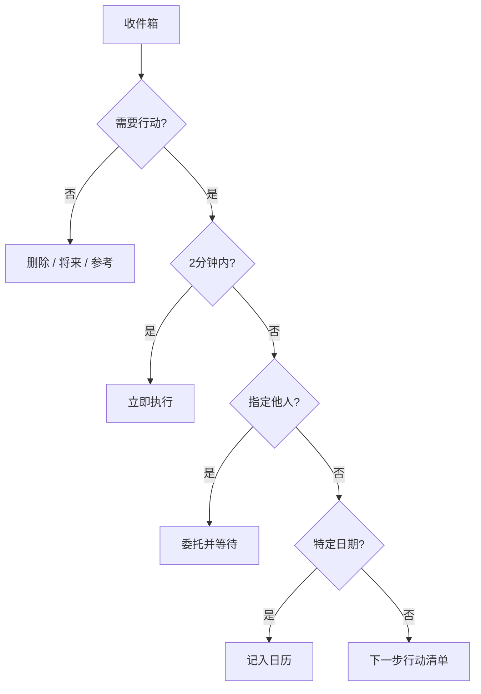

---
aliases:
  - 生产力系统
  - 效率系统
  - 时间管理方法
  - GTD
  - PARA 方法
tags:
created: 2026-05-17
updated: 2026-05-17
  - productivity
  - gtd
  - para
  - time-management
  - workflow
  - methodology
---

# 生产力系统

## 概述

生产力系统（Productivity Systems）是帮助个人或团队 **高效完成任务、管理知识、优化工作流** 的方法论框架。不同的系统适用于不同的人格特质、工作类型和生活节奏。

## 系统总览



## GTD 方法

### 理论基础

**GTD（Getting Things Done）** 由 David Allen 在 2001 年提出，核心理念是 **"把大脑清空，外包给系统"**。大脑适合处理而非存储任务信息。

$$
\text{Mental Load} = \sum_{i=1}^{n} \text{(unresolved task}_i\text{)}
$$

### 五个阶段

| 阶段 | 英文 | 核心动作 |
|------|------|----------|
| 收集 | Capture | 将所有待办事项收入收件箱 |
| 处理 | Clarify | 判断每项是否需要行动 |
| 组织 | Organize | 分类到清单或日历 |
| 回顾 | Reflect | 每周回顾，保持系统更新 |
| 执行 | Engage | 选择最佳行动执行 |

### 处理流程图



## PARA 方法

### 理论基础

**PARA** 由 Tiago Forte 在 *Building a Second Brain* 中提出，将信息分为四类：

$$
\text{PARA} = \{ \text{Projects}, \text{Areas}, \text{Resources}, \text{Archives} \}
$$

| 类别 | 定义 | 示例 |
|------|------|------|
| **P**rojects（项目） | 有截止日期的短期成果 | "完成论文初稿（6月30日）" |
| **A**reas（领域） | 需要长期维护的责任 | "健康管理 / 财务管理" |
| **R**esources（资源） | 持续感兴趣的主题 | "AI 技术趋势笔记" |
| **A**rchives（归档） | 已完成或不再活跃的内容 | "2024 年项目存档" |

### PARA 的移动原则

- 项目完成后 → 归档
- 领域不再相关 → 归档
- 资源价值降低 → 归档
- 归档内容随时可回归

## 番茄工作法

番茄工作法（Pomodoro Technique）由 Francesco Cirillo 在 1980s 开发。

### 基本流程

```
25分钟专注工作 → 5分钟短休息 → 重复4轮 → 15-30分钟长休息
```

### 数学建模

工作效率随时间的变化可近似为：

$$
E(t) = E_0 \cdot e^{-\lambda t} + E_{\text{reset}} \cdot (1 - e^{-\lambda (t \bmod T)})
$$

其中 $T$ 为番茄周期，$\lambda$ 为疲劳衰减系数。

## 时间块管理

### 时间封锁法（Time Blocking）

将一天按时间切分为固定块，每块分配特定任务类型：

| 时间段 | 时间块类型 | 任务示例 |
|--------|------------|----------|
| 08:00—10:00 | 深度工作块 | 论文写作 |
| 10:00—10:30 | 浅度工作块 | 邮件处理 |
| 10:30—12:00 | 会议块 | 组会/讨论 |
| 13:00—15:00 | 深度工作块 | 数据分析 |
| 15:00—16:00 | 学习块 | 读文献 |

## 深度工作

### Cal Newport 的四象限

$$
\text{工作质量} = \text{投入时间} \times \text{专注程度} \times \text{方法效率}
$$

| 象限 | 状态 | 典型活动 |
|------|------|----------|
| 深度工作 | 高专注、高价值 | 研究、写作、编程 |
| 浅度工作 | 低专注、低价值 | 邮件、会议、社交 |
| 专注休闲 | 高投入、非工作 | 高效学习 |
| 被动休闲 | 低投入、非工作 | 刷手机 |

## 二八法则

**Pareto Principle**：80% 的结果来自 20% 的投入。

$$
\sum_{i=1}^{0.2n} \text{output}_i \approx 0.8 \cdot \sum_{i=1}^{n} \text{output}_i
$$

在生产力中应用：

- 识别创造 80% 价值的 20% 任务
- 优先完成这 20% 的任务
- 对剩余 80% 的任务进行自动化或委托

## 工具选择

| 工具 | 适用系统 | 平台 |
|------|----------|------|
| Todoist | GTD | 全平台 |
| Notion | PARA | 全平台 |
| Obsidian | 知识管理 | 全平台 |
| TickTick | 番茄工作法 | 全平台 |
| Calendar | 时间封锁 | 全平台 |

## 混合方法建议

不存在万能系统，建议采用混合策略：

1. **用 PARA 组织信息**（长期结构）
2. **用 GTD 处理任务**（每日执行）
3. **用番茄工作法保持专注**（单任务执行）
4. **用时间块规划日程**（周/日安排）
5. **用深度工作原则评估产出质量**

## 常见陷阱

- 系统过于复杂 → 难以坚持
- 过度收集不处理 → 收件箱膨胀
- 忽视回顾环节 → 系统逐渐失效
- 不结合实际 → 死板套用方法

## 推荐阅读

- Allen, D. (2001). *Getting Things Done*
- Forte, T. (2022). *Building a Second Brain*
- Cirillo, F. (2006). *The Pomodoro Technique*
- Newport, C. (2016). *Deep Work*
