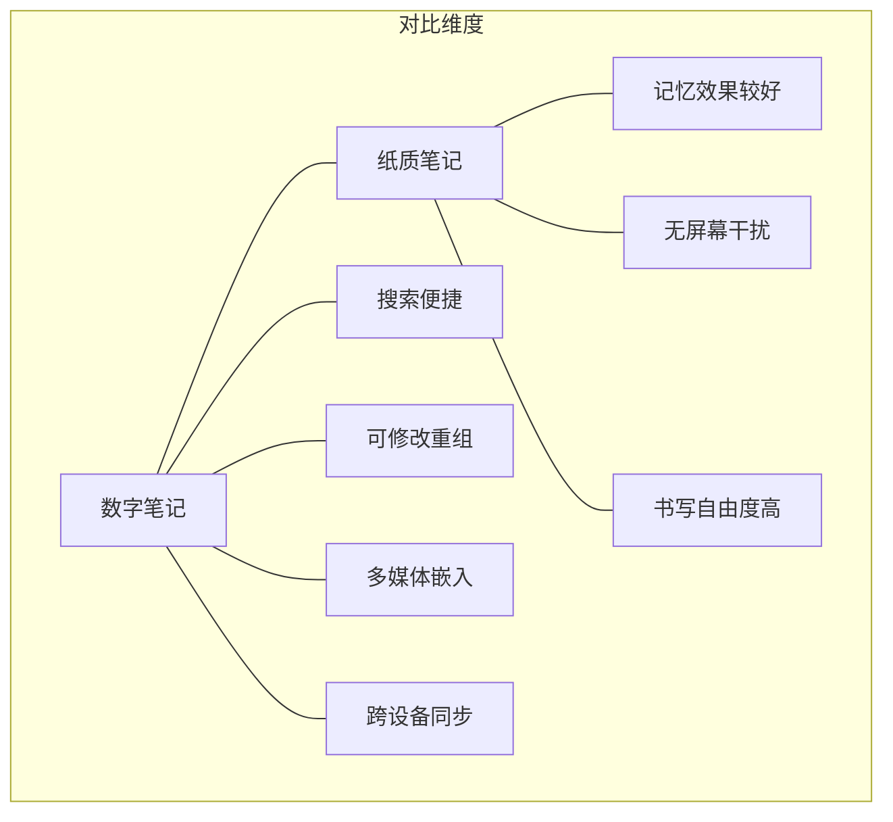
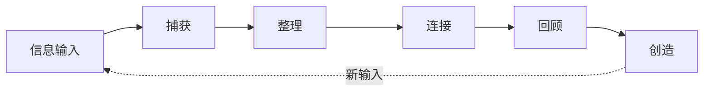

---
aliases:
  - 数字化笔记
  - 数字笔记
  - DigitalNotes
  - PKM工具
tags:
  - note-taking
  - digital-tools
  - knowledge-management
  - productivity
  - pkm
  - second-brain
---

# 数字化笔记（Digital Note-Taking）

数字化笔记是指利用数字工具进行信息记录、组织与回顾的实践方法论。它是现代知识工作者和终身学习者的核心技能，也是第二大脑（Second Brain）方法论的具体实现基础。

## 一、数字笔记vs传统笔记



| 维度 | 纸质笔记 | 数字笔记 |
|------|---------|---------|
| 搜索性 | 需手动翻阅 | 即时全文搜索 |
| 可编辑性 | 修改困难 | 随时编辑重构 |
| 多媒体支持 | 仅文字/手绘 | 图片、音频、视频、链接 |
| 跨设备同步 | 物理唯一 | 多端实时同步 |
| 知识关联 | 有限 | 双向链接、知识图谱 |
| 持久性 | 受物理条件限制 | 云端多备份 |
| 学习效果 | 手写增强记忆 | 依赖整理策略 |

## 二、主流笔记方法

### 2.1 Zettelkasten（卡片盒笔记法）

由德国社会学家Niklas Luhmann创立（他一生写了90,000+张卡片），是当代数字笔记系统的理论基础。

**四大原则**：
1. **原子性**（Atomicity）：每条笔记只包含一个概念
2. **自主性**（Autonomy）：每条笔记独立可理解
3. **关联性**（Connectivity）：笔记之间建立链接
4. **涌现性**（Emergence）：从链接中涌现新想法

**笔记类型**：

| 类型 | 定义 | 示例 |
|------|------|------|
| 闪念笔记（Fleeting） | 临时想法、灵感 | 路上想到的点子 |
| 文献笔记（Literature） | 阅读后的整理 | 一篇文章的核心发现 |
| 永久笔记（Permanent） | 经过提炼的原创观点 | 一个独立的概念解释 |
| 结构笔记（Structure/MOC） | 链接枢纽 | "深度学习相关笔记"索引 |

### 2.2 PARA系统（Tiago Forte）

**核心思想**：以项目（Projects）为驱动，按可操作性组织信息。

| 层级 | 定义 | 示例 |
|:----:|------|------|
| P（Projects） | 有截止日期的目标 | 完成论文初稿 |
| A（Areas） | 持续负责的领域 | 健康、财务、职业发展 |
| R（Resources） | 未来可能参考的主题 | 机器学习笔记、设计资源 |
| A（Archives） | 非活跃项目 | 已完成的项目、旧笔记 |

### 2.3 其他方法

- **渐进式总结**：分层提炼（见LectureNotes详述）
- **框架笔记**（Framework Note）：基于"概念-关系"结构
- **问答笔记**：以问题和答案组织内容
- **原子笔记**：每条笔记聚焦一个原子概念

## 三、笔记工作流



**工作流各阶段详解**：

| 阶段 | 操作 | 工具建议 | 频率 |
|:----:|------|---------|:----:|
| 捕获（Capture） | 快速记录原始想法 | 手机备忘录、快速笔记 | 随时 |
| 整理（Clarify） | 提炼要点、标注来源 | Obsidian/Logseq | 每天 |
| 连接（Connect） | 建立双向链接、创建MOC | Obsidian图谱视图 | 每周 |
| 回顾（Review） | 定期重温、更新内容 | 间隔重复系统 | 定期 |
| 创造（Create） | 利用笔记产生新作品 | 写作/项目工具 | 按月 |

## 四、工具生态

### 4.1 按功能分类

| 类型 | 代表工具 | 特色功能 |
|------|---------|---------|
| 纯文本/Markdown | Obsidian、Logseq、Zettlr | 双向链接、图谱视图 |
| 结构化/数据库 | Notion、Coda | 强大的数据库功能 |
| 手写识别 | GoodNotes、Notability | 手写转文字 |
| 跨平台通用 | OneNote、Bear | 全平台覆盖 |
| 极简/专注 | Standard Notes、Simplenote | 轻量快速 |

### 4.2 工具选择标准

1. **本地优先**（Local-first）：数据归你所有
2. **Markdown支持**：确保未来可迁移
3. **双向链接**：建立知识网络的核心能力
4. **插件或API扩展**：适应未来需求
5. **跨平台同步**：随时随地访问
6. **社区活跃度**：确保长期维护

## 五、笔记处理技巧

### 5.1 捕获技巧

- 降低行动门槛（Capture at speed of thought）
- 使用全局快捷键快速保存
- 定期清理收件箱（每周至少一次）
- 区分"暂存"和"永久"笔记

### 5.2 连接技巧

- 每写一个概念，思考"这让我想到什么？"
- 定期检查孤立笔记（无链接的笔记）
- 建立MOC（Map of Content）整合相关概念
- 使用标签作为辅助分类体系

### 5.3 回顾技巧

- 每日回顾：快速浏览当天新笔记
- 每周回顾：清理收件箱、建立链接
- 每月回顾：审查项目进度、归档非活跃内容
- 随机回顾：使用Anki等工具进行间隔重复

## 六、常见挑战

1. **信息囤积**：只收集不处理，笔记沦为"收藏夹"
2. **完美主义强迫症**：追求格式完美而疏于内容更新
3. **工具频繁切换**：迁移数据浪费时间
4. **孤立笔记过多**：缺乏链接降低知识价值
5. **过度链接**：链接太多反而造成信息过载
6. **系统复杂化**：维护系统本身成为负担

## 七、笔记系统的信噪比

$$ \text{Signal-to-Noise Ratio (SNR)} = \frac{\text{有用信息量}}{\text{总信息量}} $$

高SNR的笔记系统特征：
- 每条笔记都可追溯、可检索
- 定期清理过时或无效内容
- 链接密度适中（避免孤立和过度链接）
- 每个笔记都有明确的"为什么存这条"

## 八、与学习理论的联系

- **生成效应**（Generation Effect）：用自己的话重述比被动阅读记忆效果更好
- **测试效应**（Testing Effect）：定期回顾笔记相当于自我测试
- **间隔效应**（Spacing Effect）：分散在不同时间复习笔记效率更高
- **交错效应**（Interleaving Effect）：混合不同主题的笔记复习

## 九、高级工作流

### 9.1 Obsidian+Zotero工作流

```
Zotero文献管理 → Obsidian文献笔记 → 
原子笔记提取 → MOC创建 → 跨领域连接 → 
写作输出
```

### 9.2 自动化集成

推荐的工具链组合：
- **捕获**：手机备忘录 → 自动同步到Obsidian
- **阅读**：Readwise → 高亮自动导入
- **回顾**：Obsidian → Anki间隔重复
- **备份**：GitHub私有仓库自动备份

## 相关条目

- [[SecondBrain]]
- [[LectureNotes]]
- [[PomodoroTechnique]]
- [[ProgressiveSummarization]]
- [[Zettelkasten]]
- [[INDEX|当前目录索引]]

## 参考资源

- Forte, T. (2022). *Building a Second Brain*. Atria Books.
- Ahrens, S. (2017). *How to Take Smart Notes*. CreateSpace.
- Obsidian官方帮助: https://help.obsidian.md
- Logseq官方文档: https://docs.logseq.com
- Zettelkasten方法: https://zettelkasten.de
- Tiago Forte PARA方法: https://fortelabs.com/blog/para
