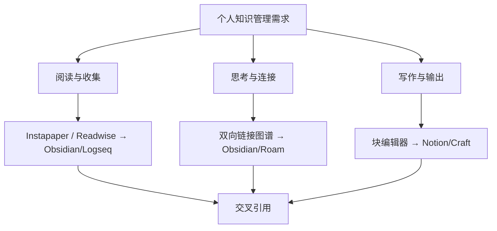
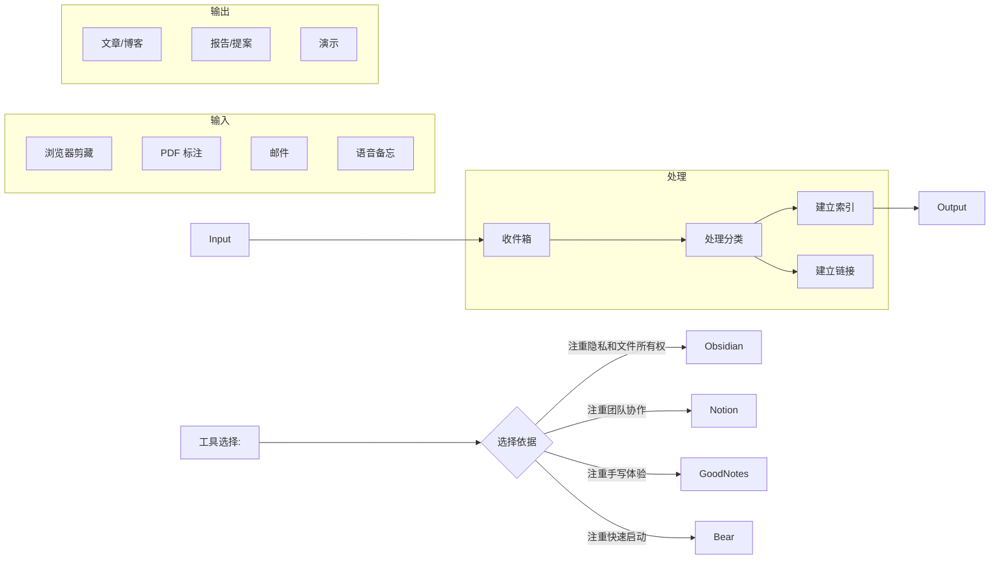
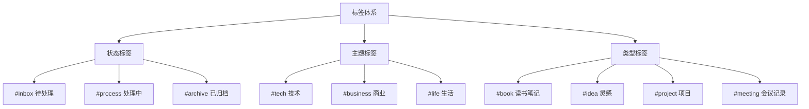

# 笔记应用对比

本文对主流笔记应用进行系统性对比，涵盖功能特性、适用场景、数据格式和生态系统等方面。

## 应用总览

| 应用 | 开发者 | 首次发布 | 平台 | 定价模式 | 核心特色 |
|------|--------|---------|------|---------|---------|
| Notion | Notion Labs | 2016 | Web/Mac/Win/iOS/Android | Freemium | 块编辑器 + 数据库 + Wiki |
| Obsidian | Obsidian | 2020 | Mac/Win/Linux/iOS/Android | 免费（同步收费） | 本地 Markdown + 双向链接 + 图谱 |
| Roam Research | Roam Research | 2019 | Web/iOS/Android | 订阅制 | 大纲 + 块引用 + 每日笔记 |
| Logseq | Logseq | 2020 | Mac/Win/Linux/iOS/Android | 免费（同步收费） | 开源 Local-first 大纲工具 |
| Notability | Ginger Labs | 2010 | iOS/Mac | 买断制 | 手写 + PDF 标注 |
| GoodNotes | Time Base Tech | 2011 | iOS/Mac | 买断制 | 手写识别 + 笔记本管理 |
| OneNote | Microsoft | 2007 | Win/Mac/iOS/Android/Web | 免费 | 自由排版 + 跨平台 + 手写 |
| Evernote | Evernote Corp | 2008 | Win/Mac/iOS/Android/Web | Freemium | 剪藏 + 文档扫描 |
| Bear | Shiny Frog | 2016 | Mac/iOS | 订阅制 | 精美 UI + Markdown + 标签 |
| Craft | Craft Docs | 2020 | Mac/iOS | Freemium | 块编辑器 + 原生体验 |

## 功能特性对比矩阵

### 编辑能力

| 功能 | Notion | Obsidian | Roam | Logseq | OneNote | Bear | Craft |
|------|--------|---------|------|-------|--------|------|-------|
| Markdown 原生支持 | 部分 | 完整 | 部分 | 完整 | 不 | 完整 | 部分 |
| 块编辑 | ✅ | ❌ | ✅ | ✅ | ❌ | ❌ | ✅ |
| 大纲模式 | ✅ | 插件 | ✅ | ✅ | ✅ | ❌ | ❌ |
| 手写支持 | ❌ | ❌ | ❌ | ❌ | ✅ | ❌ | ✅ |
| LaTeX 公式 | ✅ | ✅ | ✅ | ✅ | ❌ | 部分 | ✅ |
| 代码块高亮 | ✅ | ✅ | ✅ | ✅ | 部分 | ✅ | ✅ |
| 表格 | ✅ | 需插件 | ❌ | ❌ | ✅ | ❌ | ✅ |
| 数据库/属性 | ✅ | 需插件 | ❌ | ❌ | ✅ | ❌ | ❌ |
| 白板/画布 | ✅ | 插件 | ❌ | ✅ | ❌ | ❌ | ✅ |

### 组织方式

| 应用 | 主要组织方式 | 标签 | 双向链接 | 图谱 | 目录/文件夹 |
|------|------------|------|---------|------|-----------|
| Notion | 页面嵌套 + 数据库 | ✅ | ✅ 弱 | ❌ | ✅ |
| Obsidian | 文件夹 + 标签 + 链接 | ✅ | ✅ 强 | ✅ | ✅ |
| Roam | 页面引用 + 命名空间 | ❌ | ✅ 强 | ✅ | ❌ |
| Logseq | 页面 + 块引用 | ✅ | ✅ 强 | ✅ | ❌ |
| OneNote | 笔记本 + 分区 + 页 | ✅ | ❌ | ❌ | ✅ |
| Bear | 标签嵌套 | ✅ 强 | ❌ | ❌ | ❌ |
| Evernote | 笔记本 + 标签 | ✅ | ❌ | ❌ | ✅ |
| Craft | 文件夹 + 链接 | ✅ | ✅ | ✅ 空间 | ✅ |

### 数据与同步

| 应用 | 数据存储 | 离线支持 | 版本历史 | 导出格式 | 同步方案 |
|------|---------|---------|---------|---------|---------|
| Notion | 云端 | 有限 | ✅ 30天-无限 | HTML/Markdown/PDF | 云同步 |
| Obsidian | 本地文件 | ✅ 全离线 | 需插件 | Markdown | Obsidian Sync 或第三方 |
| Roam | 云端 | 有限 | ✅ 完整 | JSON/OPML/Markdown | 云同步 |
| Logseq | 本地文件 | ✅ 全离线 | Git | Markdown/OPML | Logseq Sync 或 Git |
| OneNote | 云端 | ✅ | ✅ | PDF | OneDrive 同步 |
| Bear | 本地 | ✅ | 需 Pro | MD/PDF/HTML | iCloud 同步 |
| Evernote | 云端 | ✅ 有限 | ✅ | ENEX/HTML | 专有云同步 |
| Craft | 云端 + 本地 | ✅ | ✅ 30天 | MD/PDF/DOCX | iCloud + Craft Cloud |

## 适用场景分析

### 个人知识管理（PKM）



| 场景 | 推荐应用 | 理由 |
|------|---------|------|
| Zettelkasten（卡片盒笔记） | Obsidian / Logseq | 双向链接 + 图谱 + 本地 Markdown 文件 |
| 项目协作与文档 | Notion | 数据库 + 权限管理 + 团队功能 |
| 学术论文笔记 | Zotero + Obsidian | 参考文献管理配合双向链接笔记 |
| 手写课堂笔记 | Notability / GoodNotes | 手写体验 + PDF 标注 + 录音 |
| 快速捕捉灵感 | Bear / Apple Notes | 启动快 + 简洁 UI + iCloud 同步 |
| 团队 Wiki | Notion / Confluence | 结构化知识库 + 历史版本 + 搜索 |
| 技术文档 | Obsidian + Git | Markdown 纯文本 + 版本控制 |
| 日记与反思 | Roam / Logseq | 每日笔记 + 块引用 + 回顾机制 |

### 工作流集成



## 文件格式与互操作

### 通用格式支持

| 格式 | 导入 | 导出 | 说明 |
|------|------|------|------|
| Markdown (.md) | ✅ 大部分 | ✅ 大部分 | 最通用的纯文本格式 |
| HTML | ✅ 部分 | ✅ 大部分 | 保留格式较好 |
| PDF | ❌ | ✅ 几乎所有 | 只读输出 |
| DOCX | ❌ | 部分支持 | Microsoft Word 格式 |
| JSON | 部分支持 | 部分支持 | 结构化导出 |
| OPML | 部分支持 | 部分支持 | 大纲交换格式 |
| CSV | ✅ Notion | ✅ 部分 | 表格数据交换 |

### 数据迁移路径

```mermaid
flowchart TD
    Evernote -->| ENEX 转 Markdown | Obsidian
    Evernote -->| 官方导入 | Notion
    Notion -->| Markdown / CSV 导出 | Obsidian
    Notion -->| 官方导出 | 任意
    Roam -->| JSON / Markdown 导出 | Obsidian
    Roam -->| 官方导入 | Logseq
    Obsidian -->| Git 同步 | 任意 Git 平台
    Bear -->| Markdown 导出 | Obsidian
    OneNote -->| 第三方工具 | Notion/Obsidian
```

## 进阶选择决策树

```
需要本地文件优先？
├─ 是 → 需要双向链接图谱？
│   ├─ 是 → 需要开源？
│   │   ├─ 是 → Logseq
│   │   └─ 否 → Obsidian
│   └─ 否 → 需要手写支持？
│       ├─ 是 → OneNote
│       └─ 否 → Bear / iA Writer
└─ 否 → 需要团队协作？
    ├─ 是 → 需要数据库功能？
    │   ├─ 是 → Notion
    │   └─ 否 → Craft / Google Docs
    └─ 否 → 需每日笔记+块引用？
        ├─ 是 → Roam Research
        └─ 否 → Craft
```

## 进阶使用技巧

### Notion 高效工作流

1. **数据库关联**：创建关联数据库而非冗余复制，如"项目"关联"任务"
2. **公式字段**：使用 Notion 公式实现自动计算和状态判断
3. **模板按钮**：为重复任务创建模板按钮一键生成
4. **看板视图**：用看板视图管理任务进展阶段
5. **嵌入内容**：嵌入 Figma、Google Maps、CodePen 等丰富页面内容

### Obsidian 插件推荐

| 插件名 | 功能 |
|--------|------|
| Dataview | 将笔记库作为数据库查询 |
| Templater | 高级模板引擎 |
| Excalidraw | 嵌入式白板绘图 |
| Kanban | 看板任务管理 |
| Calendar | 日历视图，显示每日笔记 |
| Graph Analysis | 增强图谱分析功能 |
| Pandoc Plugin | 导出 Word/LaTeX/PDF |
| Readwise Official | 自动同步高亮和批注 |

### 基于标签的 PKM 体系设计



### 笔记分类方法对比

| 方法 | 描述 | 适用人群 | 代表工具 |
|------|------|---------|---------|
| PARA | Project-Area-Resource-Archive | 行动导向型 | Notion |
| Zettelkasten | 卡片式原子笔记 + 双向链接 | 知识工作者 | Obsidian, Roam |
| GTD + 笔记 | 收件箱 + 项目 + 下一步行动 | 效率追求者 | 任何工具 |
| Johnny Decimal | 数字编码分类系统 | 分类强迫症 | 文件系统 |
| 懒人分类法 | 搜索代替分类 | 搜索能力强 | Obsidian + 全文搜索 |

### 笔记习惯养成

1. **每日回顾**：每天花 5 分钟回顾当天笔记，建立链接
2. **渐进式归纳**：从摘录 → 总结 → 关联 → 输出
3. **间隔重复**：定期回顾旧笔记，使用 Anki / RemNote 辅助记忆
4. **收件箱归零**：每日清空收件箱，做到"不过夜"

## 隐私与安全对比

| 应用 | 端到端加密 | 2FA 支持 | 本地加密 | 审计日志 |
|------|-----------|---------|---------|---------|
| Notion | ❌ | ✅ | ❌ | ✅ 工作区 |
| Obsidian | ✅（同步时） | ✅ | ✅ | 需插件 |
| Logseq | ✅（同步时） | ✅ | ✅ | Git 原生 |
| OneNote | ❌ | ✅ | ❌ | ❌ |
| Bear | ✅（iCloud） | ✅ | ✅ | ❌ |
| Evernote | ❌ | ✅ | ❌ | ❌ |
| Standard Notes | ✅ | ✅ | ✅ | ❌ |
| Joplin | ✅ | ❌ | ✅ | ❌ |

## 各应用优劣势总结

| 应用 | 优势 | 劣势 |
|------|------|------|
| Notion | 功能全面，数据库强大，团队协作 | 加载慢，离线差，数据在云端 |
| Obsidian | 本地优先，插件生态丰富，双向链接 | 学习曲线高，同步需付费或设置 |
| Roam Research | 块级别引用，每日笔记流畅 | 关闭源代码，订阅昂贵，速度慢 |
| Logseq | 开源免费，本地优先，大纲模式 | UI 不够精美，移动端体验一般 |
| OneNote | 免费，手写优秀，自由排版 | 搜索差，同步冲突，不支持 Markdown |
| Bear | 精美 UI，Markdown 支持好，标签系统 | 仅苹果生态，无表格，无 Web |
| Evernote | 剪藏优秀，跨平台成熟 | 臃肿，免费限制多，功能创新慢 |
| Craft | 原生体验好，块编辑流畅，美观 | 仅苹果生态，功能不如 Notion 全面 |
| Standard Notes | 最强加密，隐私优先 | 功能简单，生态小 |
| Joplin | 开源免费，端到端加密 | UI 一般，同步需自建 |

## 相关条目
- [[数字笔记工具]]
- [[课堂笔记]]
- [[Markdown 工具与扩展]]
- [[INDEX|当前目录索引]]
