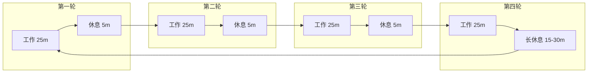

---
aliases:
  - 番茄工作法
  - 番茄钟
  - 时间管理法
  - 专注技巧
tags:
  - pomodoro
  - time-management
  - productivity
  - focus
  - attention
---

# 番茄工作法

## 概述

**番茄工作法（Pomodoro Technique）** 由意大利人 Francesco Cirillo 在 1980 年代后期创立。"Pomodoro"在意大利语中意为"番茄"——源于 Cirillo 使用番茄形状的厨房计时器。

## 核心原理

### 基本周期

番茄工作法的基本时间单位是一个 **"番茄钟"**：

$$
\text{1 番茄钟} = 25 \text{ 分钟工作} + 5 \text{ 分钟休息}
$$

每完成 4 个番茄钟后，进行一次 **长休息（15—30 分钟）**。

### 时间结构

## 五个基本步骤

| 步骤 | 动作 | 说明 |
|------|------|------|
| 1 | 选择任务 | 确定今日要完成的一件重要任务 |
| 2 | 设定番茄钟 | 设置 25 分钟倒计时 |
| 3 | 专注工作 | 直至铃声响起，期间不可中断 |
| 4 | 记录完成 | 标记完成一个番茄钟 |
| 5 | 短休息（5m） | 放松大脑，远离屏幕 |

每四个番茄钟后，执行步骤 5' 长休息（15—30m），然后回到步骤 1。

## 理论基础

### 注意力周期

人的注意力呈现 **自然的节律波动**（ultradian rhythm），约每 90—120 分钟为一个周期。25 分钟的番茄钟正好位于高专注时段内：

$$
\text{Attention}(t) = A_0 \cdot \sin\left(\frac{2\pi t}{T}\right) + \bar{A}
$$

其中 $T \approx 90\text{—}120\text{ min}$，番茄钟长度 $25\text{ min} < T/2$，确保始终在专注上升期工作。

### 蔡格尼克效应

**Zeigarnik Effect**：未完成的任务比已完成的任务更容易被记住。番茄钟利用这一效应——知道 25 分钟后会暂停，大脑更倾向于聚焦当前任务。

### 心流状态

心流（Flow）的激活条件与番茄工作法吻合：

$$
\text{Flow} \propto \frac{\text{技能水平}}{\text{任务难度}} \times \text{专注时间}
$$

番茄钟为进入心流提供了结构和节奏。

## 中断处理

中断是番茄工作法面临的最大挑战。中断分两类：

### 1. 内部中断

来自大脑自身的念头："我要查一下邮件""突然想到……"

#### 处理策略

- **记录法**：在纸上写下念头，继续当前番茄
- **推迟法**："这事等到休息时间处理"
- **纳入法**：如果确实紧急，放弃当前番茄钟

### 2. 外部中断

来自他人的干扰："打扰一下，问个问题……"

#### 处理策略

| 中断类型 | 应对方法 |
|----------|----------|
| 可推迟 | "我在番茄钟中，5 分钟后找你" |
| 可委托 | "你能帮我处理吗？" |
| 需立即响应 | 放弃番茄钟，记录中断原因 |
| 可预见的 | 在番茄钟开始前告知他人 |

## 高级技巧

### 番茄钟长度的调整

标准的 25/5 不是金科玉律。可根据任务性质调整：

| 任务类型 | 推荐时长 | 说明 |
|----------|----------|------|
| 深度写作 | 50/10 | 需要较长的沉浸时间 |
| 阅读文献 | 25/5 | 标准番茄钟 |
| 代码调试 | 45/15 | 调试需要连续性 |
| 邮件处理 | 15/3 | 浅度工作，快速切换 |

### 番茄钟的统计

追踪每日番茄钟数量，量化产出：

$$
\text{日产量} = \sum_{i=1}^{n} \text{番茄钟}_i
$$

| 日完成数 | 评价 |
|----------|------|
| 0—4 | 低效日 |
| 5—8 | 正常 |
| 9—12 | 高效 |
| 13+ | 超负荷，需警惕倦怠 |

### 番茄任务的粒度

一个番茄钟内任务应具有 **适当粒度**：

- 太大 → 一个番茄钟无法完成 → 沮丧
- 太小 → 一个番茄钟内完成多个 → 碎片化

黄金法则：**一个任务 ≈ 1—3 个番茄钟**

## 常用工具

| 工具类型 | 推荐 | 平台 |
|----------|------|------|
| 实体计时器 | 番茄钟厨房计时器 | 离线 |
| 桌面应用 | Focus Booster | Windows / macOS |
| 手机应用 | Forest / Be Focused | iOS / Android |
| 浏览器扩展 | Marinara | Chrome |
| 命令行 | Pomodoro CLI | 终端 |

## 与其他方法结合

### + GTD

- 在 GTD 的"执行"阶段使用番茄钟
- 一个番茄钟对应一个"下一步行动"
- 用番茄钟数量估算项目工作量

### + 深度工作

- 深度工作块一般 2—4 小时
- 可用番茄钟作为深度工作的节奏器
- 4 个连番 = 100 分钟深度工作 + 25 分钟休息

### + 时间封锁

- 在时间块中嵌入番茄钟
- 每个时间块由 2—3 个连番组成
- 休息时间作为块间过渡

## 常见误区

1. **番茄钟期间不可以做任何其他事** → 允许记录，但避免切换任务
2. **必须用 25/5** → 可根据任务调整
3. **中断就失败** → 重点是记录和反思
4. **完成番茄钟是目的** → 完成高质量工作才是目的
5. **不需要回顾** → 每日回顾改进系统

## 推荐资源

- Cirillo, F. (2006). *The Pomodoro Technique: The Life-Changing Time-Management System*
- [Pomodoro Technique 官方网站](https://francescocirillo.com/pages/pomodoro-technique)
- Nozick, L. (2020). *Pomodoro Technique Illustrated*
