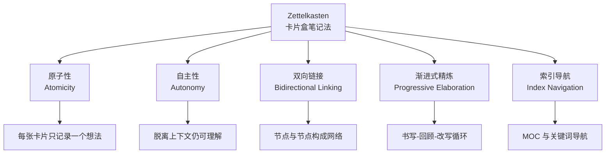
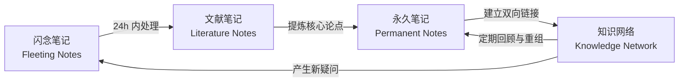

---
aliases: [Zettelkasten, 卡片盒笔记法, 卢曼笔记法, SlipBox, 知识管理]
tags: ['00_KnowledgeFramework', 'NoteTaking', 'PersonalKnowledgeManagement', 'PKM']
created: 2026-05-17
updated: 2026-05-17
---

# Zettelkasten（卡片盒笔记法）

## 概述

Zettelkasten（德语"卡片盒"）
是由德国社会学家尼克拉斯·卢曼
（Niklas Luhmann, 1927–1998）
在其30余年的学术生涯中逐步发展的一套笔记系统
（Note-Taking System）。

卢曼利用这套系统在30年内出版了70余本专著。
数百篇论文。
涵盖社会学、系统论、法律、经济学等多个领域。
其知识产出效率至今令人惊叹。

这套方法的核心理念是：
知识的价值不在于收集，而在于连接。

Zettelkasten 的哲学基础是——
一个想法的意义部分取决于
它与其他想法的关联方式。
当不同的知识单元通过链接产生碰撞时。
新的洞察从网络中涌现。

这区别于传统的"收集型笔记"。
后者只是将信息搬进文件夹。
而前者构建一个活的、可对话的知识系统
（Living Knowledge System）。

## 历史与背景

卢曼最初采用传统按主题分类的笔记方式。
很快发现其根本局限：
一个想法只能属于一个类别。
无法同时出现在多个上下文中。

于是他采用编号系统（如21/3a7b2）。
赋予每张卡片唯一标识符（Unique Identifier）。
通过编号引用建立跨主题链接。
允许在任意位置插入新卡片。
不破坏既有顺序。

到1998年去世时。
他的 Zettelkasten 已包含约90,000张手写卡片。
覆盖社会学、哲学、系统论、法律、经济学。

2013年后数字笔记工具兴起。
Obsidian、Roam Research 等工具的出现。
Zettelkasten 在全球范围内获得第二次生命。
成为个人知识管理
（Personal Knowledge Management, PKM）
领域的核心方法论。

## 核心原则

## 原则详解

| 原则 | 英文 | 核心要求 | 常见错误 | 检验方法 |
|------|------|---------|---------|---------|
| 原子性 | Atomicity | 每卡一个想法 | 一张卡写多个论点 | 是否有"同时""此外" |
| 自主性 | Autonomy | 自包含独立可读 | 依赖短期记忆 | 一周后能否读懂 |
| 双向链接 | Bidirectional | A 能到 B，B 能回 A | 仅创建单向引用 | 检查反向链接 |
| 渐进式精炼 | Progressive | 持续回顾与改写 | 写完即弃 | 月度回顾周期 |
| 索引导航 | Index | 多入口可达 | 完全无结构 | 从首页到任意笔记 |

### 原子性（Atomicity）

每条笔记只记录一个想法（Idea）。
概念（Concept）或论点（Argument）。
原子性使每条笔记可作为独立单元
被精确引用和重新组合。

经验法则：
如果在卡片中发现"同时""此外""另一方面"。
很可能需要拆分为多条笔记。

### 自主性（Autonomy）

笔记必须自包含（Self-Contained）。
脱离原始上下文仍能被理解。

一条好的自主笔记包含三要素：
核心主张（Claim）。
支持论据（Evidence）。
与已有想法的关联（Connection）。

如果一条笔记需要"看过那本书才知道在说什么"。
它就缺乏自主性。

### 双向链接（Bidirectional Linking）

新笔记主动与已有笔记建立链接。
而非在文件夹中归档。

双向链接意味着：
从笔记 A 可以跳转到 B。
从 B 也能追溯回 A。
每条笔记都在知识网络中成为节点（Node）。

当一条笔记被频繁引用时。
它在系统中获得更高的"中心性"（Centrality）。
提示这是一个关键概念。

### 渐进式精炼（Progressive Elaboration）

笔记不是一成不变的。
可以被合并、拆分、重组、更新。

卢曼本人也频繁回溯旧卡片。
添加新链接或补充新想法。

核心节奏是"书写—回顾—改写"的循环。
定期回顾（每月一次）可确保系统保持活跃。
防止"僵尸笔记"的出现。

### 索引导航（Index Navigation）

通过索引笔记和关键词提供导航入口。

索引笔记（Index Notes / MOC, Map of Content）
不直接存储知识。
而是列出该主题下所有核心笔记的链接列表。

一个好的索引笔记结构包含：
主题定义。
子主题链接列表。
指向更高层级索引的连接。

## 笔记类型分类与生命周期

| 类型 | 英文 | 核心功能 | 生命周期 | 处理优先级 |
|------|------|----------|----------|-----------|
| 闪念笔记 | Fleeting Notes | 快速捕捉临时想法 | 24-48h 内处理 | 最高 |
| 文献笔记 | Literature Notes | 阅读摘录与思考 | 永久保存 | 中 |
| 永久笔记 | Permanent Notes | 独立的知识单元 | 永久可更新 | 最高 |
| 索引笔记 | Index Notes | 导航入口 | 随增长更新 | 中 |

**闪念笔记（Fleeting Notes）**
快速捕捉临时的灵感、观察和想法。
时效性强、内容零散。
需在24~48小时内处理。
要么精炼为永久笔记，要么丢弃。
工具方面适合用手机备忘录、录音、纸质卡片。
核心价值在于"捕捉而非整理"。

**文献笔记（Literature Notes）**
阅读文献时的记录。
不是简单摘抄。
用自己的语言转述核心论点。
附带个人评论和批判性思考。

每条文献笔记需注明出处。
作者+年份+页码以便查证。
好的文献笔记是
"从书中抽取的、与你已有知识体系的碰撞点"。

**永久笔记（Permanent Notes）**
经过深思熟虑、独立成篇的知识单元。
是系统的核心资产。

创建时需回答三个问题：
这个想法是什么？
它和已有的想法有什么关系？
它让我想到什么新问题？

每条永久笔记应做到：
"即使单独被找到，也能传达完整信息"。

**索引笔记（Index Notes）**
充当知识入口的导航卡片。
不包含实质性内容。
作为"路标"指向该主题下的关键笔记。

## 与传统笔记方法对比

| 维度 | Zettelkasten | 传统笔记 |
|------|-------------|----------|
| 组织结构 | 网络化、非线性、无中心 | 层级目录或线性顺序 |
| 信息检索 | 关联搜索+双向跳转 | 目录逐级查找 |
| 知识发现 | 通过意外链接产生新洞见 | 被动复习已有内容 |
| 可扩展性 | 极高——可无限链接 | 有限——受限于文件夹 |
| 记忆辅助 | 主动输出驱动 | 被动记录驱动 |
| 容错性 | 链接错误可被补偿 | 归档错误导致丢失 |
| 信息冗余 | 低——通过链接复用 | 高——内容重复 |
| 涌现效应 | 有——跨领域组合 | 无 |
| 学习效果 | 深度理解 | 浅层记忆 |

## 工作流程

第一步：阅读时随手记录文献笔记。
第二步：从文献笔记中提炼出可独立存在的论点。
第三步：转写为永久笔记。
第四步：将新永久笔记与已有笔记建立链接。
第五步：新链接引出新问题，回到第一步。

定期（每月一次）对整个系统回顾和重组。
删除不再有价值的笔记。
合并过于零散的笔记。
更新过时的信息。

## 系统中的数学表征

系统的价值可以用连接数量来近似评估。
每条笔记的价值随其被引次数增加而增长：

$$V_{system} = \sum_{i=1}^{n} \text{degree}(i)$$

其中 $\text{degree}(i)$
为笔记 $i$ 的链接度数（入链 + 出链）。

当永久笔记的数量达到一定规模
（经验值约为1000~2000条）。
系统开始展现出涌现效应（Emergence Effect）。

这种涌现效应——
来自不同领域的笔记自动组合成新见解——
是 Zettelkasten 区别于其他笔记方法的根本特征。

## 经典引用

卢曼曾说：
"没有 Zettelkasten，我永远不会写出那么多东西。"

这句话揭示了底层逻辑——
写作不是从空白页开始。
而是从已有的笔记网络中提取和组织素材。

当每条笔记都与其他笔记连接。
写作就变成重组已知知识的创造过程。

正如卢曼所言：
"理解不是对信息的被动接收。
而是主动建立链接的过程。"

另一位笔记方法论专家 Ahrens 在
《How to Take Smart Notes》中写道：
"好的笔记系统不依赖于意志力。
因为它将结构与主动性内化到工具本身。"

## 数字工具实现

| 工具 | 核心特点 | 适用场景 |
|------|----------|----------|
| Obsidian | 本地存储、Markdown 原生、插件丰富 | 重度笔记用户 |
| Logseq | 开源、大纲式、块级引用 | 研究者与开发者 |
| Roam Research | 云端协作、实时同步 | 团队协作场景 |
| Zettlr | 学术写作导向、Zotero 集成 | 论文写作 |
| Notion | 数据库驱动、多媒体支持 | 综合项目管理 |
| The Archive | 极简、纯文本、完全控制 | plain text 爱好者 |

## 相关条目

- [[ProgressiveSummarization]]
- [[CornellNotes]]
- [[DigitalNoteTools]]
- [[DigitalNoteTaking]]
- [[MOC]]
- [[FeynmanTechnique]]
- [[SpacedRepetition]]
- [[GTD]]

