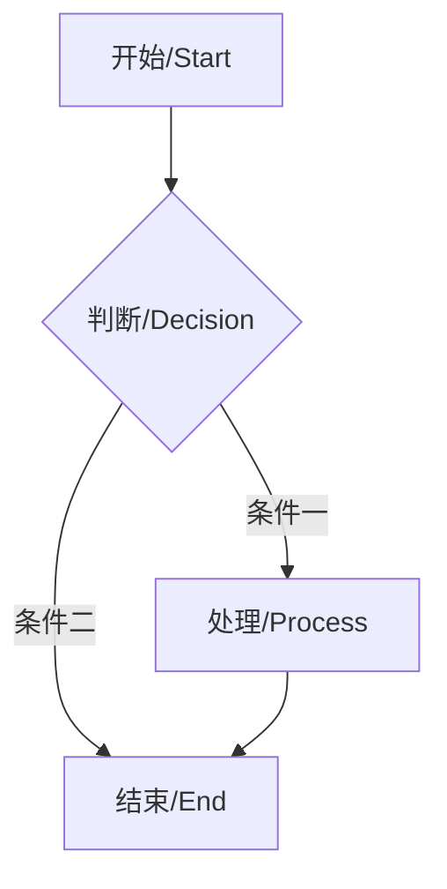
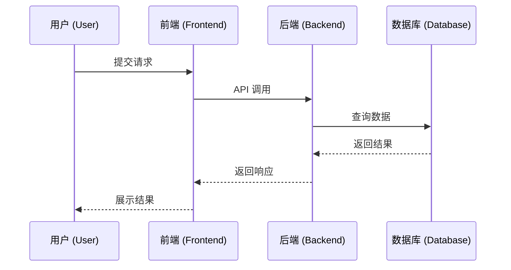
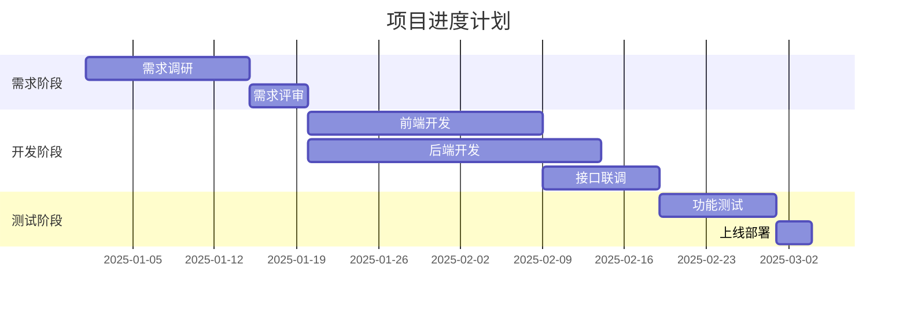
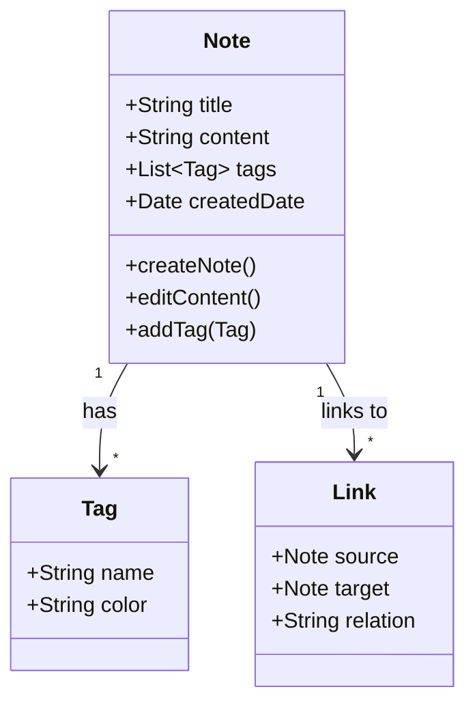
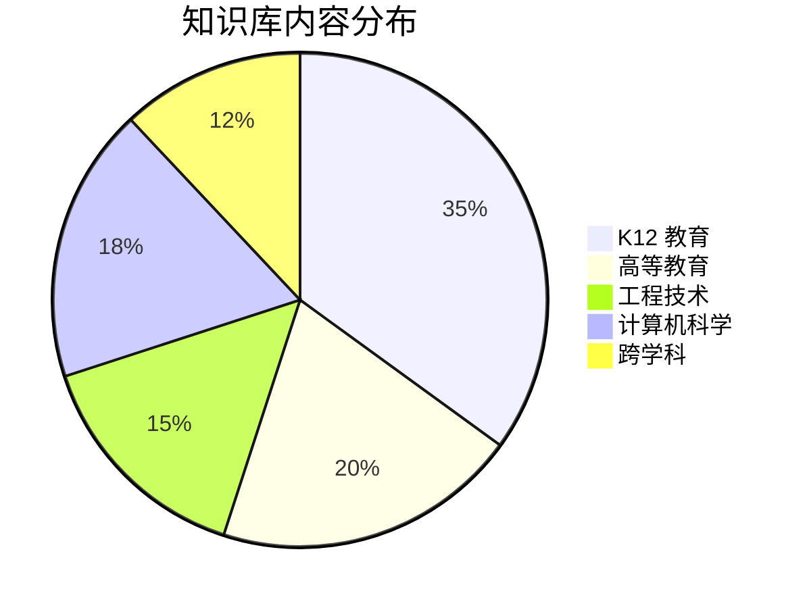

---
aliases: [MarkdownTemplates, Markdown 模板, Markdown 指南, MarkdownGuide]
tags: ['00_KnowledgeFramework', 'Templates', 'MarkdownTemplates', 'Markdown', 'Formatting']
created: 2024-08-01
updated: 2025-05-17
---

# Markdown 模板 (Markdown Templates)

> Markdown 是一种轻量级标记语言，旨在用简洁易读的纯文本格式实现排版，并可在多种工具中导出为 HTML、PDF 等格式。本文档整理了 Markdown 的语法规范和常用模板。

## Markdown 基础语法 (Basic Syntax)

### 文档结构
```markdown
# 一级标题 (H1) — 文档标题
## 二级标题 (H2) — 章节标题
### 三级标题 (H3) — 子章节标题
#### 四级标题 (H4) — 小节标题
##### 五级标题 (H5) — 段落标题
###### 六级标题 (H6) — 备注标题
```

### 文本格式
| 样式 | 语法 | 示例输出 |
|------|------|----------|
| 粗体 | `**文本**` 或 `__文本__` | **粗体文本** |
| 斜体 | `*文本*` 或 `_文本_` | *斜体文本* |
| 粗斜体 | `***文本***` | ***粗斜体文本*** |
| 删除线 | `~~文本~~` | ~~删除线~~ |
| 高亮 | `==文本==` (GFM 扩展) | ==高亮文本== |
| 行内代码 | `` `代码` `` | `printf("hello")` |
| 下标 | `<sub>文本</sub>` | 化学式 H~2~O |
| 上标 | `<sup>文本</sup>` | 数学式 E=mc² |

### 列表语法
```markdown
#### 无序列表
- 项目一
- 项目二
  - 嵌套项目 A
  - 嵌套项目 B
- 项目三

#### 有序列表
1. 第一步：收集资料
2. 第二步：分析数据
3. 第三步：得出结论
   1. 子步骤 A
   2. 子步骤 B
4. 第四步：撰写报告

#### 任务列表
- [x] 已完成任务
- [ ] 未完成任务 1
- [ ] 未完成任务 2
```

## 扩展语法 (Extended Syntax)

### 表格 (Tables)
```markdown
| 左对齐 | 居中对齐 | 右对齐 |
|:-------|:--------:|-------:|
| 单元格 | 单元格   | 单元格 |
| 内容   | 内容     | 内容   |

建议在表格前后各留一个空行，增强可读性。
```

### 代码块 (Code Blocks)
````markdown
```python
def greet(name: str) -> str:
    """Return a greeting message."""
    return f"你好，{name}！"

# 带语言标识的代码块支持语法高亮
print(greet("世界"))
```

```bash
# 命令行示例
npm install markdown-it
find . -name "*.md" | wc -l
```
````

### 引用 (Blockquotes)
```markdown
> 这是一级引用
>
> > 这是嵌套的二级引用
> >
> > > 这是三级引用
>
> 回到一级引用

> **注意**：引用内可以包含多个段落、列表和代码块。
```

### 数学公式 (LaTeX Math)
```markdown
行内公式：$E = mc^2$

块级公式：

$$
\frac{-b \pm \sqrt{b^2 - 4ac}}{2a}
$$

$$
\int_{a}^{b} f(x) \, dx = F(b) - F(a)
$$
```

### 脚注 (Footnotes)
```markdown
这是一段需要注释的文字[^1]。

[^1]: 这是脚注的内容，解释或补充说明。
```

### 定义列表 (Definition Lists)
```markdown
Markdown
: 一种轻量级标记语言，由 John Gruber 于 2004 年创建。

Obsidian
: 基于 Markdown 的知识管理工具，支持双向链接和知识图谱。

Zettelkasten
: 源自德国的卡片盒笔记法，强调原子化笔记和链接。
```

## Mermaid 图表模板 (Mermaid Diagram Templates)

### 流程图 (Flowchart)


### 时序图 (Sequence Diagram)


### 甘特图 (Gantt Chart)


### 类图 (Class Diagram)


### 饼图 (Pie Chart)


## 常用文档模板 (Common Templates)

### 读书笔记模板 (Book Notes Template)
```markdown
# 《书名》

## 基本信息 (Basic Info)
- **作者**：
- **出版社**：
- **出版年份**：
- **阅读时间**：
- **评分**：⭐⭐⭐⭐⭐

## 核心观点 (Key Ideas)
1.
2.
3.

## 关键概念 (Key Concepts)
- **概念一**：定义与解释
- **概念二**：定义与解释

## 金句摘录 (Quotes)
> 

## 个人思考 (Reflections)
- 这本书颠覆了我对...的认识
- 与...书的观点形成对比/补充
- 可以应用于...领域

## 行动清单 (Action Items)
- [ ] 
- [ ]

## 延伸阅读 (Further Reading)
- 《》
- 《》
```

### 学习笔记模板 (Study Notes Template)
```markdown
# 课程/主题名称

## 学习目标 (Learning Objectives)
- 掌握...
- 理解...
- 能够...

## 知识要点 (Key Points)
### 概念一
- 定义：
- 特征：
- 示例：

### 概念二
- 定义：
- 公式：$$
$$
- 应用场景：

## 例题 (Examples)
> **例题 1**：
> 解题思路：
> 解答：

## 常见错误 (Common Mistakes)
- ❌ 错误理解：
- ✅ 正确理解：

## 总结与反思 (Summary & Reflection)
- 本节课的核心收获：
- 存在的疑问：
- 需要进一步查阅的资料：
```

### 会议记录模板 (Meeting Notes Template)
```markdown
# 会议记录

## 会议信息
- **时间**：
- **地点**：
- **参会人**：
- **主持人**：
- **记录人**：

## 议程 (Agenda)
1. 
2. 
3. 

## 讨论记录 (Discussion Notes)
### 议题一：
- 观点：
- 结论：

### 议题二：
- 观点：
- 结论：

## 行动项 (Action Items)
| 事项 | 负责人 | 截止日期 |
|-----|--------|---------|
|      |        |         |
|      |        |         |

## 下次会议
- 时间：
- 主题：
```

### 日记/日志模板 (Daily Log Template)
```markdown
# 2025-05-17 周六

## 今日重点 (Priorities)
- [ ] 
- [ ] 
- [ ] 

## 时间线 (Timeline)
- 09:00 - 10:00：
- 10:00 - 12:00：
- 14:00 - 17:00：
- 19:00 - 21:00：

## 收获与洞察 (Insights)
- 

## 明日计划 (Tomorrow's Plan)
- 
```

## 工具与支持 (Tools & Support)

### Markdown 编辑器对比
| 工具 | 平台 | 核心特点 | 价格 | 适用场景 |
|------|------|----------|------|----------|
| Typora | Win/Mac/Linux | 所见即所得、简洁优雅 | $14.99 | 写作、笔记 |
| VS Code | Win/Mac/Linux | 插件丰富、可自定义 | 免费 | 开发者写作 |
| Obsidian | Win/Mac/Linux/Mobile | 双向链接、知识图谱 | 免费/付费同步 | 知识管理 |
| Notion | Web/Mobile/Desktop | 数据库、协作功能 | 免费/团队付费 | 团队协作笔记 |
| Logseq | Win/Mac/Linux/Mobile | 大纲模式、块级引用 | 免费/开源 | 个人知识库 |
| Mark Text | Win/Mac/Linux | 开源、所见即所得 | 免费/开源 | 日常写作 |
| Foam | VS Code 扩展 | 双向链接、图谱 | 免费/开源 | 开发者知识管理 |
| Hexo/Jekyll | 静态站点 | 博客生成、Git 部署 | 免费/开源 | 技术博客 |

### 常用 Markdown 扩展
| 功能 | 语法/工具 | 说明 |
|------|-----------|------|
| 目录生成 | `[TOC]` 或 `<!-- @TOC -->` | 自动生成文档目录 |
| 锚点链接 | `[文字](#锚点 id)` | 跳转到文档内部位置 |
| 图表 (Mermaid) | ` ```mermaid ` | 流程图、时序图等 |
| 数学公式 | `$...$` / `$$...$$` | LaTeX 数学公式 |
| 定义列表 | `: 定义内容` | 术语定义格式 |
| 徽标 (Badge) | Shields.io | 项目状态标识 |
| 表情符号 | `:smile:` → 😄 | GitHub 表情简码 |
| 折叠块 | `<details><summary>` | 可折叠内容区块 |

### 自动格式化约定
- 标题前后各留一个空行
- 列表项之间不留空行 (需要分段时除外)
- 代码块前后各留一个空行
- 表格前后各留一个空行
- 引用符号 `>` 后跟一个空格
- 列表符号 `-`/`*`/`+` 后跟一个空格
- 每个句子后使用一个空格 (而非两个)

## 相关条目
- [[00_KnowledgeFramework/NoteTaking/NoteTaking|笔记方法]]
- [[11_ManagementSciences/LibraryAndArchive/KnowledgeManagement|知识管理]]
- [[13_Others/AcademicWriting/AcademicWriting|学术写作]]
- [[00_KnowledgeFramework/NoteTaking/Zettelkasten|卡片盒笔记法]]
- [[ObsidianWorkflow|Obsidian 工作流]]
- [[MarkdownSyntaxChecklist|Markdown 语法速查]]

