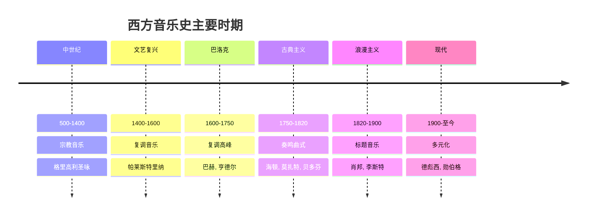

---
aliases: [Music]
tags: ['ArtsAndSports', 'Music']
created: 2026-05-17
updated: 2026-05-17
---

# K12 音乐基础与鉴赏

> 涵盖：音乐基础理论、声乐与器乐、音乐欣赏、中外音乐史

---

## 一、音乐基础理论

### 1. 音的基本属性

- **音高（Pitch）**：音的高低，由频率决定
- **音长（Duration）**：音的时值长短
- **音强（Dynamics）**：音的强弱，由振幅决定
- **音色（Timbre）**：音的色彩，由发声体材质和泛音决定

### 2. 五线谱与简谱

- **五线谱（Staff）**：五条平行线记录音高，自下而上
- **谱号（Clef）**：高音谱号（G 谱号）、低音谱号（F 谱号）、中音谱号（C 谱号）
- **音符（Note）**：全音符、二分音符、四分音符、八分音符、十六分音符
- **休止符（Rest）**：对应各时值的静音符号
- **简谱（Numbered Notation）**：用数字1-7表示音符，0表示休止

### 3. 节奏与节拍

- **节奏（Rhythm）**：音的长短关系组织
- **节拍（Meter）**：强弱拍的规律交替
- **常见拍号**：2/4拍（强、弱）、3/4拍（强、弱、弱）、4/4拍（强、弱、次强、弱）、6/8拍（强、弱、弱、次强、弱、弱）

### 4. 音程与和弦

- **音程（Interval）**：两个音之间的距离（度数和半音数）
- **协和音程**：纯一、纯八、纯四、纯五、大小三六度
- **不协和音程**：大小二度、大小七度、增四减五度
- **和弦（Chord）**：三个或以上音同时发声（三和弦、七和弦）

### 5. 调式与调性

- **大调（Major）**：明亮、欢快（C 大调、G 大调、D 大调等）
- **小调（Minor）**：柔和、暗淡（a 小调、e 小调、d 小调等）
- **五声调式（Pentatonic）**：宫、商、角、徵、羽（中国传统调式）

---

## 二、声乐

### 1. 人声分类

- **童声**：变声前的声音，清脆明亮
- **女高音**：花腔女高音、抒情女高音、戏剧女高音
- **女中音**：温暖丰满
- **女低音**：深沉浑厚
- **男高音**：抒情男高音、戏剧男高音
- **男中音**：雄壮有力
- **男低音**：深沉宽广

### 2. 演唱形式

- **独唱**：单人演唱
- **齐唱**：多人同唱同一旋律
- **合唱**：多声部演唱（混声合唱、同声合唱）
- **重唱**：每声部一人（二重唱、三重唱、四重唱）
- **轮唱**：先后相差一定时间演唱同一旋律
- **对唱**：两人或两组交替演唱

### 3. 歌唱技巧基础

- **呼吸**：腹式呼吸，气息深沉平稳
- **发声**：打开喉咙，气息支撑
- **咬字**：字正腔圆，声母韵母清晰
- **共鸣**：头腔共鸣、口腔共鸣、胸腔共鸣

---

## 三、乐器

### 1. 中国民族乐器

| 分类 | 乐器 |
|------|------|
| 吹管乐器 | 笛、箫、唢呐、笙、管子 |
| 拉弦乐器 | 二胡、京胡、板胡、高胡 |
| 弹拨乐器 | 古琴、古筝、琵琶、扬琴、阮、柳琴 |
| 打击乐器 | 鼓、锣、钹、板鼓、木鱼、编钟 |

### 2. 西洋乐器

| 分类 | 乐器 |
|------|------|
| 弦乐器 | 小提琴、中提琴、大提琴、低音提琴、竖琴 |
| 木管乐器 | 长笛、单簧管、双簧管、巴松管、萨克斯 |
| 铜管乐器 | 小号、圆号、长号、大号 |
| 打击乐器 | 定音鼓、小军鼓、钹、三角铁、木琴 |
| 键盘乐器 | 钢琴、管风琴、手风琴、电子琴 |
| 拨弦乐器 | 吉他、曼陀林 |

### 3. 乐队形式

- **民族管弦乐队**：吹拉弹打四组
- **交响乐队**：弦乐、木管、铜管、打击乐四组
- **管乐队**：木管、铜管、打击乐
- **电声乐队**：吉他、贝斯、键盘、鼓

---

## 四、音乐欣赏

### 1. 音乐要素分析

- **旋律（Melody）**：音的横向组织（上行/下行、级进/跳进）
- **和声（Harmony）**：音的纵向组织（协和/不协和、功能进行）
- **节奏（Rhythm）**：时间维度的组织（规整/自由、简单/复杂）
- **音色（Timbre）**：不同乐器和人声的色彩
- **力度（Dynamics）**：强弱的对比变化
- **速度（Tempo）**：快慢的对比变化

### 2. 音乐体裁

- **声乐体裁**：艺术歌曲、民歌、歌剧、音乐剧、合唱曲
- **器乐体裁**：交响曲、协奏曲、奏鸣曲、室内乐、进行曲、舞曲
- **中国传统体裁**：民歌、戏曲、曲艺、器乐曲

### 3. 经典作品推荐

- **中国**：《二泉映月》（二胡）、《梁祝》（小提琴协奏曲）、《黄河大合唱》、《春江花月夜》
- **西方**：贝多芬《第五交响曲"命运"》、莫扎特《弦乐小夜曲》、柴可夫斯基《天鹅湖》、维瓦尔第《四季》

---

## 五、中外音乐史

### 1. 中国音乐简史

| 时期 | 特点 | 代表 |
|------|------|------|
| 古代 | 八音分类法、礼乐制度 | 曾侯乙编钟 |
| 唐宋 | 曲子词、大曲繁荣 | 姜夔《白石道人歌曲》 |
| 元明清 | 戏曲繁荣、民间音乐发展 | 昆曲、京剧 |
| 近现代 | 中西融合、新音乐运动 | 冼星海、聂耳 |
| 当代 | 多元发展、流行音乐兴起 | 各类风格融合 |

### 2. 西方音乐简史

| 时期 | 特点 | 代表作曲家 |
|------|------|-----------|
| 中世纪 | 宗教音乐为主、格里高利圣咏 | 无伴奏合唱 |
| 文艺复兴 | 复调音乐繁荣、世俗音乐兴起 | 帕莱斯特里纳、拉索斯 |
| 巴洛克 | 复调高峰、大小调体系确立 | 巴赫、亨德尔、维瓦尔第 |
| 古典主义 | 主调音乐、奏鸣曲式成熟 | 海顿、莫扎特、贝多芬 |
| 浪漫主义 | 个性张扬、标题音乐盛行 | 舒伯特、肖邦、李斯特、柴可夫斯基 |
| 现代音乐 | 多元化、打破传统调性 | 德彪西、斯特拉文斯基、勋伯格 |



### 3. 音乐流派对照

| 时期 | 中国 | 西方 |
|------|------|------|
| 古代 | 编钟、古琴音乐 | 格里高利圣咏 |
| 古典 | 唐宋大曲 | 巴洛克、古典主义 |
| 近现代 | 新音乐运动 | 浪漫主义、民族乐派 |
| 当代 | 流行、摇滚、民谣 | 爵士、摇滚、电子 |

---

## 六、音乐与相关艺术

### 1. 音乐与舞蹈

音乐和舞蹈自古密不可分：

| 舞蹈类型 | 音乐特点 | 代表曲目 |
|---------|---------|---------|
| 芭蕾 | 优雅流畅，节奏清晰 | 《天鹅湖》《胡桃夹子》 |
| 民族舞 | 地域风格鲜明 | 《孔雀舞》《傣族舞曲》 |
| 现代舞 | 自由多变 | 各类现代音乐 |

### 2. 音乐与绘画

**联觉（Synesthesia）** 现象：听到音乐时联想到色彩

- 大调 = 明亮色彩（黄、橙）
- 小调 = 暗淡色彩（蓝、紫）
- 快速 = 跳跃的点、线
- 缓慢 = 流动的曲线

### 3. 音乐与数学

音乐中蕴含着丰富的数学关系：

- 音程的频率比：八度 = 2:1，五度 = 3:2，四度 = 4:3
- 节拍中的分数关系：4/4拍，3/4拍
- 十二平均律：每半音频率比为 $\sqrt[12]{2}$
- 斐波那契数列在音乐结构中的应用

---

## 七、音乐实践活动

### 1. 节奏训练

```
拍手节奏练习：
4/4 拍: 强 弱 次强 弱
练习:  X X X X | X X X X |
       ♩ ♩ ♩ ♩ | ♩ ♩ ♩ ♩ |
```

### 2. 歌曲演唱推荐

| 年级 | 中国歌曲 | 外国歌曲 |
|------|---------|---------|
| 低年级 | 《小燕子》《让我们荡起双桨》 | Twinkle Twinkle Little Star |
| 中年级 | 《茉莉花》《送别》 | Do-Re-Mi |
| 高年级 | 《黄河颂》《我的祖国》 | Ode to Joy |

### 3. 音乐创作入门

**简单的旋律创作步骤**：

1. 选择调式（如 C 大调）
2. 确定拍号（如4/4拍）
3. 设计节奏型
4. 用音阶中的音创作旋律
5. 加入重复和变化

## 相关条目

[[PhysicalEducation]], [[FineArts]], MusicEducation, ArtEducation

