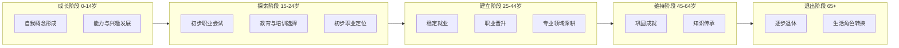
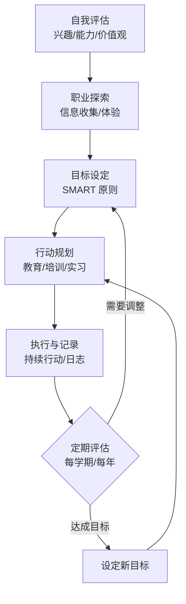

# 职业规划 (Career Planning)

> 职业规划是一个持续的、动态的过程，帮助个体认识自我、探索职业世界、制定并实施职业发展策略。对于青少年而言，职业规划教育是连接学校学习与未来职业的桥梁。

## 职业规划的理论基础 (Theoretical Foundations)

### 经典职业发展理论
| 理论名称 | 提出者 | 核心观点 | 实践应用 |
|----------|--------|----------|----------|
| 特质因素理论 (Trait-Factor) | Parsons (1909) | 人职匹配：个体特质与职业要求匹配 | 职业测评工具 |
| 职业兴趣理论 (RIASEC) | Holland (1959) | 六种职业兴趣类型：现实型/研究型/艺术型/社会型/企业型/常规型 | 霍兰德职业测评 |
| 生涯发展理论 | Super (1953) | 生涯五阶段：成长→探索→建立→维持→退出 | 生涯彩虹图 |
| 社会认知生涯理论 (SCCT) | Lent, Brown & Hackett (1994) | 自我效能、结果预期、个人目标相互作用 | 干预课程设计 |
| 生涯建构理论 | Savickas (2002) | 个体通过叙事建构职业生涯 | 生涯叙事辅导 |

### 生涯发展五阶段 (Super's Life Stages)


## 自我认知 (Self-Assessment)

### 兴趣探索 (Interest Exploration)
- **霍兰德职业兴趣测评 (Holland Code)**：六大类型帮助你发现感兴趣的工作环境
- **职业偏好清单**：列出喜欢和不喜欢的活动、课程、业余爱好
- **心流体验记录 (Flow State)**：记录那些让你沉浸其中忘记时间的活动
- **课外活动反思**：从社团、志愿服务、竞赛中发现兴趣线索

### 能力评估 (Ability Assessment)
| 能力类型 | 具体表现 | 评估方法 |
|----------|----------|----------|
| 学术能力 | 学科成绩、逻辑推理、分析能力 | 学业成绩、标准化测试 |
| 实践能力 | 动手操作、实验技能、技术应用 | 项目完成、实验报告 |
| 社交能力 | 沟通表达、团队协作、领导力 | 同伴评价、社团履历 |
| 创造力 | 问题解决、创新思维、艺术表达 | 作品集、创新项目 |
| 管理能力 | 时间管理、组织协调、决策能力 | 项目组织经历 |
| 数字素养 | 信息技术、数据分析、编程 | 数字作品、课程成绩 |

### 价值观澄清 (Values Clarification)
- **内在价值观**：成就感、创造性、智力挑战、个人成长
- **外在价值观**：社会认可、经济回报、工作稳定性、社会地位
- **工作条件价值观**：工作环境、工作地点、工作时间、工作节奏
- **关系价值观**：团队合作、人际关系、社会服务、家庭平衡

### 价值观排序练习示例
```markdown
1. 从以下15项中选出对你最重要的5项：
   - 高收入 / 工作稳定 / 工作自主 / 帮助他人
   - 社会地位 / 创造性 / 学习成长 / 团队合作
   - 工作与生活平衡 / 领导力 / 冒险挑战 / 安全感
   - 环保与社会责任 / 工作环境 / 成就认可

2. 将选出的5项按重要性排序：
   ① __________ ② __________ ③ __________
   ④ __________ ⑤ __________

3. 思考：什么样的职业能同时满足你的前三项价值观？
```

## 职业世界探索 (Career Exploration)

### 职业信息获取渠道
| 渠道类型 | 具体方式 | 优势 | 局限 |
|----------|----------|------|------|
| 网络资源 | 职业信息网站、O*NET、知乎 | 信息量大、随时访问 | 信息真实度需辨别 |
| 人物访谈 | 校友访谈、职业导师面谈 | 一手经验、真实感受 | 样本有限 |
| 实习实践 | 企业实习、职业体验日 | 亲身体验、建立人脉 | 时间成本高 |
| 职业测评 | 霍兰德、MBTI、盖洛普优势识别 | 系统分析、科学参考 | 结果不能绝对化 |
| 影子工作 | 跟随专业人士工作一天 | 深入了解日常工作 | 机会有限 |
| 志愿者服务 | 公益组织志愿服务 | 了解社会服务行业 | 专业相关性不足 |

### 行业分类体系
- **第一产业 (Primary Sector)**：农业、林业、渔业、矿业
- **第二产业 (Secondary Sector)**：制造业、建筑业、能源工业
- **第三产业 (Tertiary Sector)**：服务业、零售、运输、金融
- **第四产业 (Quaternary Sector)**：信息技术、研发、咨询、教育
- **第五产业 (Quinary Sector)**：健康、文化、娱乐、旅游

### 新兴职业趋势 (Emerging Career Trends)
1. **人工智能与数据科学** — AI 工程师、数据科学家、算法专家
2. **绿色经济与可持续发展** — 新能源工程师、碳管理师、ESG 分析师
3. **数字创意与经济** — 元宇宙设计师、内容创作者、数字策展人
4. **大健康与老龄化** — 健康管理师、康复治疗师、养老产业经理
5. **平台经济与零工经济** — 网约车平台运营、自由职业平台经理
6. **生物科技与医疗创新** — 基因编辑研究员、生物信息学家

## 职业规划方法与工具 (Planning Methods & Tools)

### SMART 目标设定法
| 要素 | 英文 | 含义 | 示例 |
|------|------|------|------|
| 具体 | Specific | 目标明确清晰 | "在本学期末获得编程语言 Python 入门证书" |
| 可衡量 | Measurable | 有明确的衡量标准 | "期末考试成绩达到85分以上" |
| 可实现 | Achievable | 在个人能力范围内 | "每天学习1小时，持续3个月" |
| 相关性 | Relevant | 与长期目标一致 | "编程能力是成为软件工程师的基础" |
| 有时限 | Time-bound | 有明确的截止日期 | "2025年6月30日前完成" |

### 决策平衡单 (Decision Balance Sheet)
```markdown
使用步骤：
1. 列出需要决策的职业选项 (A, B, C...)
2. 确定评价维度 (收入、兴趣、发展空间等)
3. 对每个选项的每个维度打分 (1-5分)
4. 加权计算总分

| 评价维度 | 权重 | 选项 A | 选项 B | 选项 C |
|----------|------|-------|-------|-------|
| 收入水平 | 20%  |  4分  |  3分  |  5分  |
| 兴趣匹配 | 25%  |  5分  |  4分  |  2分  |
| 发展空间 | 20%  |  4分  |  5分  |  3分  |
| 工作稳定 | 15%  |  3分  |  3分  |  4分  |
| 生活平衡 | 20%  |  4分  |  2分  |  3分  |
| 加权总分 | 100% | 4.15 | 3.55 | 3.40 |
```

### 个人发展计划 (Personal Development Plan, PDP)

1. **自我评估** — 当前的我会做什么？我有哪些优势和不足？
2. **目标设定** — 我想在1年/3年/5年后达到什么水平？
3. **行动路径** — 我需要完成哪些课程、培训或实践经验？
4. **资源盘点** — 我拥有和需要获取什么资源？(导师、资金、机会)
5. **进度追踪** — 如何衡量进展？多久回顾和调整一次？
6. **迭代修正** — 遇到障碍时如何调整策略？



## 教育路径规划 (Education Path Planning)

### 升学与分流路径
| 教育阶段 | 分流选择 | 对应职业方向 |
|----------|----------|-------------|
| 初中毕业 (15岁) | 普通高中 / 职业高中 / 中专 | 学术型 / 技术技能型 |
| 高中毕业 (18岁) | 大学本科 / 大专 / 留学 | 专业型 / 技术应用型 |
| 本科毕业 (22岁) | 硕士研究生 / 直接就业 / 创业 | 学术研究型 / 产业就业型 |
| 硕士毕业 | 博士研究生 / 企业研发 / 管理 | 前沿研究 / 高级技术 / 管理 |

### 职业对应学科选择指南
- **医疗健康** → 生物/化学/医学 → 临床医学、护理、药学
- **信息技术** → 数学/物理 → 计算机科学、软件工程、AI
- **工程制造** → 数学/物理/技术 → 机械、电气、土木、化工
- **商业金融** → 数学/经济 → 金融、会计、市场营销、管理
- **教育研究** → 全科 → 师范教育、学科教学、教育技术
- **创意艺术** → 艺术/文学 → 设计、媒体、表演、写作
- **法律社会** → 政治/历史/语言 → 法律、社会学、公共管理
- **农林环境** → 生物/地理 → 农学、林学、环境科学

## 技能发展策略 (Skill Development Strategies)

### 建立技能组合矩阵
```markdown
| 技能类型 | 当前水平 (1-5) | 目标水平 (1-5) | 发展计划 |
|----------|----------------|----------------|----------|
| Python 编程 | 3 | 5 | 完成 CS50课程 + LeetCode 200题 |
| 项目管理 | 2 | 4 | 考取 CAPM 认证 + 参与2个项目 |
| 英语口语 | 3 | 5 | 英语角每周2次 + 雅思备考 |
| 数据分析 | 1 | 3 | 学习 Excel 进阶 + SQL 基础 |
| ... | ... | ... | ... |
```

### 技能发展行动日历
```markdown
第1-3个月：基础能力建设
  - 完成在线课程 X
  - 每周学习 Y 小时
  - 建立学习日志

第4-6个月：实践应用
  - 参与学校/社区项目
  - 完成个人作品集项目
  - 参加相关竞赛

第7-9个月：认证与拓展
  - 考取专业认证
  - 参加行业会议/workshop
  - 建立专业社交网络

第10-12个月：评估与调整
  - 进行全面自我评估
  - 更新职业规划文档
  - 设定下一阶段目标
```

## 相关条目
- [[HigherEducationPlanning|高等教育规划]]
- [[CareerEducationIndex|生涯教育索引]]
- [[StudyMethods|学习方法]]
- [[SkillDevelopment|技能发展]]
- [[SelfAssessmentTools|自我评估工具]]
- [[InternshipGuide|实习指南]]
