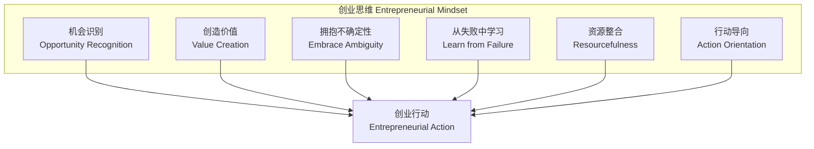
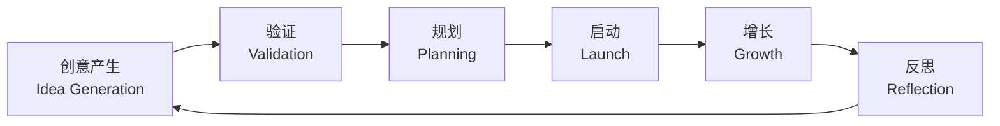

---
aliases:
  - EntrepreneurshipForTeens
  - TeenEntrepreneurship
  - YouthEntrepreneurship
  - YouthBusiness
tags:
  - CrossDisciplinaryK12
  - CareerEducation
  - EntrepreneurshipForTeens
  - YouthDevelopment
  - BusinessEducation
created: 2024-01-20
updated: 2026-05-17
---

# 青少年创业

> 青少年创业教育 (Entrepreneurship for Teens) 培养学生的创新思维、风险意识和解决问题的能力，为未来职业发展和创业实践奠定基础。

## 创业思维 (Entrepreneurial Mindset)

### 创业者的核心思维特征

| 思维特征 | 描述 | 培养方法 |
| :--- | :--- | :--- |
| 机会识别 | 发现未被满足的需求 | 每日观察练习、问题日记 |
| 成长心态 (Growth Mindset) | 相信能力可以通过努力提升 | 过程表扬、挑战记录 |
| 计算风险 (Calculated Risk) | 权衡收益与风险的理性决策 | 风险收益分析表 |
| 抗挫折能力 (Resilience) | 从失败中快速恢复 | 失败复盘、迭代思维 |
| 自我效能感 (Self-Efficacy) | 相信自己能达成目标 | 小胜利累积、榜样学习 |

## 创业全流程

### 流程概览

## 创意产生 (Idea Generation)

### 创意发现技术

| 方法 | 描述 | 青少年适用示例 |
| :--- | :--- | :--- |
| **头脑风暴 (Brainstorming)** | 自由联想，延后评判 | 校园生活痛点清单 |
| **设计思维 (Design Thinking)** | 共情→定义→构思→原型→测试 | 为同学设计更好的午休方案 |
| **SCAMPER** | Substitute, Combine, Adapt, Modify, Put to Another Use, Eliminate, Reverse | 改造现有产品 |
| **问题-解决方案匹配** | 列出问题→提出解决方案 | 作业太多→作业管理 App |
| **趋势观察** | 识别社会与技术趋势 | 环保潮流→可重复使用文具 |

## 商业模型画布 (Business Model Canvas)

商业模型画布由 Alexander Osterwalder 提出，是可视化商业模型的强大工具：

| 九大模块 | 关键问题 | 青少年创业示例 (校园奶茶站) |
| :--- | :--- | :--- |
| **客户细分 (Customer Segments)** | 为谁创造价值？ | 本校学生、教师 |
| **价值主张 (Value Proposition)** | 解决什么问题？ | 便利 + 低价 + 健康选择 |
| **渠道 (Channels)** | 如何触达客户？ | 课间走廊摊点、微信群预定 |
| **客户关系 (Customer Relationships)** | 如何维护关系？ | 积分卡、新品试饮、反馈群 |
| **收入来源 (Revenue Streams)** | 如何赚钱？ | 饮品销售、套餐优惠 |
| **核心资源 (Key Resources)** | 需要什么？ | 奶茶机、原料、摊位许可 |
| **关键业务 (Key Activities)** | 做什么？ | 制作、采购、营销 |
| **重要伙伴 (Key Partnerships)** | 谁可以帮助？ | 学校后勤、家长支持 |
| **成本结构 (Cost Structure)** | 支出有哪些？ | 原料、设备折旧、包装 |

## 最小可行产品 (MVP)

### MVP 原则

- **核心功能优先**：只开发解决核心问题的功能
- **快速迭代**：Build → Measure → Learn 循环
- **用户反馈驱动**：早期用户参与产品改进
- **低风险验证**：先做原型或服务模拟

### 青少年 MVP 示例

| 创业想法 | MVP 方案 | 验证指标 |
| :--- | :--- | :--- |
| 校园二手书店 | 微信群手工撮合（零开发成本） | 成交订单数 |
| 自习监督服务 | 1 人 1 手机计时器监督 | 完成自习时长 |
| 手工烘焙 | 周末在家制作，朋友圈预售 | 预订单数 |
| 校园跑腿服务 | 志愿者+红包模式 | 日服务单量 |

## 市场调研 (Market Research)

### 调研方法

- **问卷调查**：Google Forms、问卷星，收集定量数据
- **用户访谈**：1v1 深度访谈，了解需求痛点
- **竞品分析**：研究同类产品或服务的优劣势
- **实地观察**：在目标场景中观察用户行为
- **A/B 测试**：两个方案对比测试效果

### 调研数据分析

调研结果可用于支持商业计划书中的市场分析部分，常见分析维度：

| 分析维度 | 关键指标 | 数据来源 |
| :--- | :--- | :--- |
| 市场规模 | 目标人群数量 × 年消费 | 学校人口数据 |
| 需求强度 | 愿意付费的百分比 | 问卷调查 |
| 竞争格局 | 直接/间接竞争者数量 | 实地观察 |
| 价格敏感度 | 可接受价格区间 | 价格阶梯测试 |

## 创业财务基础 (Finance Basics)

### 基础财务概念

- **收入 (Revenue)** = 单价 × 销量
- **成本 (Cost)** = 固定成本 + 变动成本
- **利润 (Profit)** = 收入 − 成本
- **盈亏平衡点 (Break-Even Point)**：

$$ \text{盈亏平衡销量} = \frac{\text{固定成本}}{\text{单价} - \text{单位变动成本}} $$

- **利润率 (Profit Margin)** = $\frac{\text{利润}}{\text{收入}} \times 100\%$

### 青少年项目的简易财务报表

| 项目 | 金额 (元/月) | 备注 |
| :--- | :--- | :--- |
| **收入** | | |
| 饮品销售 | 1500 | 日均 10 杯 × 5 元 |
| 套餐优惠 | 300 | 买五送一 |
| **总收入** | **1800** | |
| **支出** | | |
| 原料采购 | 600 | 奶精、茶叶、糖浆 |
| 包装 | 200 | 杯子、吸管、袋子 |
| 宣传材料 | 50 | 海报打印 |
| **总支出** | **850** | |
| **月度利润** | **950** | |

## 创业计划书 (Business Plan)

### 计划书结构

1. **执行摘要 (Executive Summary)**：一句话说明创业项目
2. **公司描述**：名称、使命、愿景
3. **市场分析**：目标市场、竞争分析
4. **产品/服务描述**：核心价值、特色
5. **营销策略**：4P (Product, Price, Place, Promotion)
6. **运营计划**：团队分工、日常流程
7. **财务预测**：启动资金、收支预测
8. **附录**：问卷结果、产品图片

## 创业者素养培养

### 团队协作

- **角色分工**：CEO (统筹)、CMO (市场)、CFO (财务)、COO (运营)
- **沟通工具**：飞书/钉钉、Notion、微信群
- **冲突解决**：关键对话技巧、投票机制
- **激励方式**：利润分成、荣誉表彰、轮岗体验

### 公共演讲与展示

| 要素 | 技巧 | 避免 |
| :--- | :--- | :--- |
| 开场 | 问题/故事/数据 Hook | 客套或冗余开场 |
| 主体 | 3 个核心要点，结构化 | 信息过载 |
| 视觉 | 简洁 PPT，关键图表 | 满屏文字 |
| 收尾 | 呼吁行动 (Call to Action) | 突然结束 |
| Q&A | 提前预判问题 | 防御性回应 |

### 演讲的 AIDA 模型

| 阶段 | 目的 | 演讲技巧 |
| :--- | :--- | :--- |
| **Attention (引起注意)** | 开篇抓住听众注意力 | 震撼数据、惊人事实、个人故事、设问 |
| **Interest (激发兴趣)** | 让听众关心你的项目 | 描述问题场景、共鸣痛点、展现市场规模 |
| **Desire (唤起渴望)** | 让听众相信你的方案 | 展示 MVP、用户反馈、竞品对比优势 |
| **Action (促进行动)** | 引导下一步行动 | 明确邀请 (投资/试用/加入)、留下联系方式 |

## 营销基础 (Marketing Basics)

### 4P 营销组合

| 要素 | 内容 | 青少年创业中的应用 |
| :--- | :--- | :--- |
| **Product (产品)** | 核心功能、品质、包装、品牌 | 手工烘焙的产品种类和口味组合 |
| **Price (价格)** | 定价策略、折扣、付款方式 | 单价 5 元 vs 套餐 12 元，试销调整 |
| **Place (渠道)** | 销售渠道、覆盖范围 | 课间摊位、微信群、周末校园集市 |
| **Promotion (推广)** | 广告、促销、公关、口碑 | 朋友圈海报、试吃活动、推荐奖励 |

### 数字营销基础

- **社交媒体营销**：小红书、抖音、微信朋友圈的内容创作
- **口碑营销 (Word-of-Mouth)**：满意用户的自然推荐
- **KOL 合作**：邀请校园意见领袖试用
- **内容营销**：写创业日记、制作产品制作过程的短视频
- **用户生成内容 (UGC)**：鼓励客户分享使用体验

## 创业伦理与社会责任

### 青少年创业的伦理考量

| 伦理维度 | 关键问题 | 实践指南 |
| :--- | :--- | :--- |
| **诚信 (Honesty)** | 产品宣传是否真实？ | 不做虚假宣传、标清产品成分 |
| **公平 (Fairness)** | 定价是否合理？是否善待合作伙伴？ | 参考市场价格、尊重供应商 |
| **透明 (Transparency)** | 是否向客户说明产品来源？ | 在包装上标注原料和制作日期 |
| **社会责任 (Social Responsibility)** | 你的项目是否对社会有益？ | 考虑环保包装、捐赠部分比例 |
| **知识产权 (IP)** | 是否使用了他人的创意或作品？ | 获得授权、标注来源 |

### 社会企业 (Social Enterprise) 的概念

青少年创业也可以关注社会问题：将商业手段与社会使命相结合，创造"双重底线" (Double Bottom Line) —— 同时追求利润和社会影响力。

### 创业者的法律基础

- **未成年人创业的法律限制**：需要监护人同意、银行开户要求
- **税务基础**：了解起征点和申报义务
- **合同意识**：口头协议的局限性、简单书面合同模板
- **商标与品牌保护**：商标的概念、如何在青少年阶段保护品牌

## 失败与迭代

### 创业失败案例学习

| 常见失败原因 | 占比 | 预防建议 |
| :--- | :--- | :--- |
| 市场不需要这个产品 | ~42% | 在投入前做充分的市场调研 |
| 现金流耗尽 | ~29% | 做好财务计划，控制启动成本 |
| 团队问题 | ~23% | 明确分工，建立沟通机制 |
| 竞争压力 | ~19% | 坚持差异化，关注核心用户 |
| 定价/成本问题 | ~17% | 计算清楚单位经济模型 |

> "我没有失败。我只是找到了一万种行不通的方法。" —— 托马斯·爱迪生

### 迭代思维

创业是一个持续迭代的过程。每次"失败"都是一次学习机会：

$$ \text{成功} = P(\text{正确假设}) \times \text{学习速度} \times \text{行动次数} $$

其中 $P(\text{正确假设})$ 表示初始假设成立的概率，"学习速度"表示从每次试错中获取洞察的速度。

## 相关条目

- [[FinancialLiteracy|财商教育]]
- [[DesignThinking|设计思维]]
- [[ProjectBasedLearning|项目式学习]]
- [[LeadershipForTeens|青少年领导力]]
- [[11_ManagementSciences/BusinessAdministration/Marketing/DigitalMarketing|数字营销]]
- [[../INDEX|CrossDisciplinaryK12 索引]]

