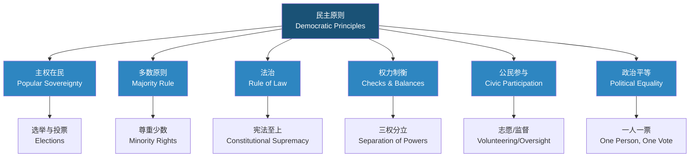

---
aliases: [DemocracyAndGovernance, 民主与治理, 公民教育, CivicEducation, 民主制度]
tags: ['CrossDisciplinaryK12', 'CivicEducation', 'DemocracyAndGovernance', 'SocialStudies', 'Citizenship']
created: 2026-05-17
updated: 2026-05-17
---

# 民主与治理 (Democracy and Governance)

> 民主与治理教育帮助学生理解公民权利与义务，培养参与社会治理的意识和能力，是现代社会公民素养的核心组成部分。

## 学习目标 (Learning Objectives)

| 目标类别 | 具体目标 |
|---------|---------|
| 知识目标 | 理解民主的基本概念、形式与原则 |
| 能力目标 | 培养公共事务参与、理性协商、民主决策的能力 |
| 态度目标 | 树立法治意识、尊重多元、社会责任感 |
| 行动目标 | 能够在校内外实践民主参与方式 |

## 民主基础 (Foundations of Democracy)

### 民主的含义 (Meaning of Democracy)

- **人民当家作主** (Popular Sovereignty)：国家权力来源于人民，人民是国家的主人
- **民主的词源**：希腊语 δημοκρατία (dēmokratía) — dēmos（人民）+ kratos（统治）
- **林肯的定义**：government of the people, by the people, for the people（民有、民治、民享）

### 民主的形式 (Forms of Democracy)

| 形式 | 定义 | 典型例子 | 优势 | 局限 |
|------|------|---------|:----:|:----:|
| 直接民主 (Direct Democracy) | 公民直接参与决策 | 古希腊雅典公民大会、瑞士小镇集会 | 充分表达民意 | 不适用于大规模社会 |
| 间接民主/代议制民主 (Representative Democracy) | 公民选举代表行使权力 | 中国人大制度、美国国会制 | 高效、专业化治理 | 代表与选民可能存在距离 |
| 协商民主 (Deliberative Democracy) | 通过公共协商达成共识 | 听证会、公民评议会 | 提升决策质量 | 耗时长、参与门槛高 |
| 参与式民主 (Participatory Democracy) | 扩展公民在决策中的直接参与 | 预算参与、社区规划 | 增强公民赋权 | 可能降低效率 |

### 民主的原则 (Principles of Democracy)

1. **主权在民** (Popular Sovereignty) — 最终权力属于人民
2. **多数决定，尊重少数** (Majority Rule, Minority Rights) — 既遵循多数人意愿，又保护少数人合法权益
3. **法治原则** (Rule of Law) — 法律面前人人平等，任何人都不能凌驾于法律之上
4. **权力制约** (Checks and Balances) — 不同权力分支相互监督制衡
5. **公民参与** (Civic Participation) — 公民通过多种渠道参与公共事务
6. **政治平等** (Political Equality) — 每一票具有同等效力

## 治理体系 (Governance System)

### 国家治理 (State Governance)

| 治理层面 | 主要机构 | 核心职能 |
|---------|---------|---------|
| 立法 (Legislative) | 人民代表大会/议会/Congress | 制定法律、监督政府、审批预算 |
| 行政 (Executive) | 政府/Cabinet/President | 执行法律、管理公共事务、外交国防 |
| 司法 (Judicial) | 法院/Courts | 审判案件、解释法律、违宪审查 |
| 监察 (Supervisory) | 监察委员会/Ombudsman | 反腐败、监督公职人员 |

### 基层治理 (Grassroots Governance)

- **社区自治** (Community Self-governance)：居民委员会、业主委员会、社区议事会
- **村民自治** (Village Self-governance)：村委会选举、村务公开、村民代表会议
- **基层协商** (Grassroots Deliberation)：民主恳谈会、民情日(民情日记)、矛盾调解
- **网格化管理** (Grid Management)：社区网格员、综合信息平台

### 公民参与渠道 (Channels for Civic Participation)

| 参与方式 | 参与层次 | 适用场景 | 示例 |
|---------|:--------:|---------|------|
| 选举 (Elections) | 国家/地方 | 选择代表或领导人 | 人大代表选举、总统选举 |
| 投票 (Referendums) | 国家/地方 | 重大公共决策 | 宪法公投、地方预算公投 |
| 听证会 (Public Hearings) | 地方 | 政策/项目征求意见 | 城市规划听证会、定价听证会 |
| 信访 (Petitioning) | 各级 | 个人或群体诉求 | 网上信访、领导接待日 |
| 社会监督 (Social Oversight) | 各级 | 监督公权力运行 | 舆论监督、政务公开 |
| 志愿服务 (Volunteering) | 社区 | 社区公益活动 | 环保志愿、社区服务 |

### 法治 (Rule of Law)

- **宪法** (Constitution)：国家的根本大法，具有最高法律效力
- **法律体系** (Legal System)：民法、刑法、行政法、诉讼法等
- **司法独立** (Judicial Independence)：法院依法独立行使审判权
- **法律救济** (Legal Remedies)：诉讼、仲裁、调解、行政复议
- **法律面前人人平等** (Equality Before the Law)：不因身份、财富、地位差异受到区别对待

## 学生参与实践 (Student Participation Practices)

### 学生会 (Student Council/Government)

- 职能：代表学生利益、组织活动、参与学校管理
- 组织架构：主席团、各部门（学习、文体、生活等）
- 选举方式：班级推选、全校选举、竞选演说

### 班级民主管理 (Classroom Democratic Management)

| 要素 | 具体做法 |
|------|---------|
| 班级议事规则 (Meeting Rules) | 罗伯特议事规则简化版、轮流主持 |
| 班规制定 (Rule-making) | 全体参与、讨论通过、定期修订 |
| 班干部轮换 (Rotation) | 定期改选、轮流担任不同职务 |
| 民主评议 (Evaluation) | 学生互评、自评、师评相结合 |

### 模拟政协 (Model CPPCC / Model Congress)

- 模拟提案撰写 (Proposal Writing)：选题调研、问题分析、建议提出
- 协商讨论 (Deliberation)：小组讨论、辩论、修改提案
- 模拟听证 (Mock Hearing)：各利益方陈述观点，辩论交锋
- 优秀提案展示 (Presentation)：向学校或社区提交建议

### 其他实践方式

- **模拟联合国** (Model UN)：模拟联合国会议，锻炼外交协商能力
- **模拟法庭** (Mock Trial)：扮演法官、律师、当事人，体验司法过程
- **社区调研** (Community Survey)：对社区问题进行调查并提出解决方案
- **校园公共议事厅** (Campus Forum)：就校园热点议题组织公开讨论

## 中西民主比较 (Comparative Democracy)

| 维度 | 中国特色社会主义民主 | 西方代议制民主 |
|:----:|:-------------------:|:--------------:|
| 理论基础 | 人民民主、全过程民主 | 自由主义民主、多元主义 |
| 政党制度 | 中国共产党领导的多党合作和政治协商 | 多党竞争、两党制或多党制 |
| 选举方式 | 直接选举与间接选举结合 | 普选、选区制、比例代表制 |
| 决策机制 | 民主集中制 | 三权分立、制衡 |
| 公民参与 | 协商民主、群众路线 | 利益集团、游说、公民投票 |
| 法治特色 | 依法治国与以德治国结合 | 法律至上、司法独立 |

## 拓展阅读 (Further Reading)

- 《论民主》— 罗伯特·达尔 (Robert Dahl)
- 《自由论》— 以赛亚·伯林 (Isaiah Berlin)
- 《民主新论》— 乔万尼·萨托利 (Giovanni Sartori)
- 《中国的民主》白皮书 — 中华人民共和国国务院新闻办公室
- 《民主是一种现代生活》— 蔡定剑
- 《公民文化》— 阿尔蒙德与维巴 (Almond & Verba)

## 相关条目 (Related Entries)

- [[INDEX\|总索引]]
- [[01_K12/CrossDisciplinaryK12/FinancialLiteracyForTeens/PersonalFinance\|个人理财]]

