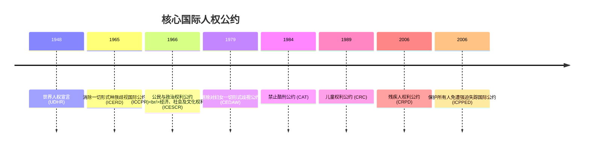
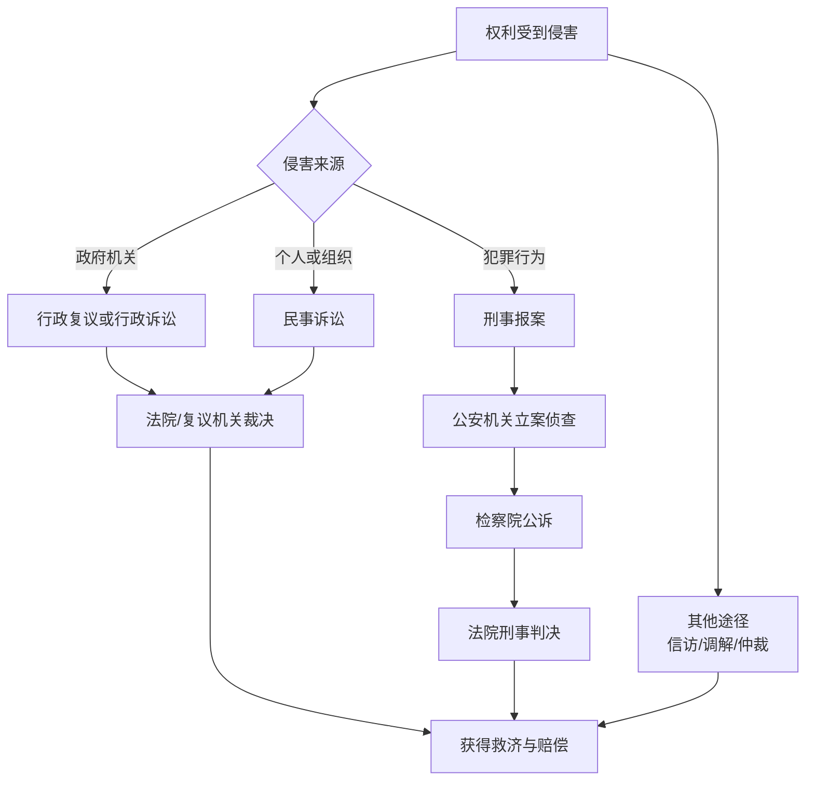

---
aliases: [HumanRightsEducation, 人权教育, HRE]
tags: ['CrossDisciplinaryK12', 'CivicEducation', 'HumanRightsEducation', 'UNCRC', 'UDHR']
created: 2025-01-01
updated: 2025-05-17
---

# 人权教育 (Human Rights Education)

> 人权教育是培养个体理解、尊重、捍卫基本人权的终身学习过程。联合国将人权教育定义为"旨在建立普遍人权文化的教育、培训和信息活动"。

## 人权的基本概念 (Fundamental Concepts)

### 人权的定义与特征
- **固有性 (Inherent)**：人权与生俱来，不依赖于任何法律或政府授予
- **普遍性 (Universal)**：适用于所有人，不分国籍、性别、种族、宗教
- **不可剥夺性 (Inalienable)**：任何人或政府都无权剥夺基本人权
- **不可分割性 (Indivisible)**：所有权利相互关联，同等重要
- **相互依存性 (Interdependent)**：一项权利的实现往往依赖其他权利的保障

### 人权的代际发展
| 代际 | 权利类别 | 核心内容 | 代表文献 |
|------|----------|----------|----------|
| 第一代 | 公民与政治权利 | 生命权、言论自由、选举权 | 国际公民与政治权利公约 (ICCPR) |
| 第二代 | 经济、社会与文化权利 | 教育权、医疗权、劳动权 | 国际经济、社会及文化权利公约 (ICESCR) |
| 第三代 | 集体与发展权利 | 发展权、和平权、环境权 | 非洲人权与民族权宪章、联合国宣言 |

## 国际人权法律体系 (International Human Rights Framework)

### 国际人权宪章 (International Bill of Human Rights)
1. **世界人权宣言 (UDHR, 1948)** — 30条奠定了所有人权的基础
2. **国际公民与政治权利公约 (ICCPR, 1966)** — 具有法律约束力的条约
3. **国际经济、社会及文化权利公约 (ICESCR, 1966)** — 经济与社会权利的法律保障

### 核心人权公约

### 联合国人权机制
- **人权理事会 (Human Rights Council)** — 政府间机构，负责监督人权状况
- **普遍定期审议 (Universal Periodic Review, UPR)** — 每四年审查所有联合国成员国
- **条约机构 (Treaty Bodies)** — 十大核心公约各自的专家委员会
- **特别程序 (Special Procedures)** — 独立专家对人权问题的调查与报告

## 儿童权利 (Children's Rights)

### 《儿童权利公约》四大核心原则
| 原则 | 英文 | 含义 |
|------|------|------|
| 不歧视 | Non-discrimination | 所有儿童享有同等权利 |
| 儿童最大利益 | Best interests of the child | 一切行动以儿童福祉为首要考虑 |
| 生命、生存与发展权 | Right to life, survival and development | 确保儿童健康成长 |
| 尊重儿童意见 | Respect for the views of the child | 儿童有权参与影响自身的事务 |

### 儿童权利的具体内容
- **身份权**：姓名、国籍、家庭关系
- **受教育权**：免费初等教育、教育机会平等
- **健康权**：医疗服务、营养、清洁饮用水
- **受保护权**：免受暴力、虐待、剥削和忽视
- **参与权**：表达意见、结社自由、获取信息

### 校园中的人权教育实践
1. **课程融入**：在道德与法治、社会、历史等学科中融入人权议题
2. **民主校园**：学生议会、班级公约、冲突调解机制
3. **主题活动**：世界人权日 (12月10日)、儿童节主题活动
4. **案例教学**：通过真实或模拟案例探讨权利冲突与平衡
5. **模拟联合国 (MUN)**：学生扮演各国代表讨论人权议题
6. **服务学习 (Service Learning)**：参与社区服务，在实践中理解权利与责任

### 儿童权利保护的挑战
- **童工问题**：全球仍有约1.6亿儿童从事童工劳动
- **儿童婚姻**：每年有约1200万女童在18岁前结婚
- **教育不平等**：冲突地区、贫困地区女童入学率显著偏低
- **数字时代的儿童保护**：网络欺凌、隐私泄露、不良内容

## 人权的国内保障 (Domestic Protection)

### 宪法保障
中国《宪法》第二章"公民的基本权利和义务" (第33-56条) 规定：
- 法律面前人人平等 (第33条)
- 选举权和被选举权 (第34条)
- 言论、出版、集会、结社、游行、示威自由 (第35条)
- 宗教信仰自由 (第36条)
- 人身自由不受侵犯 (第37条)
- 人格尊严不受侵犯 (第38条)
- 住宅不受侵犯 (第39条)
- 通信自由和通信秘密受法律保护 (第40条)

### 重要法律法规
| 法律名称 | 颁布时间 | 保护重点 |
|----------|----------|----------|
| 未成年人保护法 | 1991/2020修订 | 未成年人六大保护体系 |
| 预防未成年人犯罪法 | 1999/2020修订 | 不良行为干预与矫治 |
| 妇女权益保障法 | 1992/2022修订 | 妇女平等权利与特殊保护 |
| 残疾人保障法 | 1990/2018修订 | 残疾人就业、教育、无障碍 |
| 劳动法 | 1994/2018修订 | 劳动者权益、最低工资、工时 |
| 国家赔偿法 | 1994/2012修订 | 国家侵权赔偿标准与程序 |

### 法律救济途径
- **行政复议**：对行政机关行为提出复议
- **行政诉讼**：通过法院审查行政行为合法性
- **民事诉讼**：维护民事权利
- **刑事诉讼**：追究侵犯人权的犯罪行为
- **国家赔偿**：因国家机关侵权获得赔偿
- **法律援助**：经济困难者可申请免费法律服务
- **公益诉讼**：检察机关或社会组织提起的环境、消费者权益等公益诉讼
- **信访制度**：通过信访渠道反映诉求和提出建议

## 人权保护组织 (Human Rights Organizations)

### 国际组织
| 组织名称 | 英文缩写 | 主要职能 |
|----------|----------|----------|
| 联合国人权事务高级专员办事处 | OHCHR | 协调联合国人权工作 |
| 国际特赦组织 | Amnesty International | 调查和报告人权侵犯 |
| 人权观察 | Human Rights Watch | 全球人权研究与倡导 |
| 国际红十字与红新月运动 | ICRC/IFRC | 战争与人道危机中保护平民 |
| 国际法学家委员会 | ICJ | 促进法治与人权 |
| 联合国儿童基金会 | UNICEF | 儿童权利保护与倡导 |
| 联合国教科文组织 | UNESCO | 教育权与文化权利 |
| 国际劳工组织 | ILO | 劳动权利与工作条件标准 |

### 中国的相关机构
- **国家信访局**：受理公民信访和投诉
- **全国妇联**：维护妇女儿童合法权益
- **中国法律援助基金会**：提供法律援助
- **中国残疾人联合会**：保障残疾人权利
- **中华全国总工会**：维护劳动者权益
- **中国儿童中心**：儿童发展与权利保护
- **中国人权研究会**：人权理论研究与交流

## 当代人权议题 (Contemporary Human Rights Issues)

### 全球关注的热点
1. **数字人权 (Digital Rights)** — 隐私权、网络自由、数字鸿沟、算法偏见
2. **气候正义 (Climate Justice)** — 气候变化对人权的影响、气候难民
3. **难民与移民权利 (Refugee and Migrant Rights)** — 被迫迁移者的保护、边境政策
4. **性别平等 (Gender Equality)** — 妇女权利、LGBTQ+ 权利、同工同酬
5. **商业与人权 (Business and Human Rights)** — 企业责任与供应链人权尽职调查
6. **种族平等 (Racial Equality)** — 反种族歧视、原住民权利
7. **残障人士权利 (Disability Rights)** — 无障碍环境、融合教育、就业平等
8. **健康权 (Right to Health)** — 公共卫生体系、疫苗公平分配、心理健康

### 中国的人权发展重点
- **脱贫攻坚与生存权**：消除绝对贫困作为首要人权成就
- **发展权**：以发展促人权，全面建设小康社会，乡村振兴战略
- **少数民族权利**：区域自治、语言文化保护、民族教育
- **环境权**：生态文明建设、污染防治攻坚战、双碳目标
- **司法人权保障**：司法改革、冤假错案纠正、法律援助扩面
- **社会保障权**：全民医保、养老保险、最低生活保障

## 人权教育的方法论 (Pedagogical Approaches)

### 教学原则
- **参与式学习 (Participatory Learning)**：通过角色扮演、模拟联合国等活动
- **批判性思维 (Critical Thinking)**：分析社会现象中的权利与权力
- **价值观内化 (Values Internalization)**：从认知到态度再到行为的转变
- **跨学科整合 (Interdisciplinary Integration)**：历史、法律、伦理、社会学视角
- **体验式学习 (Experiential Learning)**：通过参观、访谈、志愿服务获得直接经验

### 课堂活动设计
1. **权利卡片游戏**：学生分类和排序不同权利
2. **案例辩论**：就"权利冲突"情景展开辩论
3. **社区调查**：调查校园或社区中的人权现状
4. **人权日记**：记录日常生活中与权利相关的经历
5. **立场写作**：模拟联合国立场文件撰写
6. **角色扮演**：扮演法官、律师、当事人审理人权案例
7. **海报展览**：制作人权主题宣传海报
8. **TEDx 风格演讲**：围绕人权议题进行3-5分钟演讲

### 教学资源与参考资料
- 《世界人权宣言》儿童版 — 联合国儿童基金会出品
- 《我是人权的孩子》— 绘本形式介绍儿童权利
- 联合国人权教育网站 — www.ohchr.org 教育资源专区
- 纪录片《人权之城》— 介绍联合国人权机制
- 电影《辩护人》— 关于公民权利与法治

### 课堂讨论引导问题
1. 当不同权利发生冲突时，应如何权衡？(如国家安全 vs 个人隐私)
2. 数字时代出现了哪些新的权利挑战？如何应对？
3. 作为青少年，你在日常生活中体验或观察到哪些与人权相关的情境？
4. 如果你可以新增一项人权，你会增加什么？为什么？
5. 不同文化背景下，对人权的理解和实践有何差异？
6. 网络言论自由的边界在哪里？虚假信息和仇恨言论应如何治理？
7. 企业应在人权保护中承担什么责任？消费者可以如何推动企业改善？

### 人权教育的评估方式
| 评估方法 | 描述 | 适用阶段 |
|----------|------|----------|
| 知识测试 | 人权概念、公约内容的基础考核 | 认知理解阶段 |
| 案例分析 | 分析真实或模拟的人权案例 | 应用分析阶段 |
| 项目展示 | 小组完成人权主题调研并展示 | 综合实践阶段 |
| 反思日志 | 记录个人对人权议题的思考变化 | 态度转变阶段 |
| 行动方案 | 设计校园或社区的人权促进方案 | 行动参与阶段 |
| 辩论表现 | 人权议题辩论中的论证与表达 | 高阶思维阶段 |

## 相关条目
- [[01_K12/JuniorHigh/Politics/CivicEducation|公民教育]]
- [[GlobalCitizenship|全球公民素养]]
- [[LegalEducation|法治教育]]
- [[UNCRC|儿童权利公约]]
- [[UDHR|世界人权宣言]]
- [[DiscriminationPrevention|反歧视教育]]
- [[DigitalRights|数字权利]]
- [[EnvironmentalJustice|环境正义]]

