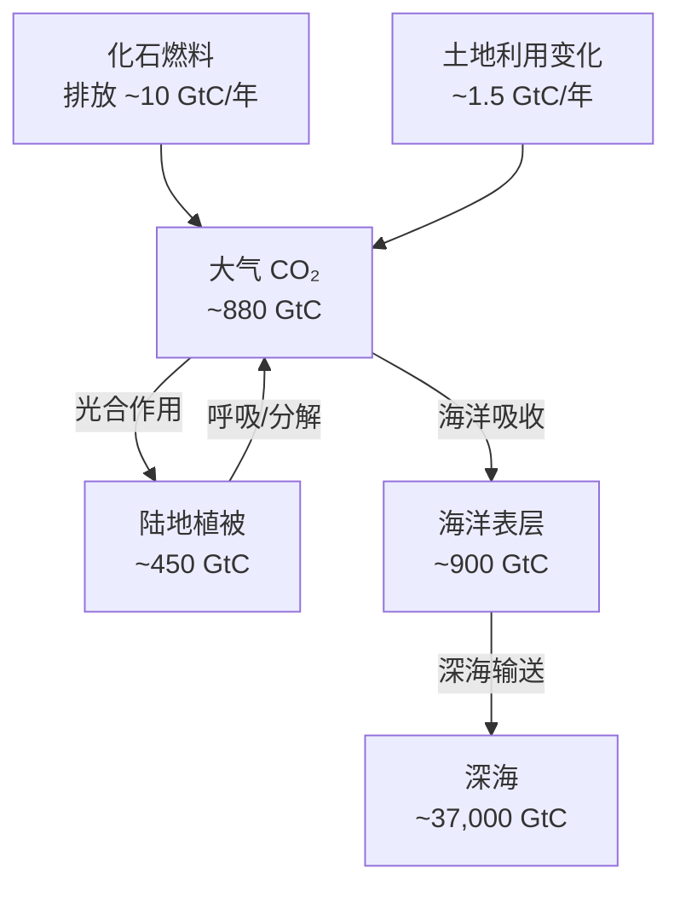
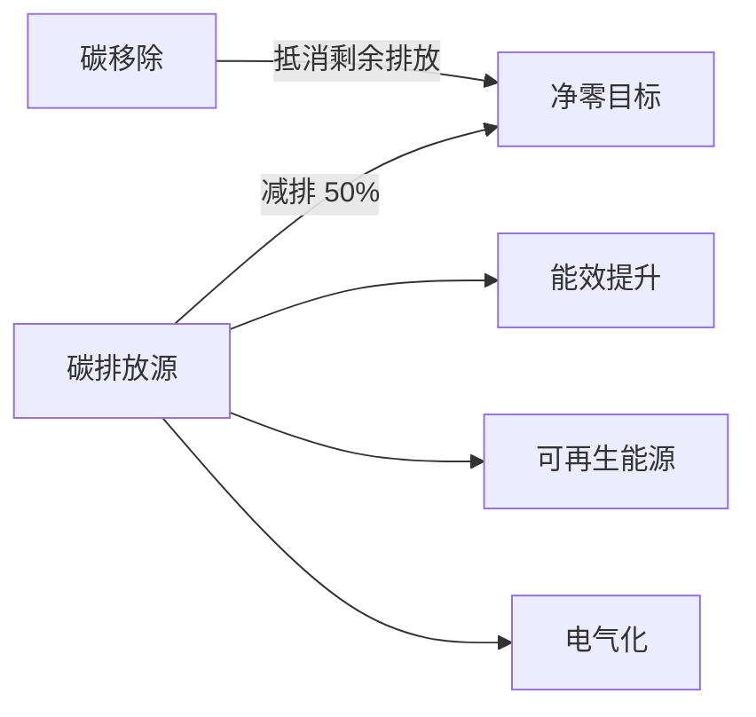

# 气候变化教育 Climate Change Education

> 气候变化教育（Climate Change Education, CCE）旨在帮助学生理解全球气候系统的科学原理、人类活动对气候的影响以及减缓与适应气候变化的策略。它是联合国可持续发展目标（SDG 13：气候行动）在教育领域的核心实践。

## 气候科学基础

### 温室效应与辐射强迫

地球大气中的温室气体（Greenhouse Gases, GHGs）允许太阳短波辐射进入，但吸收地球长波辐射，造成自然的温室效应。人类活动增强了这一效应：

| 温室气体 | 主要来源 | 增温潜势（GWP-100） | 大气寿命 |
|:--------:|:--------:|:-------------------:|:--------:|
| CO₂ | 化石燃料燃烧、 deforestation | 1 | 300–1000 年 |
| CH₄ | 农业、天然气泄漏 | 28 | 12 年 |
| N₂O | 化肥使用、工业过程 | 265 | 121 年 |
| SF₆ | 电力绝缘 | 23,500 | 3,200 年 |

辐射强迫（Radiative Forcing）公式：

$$
\Delta F = 5.35 \cdot \ln\left(\frac{C}{C_0}\right) \quad\text{(W/m²)}
$$

其中 $C$ 为当前 CO₂ 浓度，$C_0$ 为工业革命前浓度。

### 全球碳循环

## 气候变化观测证据

IPCC 第六次评估报告（AR6, 2021–2023）关键结论：

- **全球地表温度**：2011–2020 年比 1850–1900 年升高 **1.09°C**
- **海平面上升**：1901–2018 年上升约 **0.20 m**，速率在加速
- **冰川退缩**：全球冰川每年损失约 **267 Gt** 冰量
- **海洋酸化**：pH 下降约 **0.1** 单位（相当于酸度增加 26%）

温度变化可用线性趋势模型描述：

$$
T(t) = \beta_0 + \beta_1 t + \varepsilon_t
$$

其中 $\beta_1$ 为百年增温速率（°C/世纪）。

## 气候变化影响

### 自然系统影响

- **极端天气事件**：热浪频率增加 5 倍以上；强降水事件强度每 °C 增温提升约 7%
- **生物多样性**：约 50% 的物种面临局部灭绝风险（>2°C 情景）
- **海洋生态系统**：珊瑚白化事件频率从每 25 年一次升至每 6 年一次
- **冻土退化**：北极永久冻土含约 1,400 Gt 有机碳，解冻后将释放 CH₄ 与 CO₂

### 社会经济影响

| 领域 | 主要风险 | 预估影响（21 世纪末） |
|:----:|:--------:|:---------------------:|
| 农业 | 作物减产 | 全球主要作物减产 5–30% |
| 水资源 | 冰川消退 | 20 亿人面临严重水短缺 |
| 健康 | 热相关死亡 | 额外死亡 >250,000/年（2050） |
| 海岸 | 淹没风险 | 每年 1 亿人面临沿海洪水 |

## 减缓 Mitigation

减缓措施旨在减少 GHG 排放或增加碳汇：

### 能源转型

可再生能源（Solar PV、Wind）的 LCOE（平准化度电成本）已低于化石燃料：

$$
\text{LCOE} = \frac{\sum_{t=0}^n (I_t + M_t + F_t)/(1+r)^t}{\sum_{t=0}^n E_t/(1+r)^t}
$$

### 碳移除技术

- **造林与再造林**（Afforestation / Reforestation）
- **直接空气捕集**（Direct Air Capture, DAC）
- **生物能源碳捕集与封存**（BECCS）
- **增强风化**（Enhanced Weathering）

## 适应 Adaptation

适应策略针对已经发生和不可避免的气候影响：

- **工程防御**：海堤、防洪闸、雨水管网升级
- **生态适应**：红树林恢复、城市绿色基础设施
- **农业适应**：耐旱品种改良、灌溉效率提升、耕作制度调整
- **制度适应**：气候风险评估纳入城市规划、早期预警系统

适应成本—收益分析（CBA）框架：

$$
\text{NPV} = \sum_{t=0}^T \frac{B_t - C_t}{(1+r)^t}
$$

其中 $B_t$ 为避免的损失，$C_t$ 为适应投入。

## 教育方法与课程整合

### 跨学科教学框架

气候变化教育天然跨学科：

| 学科 | 贡献内容 |
|:----:|:--------:|
| 物理 | 辐射传输、热力学、能量平衡 |
| 化学 | 大气化学、碳循环化学 |
| 生物 | 生态系统响应、碳吸收机制 |
| 地理 | 空间分析、区域影响差异 |
| 公民 | 气候政策、环境正义 |
| 数学 | 数据建模、统计趋势分析 |

### 教学策略

- **探究式学习（Inquiry-Based Learning）**：引导学生提出问题、收集数据、分析证据
- **项目式学习（PBL）**：设计校园碳足迹审计项目
- **系统思维（Systems Thinking）**：用因果循环图理解气候系统的反馈机制
- **角色扮演（Role-Playing）**：模拟联合国气候谈判（COP 模拟）

### 校园碳足迹计算

$$
\text{碳足迹} = \sum_{i} E_i \times \text{EF}_i
$$

其中 $E_i$ 为第 $i$ 类能源消耗量，$\text{EF}_i$ 为对应排放因子。

| 活动 | 计算方式 | 平均排放（kg CO₂/人/年） |
|:----:|:--------:|:------------------------:|
| 电力 | kWh × 区域电网因子 | 450 |
| 交通 | km × 交通工具因子 | 800 |
| 饮食 | 餐次 × 膳食类型因子 | 600 |
| 废弃物 | kg × 填埋排放因子 | 100 |

## 相关条目

- [[EnvironmentalScienceOverview]]
- [[SustainableDevelopment]]
- [[RenewableEnergy]]
- [[EcosystemEcology]]
- [[GlobalWarming]]
- [[EnvironmentalPolicy]]
- [[CarbonNeutrality]]
