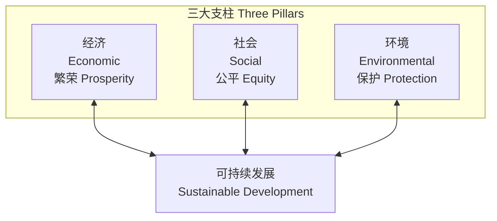
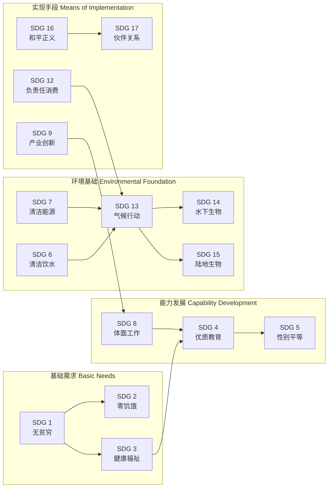

---
aliases:
  - SustainableDevelopment
  - SDGs
  - SustainabilityEducation
  - ESG
tags:
  - CrossDisciplinaryK12
  - EnvironmentalEducation
  - SustainableDevelopment
  - SDGs
  - GlobalCitizenship
created: 2024-01-18
updated: 2026-05-17
---

# 可持续发展

> 可持续发展教育 (Education for Sustainable Development, ESD) 培养学生面向未来的责任意识和行动能力，理解经济、社会、环境三个维度的协调发展。

## 可持续发展的核心理念

### 定义与起源

可持续发展最广为引用的定义来自 1987 年布伦特兰报告 (Brundtland Report)《Our Common Future》：

> **既满足当代人的需求，又不损害后代人满足其需求的能力的发展。**  
> *"Development that meets the needs of the present without compromising the ability of future generations to meet their own needs."*

### 三大支柱模型

| 支柱 | 核心关注 | 关键指标示例 |
| :--- | :--- | :--- |
| **环境可持续 (Environmental)** | 生态承载力、资源消耗、生物多样性 | 碳足迹、水资源利用、森林覆盖率 |
| **社会可持续 (Social)** | 公平正义、教育健康、文化多样性 | 基尼系数、识字率、性别平等指数 |
| **经济可持续 (Economic)** | 长期繁荣、创新效率、包容性增长 | 绿色 GDP、就业率、创新指数 |

### 可持续发展与经济增长的关系

传统经济增长模式遵循线性模型：资源开采 → 生产 → 消费 → 废弃。可持续经济追求**循环经济 (Circular Economy)** 模型：

$$ \text{环境影响} = \text{人口} \times \text{人均消费} \times \text{单位消费的环境强度} $$

(公式: I = P × A × T, 即 IPAT 方程)

## 联合国可持续发展目标 (SDGs)

### 17 个目标概览

2015 年，联合国通过了 2030 年可持续发展议程，涵盖 17 个目标 (Sustainable Development Goals) 和 169 个具体指标：

| 编号 | 目标 | 核心主题 | 关键指标 (2030) |
| :--- | :--- | :--- | :--- |
| SDG 1 | 无贫穷 (No Poverty) | 消除一切形式贫困 | 极端贫困人口比例 < 3% |
| SDG 2 | 零饥饿 (Zero Hunger) | 粮食安全与营养改善 | 营养不良率减半 |
| SDG 3 | 良好健康与福祉 | 健康生活与全民健康覆盖 | 孕产妇死亡率 < 70/10 万 |
| SDG 4 | 优质教育 | 包容公平的终身学习 | 所有青少年完成中小学 |
| SDG 5 | 性别平等 | 赋权妇女与女童 | 消除所有形式的性别歧视 |
| SDG 6 | 清洁饮水与卫生 | 水资源的可持续管理 | 全民获得安全饮用水 |
| SDG 7 | 经济适用的清洁能源 | 可再生能源与能效 | 可再生能源占比翻倍 |
| SDG 8 | 体面工作和经济增长 | 包容性经济增长 | 人均经济增长最不发达国家 > 7% |
| SDG 9 | 产业创新和基础设施 | 韧性基础设施与工业化 | 研发投入占 GDP 比例提升 |
| SDG 10 | 减少不平等 | 国家内部和国家间不平等 | 收入增长最底层 40% |
| SDG 11 | 可持续城市与社区 | 包容安全韧性的城市 | 保障适足住房 |
| SDG 12 | 负责任消费和生产 | 可持续消费与生产模式 | 减少食品浪费 |
| SDG 13 | 气候行动 | 应对气候变化 | 增强适应能力 |
| SDG 14 | 水下生物 | 海洋资源保护 | 减少海洋污染 |
| SDG 15 | 陆地生物 | 森林荒漠化与生物多样性 | 制止生物多样性丧失 |
| SDG 16 | 和平正义与强大机构 | 法治与包容性制度 | 减少暴力相关死亡率 |
| SDG 17 | 促进目标实现的伙伴关系 | 全球合作 | 官方发展援助承诺兑现 |

### SDGs 之间的相互关系

### SDG 指数的多维评估模型

各国家的 SDG 进展可通过 SDG 指数进行量化评估，综合得分计算公式：

$$ \text{SDG Index Score} = \frac{1}{17} \sum_{i=1}^{17} \frac{\text{Actual}_i - \text{Min}_i}{\text{Max}_i - \text{Min}_i} \times 100 $$

其中 $\text{Actual}_i$ 是第 $i$ 个 SDG 指标的实际值，$\text{Min}_i$ 和 $\text{Max}_i$ 分别为最差和最佳基准值。

## 可持续发展在校园中的实践

### 绿色校园 (Green Campus)

| 实践领域 | 具体行动 | 测量指标 |
| :--- | :--- | :--- |
| 能源管理 | 灯光定时控制、太阳能路灯、教室节能公约 | 月度用电量对比 |
| 水资源 | 节水龙头、雨水收集、漏水巡查 | 人均用水量 |
| 废弃物 | 分类垃圾桶、堆肥实验、一次性用品减量 | 垃圾减量率 |
| 交通 | 步行上学日、自行车停放区、校车拼车 | 绿色出行比例 |
| 餐饮 | 光盘行动、本地食材、可重复餐具 | 食物浪费量 |

### 可持续消费 (Sustainable Consumption)

- **5R 原则**：Refuse (拒绝不需要的)、Reduce (减少消耗的)、Reuse (重复使用)、Repair (修复替代)、Recycle (循环回收)
- **碳足迹计算**：个人日常活动的碳排放估算
- **绿色标签识别**：FSC (森林认证)、Energy Star (能效标签)、有机食品认证
- **慢时尚 (Slow Fashion)**：减少快时尚消费，提倡二手衣物交换

### 项目式学习案例

| 项目主题 | 学习目标 | 活动设计 | 成果展示 |
| :--- | :--- | :--- | :--- |
| 校园碳足迹调查 | 理解碳排放概念与计算方法 | 记录一周用电、用水、出行数据 | 校园碳足迹报告 |
| 塑料污染解决方案 | 培养问题分析与创新解决能力 | 统计校园塑料使用、设计替代方案 | 减少塑料行动方案 |
| 本地食物系统 | 理解食物里程与可持续农业 | 调查学校餐厅食材来源、设计本地菜谱 | 本地食物地图 |
| 社区垃圾分类优化 | 培养公民参与与设计思维 | 调研社区现状、设计分类设施方案 | 优化方案模型 |

## 可持续发展的挑战与反思

### 主要挑战

- **经济增长与环境保护的张力**：发展中国家面临的发展权与减排责任的平衡
- **政治意愿不足**：SDGs 的执行依赖各国政府的政策承诺与资源投入
- **消费主义的惯性**：高消费模式难以在短期内改变
- **全球合作困境**：气候变化、海洋塑料是跨国界问题，需要超越国界的合作
- **数据与监测不足**：许多发展中国家缺乏可靠的统计能力以追踪 SDGs 进展

### 个人可以采取的行动

| 生活领域 | 具体行动 | 影响范围 |
| :--- | :--- | :--- |
| 饮食 | 减少食物浪费、多吃植物性食物 | 减少碳排放 × 水资源节约 |
| 出行 | 步行/骑行/公共交通、减少飞机出行 | 直接减少化石燃料消耗 |
| 购物 | 购买本地产品、拒绝过度包装 | 减少运输排放 × 废弃物 |
| 参与 | 加入环保社团、撰写环境议题研究 | 传播意识 × 政策推动 |
| 教育 | 学习可持续知识、分享给他人 | 知识传播 × 行为影响 |

## SDGs 在中国的进展

### 中国在 SDGs 方面的主要成就

| SDG | 成就亮点 | 挑战 |
| :--- | :--- | :--- |
| SDG 1 无贫穷 | 2021 年宣布消除绝对贫困 (近 1 亿人脱贫) | 相对贫困和返贫风险的持续存在 |
| SDG 7 清洁能源 | 可再生能源装机容量全球第一 | 煤炭仍占能源结构的 ~56% |
| SDG 13 气候行动 | 承诺 2030 年前碳达峰、2060 年前碳中和 | 从达峰到中和仅 30 年，时间紧迫 |
| SDG 4 优质教育 | 九年义务教育巩固率 > 95% | 城乡教育资源不均衡问题 |

### 生态红线制度

中国提出的生态红线 (Ecological Redline) 制度与可持续发展理念高度契合，将约 25% 的国土面积划入生态保护红线范围，禁止工业化城镇化开发。

## 循环经济 (Circular Economy)

### 线性经济 vs 循环经济

| 对比维度 | 线性经济 | 循环经济 |
| :--- | :--- | :--- |
| 资源流动 | 开采 → 制造 → 使用 → 废弃 | 减量 → 复用 → 修复 → 回收 |
| 废弃物 | 视为终点 (垃圾填埋/焚烧) | 视为资源 (闭环再利用) |
| 产品设计 | 计划性淘汰 | 模块化、可修复、可升级 |
| 能源来源 | 化石能源为主 | 可再生能源驱动 |
| 商业模式 | 售卖所有权 | 产品即服务 (Product-as-a-Service) |
| 环境成本 | 外部化 (未计入价格) | 内部化 (污染者付费) |

### 循环经济的 9R 框架

$$ \text{循环性递增: } \text{R0 拒绝} \rightarrow \text{R1 反思} \rightarrow \text{R2 减量} \rightarrow \text{R3 复用} \rightarrow \text{R4 修复} \rightarrow \text{R5 翻新} \rightarrow \text{R6 再造} \rightarrow \text{R7 另用} \rightarrow \text{R8 回收} $$

## 可持续发展教育 (ESD) 的教学方法

### 核心教学方法

| 教学方法 | 描述 | 适用主题 |
| :--- | :--- | :--- |
| **探究式学习 (Inquiry-Based)** | 学生提出可持续发展问题并自主研究 | SDG 专题研究 |
| **项目式学习 (PBL)** | 团队完成一个真实的可持续发展项目 | 校园垃圾分类优化 |
| **情境学习 (Situated Learning)** | 在真实的社区环境中学习 | 社区生态调查 |
| **参与式行动研究** | 学生作为研究者参与社区问题解决 | 本地水资源监测 |
| **跨学科整合** | 融合科学、社会、数学、语文等多学科 | 气候变化辩论 |
| **未来思维 (Futures Thinking)** | 想象和规划可能的未来场景 | 2050 年可持续城市设计 |

### 可持续发展能力的评估

| 能力维度 | 具体表现 | 评估方法 |
| :--- | :--- | :--- |
| 系统思维 (Systems Thinking) | 理解经济-社会-环境的相互关系 | 因果循环图绘制 |
| 预见能力 (Anticipatory) | 评估不同选择的长期后果 | 未来情景写作 |
| 规范能力 (Normative) | 理解和权衡不同的价值观 | 道德困境讨论 |
| 战略能力 (Strategic) | 设计实现可持续发展的行动方案 | 行动方案设计 |
| 人际能力 (Interpersonal) | 跨文化沟通与协作 | 多利益相关者模拟谈判 |
| 批判能力 (Critical) | 质疑主流发展模式 | 广告中的消费主义分析 |

## 相关条目

- [[ClimateChangeEducation|气候变化教育]]
- [[EnvironmentalScience|环境科学]]
- [[GlobalCitizenship|全球公民教育]]
- [[CircularEconomy|循环经济]]
- [[Biodiversity|生物多样性]]
- [[SystemsThinking|系统思维]]
- [[FuturesLiteracy|未来素养]]
- [[../INDEX|CrossDisciplinaryK12 索引]]
