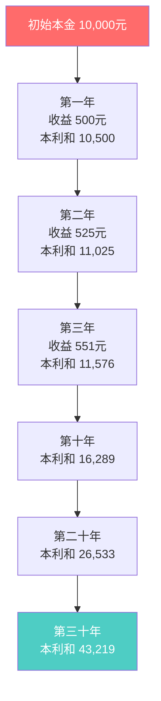
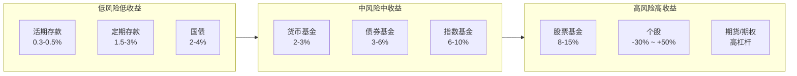

# 投资基础 (Investment Basics)

> 投资是将资金投入到某种资产中，期望在未来获得收益或增值的行为。对于青少年而言，建立正确的投资观念和风险意识，是培养财务素养和实现长期财富积累的关键第一步。

## 投资的核心概念 (Core Concepts)

### 什么是投资
| 概念 | 定义 | 类比 |
|------|------|------|
| 投资 (Investing) | 投入资金购买资产，期望未来产生收益 | 种下一棵树，期待未来结果 |
| 投机 (Speculating) | 短期买卖，基于价格波动而非资产价值 | 赌短期天气变化 |
| 储蓄 (Saving) | 保留资金不消费，通常存入银行 | 把种子放进仓库 |
| 消费 (Consuming) | 使用资金购买商品或服务 | 吃掉果子 |

### 风险与收益的基本关系
- **高风险 ≠ 高收益**：高风险意味着收益的不确定性更大，但不保证高收益
- **低风险 = 低收益**：安全性高的资产通常收益较低
- **风险溢价 (Risk Premium)**：投资者因承担额外风险而获得的额外预期收益

$$
预期收益 = 无风险利率 + 风险溢价
$$

$$
E(R) = R_f + \beta \times (R_m - R_f)
$$

其中：
- $E(R)$ = 资产的预期收益率
- $R_f$ = 无风险利率 (如国债收益率)
- $\beta$ = 资产相对于市场的风险系数
- $R_m$ = 市场平均收益率

### 复利效应 — 世界第八大奇迹



#### 复利计算示例
| 年数 | 5%年化 | 8%年化 | 10%年化 | 15%年化 |
|------|--------|--------|---------|---------|
| 0年 | ¥10,000 | ¥10,000 | ¥10,000 | ¥10,000 |
| 5年 | ¥12,763 | ¥14,693 | ¥16,105 | ¥20,114 |
| 10年 | ¥16,289 | ¥21,589 | ¥25,937 | ¥40,456 |
| 20年 | ¥26,533 | ¥46,610 | ¥67,275 | ¥163,665 |
| 30年 | ¥43,219 | ¥100,627 | ¥174,494 | ¥662,118 |
| 40年 | ¥70,400 | ¥217,245 | ¥452,593 | ¥2,678,635 |

> **关键启示**：投资越早开始，复利的效果越显著。每月投入少量资金，长期积累的效果惊人。

## 主要投资工具 (Investment Vehicles)

### 风险-收益谱系



### 各类投资工具详解

#### 储蓄类 (Savings)
| 类型 | 特点 | 流动性 | 收益率 | 安全性 |
|------|------|--------|--------|--------|
| 活期存款 | 随存随取、门槛极低 | 极高 | 0.3-0.5% | 极高 (存款保险50万) |
| 定期存款 | 锁定期限、利率固定 | 低 | 1.5-3% | 极高 |
| 大额存单 | 20万起存、利率较高 | 中 (可转让) | 2-4% | 极高 |
| 结构性存款 | 保本+浮动收益 | 低 | 1-5% | 高 (保本) |

#### 债券类 (Bonds)
- **国债 (Government Bonds)**：国家信用担保、几乎零风险
- **地方债 (Municipal Bonds)**：地方政府发行、利率略高于国债
- **金融债 (Financial Bonds)**：银行等金融机构发行
- **企业债 (Corporate Bonds)**：公司发行、利率与信用评级相关
- **可转债 (Convertible Bonds)**：可转换为公司股票、兼具股性和债性

债券价格与利率呈反向关系：
$$
P = \sum_{t=1}^{n} \frac{C}{(1+r)^t} + \frac{F}{(1+r)^n}
$$

其中 $P$ 为债券价格，$C$ 为票息，$F$ 为面值，$r$ 为市场利率，$n$ 为期限。

#### 股票类 (Stocks)
- **普通股 (Common Stock)**：享有投票权和分红权
- **优先股 (Preferred Stock)**：优先分红但无投票权
- **A 股**：人民币计价，中国境内上市
- **H 股**：港币计价，香港上市的内地公司
- **美股**：美元计价，美国上市

#### 基金类 (Mutual Funds)
| 基金类型 | 投资标的 | 年化收益参考 | 适合人群 |
|----------|----------|-------------|----------|
| 货币基金 | 短期债券、银行存款 | 2-3% | 短期闲钱理财 |
| 债券基金 | 各类债券 (≥80%) | 3-6% | 稳健投资者 |
| 混合基金 | 股票+债券灵活配置 | 5-12% | 平衡型投资者 |
| 股票基金 | 股票 (≥80%) | 8-15% (长期) | 进取型投资者 |
| 指数基金 | 跟踪特定指数 (如沪深300) | 6-10% (长期) | 定投初学者 |
| QDII 基金 | 海外市场资产 | 5-12% | 全球资产配置 |
| ETF | 交易所交易基金 | 同指数基金 | 灵活交易者 |

### 指数基金定投的数学原理

每月定投固定金额，在价格低时买入更多份额，价格高时买入较少份额，平均成本降低。

$$
平均成本 = \frac{总投资额}{总买入份额} = \frac{n \times A}{\sum_{i=1}^{n} \frac{A}{P_i}} = \frac{n}{\sum_{i=1}^{n} \frac{1}{P_i}}
$$

其中 $A$ 为每月定投金额，$P_i$ 为第 $i$ 月的基金净值，$n$ 为定投期数。

## 投资策略 (Investment Strategies)

### 资产配置 (Asset Allocation)

#### 按年龄的简易配置公式
```
股票比例 (%) = 100 - 年龄
债券比例 (%) = 年龄
```

**示例**：一位15岁的青少年
- 股票配置：100 - 15 = 85%
- 债券配置：15%

> 随着年龄增长，逐渐降低股票比例，增加债券比例，以降低整体风险。

#### 标准普尔家庭资产配置

| 账户 | 比例 | 用途 | 投资工具 |
|------|------|------|----------|
| 要花的钱 | 10% | 短期消费 (3-6个月生活费) | 活期存款、货币基金 |
| 保命的钱 | 20% | 保险保障、应急资金 | 保险、定期存款 |
| 生钱的钱 | 30% | 为财富增长 | 股票、基金、房产 |
| 保本的钱 | 40% | 为长期目标 (教育/养老) | 债券、定期存款、年金 |

### 定投策略 (Dollar-Cost Averaging, DCA)

```
定投三原则：
1. 固定时间 (如每月10日)
2. 固定金额 (如每月500元)
3. 长期坚持 (至少3-5年)
```

**定投的优势**：
- 消除择时焦虑，不用猜市场高低点
- 平摊买入成本，降低整体风险
- 纪律性投资，避免情绪化操作
- 积累投资习惯，培养长期思维

### 分散投资 (Diversification)

不要把所有的鸡蛋放在同一个篮子里。

```markdown
分散投资的层次：
├── 资产类别分散：股票 + 债券 + 现金
├── 行业分散：科技 + 消费 + 医疗 + 金融 + 能源
├── 地域分散：A 股 + 港股 + 美股 + 其他市场
├── 时间分散：分批次买入 (定投)
└── 个股分散：单只股票不超过总资产的5-10%
```

### 价值投资 (Value Investing)

**核心原则** (本杰明·格雷厄姆 / 沃伦·巴菲特)：
1. **买股票就是买公司** — 以企业所有者的视角投资
2. **安全边际 (Margin of Safety)** — 以低于内在价值的价格买入
3. **能力圈 (Circle of Competence)** — 只投资自己理解的行业
4. **市场先生 (Mr. Market)** — 利用市场波动而非被其左右
5. **长期持有** — 最好的持有期是"永远"

### 投资策略对比

| 策略 | 核心理念 | 适用人群 | 时间周期 | 所需知识 |
|------|----------|----------|----------|----------|
| 价值投资 | 买低估好公司 | 长期投资者 | 5年以上 | 财务分析 |
| 指数定投 | 定期定额买指数 | 投资新手 | 3年以上 | 简单 |
| 成长投资 | 买入高增长公司 | 进取型 | 3-5年 | 行业研究 |
| 趋势投资 | 跟随市场趋势 | 技术派 | 短期-中期 | 技术分析 |
| 量化投资 | 数学模型驱动 | 专业机构 | 多样化 | 编程+统计 |
| 股息投资 | 买入高分红股票 | 稳健型 | 长期 | 基本面分析 |

## 风险管理 (Risk Management)

### 投资风险类型
| 风险类型 | 描述 | 应对方法 |
|----------|------|----------|
| 市场风险 | 整体市场波动导致资产价格变化 | 分散投资、长期持有 |
| 信用风险 | 债券发行方违约 | 选择高评级债券或国债 |
| 流动性风险 | 无法及时以合理价格卖出 | 避免过于冷门的资产 |
| 通胀风险 | 收益率低于通货膨胀率 | 配置增长型资产 (如股票) |
| 汇率风险 | 外币资产因汇率变动受损 | 对冲或限定比例 |
| 政策风险 | 法规或税收政策变化 | 了解政策方向、多元化 |

### 风险承受能力评估
```markdown
请针对以下问题如实回答 (每题 1-5分)：

1. 你的投资期限是多久？(1=1年以内 → 5=10年以上)
   得分：____

2. 如果投资亏损20%，你的反应是？
   (1=立即卖出 → 5=继续持有甚至加仓)
   得分：____

3. 你的收入来源稳定性？(1=非常不稳定 → 5=非常稳定)
   得分：____

4. 你是否有应急储备金？(1=没有 → 5=有6个月以上)
   得分：____

5. 你对投资的了解程度？(1=完全不了解 → 5=非常了解)
   得分：____

总分：____ / 25

评估结果：
- 5-10分：保守型 (参考配置：债券80% + 股票20%)
- 11-15分：稳健型 (参考配置：债券60% + 股票40%)
- 16-20分：平衡型 (参考配置：债券40% + 股票60%)
- 21-25分：进取型 (参考配置：债券20% + 股票80%)
```

## 常见投资误区与骗局 (Common Mistakes & Scams)

### 投资心理陷阱
| 心理偏差 | 表现 | 应对策略 |
|----------|------|----------|
| 从众效应 (Herd Mentality) | 看到别人赚钱就跟着买 | 坚持自己的投资计划 |
| 损失厌恶 (Loss Aversion) | 损失100元的痛苦>赚100元的快乐 | 理性看待短期波动 |
| 过度自信 (Overconfidence) | 认为自己能择时选股 | 承认市场不可预测 |
| 确认偏误 (Confirmation Bias) | 只关注支持自己观点的信息 | 主动寻找反面证据 |
| 近因效应 (Recency Bias) | 用最近的表现预测未来 | 关注长期历史数据 |
| 锚定效应 (Anchoring) | 被买入价锚定不肯止损 | 基于价值而非成本决策 |

### 投资骗局识别指南
```mermaid
flowchart TD
    A[接到投资推荐] --> B{承诺高回报?}
    B -->|是| C[🔴 危险信号]
    B -->|否| D{是否要求<br/>尽快决定?}
    D -->|是| C
    D -->|否| E{是否涉及<br/>拉人头/传销?}
    E -->|是| C
    E -->|否| F{是否声称<br/>"稳赚不赔"?}
    F -->|是| C
    F -->|否| G[🟢 进一步核实]

    C --> H[立即拒绝并举报]
```

**常见的投资骗局**：
- **庞氏骗局 (Ponzi Scheme)** — 用新投资者的钱支付老投资者的收益
- **传销式投资** — 以发展下线为主要盈利模式
- **虚假外汇/期货平台** — 模拟交易，资金从未进入市场
- **"内部消息"推荐** — 声称有内幕消息可以稳赚
- **虚拟货币骗局** — 空气币、拉盘砸盘、跑路
- **"专家带单"** — 收费荐股，实际是反向操作

## 青少年投资实践 (Teen Investment Practice)

### 模拟投资练习
1. **虚拟股票交易**：使用同花顺模拟盘、雪球组合等
2. **基金定投模拟**：用 Excel 记录每月"定投"虚拟资金
3. **财报阅读**：从自己熟悉的品牌入手 (如腾讯、茅台)
4. **投资日记**：记录每次"交易"的原因和结果

### 小额实战建议
- 使用家长的证券账户进行小额操作 (法律限制18岁以下开户)
- 从指数基金定投开始 (最低10元起投)
- 关注投资者教育平台 (上交所投教、深交所投教)
- 参加青少年金融素养竞赛

### 推荐学习资源
| 类型 | 资源名称 | 适合水平 |
|------|----------|----------|
| 书籍 | 《小狗钱钱》 | 初学者 (青少年) |
| 书籍 | 《富爸爸穷爸爸》 | 初级 |
| 书籍 | 《投资中最简单的事》 (邱国鹭) | 中级 |
| 书籍 | 《聪明的投资者》 (格雷厄姆) | 进阶 |
| 视频 | B 站投资科普 UP 主 | 初级到中级 |
| 课程 | 中国大学 MOOC《个人理财》 | 初级 |
| 播客 | 《知行小酒馆》 | 初级到中级 |
| 网站 | 雪球、理杏仁 | 中级以上 |

## 相关条目
- [[FinancialLiteracyForTeensIndex|青少年财商教育索引]]
- [[BudgetingForTeens|青少年预算管理]]
- [[SavingForTeens|青少年储蓄指南]]
- [[CompoundInterest|复利效应详解]]
- [[StockMarketBasics|股票市场基础]]
- [[MutualFundGuide|基金投资指南]]
- [[FinancialScamsAwareness|金融骗局识别]]
