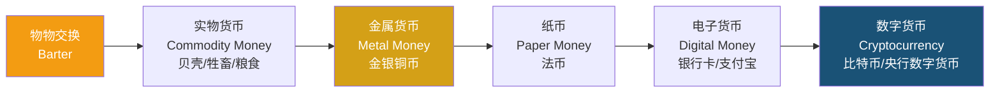

---
aliases: [PersonalFinance, 个人理财, 青少年理财, FinancialLiteracy, MoneyManagement, 金钱管理]
tags: ['CrossDisciplinaryK12', 'FinancialLiteracyForTeens', 'PersonalFinance', 'FinancialEducation', 'LifeSkills']
created: 2026-05-17
updated: 2026-05-17
---

# 个人理财 (Personal Finance)

> 青少年理财教育帮助年轻人树立正确的金钱观，培养预算、储蓄、投资和消费的基本能力，为未来的财务独立和财富积累奠定基础。

## 学习目标 (Learning Objectives)

| 目标类别 | 具体目标 |
|---------|---------|
| 认知目标 | 理解金钱的功能、货币的本质、金融基础知识 |
| 技能目标 | 掌握预算编制、记账、储蓄规划、基本投资决策 |
| 态度目标 | 树立理性消费观、延迟满足意识、风险意识 |
| 行动目标 | 能够制定并执行个人月度预算和储蓄计划 |

## 金钱认知 (Understanding Money)

### 金钱的功能 (Functions of Money)

1. **交换媒介** (Medium of Exchange) — 替代物物交换，降低交易成本
2. **价值尺度** (Unit of Account) — 衡量商品和服务价值的标准单位
3. **贮藏手段** (Store of Value) — 将购买力从现在转移到未来

### 货币的演变 (Evolution of Money)

### 收入与支出 (Income & Expenses)

**常见的青少年收入来源**：

| 收入类型 | 说明 | 常见金额（中国学生参考） |
|---------|------|:------------------------:|
| 零花钱 | 父母定期给的日常花费 | 50~500 元/月 |
| 压岁钱 | 春节收到的红包 | 500~5000 元/年 |
| 兼职工资 | 课外兼职、家教、实习 | 20~100 元/小时 |
| 奖励金 | 奖学金、竞赛奖金 | 100~5000 元/次 |
| 投资收益 | 理财利息、基金分红 | 视本金而定 |

## 预算管理 (Budgeting)

### 预算原则 (Budgeting Principles)

**核心公式**：

$$ \text{收入} - \text{储蓄} = \text{支出} $$

而不是：

$$ \text{收入} - \text{支出} = \text{储蓄} $$

先储蓄后消费是最重要的理财习惯。

### 50/30/20 预算法则 (50/30/20 Rule)

| 类别 | 比例 | 内容 | 青少年建议 |
|:----:|:----:|------|:----------:|
| 必要支出 (Needs) | 50% | 食、住、行、学 | 餐费、交通、学习用品 |
| 想要支出 (Wants) | 30% | 娱乐、购物、旅行 | 零食、游戏、玩具 |
| 储蓄/投资 (Savings) | 20% | 储蓄、投资、保险 | 存钱罐、基金定投 |

### 记账方法 (Tracking Expenses)

| 方法 | 说明 | 适合场景 | 工具 |
|:----:|------|:--------:|------|
| 随手记 | 每笔消费实时记录 | 日常小额支出 | 笔记本、手机便签 |
| 分类账本 | 按类别（食/行/玩）汇总 | 月度预算跟踪 | 记账 App（随手记/挖财） |
| 信封预算法 | 每类支出放一个信封 | 控制超支 | 实体信封 |
| 电子账单 | 自动分类银行/支付流水 | 电子支付为主 | 支付宝账单、银行 App |

## 储蓄与复利 (Saving & Compound Interest)

### 单利与复利 (Simple vs. Compound Interest)

**单利** (Simple Interest)：

$$ A = P(1 + rt) $$

**复利** (Compound Interest)：

$$ A = P\left(1 + \frac{r}{n}\right)^{nt} $$

其中：
- $P$ = 本金 (Principal)
- $r$ = 年利率 (Annual Interest Rate)
- $n$ = 每年复利次数 (Compounding Frequency)
- $t$ = 时间 (年, Years)
- $A$ = 本息和 (Total Amount)

### 复利效应示例 (Compound Interest Example)

假设每月存 200 元，年化收益率 8%：

| 时间 | 本金投入 | 本息合计 | 收益 |
|:----:|:--------:|:--------:|:----:|
| 1 年 | 2,400 元 | 2,498 元 | 98 元 |
| 5 年 | 12,000 元 | 14,694 元 | 2,694 元 |
| 10 年 | 24,000 元 | 36,590 元 | 12,590 元 |
| 20 年 | 48,000 元 | 117,804 元 | 69,804 元 |
| 30 年 | 72,000 元 | 298,972 元 | 226,972 元 |

> **复利是"世界第八大奇迹"**  — 据说出自爱因斯坦

### 72 法则 (Rule of 72)

$$ \text{翻倍年数} \approx \frac{72}{\text{年化收益率}} $$

| 年化收益率 | 翻倍所需年数 |
|:----------:|:------------:|
| 4% | 18 年 |
| 6% | 12 年 |
| 8% | 9 年 |
| 10% | 7.2 年 |
| 12% | 6 年 |

## 消费决策 (Consumer Decision Making)

### 需求 vs 欲望 (Needs vs. Wants)

| 类别 | 定义 | 例子 |
|:----:|:----:|------|
| **需求** (Needs) | 生存和基本学习必需 | 食物、衣服、书本 |
| **欲望** (Wants) | 提升生活质量但非必需 | 奶茶、新款球鞋、游戏皮肤 |

**决策框架**：购买前问自己
1. 我真的需要这个吗？（需要 vs 想要）
2. 我有支付能力吗？（预算检查）
3. 是否值得花这个时间/精力赚钱买它？（机会成本）
4. 等 24 小时后再决定是否购买？（冷却期）

### 比价策略 (Comparison Shopping)

对比维度：
- **价格** (Price)：同一商品在不同平台的售价
- **质量** (Quality)：材质、做工、品牌口碑
- **性价比** (Value for Money)：单位价格获得的品质
- **长期成本** (Long-term Cost)：维护费、耗材、使用年限

## 银行与金融基础 (Banking & Finance Basics)

### 银行账户类型 (Bank Account Types)

| 账户类型 | 特点 | 适合用途 |
|:--------:|:----:|:--------:|
| 储蓄账户 (Savings Account) | 有利息、存取灵活 | 存压岁钱、应急金 |
| 活期账户 (Checking Account) | 无利息、随时支付 | 日常消费、零花钱 |
| 定期存款 (Time Deposit) | 利率更高、到期取 | 长期储蓄、目标存钱 |

### 电子支付安全 (Digital Payment Safety)

| 安全原则 | 具体做法 |
|:--------:|---------|
| 密码管理 | 使用不同密码、定期更换、启用指纹/面容 |
| 二维码安全 | 不扫描来源不明的二维码 |
| 网络环境 | 不在公共 WiFi 进行支付操作 |
| 账户监控 | 定期查看账单，发现异常及时报告 |
| 防诈骗 | 不轻信"转账返利""刷单"等信息 |

## 基础投资概念 (Basic Investment Concepts)

### 储蓄 vs 投资

| 维度 | 储蓄 | 投资 |
|:----:|:----:|:----:|
| 风险 | 极低 | 有风险 |
| 收益 | 低（1%~3%） | 较高（5%~15%+) |
| 流动性 | 高 | 视产品而定 |
| 目的 | 短期目标、应急 | 长期财富增值 |

### 常见投资工具 (Investment Vehicles)

| 工具 | 风险等级 | 适合人群 | 门槛 |
|:----:|:--------:|:--------:|:----:|
| 货币基金 (余额宝等) | 低 | 所有人 | 1 元起 |
| 指数基金定投 | 中低 | 长期投资者 | 10 元起 |
| 债券基金 | 中低 | 稳健型 | 100 元起 |
| 股票 | 中高 | 有一定知识 | 100 股起 |
| 基金组合 | 中 | 分散投资 | 100 元起 |

## 财务目标设定 (Financial Goal Setting)

### SMART 原则

| 要素 | 含义 | 例：买新手机 |
|:----:|:----:|:------------:|
| **S**pecific (具体) | 明确目标 | 购买某品牌某型号手机 |
| **M**easurable (可衡量) | 可量化金额 | 5,000 元 |
| **A**chievable (可实现) | 符合现实 | 每月存 500 元 |
| **R**elevant (相关) | 与个人相关 | 用于学习/娱乐需要 |
| **T**ime-bound (有时限) | 截止日期 | 10 个月后 |

### 不同时间维度的目标

$$ \text{短} \xrightarrow{\text{3-6个月}} \text{应急基金、一本书} $$
$$ \text{中} \xrightarrow{\text{6个月-2年}} \text{手机、旅行、课程} $$
$$ \text{长} \xrightarrow{\text{2年以上}} \text{大学学费、第一笔基金} $$

## 理财习惯养成计划 (Building Financial Habits)

| 年龄阶段 | 习惯养成目标 | 实践建议 |
|:--------:|:------------:|---------|
| 7-9 岁 | 认识钱币、基本交易 | 模拟商店游戏、存钱罐 |
| 10-12 岁 | 零花钱管理、储蓄意识 | 每周零花钱、目标存钱罐 |
| 13-15 岁 | 预算编制、消费决策 | 月度预算本、比价练习 |
| 16-18 岁 | 银行账户、基本投资 | 开立储蓄账户、模拟基金投资 |
| 18 岁以上 | 信用管理、长期规划 | 信用卡正确使用、定投实践 |

## 拓展阅读 (Further Reading)

- 《小狗钱钱》— 博多·舍费尔 (青少年理财启蒙)
- 《富爸爸穷爸爸》— 罗伯特·清崎 (财务素养入门)
- 《穷查理宝典》— 查理·芒格 (思维模型与投资)
- 《解读基金》— 季凯帆 (基金投资入门)
- 支付宝"蚂蚁财富"投资者教育专栏
- 中国证券业协会投资者教育网站

## 相关条目 (Related Entries)

- [[INDEX\|总索引]]
- [[01_K12/CrossDisciplinaryK12/CivicEducation/DemocracyAndGovernance\|民主与治理]]
- [[11_ManagementSciences/LearningPath\|管理科学学习路径]]

