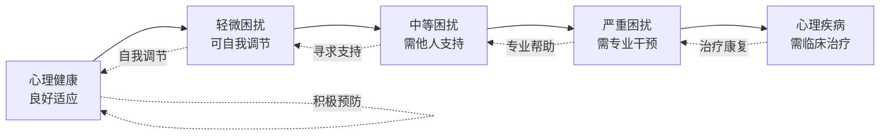
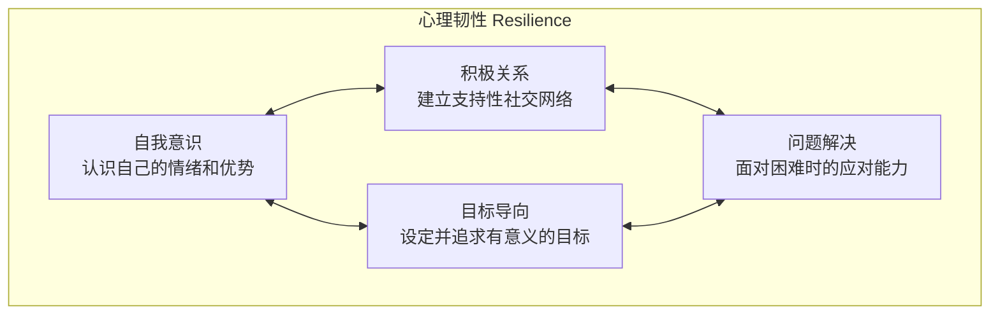
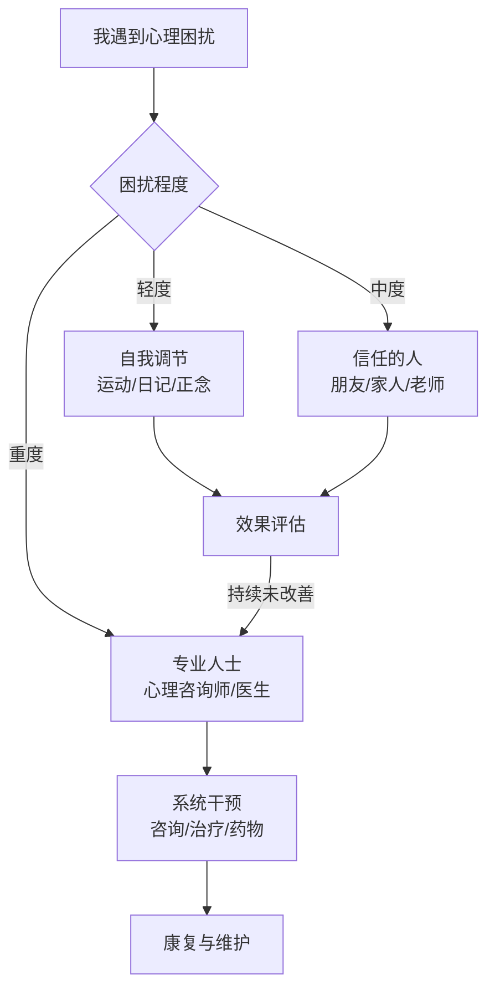

# 青少年心理健康 (Mental Health for Teens)

> 青少年心理健康是指青少年在情绪、心理和社交层面的良好状态。它影响着青少年的思维方式、行为模式和人际关系，是健康成长的重要基石。世界卫生组织 (WHO) 指出，全球约10-20%的青少年面临心理健康问题。

## 什么是心理健康 (What is Mental Health)

### 心理健康的维度
| 维度 | 内涵 | 具体表现 |
|------|------|----------|
| 情绪健康 | 能识别、表达和调节情绪 | 情绪波动在正常范围，能从挫折中恢复 |
| 认知健康 | 思维清晰、学习能力正常 | 注意力集中、记忆力良好、能解决问题 |
| 社交健康 | 建立和维护积极的人际关系 | 与同伴和成人的关系良好、有归属感 |
| 行为健康 | 行为适应环境和社会规范 | 不伤害自己或他人、能遵守规则 |
| 自我认同 | 形成稳定的自我认知 | 了解自己的优点和不足，有自尊自信 |

### 心理健康与心理疾病的连续谱



## 青少年常见心理挑战 (Common Mental Health Challenges)

### 学业压力 (Academic Stress)
- **表现**：考试焦虑、作业拖延、成绩波动、厌学情绪
- **成因**：过高期望、时间管理能力不足、竞争环境
- **影响**：失眠、食欲改变、注意力下降、自信心降低

### 焦虑 (Anxiety)
- **广泛性焦虑 (GAD)**：对日常事务过度担心，难以控制焦虑感
- **社交焦虑 (Social Anxiety)**：害怕被评价，回避社交场合
- **考试焦虑 (Test Anxiety)**：考前紧张、脑中空白、生理反应强烈
- **分离焦虑 (Separation Anxiety)**：离开家人或熟悉环境时极度不安

### 抑郁 (Depression)
- **核心症状**：持续情绪低落、兴趣丧失、精力不足
- **伴随症状**：睡眠问题、食欲改变、自我评价低、注意力困难
- **危险信号**：反复想到死亡或自杀、自我伤害行为
- **需要警惕**：症状持续超过2周，影响正常生活和学习

### 常见心理问题速查表

| 问题类型 | 常见表现 | 持续时间 | 建议行动 |
|----------|----------|----------|----------|
| 考试焦虑 | 考前紧张、失眠 | 考前1-2周 | 放松训练、时间管理 |
| 社交焦虑 | 回避社交、害怕被关注 | 持续6个月以上 | 逐步暴露、认知行为 |
| 情绪低落 | 悲伤、哭泣、缺乏动力 | 2天-2周 | 倾诉、运动、作息调整 |
| 抑郁 | 持续低沉、兴趣丧失 | 超过2周 | 心理咨询、必要时就医 |
| 注意力困难 | 难以专注、坐立不安 | 持续6个月以上 | 专注力训练、医学评估 |
| 强迫思维/行为 | 反复出现的念头或动作 | 每天1小时以上 | 专业心理治疗 (CBT) |
| 进食问题 | 过度节食或暴食 | 持续异常饮食模式 | 营养咨询 + 心理咨询 |
| 自伤行为 | 划伤、烫伤等自我伤害 | 任何一次都需重视 | 立即就医 + 心理干预 |

## 情绪管理 (Emotion Regulation)

### 情绪识别与命名
- **基础情绪**：快乐 (Joy)、悲伤 (Sadness)、愤怒 (Anger)、恐惧 (Fear)、厌恶 (Disgust)、惊讶 (Surprise)
- **高级情绪**：羞愧 (Shame)、内疚 (Guilt)、自豪 (Pride)、嫉妒 (Jealousy)、同情 (Compassion)
- **情绪记录表**：每天记录3次自己的情绪状态

```markdown
日期：________  时间：________

当前情绪：________  (强度 1-10：____)

触发事件：
______________________________

身体反应：(勾选)
[ ] 心跳加快  [ ] 呼吸急促  [ ] 肌肉紧张
[ ] 头疼      [ ] 胃部不适  [ ] 出汗

我的想法：
______________________________

应对方式：
[ ] 深呼吸  [ ] 散步  [ ] 找人聊聊
[ ] 写日记  [ ] 听音乐  [ ] 其他：______
```

### 健康情绪表达方式
| 方式 | 方法 | 适用场景 |
|------|------|----------|
| 语言表达 | 用"I feel..."句式表达感受 | 冲突中的自我表达 |
| 艺术表达 | 绘画、音乐、舞蹈、写作 | 语言难以表达时 |
| 身体活动 | 运动、跑步、瑜伽 | 愤怒或焦虑时释放能量 |
| 正念冥想 | 观察呼吸、身体扫描 | 焦虑或烦躁时平静 |
| 社交支持 | 与信任的人倾诉 | 悲伤或孤独时寻求连接 |
| 幽默 | 以幽默方式看待困境 | 缓解紧张气氛 |

### 压力管理技巧
- **4-7-8 呼吸法**：吸气4秒 → 屏住7秒 → 呼气8秒，重复4次
- **渐进式肌肉放松 (PMR)**：从头到脚逐步收紧和放松肌肉群
- **STOP 技巧**：
  - **S** — Stop (停下来)
  - **T** — Take a breath (深呼吸)
  - **O** — Observe (观察自己的感受)
  - **P** — Proceed (继续，用新的方式)
- **5-4-3-2-1 接地技巧**：说出5个看到的事物 → 4个触碰到的事物 → 3个听到的声音 → 2个闻到的气味 → 1个尝到的味道

## 心理韧性培养 (Building Resilience)

### 心理韧性的四大支柱


### 培养心理韧性的日常练习
- **感恩日记 (Gratitude Journal)**：每天写下3件值得感恩的事
- **优势识别 (Strength Spotting)**：每周记录自己使用优势的时刻
- **成长型思维 (Growth Mindset)**：将"我做不到"改为"我还没学会"
- **挑战日志 (Challenge Log)**：记录一次困难经历和学会的教训
- **自我对话调整 (Self-talk Adjustment)**：关注对自己说话的方式

## 人际关系 (Interpersonal Relationships)

### 同伴关系
- **健康友谊的特征**：互相尊重、信任、支持、平等
- **建立友谊的技巧**：主动打招呼、真诚倾听、分享兴趣
- **应对同伴压力**：坚持自己的价值观、学会说"不"
- **处理冲突**：使用非暴力沟通、寻求第三方调解

### 亲子沟通
| 沟通障碍 | 表现 | 改善策略 |
|----------|------|----------|
| 代际差异 | 父母不理解"网络时代"的挑战 | 主动分享日常生活 |
| 期望冲突 | 学业要求与个人兴趣的矛盾 | 表达真实想法，寻找折中方案 |
| 表达方式 | 指责式沟通 vs 表达式沟通 | 用"我感到..."代替"你总是..." |
| 时间投入 | 父母忙碌，缺乏深度交流 | 约定每周固定家庭时间 |

### 非暴力沟通四步法 (NVC)
```markdown
1. 观察 (Observation) — 客观描述事实，不做评价
   "这周我有三天晚上11点还在做作业..."

2. 感受 (Feeling) — 表达自己的真实感受
   "...我感到压力和疲惫..."

3. 需要 (Need) — 说明背后的需求
   "...因为我需要更多的睡眠和休息时间..."

4. 请求 (Request) — 提出具体、可执行的请求
   "...你能否帮我一起制定一个更合理的时间安排？"
```

## 心理健康求助指南 (Help-Seeking Guide)

### 需要求助的警示信号
- **情绪信号**：持续情绪低落超过2周、极度焦虑或恐惧
- **行为信号**：自我伤害、饮食严重异常、社交完全退缩
- **生理信号**：长期失眠、不明原因的身体疼痛
- **认知信号**：注意力严重下降、记忆困难、出现幻觉
- **言语信号**：谈论死亡、表达无价值感或绝望

### 求助路径


### 中国心理援助资源
| 资源类型 | 名称 | 联系方式 |
|----------|------|----------|
| 全国心理援助热线 | 12355 青少年服务台 | 拨打 12355 |
| 全国心理危机干预热线 | 北京心理危机研究与干预中心 | 010-82951332 |
| 生命热线 | 希望24热线 | 400-161-9995 |
| 学校资源 | 学校心理辅导室 | 向班主任或心理老师预约 |
| 社区资源 | 社区卫生服务中心心理科 | 咨询当地社区卫生服务中心 |
| 在线资源 | 简单心理、壹心理 | 官方网站或 App |

### 如何帮助有心理困扰的朋友
1. **倾听而非说教**— 不急于给建议，先理解感受
2. **表达关心**— "我注意到你最近不太开心，我想知道你好不好"
3. **陪伴**— 不需要解决问题，陪伴本身就是支持
4. **鼓励求助**— 温柔地建议寻求专业帮助
5. **告知信任的成人**— 如果朋友有自伤风险，必须告诉家长或老师
6. **保护隐私**— 在安全范围内尊重朋友的隐私
7. **照顾好自己**— 帮助他人时也要照顾好自己的情绪

## 身心健康的生活方式 (Healthy Lifestyle)

### 日常健康习惯
```markdown
☐ 睡眠：14-17岁青少年每晚8-10小时，固定作息
☐ 运动：每天至少60分钟中高强度体育活动
☐ 营养：均衡饮食，三餐规律，减少高糖高脂零食
☐ 屏幕：休闲屏幕时间每天不超过2小时
☐ 社交：每天至少一次面对面的社交互动
☐ 自然：每周至少2小时户外自然活动
☐ 放松：每天15-30分钟的放松或正念练习
☐ 表达：每天有表达和记录情绪的机会
```

### 每日正念练习指导
- **早晨 (3分钟)**：起床前深呼吸3次，设定今天的一个积极意图
- **课间 (1分钟)**：闭上眼，注意3个呼吸的起伏
- **午餐 (2分钟)**：吃饭时放下手机，专注于食物味道
- **放学后 (5分钟)**：回顾今天三件顺利的事
- **睡前 (5分钟)**：身体扫描，从脚到头逐步放松

## 相关条目
- [[EmotionRegulation|情绪管理]]
- [[StressManagement|压力管理]]
- [[PositivePsychology|积极心理学]]
- [[SchoolCounseling|学校心理咨询]]
- [[ParentChildCommunication|亲子沟通技巧]]
- [[HealthyLifestyleTeens|青少年健康生活方式]]
- [[CopingStrategies|应对策略大全]]
