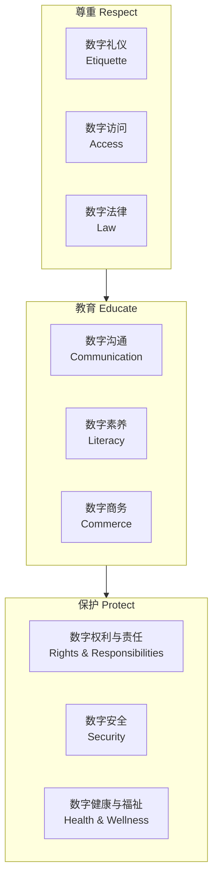
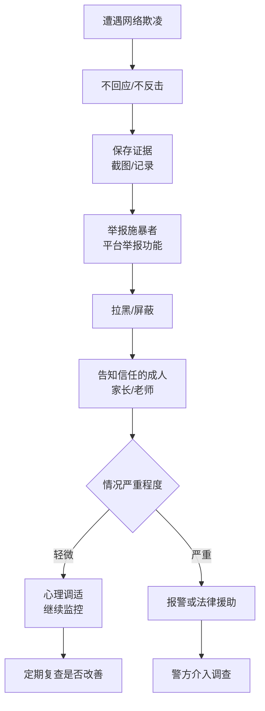

# 数字公民素养 (Digital Citizenship)

> 数字公民素养指个体在数字环境中负责任、尊重、安全地参与社会生活的知识、技能与态度。随着数字化程度加深，数字公民教育已成为21世纪核心素养的重要组成部分。

## 数字公民的九大要素 (Nine Elements of Digital Citizenship)

### Ribble 九要素模型
| 要素 | 英文 | 核心含义 |
|------|------|----------|
| 数字访问 | Digital Access | 确保所有人都能公平地使用数字技术 |
| 数字商务 | Digital Commerce | 在线购物、交易的安全与伦理 |
| 数字沟通 | Digital Communication | 使用数字工具进行有效、尊重的沟通 |
| 数字素养 | Digital Literacy | 理解和使用数字工具与技术的能力 |
| 数字礼仪 | Digital Etiquette | 在线行为的标准与规范 |
| 数字法律 | Digital Law | 数字环境中的法律责任与权利 |
| 数字权利与责任 | Digital Rights & Responsibilities | 数字环境中的基本自由与义务 |
| 数字健康与福祉 | Digital Health & Wellness | 使用技术时的身心健康 |
| 数字安全 | Digital Security | 保护个人信息与设备安全 |

### 九要素关系图



## 数字身份与足迹 (Digital Identity & Footprint)

### 数字身份管理
- **主动塑造**：通过个人网站、LinkedIn、GitHub 等展示专业形象
- **一致性原则**：在不同平台保持身份信息的一致性
- **角色分离**：区分个人社交账号与专业/学习账号
- **定期审计**：每季度检查自己的网络搜索结果

### 数字足迹类型
| 足迹类型 | 定义 | 示例 | 控制程度 |
|----------|------|------|----------|
| 主动足迹 | 用户主动发布的内容 | 社交媒体发帖、评论、博客文章 | 可编辑/可删除 |
| 被动足迹 | 被系统收集的数据 | 浏览历史、位置数据、搜索记录 | 有限控制 |
| 共享足迹 | 他人发布的与你相关的内容 | 朋友照片中的你、被@的帖子 | 几乎不可控 |

### 数字足迹管理清单
- [ ] 我用 Google 搜索自己的名字，检查搜索结果
- [ ] 检查所有社交媒体账户的隐私设置
- [ ] 删除旧的、不适当的帖子或照片
- [ ] 检查哪些应用可以访问我的数据
- [ ] 为重要账户开启双重认证 (2FA)
- [ ] 不使用相同的密码在多个重要账户
- [ ] 定期清理浏览器缓存和 Cookie
- [ ] 了解学校/公司的网络使用政策

## 网络安全基础 (Online Safety Basics)

### 密码安全策略
- 使用至少12位字符，包含大小写字母、数字和特殊符号
- 每个重要账户使用唯一的密码
- 使用密码管理器 (如 Bitwarden、1Password、KeePass)
- 开启双重认证 (2FA/MFA)
- 每3-6个月更换一次关键账户密码

### 常见网络威胁识别
| 威胁类型 | 英文 | 特征 | 防范方法 |
|----------|------|------|----------|
| 钓鱼邮件 | Phishing | 假冒官方机构、紧急语气、可疑链接 | 检查发件人地址、不点击陌生链接 |
| 恶意软件 | Malware | 通过下载或附件传播 | 不下载不明软件、安装杀毒软件 |
| 勒索软件 | Ransomware | 加密文件后索要赎金 | 定期备份重要数据 |
| 社交工程 | Social Engineering | 利用人性弱点获取信息 | 验证身份、不透露敏感信息 |
| 网络跟踪 | Cyberstalking | 持续骚扰、监视 | 保留证据、报告平台和警方 |
| 身份盗用 | Identity Theft | 冒用身份进行非法活动 | 监控信用记录、不分享身份证件 |

### Wi-Fi 安全使用指南
- 避免在公共 Wi-Fi 进行网银等敏感操作
- 使用 VPN (虚拟专用网络) 加密数据传输
- 确认 Wi-Fi 名称合法 (警惕假冒热点)
- 关闭设备的自动连接功能
- 家庭路由器设置强密码和 WPA3 加密

## 网络欺凌防治 (Cyberbullying Prevention)

### 网络欺凌的形式
- **骚扰 (Harassment)**：反复发送辱骂、威胁信息
- **诽谤 (Denigration)**：散布谣言或恶意 PS 图片
- **冒充 (Impersonation)**：冒用身份发布不当内容
- **排挤 (Exclusion)**：在群组或社交圈中故意孤立某人
- **钓鱼 (Trickery)**：骗取隐私信息后公开曝光
- **网络跟踪 (Cyberstalking)**：持续的监视与骚扰
- **人肉搜索 (Doxing)**：公开个人住址、电话等隐私信息

### 被欺凌时的应对步骤
1. **不回应**：不直接回击，避免激化冲突
2. **保留证据**：截图、保存聊天记录和邮件
3. **举报**：向平台举报功能提交投诉
4. **拉黑**：在社交平台拉黑施暴者
5. **告知信任成年人**：家长、老师或学校辅导员
6. **寻求心理支持**：心理咨询或心理健康热线
7. **必要时报警**：涉及威胁、色情等违法内容



### 预防网络欺凌的校园策略
- 建立班级反欺凌公约和举报机制
- 开展共情教育，培养"数字旁观者"转化"数字干预者"
- 设置校园心理倾诉信箱 (匿名+线上)
- 定期开展网络安全主题班会
- 培训教师识别和应对网络欺凌的能力

## 数字礼仪与沟通 (Digital Etiquette & Communication)

### 在线沟通的基本原则
- **THINK 原则**：在发布前思考
  - **T** — Is it True? (这是真的吗？)
  - **H** — Is it Helpful? (这有帮助吗？)
  - **I** — Is it Inspiring? (这有启发性吗？)
  - **N** — Is it Necessary? (这有必要吗？)
  - **K** — Is it Kind? (这是友善的吗？)

### 不同场景的沟通规范
| 场景 | 沟通工具 | 适合的内容 | 禁忌 |
|------|----------|------------|------|
| 学校通知 | 班级群/邮件 | 正式通知、作业要求 | 刷屏、无关话题 |
| 项目协作 | 工作群/Trello | 任务进度、文档共享 | 私人闲聊、情绪化表达 |
| 学术讨论 | 论坛/会议软件 | 专业问题、知识分享 | 人身攻击、抄袭 |
| 社交互动 | 朋友圈/微博 | 生活分享、观点交流 | 过度分享隐私、散播谣言 |
| 求职沟通 | 邮件/LinkedIn | 简历投递、职业咨询 | 过于随意、频繁催促 |

### 电子邮件礼仪速查表
- **主题行**：清晰标注目的，如"关于 XX 的咨询 — 张三"
- **称呼**：使用"尊敬的 XX 老师/先生/女士"
- **正文**：简洁分段，表明身份和来意
- **附件**：检查和命名附件 (如"张三_简历_2025.pdf")
- **回复**：24小时内回复，即使只是"收到，正在处理"
- **签名档**：包含姓名、学校/单位、联系方式

## 信息素养与媒体辨伪 (Information Literacy & Media Verification)

### 信息真实性核查流程
1. **溯源 (Source)**：信息来源是什么？是否可靠？
2. **作者 (Author)**：作者背景如何？是否有利益冲突？
3. **日期 (Date)**：信息是否过时？是否需要最新数据？
4. **证据 (Evidence)**：是否提供了可验证的事实和数据？
5. **多方验证 (Cross-reference)**：其他独立来源是否印证？
6. **动机 (Motivation)**：发布者是否有特定的商业或政治动机？

### 常见虚假信息类型
| 类型 | 中文 | 例子 |
|------|------|------|
| Misinformation | 无心误导 | 分享未经核实的事件照片 |
| Disinformation | 有意造谣 | 为影响选举编造候选人丑闻 |
| Malinformation | 恶意泄密 | 将私人对话断章取义公开 |
| Clickbait | 标题党 | 夸张标题引诱点击 |
| Deepfake | 深度伪造 | AI 生成的虚假视频/音频 |
| Astroturfing | 伪草根 | 伪装成普通用户的付费宣传 |

### 查证资源
- **事实核查网站**：Snopes、FactCheck.org、腾讯较真、辟谣平台
- **图片反向搜索**：Google Images、TinEye、Baidu 图片搜索
- **来源验证**：WHO、CDC、教育部等官方渠道
- **学术验证**：Google Scholar、CNKI、PubMed

## 屏幕时间管理 (Screen Time Management)

### 健康使用数字设备的建议
| 年龄组 | 每天建议屏幕时间 | 注意事项 |
|--------|------------------|----------|
| 2岁以下 | 尽量避免 | 视频通话可例外 |
| 2-5岁 | ≤1小时 | 家长陪同观看高质量内容 |
| 6-12岁 | ≤1-2小时 | 以学习为主，兼顾休闲 |
| 13-18岁 | ≤2-3小时 | 平衡在线学习与娱乐 |
| 18岁以上 | 自我管理 | 注意睡眠和运动时间 |

### 数字排毒 (Digital Detox) 策略
1. **设定无屏幕区域**：餐厅、卧室、卫生间
2. **定时断连**：每天固定1小时无手机时间
3. **通知管理**：关闭非必要 App 的通知推送
4. **单任务模式**：不边看手机边做其他事
5. **用纸笔代替**：阅读纸质书、手写笔记
6. **户外活动**：每周至少3次户外运动
7. **灰度模式**：将手机设为黑白显示降低吸引力
8. **睡前仪式**：睡前1小时不使用屏幕设备

### 数字健康评估工具
```markdown
每周自测 (1-5分，1=从不，5=总是)：
___ 我能专注完成作业/工作而不频繁看手机
___ 我不会在走路/骑车时使用手机
___ 我每晚能在合理时间放下设备入睡
___ 我有足够的时间进行线下社交
___ 我每周有至少3次运动锻炼
___ 我定期检查和管理自己的数字使用习惯
总分：___/30

评分参考：
25-30：数字健康良好
20-24：需要适当调整
15-19：需要认真改善
<15：建议立即行动
```

## 相关条目
- [[MediaLiteracyIndex|媒介素养索引]]
- [[InformationLiteracy|信息素养]]
- [[OnlineSafety|网络安全指南]]
- [[CyberbullyingGuide|网络欺凌防治指南]]
- [[ScreenTimeManagement|屏幕时间管理]]
- [[DigitalFootprint|数字足迹管理]]
- [[SocialMediaGuide|社交媒体使用指南]]
