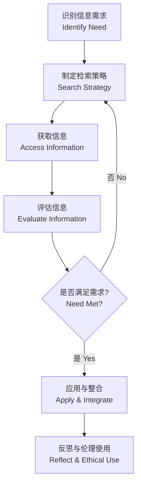
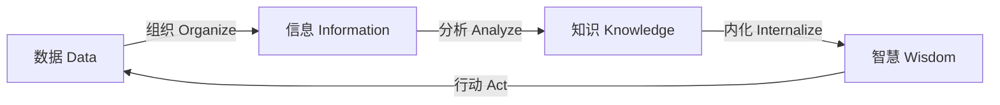

---
aliases:
  - InformationLiteracy
  - InfoLit
  - MediaLiteracyCore
tags:
  - CrossDisciplinaryK12
  - MediaLiteracy
  - InformationLiteracy
  - CriticalThinking
  - ResearchSkills
created: 2024-01-15
updated: 2026-05-17
---

# 信息素养

> 信息素养 (Information Literacy) 是个人识别信息需求、有效获取、批判性评估和合理利用信息的能力集合，是数字时代终身学习的核心素养。

## 信息素养的定义与框架

### 核心定义

信息素养超越了传统的图书馆技能，涵盖了对信息全生命周期的管理能力。美国大学与研究图书馆协会 (ACRL) 将其定义为"一组综合能力，包括反思性发现信息、理解信息的产生与价值、以及利用信息创造新知识并参与社群活动"。

### 主要框架

- **ACRL 框架 (2016)**：权威即建构与语境化、信息创建即过程、信息有价值、探究即研究、对话即学术、检索即策略式探索
- **SCONUL 七支柱模型**：识别需求 → 辨别方式 → 构建策略 → 获取 → 比较 → 综合 → 创造
- **Big6 模型**：任务定义 → 信息策略 → 定位获取 → 利用 → 综合 → 评价
- **Eisenberg & Berkowitz 大六法**：广泛应用于 K-12 教育

## 信息检索 (Information Retrieval)

### 搜索策略

| 策略 | 描述 | 示例 |
| :--- | :--- | :--- |
| 关键词选择 | 提取核心概念词 | "climate change" AND "sea level" |
| 布尔运算符 | AND / OR / NOT 组合 | 教育 AND (在线 OR 远程) NOT 传统 |
| 截词搜索 | \* 或 ? 通配 | educat\* → education, educator, educational |
| 短语搜索 | 精确匹配引号内容 | "sustainable development goals" |
| 字段搜索 | 限定标题/作者/摘要 | title:("machine learning") |

### 信息源类型

- **一手信息 (Primary Sources)**：原始研究论文、实验数据、档案记录、访谈录音
- **二手信息 (Secondary Sources)**：综述文章、教科书、百科全书、新闻报道
- **三手信息 (Tertiary Sources)**：索引、文摘、目录指南
- **学术数据库**：Web of Science, Scopus, CNKI (中国知网), Google Scholar
- **开放获取资源**：DOAJ, arXiv, PubMed Central

## 信息评估 (Information Evaluation)

### CRAAP 测试

CRAAP 测试是评估信息可靠性的经典工具，由加州州立大学奇科分校开发：

| 维度 | 关键问题 | 评估要点 |
| :--- | :--- | :--- |
| **Currency** 时效性 | 信息何时发布？是否更新？ | 检查发布日期、修订记录、链接有效性 |
| **Relevance** 相关性 | 是否满足你的信息需求？ | 目标受众、内容深度、适用范围 |
| **Authority** 权威性 | 来源是谁？有何资质？ | 作者背景、机构声誉、同行评审状态 |
| **Accuracy** 准确性 | 证据是否可靠？是否有引用？ | 数据来源、可验证性、语法拼写 |
| **Purpose** 目的 | 信息为何存在？是否有偏见？ | 教育/商业/宣传/娱乐，客观性判断 |

### 事实核查 (Fact-Checking) 策略

- **横向阅读 (Lateral Reading)**：离开当前页面，搜索来源和作者的可信度
- **追根溯源 (Trace to Original)**：找到信息的原始出处，而非依赖转述
- **核查机构**：Snopes, FactCheck.org, 腾讯较真, 澎湃明查
- **反向图片搜索**：验证图片真实性与原始上下文
- **伪科学识别标志**：夸大用语 ("突破性疗法")、缺乏同行评审、单一案例证据

### 认知偏误与信息处理

| 偏误类型 | 描述 | 应对策略 |
| :--- | :--- | :--- |
| 确认偏误 (Confirmation Bias) | 倾向于相信支持自己观点的信息 | 主动搜索反方论点 |
| 信息茧房 (Information Cocoons) | 算法推荐导致信息同质化 | 多样化信息来源 |
| 回音室效应 (Echo Chamber) | 在同质群体中观点不断强化 | 跨圈层对话 |
| Dunning-Kruger 效应 | 低能力者高估自己 | 保持元认知反思 |
| 可得性启发 (Availability Heuristic) | 容易回忆的事件被高估 | 参考统计数据而非个案 |

## 信息伦理与学术规范

### 引用规范

- **MLA 格式**：人文学科常用 - (Author Page)
- **APA 格式**：社会科学常用 - (Author, Year)
- **Chicago 格式**：历史和出版领域 - 脚注/尾注
- **GB/T 7714**：中国国家标准引用格式

### 学术诚信

- **合理引用 (Fair Use)**：教育目的下的有限引用
- **剽窃 (Plagiarism)** 的类型：逐字剽窃、改写剽窃、拼贴剽窃、自我剽窃
- **文献管理工具**：Zotero, EndNote, Mendeley, NoteExpress
- **AI 生成内容的引用**：标注使用了 ChatGPT / Copilot 等工具辅助

## 信息综合与知识创造

### 笔记方法

| 方法 | 特点 | 适用场景 |
| :--- | :--- | :--- |
| Cornell 笔记 | 分栏记录 + 关键词 + 总结 | 课堂笔记 |
| Zettelkasten 卡片笔记 | 原子化 + 双向链接 | 长期知识积累 |
| 思维导图 (Mind Map) | 放射状结构 | 头脑风暴与概念关系 |
| SQ3R 方法 | Survey, Question, Read, Recite, Review | 教材精读 |

### 从信息到知识的转化路径

## 数字时代的新素养

### 算法素养 (Algorithm Literacy)

- 推荐算法的工作原理：协同过滤、内容推荐、混合推荐
- 算法偏见：训练数据偏见导致不公平结果
- 过滤气泡 (Filter Bubble)：算法个性化导致的认知窄化
- 应对策略：主动选择不同视角内容、使用无痕浏览进行比较

### 社交媒体辨析

- **新闻与评论的区分**：事实报道 vs. 观点表达
- **信息级联 (Information Cascade)**：大规模转发导致错误信息扩散
- **深度伪造 (Deepfake)**：AI 生成的虚假音视频，需关注数字水印与取证工具
- **信息战 (Information Warfare)**：虚假信息作为政治工具

## 教学与评估

### 信息素养教育方法

- **嵌入式教学**：将信息素养融入学科课程
- **探究式学习 (Inquiry-Based Learning)**：以真实问题驱动信息搜索
- **游戏化 (Gamification)**：信息检索竞赛、线索解密
- **同伴教学 (Peer Instruction)**：学生互评信息产品

### 评估工具

| 工具 | 形式 | 评估维度 |
| :--- | :--- | :--- |
| TRAILS | 在线测验 | 信息检索与评估 |
| SAILS | 标准化测试 | 学科信息素养 |
| 研究日志 (Research Log) | 过程记录 | 检索过程与反思 |
| 作品集 (Portfolio) | 综合展示 | 信息产品全流程 |

### 学习成果评估框架

| 评估层面 | 初中生 (G7-9) | 高中生 (G10-12) |
| :--- | :--- | :--- |
| 知识 (Knowledge) | 能说出 CRAAP 测试的五个维度 | 能解释信息生产的社会语境 |
| 技能 (Skills) | 能使用布尔运算符进行搜索 | 能设计系统的检索策略 |
| 态度 (Attitudes) | 愿意质疑信息来源 | 主动反思自身的认知偏误 |
| 行为 (Behaviors) | 在作业中引用至少 3 个来源 | 使用文献管理工具管理参考文献 |

## 信息素养与学科融合

### 跨学科应用

| 学科 | 信息素养融合点 | 典型任务 |
| :--- | :--- | :--- |
| 语文/语言艺术 | 源文本的可靠性判断、多角度解读 | 分析同一新闻事件的不同媒体报道 |
| 社会科学 | 统计数据的批判性阅读、政策文件分析 | 评估政府报告中的数据使用 |
| 科学 | 研究论文的结构理解、实验数据验证 | 对比科普文章与原始论文的表述差异 |
| 数学 | 统计误读识别、数据可视化批判 | 识别图表中的误导性坐标轴 |
| 艺术 | 图像与视频的版权分析 | 创建数字作品并选择合适的知识共享许可 |

### AI 时代的信息素养

大型语言模型 (LLM) 的普及对信息素养提出了新挑战：

| AI 相关的信息素养能力 | 具体表现 | 培养建议 |
| :--- | :--- | :--- |
| **Prompt 素养** | 学会有效提问以获取高质量 AI 输出 | 设计 Prompt 工作坊，对比不同提问结果 |
| **AI 幻觉识别** | 识别生成内容中的事实性错误 | 给学生 AI 生成文章并要求事实核查 |
| **输出评估** | 判断 AI 内容的可靠性和偏差 | 使用 CRAAP 测试评估 AI 生成内容 |
| **伦理使用** | 理解引用 AI 生成的必要性 | 制定班级 AI 使用规范 |
| **人机协作** | 将 AI 视为增强而非替代 | 完成"AI 初稿+人工精修"的协作任务 |

## 信息素养课程设计示例

### 初中 6 周单元概览

| 周次 | 主题 | 核心活动 | 产出 |
| :--- | :--- | :--- | :--- |
| 第 1 周 | 什么是信息素养？ | 信息素养自评问卷 + 讨论 | 个人信息素养档案 |
| 第 2 周 | 搜索策略入门 | 布尔运算符游戏 + 数据库探索 | 搜索策略记录表 |
| 第 3 周 | CRAAP 测试深度应用 | 评估 5 个网站 (包含真实和虚假) | 网站评估报告 |
| 第 4 周 | 虚假信息识别 | 分析社交媒体上的虚假信息案例 | 虚假信息侦测卡 |
| 第 5 周 | 学术引用基础 | 引用格式专项练习 + Zotero 入门 | 文献引用练习题 |
| 第 6 周 | 综合项目 | 完成一个研究项目并展示 | 研究海报 + 文献列表 |

### 高中 8 周单元概览

| 周次 | 主题 | 核心活动 | 产出 |
| :--- | :--- | :--- | :--- |
| 第 1 周 | 信息生态系统 | 绘制个人信息获取地图 | 信息生态图谱 |
| 第 2 周 | 高级搜索技术 | 学术数据库深度探索 | 学科文献检索策略 |
| 第 3 周 | 数据素养 | 统计误读案例分析 | 数据批判性分析报告 |
| 第 4 周 | AI 与信息生产 | 对比 AI 生成与人工撰写文章 | AI 输出评估量规 |
| 第 5 周 | 学术写作与引用 | 文献综述写作 + Zotero 实践 | 千字文献综述 |
| 第 6 周 | 媒体偏见分析 | 同一个新闻的跨媒体对比 | 媒体偏见分析报告 |
| 第 7 周 | 数字足迹与隐私 | 个人数据足迹调查 | 隐私保护行动方案 |
| 第 8 周 | 综合展示 | 信息素养研究项目展 | 海报 + 口头陈述 |

## 信息素养的评估工具

### 自我评估量表

以下是青少年信息素养自我评估量表的示例维度 (5 分 Likert 量表, 1=完全不符合, 5=完全符合)：

| 维度 | 题项示例 |
| :--- | :--- |
| 信息需求识别 | "我能清晰地表述我需要什么样的信息来完成一个研究任务。" |
| 检索能力 | "我能够使用至少两种不同的数据库或搜索工具来查找信息。" |
| 批判评估 | "我用 CRAAP 标准来评估我找到的每一条信息。" |
| 伦理意识 | "我在引用他人作品时总是注明出处。" |
| 信息整合 | "我能够将来自多个来源的信息综合成一个连贯的论点。" |
| 反思成长 | "我会反思自己的信息查找过程并思考如何改进。" |

## 相关条目

- [[00_KnowledgeFramework/Methodology/CriticalThinking|批判性思维]]
- [[DigitalCitizenship|数字公民]]
- [[ResearchMethodology|研究方法论]]
- [[MediaProduction|媒体制作]]
- [[AI Literacy|人工智能素养]]
- [[DataLiteracy|数据素养]]
- [[../INDEX|CrossDisciplinaryK12 索引]]

