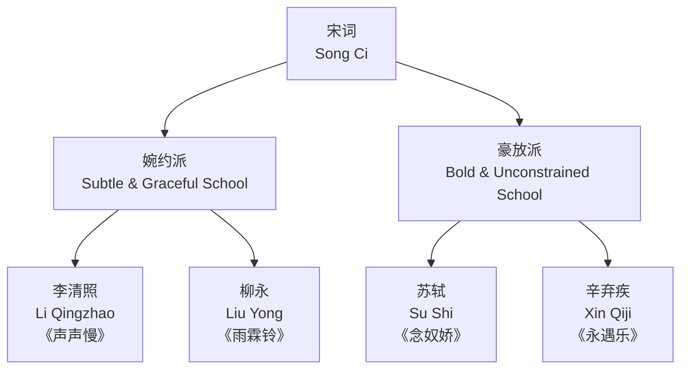

---
aliases:
  - 古代诗文鉴赏
  - Classical Poetry and Prose
  - 古诗鉴赏
  - 文言文阅读
tags:
  - ChineseLiterature
  - ClassicalPoetry
  - TangSongLiterature
  - LiteraryAnalysis
created: 2025-05-17
---

# 古代诗文鉴赏 (Classical Poetry and Prose Appreciation)

## 概述

古代诗文鉴赏是中国语文教育的核心内容之一，涵盖诗歌（Poetry）、词（Ci Poetry）和散文（Classical Prose）三大文体。鉴赏旨在理解作品的思想情感、艺术手法和语言魅力，培养审美能力（Aesthetic Ability）和文化素养（Cultural Literacy）。

## 文体演变脉络

```mermaid
graph LR
    subgraph 诗歌演变<br/>Poetry Evolution
        Shijing["诗经<br/>Shijing"] --> Chuci["楚辞<br/>Chu Ci"]
        Chuci --> HanFu["汉赋<br/>Han Fu"]
        HanFu --> TangShi["唐诗<br/>Tang Poetry"]
        TangShi --> SongCi["宋词<br/>Song Ci"]
        SongCi --> YuanQu["元曲<br/>Yuan Qu"]
    end
    subgraph 散文演变<br/>Prose Evolution
        XianQin["先秦散文<br/>Pre-Qin Prose"] --> HanWen["汉文<br/>Han Prose"]
        HanWen --> TangSong["唐宋八大家<br/>Tang-Song Eight Masters"]
    end
```

## 核心概念表

| 概念 | 英文 | 说明 | 示例 |
|------|------|------|------|
| 意象 | Imagery | 融入了情感的物象 | 明月、杨柳 |
| 意境 | Artistic Conception | 意象组合形成的境界 | 空灵、雄浑 |
| 格律 | Prosody | 平仄、押韵规则 | 仄仄平平仄仄平 |
| 对仗 | Antithesis | 词性结构对应 | "两个黄鹂鸣翠柳" |
| 用典 | Allusion | 引用典故 | "廉颇老矣" |
| 赋比兴 | Exposition/Metaphor/Arousal | 诗经手法 | 关关雎鸠（兴） |

## 诗歌鉴赏

### 唐诗流派

唐诗（Tang Poetry）按风格和题材分为四大流派：

| 流派 | 代表诗人 | 风格特点 | 代表作 |
|------|---------|---------|--------|
| 浪漫主义 | 李白 (Li Bai) | 豪放飘逸、想象瑰丽 | 《将进酒》《蜀道难》 |
| 现实主义 | 杜甫 (Du Fu) | 沉郁顿挫、关注民生 | 《春望》《茅屋为秋风所破歌》 |
| 山水田园 | 王维 (Wang Wei) | 诗中有画、意境空灵 | 《山居秋暝》《鸟鸣涧》 |
| 边塞诗派 | 岑参 (Cen Shen) | 雄浑壮阔、慷慨悲壮 | 《白雪歌送武判官归京》 |

### 格律分析

七言绝句（Seven-Character Quatrain）的平仄格式分为平起和仄起两种。平起首句入韵式的平仄规律：

$$
\begin{aligned}
&\text{平平仄仄仄平平（韵）} \\
&\text{仄仄平平仄仄平（韵）} \\
&\text{仄仄平平平仄仄} \\
&\text{平平仄仄仄平平（韵）}
\end{aligned}
$$

**押韵规则（Rhyming Rules）**：
- 偶句押韵（偶数句末字押韵）
- 一韵到底（全诗用同一韵部）
- 首句可押可不押（七律首句多入韵）

### 五言律诗格律

五言律诗（Five-Character Regulated Verse）每句五字，共八句。仄起首句不入韵式：

$$
\begin{aligned}
&\text{仄仄平平仄} \\
&\text{平平仄仄平（韵）} \\
&\text{平平平仄仄} \\
&\text{仄仄仄平平（韵）} \\
&\text{仄仄平平仄} \\
&\text{平平仄仄平（韵）} \\
&\text{平平平仄仄} \\
&\text{仄仄仄平平（韵）}
\end{aligned}
$$

### 诗歌鉴赏步骤

1. **诵读感知** (Perceptive Reading)：通过朗读感受音韵美和节奏
2. **理解内容** (Content Understanding)：把握字面意思和基本情节
3. **分析意象** (Imagery Analysis)：识别关键意象及其象征意义
4. **体会情感** (Emotional Appreciation)：结合作者生平和时代背景理解情感
5. **鉴赏手法** (Artistic Techniques)：分析修辞、结构和用典

## 宋词鉴赏

### 词牌与结构

词（Ci Poetry）是配合音乐歌唱的诗歌形式，有固定的词牌（Ci Pattern）和格律要求：

| 词牌 | 别名 | 字数 | 句式特点 | 代表作品 |
|------|------|------|---------|---------|
| 水调歌头 | 元会曲 | 双调95字 | 长调，上下阕各九句 | 苏轼《明月几时有》 |
| 念奴娇 | 百字令 | 双调100字 | 气势磅礴 | 苏轼《赤壁怀古》 |
| 浣溪沙 | 小庭花 | 双调42字 | 小令，七言六句 | 晏殊《一曲新词》 |
| 蝶恋花 | 鹊踏枝 | 双调60字 | 婉约缠绵 | 柳永《伫倚危楼》 |
| 江城子 | 江神子 | 双调70字 | 刚柔并济 | 苏轼《密州出猎》 |

### 婉约与豪放



### 意象系统

宋词中常见的意象及象征意义：

| 意象 | 象征意义 | 相关词句 |
|------|---------|---------|
| 明月 | 思乡怀人、永恒 | "但愿人长久，千里共婵娟" |
| 杨柳 | 离别、挽留 | "今宵酒醒何处？杨柳岸，晓风残月" |
| 落花 | 春逝、人生无常 | "无可奈何花落去" |
| 梧桐 | 孤独、凄凉 | "梧桐更兼细雨，到黄昏、点点滴滴" |
| 江水 | 时光流逝 | "大江东去，浪淘尽" |
| 鸿雁 | 书信、思乡 | "雁字回时，月满西楼" |

## 文言散文

### 唐宋八大家

唐代：韩愈 (Han Yu, 768–824)、柳宗元 (Liu Zongyuan, 773–819)

宋代：欧阳修 (Ouyang Xiu, 1007–1072)、苏洵 (Su Xun, 1009–1066)、苏轼 (Su Shi, 1037–1101)、苏辙 (Su Zhe, 1039–1112)、王安石 (Wang Anshi, 1021–1086)、曾巩 (Zeng Gong, 1019–1083)

### 代表性名篇

| 篇名 | 作者 | 文体 | 核心思想 | 名句 |
|------|------|------|---------|------|
| 师说 | 韩愈 | 论说文 | 尊师重道、学无常师 | "师者，所以传道受业解惑也" |
| 陋室铭 | 刘禹锡 | 铭文 | 安贫乐道、品德高尚 | "斯是陋室，惟吾德馨" |
| 岳阳楼记 | 范仲淹 | 记 | 先忧后乐、家国情怀 | "先天下之忧而忧" |
| 醉翁亭记 | 欧阳修 | 记 | 与民同乐、寄情山水 | "醉翁之意不在酒" |
| 赤壁赋 | 苏轼 | 赋 | 豁达超脱、变与不变 | "逝者如斯，而未尝往也" |
| 阿房宫赋 | 杜牧 | 赋 | 戒奢以俭、借古讽今 | "秦人不暇自哀" |

### 文言虚词

常见文言虚词的功能：

$$ \text{之} \begin{cases} \text{结构助词：的} & \text{"赤壁之游乐乎"} \\ \text{代词：他/它} & \text{"学而时习之"} \\ \text{取消独立性} & \text{"大道之行也"} \end{cases} $$

$$ \text{而} \begin{cases} \text{顺承：就/然后} & \text{"学而时习之"} \\ \text{转折：却/但是} & \text{"人不知而不愠"} \\ \text{修饰：地} & \text{"默而识之"} \end{cases} $$

## 修辞手法

| 手法 | 英文 | 定义 | 例句 |
|------|------|------|------|
| 比喻 | Metaphor | 以此物比彼物 | "问君能有几多愁？恰似一江春水向东流" |
| 拟人 | Personification | 赋予物以人的特征 | "感时花溅泪，恨别鸟惊心" |
| 对仗 | Antithesis | 结构对称的句子 | "两个黄鹂鸣翠柳，一行白鹭上青天" |
| 用典 | Allusion | 引用历史典故 | "廉颇老矣，尚能饭否" |
| 借景抒情 | Lyricism through Scenery | 通过景物抒发情感 | "月落乌啼霜满天" |
| 互文 | Intertextuality | 前后文义互相补充 | "秦时明月汉时关" |
| 通感 | Synesthesia | 感官互通 | "红杏枝头春意闹" |

## 经典选篇与鉴赏方法

### 唐诗精选赏析

**李白《静夜思》**：
"床前明月光，疑是地上霜。举头望明月，低头思故乡。"

鉴赏要点：以月光为触发点，通过"举头—低头"的动作对比，自然引出思乡之情。语言极简而意境深远，体现了李白诗歌"清水出芙蓉"的风格。

**杜甫《春望》**：
"国破山河在，城春草木深。感时花溅泪，恨别鸟惊心。"

鉴赏要点：以"山河在"反衬"国破"，通过花鸟的拟人化表达忧伤。对仗工整，"感时"与"恨别"双重情感叠加。

### 散文鉴赏要领

- **知人论世** (Understanding Author and Era)：了解作者生平和时代背景
- **披文入情** (Reading into Emotion)：通过语言文字体会思想感情
- **涵泳品味** (Contemplative Reading)：反复朗读，体会语言韵味
- **比较阅读** (Comparative Reading)：将同类作品对比分析

## 诗歌鉴赏进阶方法

### 比较鉴赏

比较鉴赏（Comparative Appreciation）是将两首或多首作品对照分析，发现异同和规律：

$$ \text{比较维度} = \{题材, 主题, 意象, 手法, 风格, 情感\} $$

**示例：李白《望庐山瀑布》vs 苏轼《题西林壁》**

| 比较项 | 李白《望庐山瀑布》 | 苏轼《题西林壁》 |
|--------|-----------------|----------------|
| 视角 | 仰视——"日照香炉生紫烟" | 横看侧看——"横看成岭侧成峰" |
| 主要手法 | 夸张比喻——"飞流直下三千尺" | 哲理思辨——"不识庐山真面目" |
| 主题 | 赞美自然之壮美 | 揭示认知之局限 |
| 风格 | 浪漫飘逸 | 理性蕴藉 |

### 常见题型应答

中考古代诗文鉴赏常见题型（Question Types）及答案要点：

**赏析题**：这句话运用了什么手法？表达了什么情感？

$$ \text{答题模板} = \text{手法} + \text{内容概括} + \text{情感表达} + \text{表达效果} $$

**炼字题**：某个字为什么用得好？

$$ \text{答题要点} = \text{字义（本义+语境义）} + \text{手法} + \text{意境} + \text{情感} $$

**意境题**：这首诗营造了怎样的意境？

$$ \text{意境概括} = \text{景物特点} + \text{画面描述} + \text{情感基调} $$

常见的意境类型：雄浑壮阔、清幽明净、凄清冷寂、恬淡闲适、萧瑟凄凉、繁华热闹。

### 名句背诵与默写策略

中考要求背诵的必考古诗文篇目约50篇。高效记忆方法包括：
- **意象联想法**：将诗句与画面关联
- **关键词记忆法**：每句提取1-2个关键词
- **对仗对比记忆**：利用对仗结构的对称性
- **情景模拟法**：想象诗中的场景和情感

## 相关条目

- [[文言文语法]]
- [[唐诗三百首]]
- [[中国古代文学史]]
