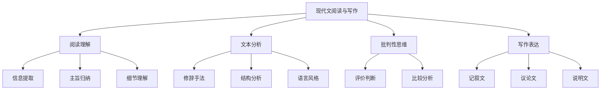

---
aliases:
  - 现代文阅读
  - 语文写作
  - 阅读理解
  - 作文技巧
tags:
  - K12
  - 初中语文
  - 阅读理解
  - 写作
  - 文学分析
---

# 现代文阅读与写作 (Modern Chinese Reading and Writing)

## 概述

现代文阅读与写作是初中语文教育的核心组成部分，涵盖**阅读理解 (Reading Comprehension)**、**文本分析 (Text Analysis)**、**批判性思维 (Critical Thinking)** 和**议论文写作 (Argumentative Writing)** 四大能力维度。

## 一、阅读理解 (Reading Comprehension)

### 1.1 阅读层次

根据布鲁姆认知分类 (Bloom's Taxonomy)，阅读可分为以下层次：

| 层次 | 能力要求 | 典型题型 |
|------|---------|---------|
| 识记 (Remember) | 提取文中直接信息 | "作者提到了哪几点？" |
| 理解 (Understand) | 解释文中的信息 | "这句话是什么意思？" |
| 应用 (Apply) | 将知识与新情境结合 | "用文中的方法分析另一段文字" |
| 分析 (Analyze) | 拆解文本的结构与逻辑 | "论证过程是否合理？" |
| 评价 (Evaluate) | 做出价值判断 | "你同意作者的观点吗？" |
| 创造 (Create) | 基于阅读生成新内容 | "续写或仿写一段文字" |

### 1.2 阅读策略

| 策略 | 方法 | 目标 |
|------|------|------|
| 速读 (Skimming) | 迅速浏览获取大意 | 把握文章主旨 |
| 扫读 (Scanning) | 寻找特定信息 | 定位关键细节 |
| 精读 (Close Reading) | 逐句分析语言与逻辑 | 深入理解文本 |
| 批注 (Annotation) | 边读边标记重点 | 主动阅读 |

### 1.3 不同类型文本的阅读

- **记叙文 (Narrative)** — 关注人物、事件、时间线
- **说明文 (Expository)** — 关注逻辑结构、说明方法
- **议论文 (Argumentative)** — 关注论点、论据、论证过程
- **散文 (Essay)** — 关注情感、意境、语言美

## 二、文本分析 (Text Analysis)

### 2.1 修辞手法 (Rhetorical Devices)

| 修辞手法 | 定义 | 效果 | 示例 |
|---------|------|------|------|
| 比喻 (Metaphor) | 以此物喻彼物 | 形象生动 | "时间如流水" |
| 拟人 (Personification) | 赋予事物人的特征 | 生动有趣 | "春风吻上了我的脸" |
| 排比 (Parallelism) | 结构相似的并列句 | 增强气势 | "读书好，读好书，好读书" |
| 反问 (Rhetorical Question) | 无疑而问 | 强化语气 | "难道不是吗？" |
| 夸张 (Hyperbole) | 言过其实 | 突出特征 | "白发三千丈" |
| 对偶 (Antithesis) | 对称结构 | 节奏优美 | "横眉冷对千夫指，俯首甘为孺子牛" |

### 2.2 文章结构分析

- **总分总结构** — 首段引出、中间展开、末段总结
- **递进结构** — 由浅入深、层层深入
- **并列结构** — 各段落平行展开、独立论证
- **对比结构** — 正反对比、增强说服力

### 2.3 语言风格 (Language Style)

| 风格类型 | 特点 | 适用文体 |
|---------|------|---------|
| 简洁 (Concise) | 信息密度高 | 说明文 |
| 华丽 (Ornate) | 辞藻丰富 | 散文 |
| 朴实 (Plain) | 生活化语言 | 记叙文 |
| 严谨 (Formal) | 逻辑严密 | 议论文 |
| 幽默 (Humorous) | 轻松风趣 | 杂文 |

## 三、写作技巧 (Writing Skills)

### 3.1 写作基本框架

1. **审题 (Analyze the Prompt)** — 明确写作要求与方向
2. **立意 (Determine the Theme)** — 确立文章的中心思想
3. **选材 (Select Materials)** — 收集与筛选素材
4. **结构 (Organize Structure)** — 安排段落与层次
5. **表达 (Express)** — 运用恰当语言与修辞
6. **修改 (Revise)** — 检查与完善文章

### 3.2 记叙文写作

| 要素 | 说明 |
|------|------|
| 六要素 | 时间、地点、人物、起因、经过、结果 |
| 人称选择 | 第一人称 (真实性) / 第三人称 (全知视角) |
| 叙事顺序 | 顺叙 (流畅)、倒叙 (悬念)、插叙 (补充) |
| 描写手法 | 外貌、动作、语言、心理、环境 |

### 3.3 议论文写作

**议论文三要素**：

| 要素 | 定义 | 写作要点 |
|------|------|---------|
| 论点 (Thesis) | 作者的观点和主张 | 明确、新颖、有深度 |
| 论据 (Evidence) | 支撑论点的材料 | 真实、典型、充分 |
| 论证 (Reasoning) | 连接论点和论据的逻辑 | 严密、有条理 |

### 3.4 说明文写作

- **说明方法**：举例子、列数字、作比较、打比方、分类别、下定义
- **说明顺序**：时间顺序、空间顺序、逻辑顺序

## 四、常见考场技巧

### 4.1 阅读答题要点

- **先读题再读文** — 带着问题阅读，提高效率
- **从原文中找答案** — 答案大多在文中，避免主观臆断
- **分点作答** — 使用 (1)(2)(3) 使答案清晰
- **注意关键词** — "但是""因此""然而"等提示逻辑关系

### 4.2 写作提分技巧

- **开头要抓人** — 设问式、引用式、场景式
- **内容要充实** — 具体事例/细节比空话更有说服力
- **结构要清晰** — 每段一个中心，段段有衔接
- **结尾要有力** — 总结升华，留有余味

### 4.3 常见误区

| 误区 | 表现 | 改进方法 |
|------|------|---------|
| 审题不清 | 偏题、跑题 | 圈画关键要求 |
| 结构混乱 | 层次不清、东拼西凑 | 先列提纲 |
| 语言空洞 | 套话连篇、缺乏真情实感 | 写出个人感受 |
| 忽视修改 | 错别字、语病多 | 留出修改时间 |

---
*阅读是吸收，写作是输出。持续的阅读积累与反复的写作练习，是语文能力提升的双翼。*
