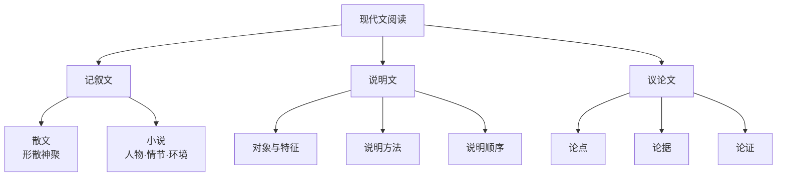

---
aliases: [现代文阅读基础]
tags: ['JuniorHigh', 'Chinese', '现代文阅读基础', 'ReadingComprehension']
---

# 现代文阅读基础

## 中考现代文阅读概述

中考现代文阅读分三类：**记叙文**（含散文、小说）、**说明文**、**议论文**。分值约占总分 25%-30%。

### 文体分类框架



## 第一部分：记叙文阅读

### 一、文体特征

| 类型 | 特点 |
|------|------|
| **散文** | 形散神聚、语言优美、情感真挚 |
| **小说** | 人物、情节、环境三要素 |
| **叙事散文** | 以叙述事件为主，有完整的故事情节 |

### 二、常见题型与答题技巧

#### 1. 概括文章内容

**答题公式**：谁 + 在什么情况下 + 做了什么 + 结果如何

**示例**：文章记叙了作者在秋天回故乡探望母亲，看到故乡变化后引发的感概。

#### 2. 分析人物形象

**答题公式**：从……（事件/描写）中，可以看出……（性格特征）的人物形象

**常用词汇**：勤劳善良、朴实憨厚、坚强勇敢、乐观向上、关心他人、无私奉献

#### 3. 赏析句子

**答题公式**：修辞手法/描写方法 + 生动形象地写出了…… + 表达了……的情感

**常见修辞手法**

| 手法 | 作用关键词 |
|------|-----------|
| 比喻 | 生动形象、化抽象为具体 |
| 拟人 | 赋予人格化、亲切自然 |
| 排比 | 增强语势、强调感情 |
| 夸张 | 突出特征、增强感染力 |
| 对偶 | 句式整齐、节奏感强 |
| 反问 | 加强语气、引发思考 |

**示例**：

```
句子：春天像刚落地的娃娃，从头到脚都是新的。
赏析：运用比喻的修辞手法，将春天比作刚落地的娃娃，生动形象地写出了春天的生机勃勃，表达了作者对春天的喜爱之情。
```

#### 4. 理解标题含义

- **表层含义**：字面意思
- **深层含义**：象征意义、主题意义
- **标题作用**：概括内容、点明主题、设置悬念、作为线索

#### 5. 分析段落作用

**开头段**：开篇点题、引出下文、设置悬念、奠定感情基调

**中间段**：承上启下、照应前文、推动情节发展

**结尾段**：总结全文、深化主题、照应开头、令人深思

### 三、记叙文答题技巧总结

1. **看标题**：了解文章主旨
2. **理思路**：概括段落大意
3. **抓关键**：找出中心句、过渡句
4. **扣主题**：围绕中心答题
5. **用术语**：使用标准答题语言

## 第二部分：说明文阅读

### 一、文体特征

以说明为主要表达方式，介绍事物的形状、构造、性质、功能等。

### 二、常见题型

#### 1. 说明对象及特征

**答题**：本文的说明对象是……，其特征是……

#### 2. 说明方法及作用

| 说明方法 | 标志 | 作用 |
|---------|--------|------|
| 举例子 | 例如、比如 | 具体形象地说明 |
| 列数字 | 数词、数据 | 准确科学地说明 |
| 作比较 | 比、相对于 | 突出强调特征 |
| 打比方 | 像、好像 | 生动形象地说明 |
| 分类别 | 分为几类 | 条理清晰地说明 |
| 下定义 | 是、叫作 | 科学准确地揭示本质 |

**答题公式**：运用了……的说明方法，……地说明了事物的……特征。

#### 3. 说明顺序

- **时间顺序**：按时间先后
- **空间顺序**：按空间方位
- **逻辑顺序**：由主到次、由表及里、由现象到本质

### 三、说明文语言特点

- **准确性**：科学严谨
- **严密性**：逻辑周密
- 注意限制性词语（"大约""可能""主要"）的作用

## 第三部分：议论文阅读

### 一、三要素

| 要素 | 定义 | 要求 |
|------|------|------|
| **论点** | 作者的观点和主张 | 正确鲜明、有针对件 |
| **论据** | 证明论点的材料 | 真实可靠、充分典型 |
| **论证** | 用论据证明论点的过程 | 逻辑严密、方法得当 |

### 二、常见题型

#### 1. 找中心论点

- 看题目（有的题目就是论点）
- 看开头（首段末句）
- 看结尾（总结段）
- 看文中反复出现的句子

#### 2. 论证方法及作用

| 论证方法 | 作用 |
|---------|------|
| 举例论证 | 具体有力、增强说服力 |
| 道理论证 | 权威充分、增强说服力 |
| 对比论证 | 突出鲜明、加深印象 |
| 比喻论证 | 生动形象、通俗易懂 |

**答题公式**：运用了……论证方法，论证了……（论点），使论证更……

#### 3. 分析论证思路

- **答题**：首先提出……论点，然后运用……论据进行论证，最后得出……结论
- 关注关联词：首先、其次、再次、最后

#### 4. 议论文语言特点

- 严密性（逻辑严密）
- 鲜明性（立场鲜明）
- 概括性（语言凝练）

## 第四部分：综合阅读策略

### 一、不同文体的阅读侧重点

| 文体 | 阅读重点 | 常见考点 |
|------|----------|----------|
| 记叙文 | 人物、情节、情感 | 概括、赏析、人物分析 |
| 说明文 | 对象、特征、方法 | 说明方法、语言特点 |
| 议论文 | 论点、论据、论证 | 中心论点、论证方法 |
| 散文 | 意境、语言、情感 | 语句赏析、主旨把握 |
| 小说 | 人物、环境、主题 | 人物形象、环境作用 |

### 二、阅读答题规范

1. **审题规范**：看清题目要求，明确答题方向
2. **答题规范**：分点作答，条理清晰
3. **语言规范**：使用专业术语，表达准确完整
4. **书写规范**：字迹工整，卷面整洁

### 三、答题注意事项

- **不要空题**：即使不确定也要尝试作答
- **联系上下文**：答案往往在原文中
- **注意分值**：分值高的题目要多答几点
- **看清要求**：是"概括"还是"赏析"，是"分析"还是"简述"
- **检查答案**：确认答案完整，没有遗漏

## 第五部分：常见阅读题型精讲

### 一、句子含义理解

**答题思路**：
1. 理解句子的字面意思
2. 结合上下文理解深层含义
3. 分析句子使用的修辞手法或表现手法
4. 体会句子表达的思想感情

**示例**：
"父亲是一头沉默的牛，默默地耕耘着我们这个家。"
- 字面意思：父亲像牛一样勤劳
- 修辞手法：比喻
- 深层含义：父亲任劳任怨，为家庭付出
- 表达情感：对父亲的感激和敬佩

### 二、段落作用分析

**开头段的作用**：

| 作用类型 | 具体说明 |
|----------|----------|
| 内容上 | 开篇点题，奠定感情基调 |
| 结构上 | 总领全文，引出下文 |
| 效果上 | 设置悬念，吸引读者 |

**中间段的作用**：

| 作用类型 | 具体说明 |
|----------|----------|
| 内容上 | 补充情节，深化主题 |
| 结构上 | 承上启下，前后照应 |
| 效果上 | 推动情节发展，丰富人物形象 |

**结尾段的作用**：

| 作用类型 | 具体说明 |
|----------|----------|
| 内容上 | 点明主旨，升华主题 |
| 结构上 | 总结全文，照应开头 |
| 效果上 | 令人深思，余味无穷 |

### 三、文章主旨概括

**答题方法**：
1. 通过分析标题理解主旨
2. 找出文中的中心句、关键词
3. 分析主要人物和事件
4. 结合写作背景理解

**答题公式**：
通过记叙/描写……（内容），表达了/抒发了……（情感/观点），揭示了/说明了……（主旨）。

**示例**：
《背影》通过记叙父亲在火车站为儿子买橘子的情景，表达了父亲对儿子深沉的爱，以及儿子对父亲的感激和思念之情。

## 第六部分：实战练习

### 记叙文阅读练习

阅读下面的短文，回答问题：

**那个夏天**

那年夏天，我跟着父亲去田里干活。太阳火辣辣地照着，田里的水稻已经被晒得低下了头。父亲弯着腰，一下一下地挥着镰刀，汗水顺着他的脸颊流下来，掉在地上，瞬间就被蒸发了干。

我跟在父亲身后，想把割下的水稻捆起来。可是太阳实在太毒了，我的头开始发晕。我直起腰，对父亲说："爸，太热了，我们回去吧。"

父亲头也不回地说："再坚持一会儿，割完这一垄就好。"

太阳越来越毒，我觉得自己的皮肤快要被烤焦了。我再次对父亲说："爸，我真的受不了了。"

父亲停下手里的活儿，转过身看着我。他的脸被晒得通红，衣服已经完全湿透了。他沉默了一会儿，说："孩子，这地里的活儿确实苦。你不想以后也这样，就好好读书。"

那天，我第一次真正理解了父亲。

**问题**：
1. 请概括文章的主要内容
2. 文中画线句子运用了什么描写方法？有什么作用？
3. 文章最后说"我第一次真正理解了父亲"，请你说说"我"理解了什么。

### 说明文阅读练习

**蜜蜂的舞蹈语言**

蜜蜂是高度社会化的昆虫，它们用一种特殊的"舞蹈语言"来传递信息。当一只工蜂发现了蜜源，它会飞回蜂巢，通过舞蹈告诉同伴蜜源的位置和距离。

如果蜜源距离蜂巢较近（50-100米以内），蜜蜂会跳"圆舞"：它在蜂巢上快速画着小圆圈，一会儿向左，一会儿向右。其他蜜蜂通过观察舞蹈就可以知道附近有食物。

如果蜜源距离较远，蜜蜂会跳"8字舞"：它先走一条直线，然后向左转一个圈，再走一条直线，然后向右转一个圈。舞蹈中直线的方向指示了蜜源相对于太阳的位置，而摆尾的频率则指示了距离。

**问题**：
1. 本文的说明对象是什么？
2. 文章主要使用了哪些说明方法？请举例说明。
3. 蜜蜂的两种舞蹈分别传递什么信息？

### 议论文阅读练习

**谈坚持**

坚持是一种可贵的品质。古今中外，凡有成就者，无不是坚持不懈的结果。

司马迁遭受宫刑后，没有放弃，而是坚持创作，历时十三年完成了《史记》。爱迪生在发明电灯的过程中，尝试了上千种材料，最终找到了适合做灯丝的钨丝。袁隆平数十年如一日研究杂交水稻，只为了让中国人端稳自己的饭碗。

坚持不是盲目的固执，而是对目标的坚守。在坚持的过程中，我们需要不断总结经验，调整方法，才能最终到达成功的彼岸。

**问题**：
1. 本文的中心论点是什么？
2. 文章使用了哪些论证方法？
3. 请结合自己的经历，谈谈你对"坚持"的理解。

## 相关条目

[[03_HumanitiesAndSocialSciences/ChineseLanguageAndLiterature/ClassicalChinese/ClassicalChinese|ClassicalChinese]], [[01_K12/SeniorHigh/English/ReadingComprehension|ReadingComprehension]], [[01_K12/SeniorHigh/English/Writing|Writing]], AncientPoems

