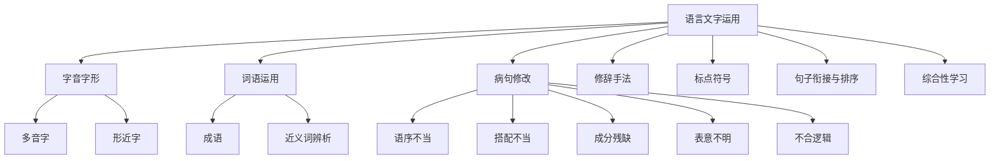

# 语言文字运用

## 中考语言文字运用概述

语言文字运用是中考语文的重要基础，涵盖字音字形、词语运用、病句修改、修辞手法、标点符号、句子衔接与排序、综合性学习等。

### 知识体系



---

## 第一部分：字音与字形

### 一、易错字音分类

**多音字**

| 字 | 不同读音 | 示例 |
|-----|---------|------|
| 薄 | báo/bó/bò | 薄(báo)饼 / 薄(bó)弱 / 薄(bò)荷 |
| 省 | shěng/xǐng | 节省(shěng) / 省(xǐng)亲 |
| 强 | qiáng/qiǎng/jiàng | 强(qiáng)大 / 勉强(qiǎng) / 倔强(jiàng) |
| 称 | chēng/chèn | 称(chēng)呼 / 称(chèn)职 |
| 差 | chā/chà/chāi/cī | 差(chā)别 / 差(chà)劲 / 出差(chāi) / 参差(cī) |
| 涨 | zhǎng/zhàng | 涨(zhǎng)价 / 涨(zhàng)红 |
| 落 | luò/lào/là | 落(luò)后 / 落(lào)枕 / 丢三落(là)四 |

**易读错的字**

| 字 | 正确读音 | 错误读音 |
|-----|---------|---------|
| 哺 | bǔ | pǔ |
| 畸 | jī | qí |
| 酵 | jiào | xiào |
| 矫 | jiǎo | yáo |
| 酗 | xù | xiōng |
| 绽 | zhàn | dìng |
| 炽 | chì | zhì |
| 糙 | cāo | zào |

### 二、易写错的字

**形近字**

| 字 | 组词 |
|----|------|
| 燥/躁/噪 | 干燥/急躁/噪音 |
| 辨/辩/辫 | 辨别/辩论/辫子 |
| 暮/幕/墓/慕 | 暮色/幕布/坟墓/羡慕 |
| 即/既 | 即使/既然 |
| 戍/戌/戊 | 卫戍/戊戌/戊戌变法 |
| 哀/衰/衷 | 悲哀/衰败/衷心 |
| 徒/徙 | 徒步/迁徙 |

---

## 第二部分：词语运用

### 一、成语运用

**常考成语**

| 成语 | 含义 | 使用注意 |
|------|------|---------|
| 首当其冲 | 最先受到攻击或遭遇灾难 | 不用作"首先" |
| 望其项背 | 能够赶得上 | 多用于否定句 |
| 不刊之论 | 不可磨灭的言论 | 刊是修改，不是刊刻 |
| 万人空巷 | 形容轰动一时的盛况 | 不表示冷清 |
| 差强人意 | 大体上还能让人满意 | 不是让人不满意 |
| 美轮美奂 | 形容房屋高大华丽 | 只用于建筑 |
| 炙手可热 | 气焰很盛，权势很大 | 贬义词 |

**常见成语错误类型**

- 望文生义：如"七月流火"（不是天热）
- 用错对象：如"举案齐眉"只用于夫妻
- 褒贬不当：如"趋之若鹜"是贬义词
- 语义重复：如"忍俊不禁地笑了"
- 不合语境：如时间状语与成语矛盾

### 二、近义词辨析

| 词语 | 区别 |
|------|------|
| 必须/必需 | 必须（副词，一定要）/ 必需（动词，不可缺少） |
| 截止/截至 | 截止（结束）/ 截至（到某个时候） |
| 只要/只有 | 只要（充分条件）/ 只有（必要条件） |
| 从而/进而 | 从而（因果关系）/ 进而（递进关系） |
| 暴发/爆发 | 暴发（突然发生，多用于洪水山洪）/ 爆发（突然发作，多用于火山、战争） |
| 考察/考查 | 考察（实地观察调查）/ 考查（考试检查） |
| 制定/制订 | 制定（定出法律法规等，强调结果）/ 制订（创制拟定，强调过程） |

---

## 第三部分：病句修改

### 常见病句类型

#### 1. 语序不当

```
错误：我们要认真改正并找出作业中的错误。
正确：我们要找出并认真改正作业中的错误。
```

#### 2. 搭配不当

```
错误：秋天的北京是一个美丽的季节。
正确：北京的秋天是一个美丽的季节。
```

#### 3. 成分残缺

```
错误：通过这次活动，使我们增长了见识。
正确：这次活动使我们增长了见识。（去掉"通过"）
```

#### 4. 句式杂糅

```
错误：他的写作水平有了明显的提高和进步。
正确：他的写作水平有了明显的提高。
```

#### 5. 表意不明

```
错误：三个学校的老师参加了会议。
正确：三所学校的老师参加了会议。（或：学校的三位老师参加了会议。）
```

#### 6. 不合逻辑

```
错误：他是众多死难者中幸免的一个。
正确：他是众多遇难者中幸免的一个。
```

#### 7. 否定不当

```
错误：为了防止不再发生类似事故，我们采取了措施。
正确：为了防止再发生类似事故，我们采取了措施。
```

### 病句判断口诀

- 看到"通过""使"，警惕缺主语
- 看到"是否""能否"，注意前后要一致
- 看到"和""与"，检查搭配是否出问题
- 看到否定词，小心多重否定
- 看到"避免""防止"，注意是否冗余
- 看到数量词，检查语序和搭配

---

## 第四部分：修辞手法

| 修辞 | 定义 | 示例 |
|------|------|------|
| 比喻 | 用相似事物打比方 | 月亮像白玉盘 |
| 拟人 | 把物当人写 | 春天来了，花儿笑了 |
| 夸张 | 故意夸大或缩小 | 飞流直下三千尺 |
| 排比 | 三个以上结构相同的句子 | 爱心是风，卷来浓密的云；爱心是云，化作及时的雨…… |
| 对偶 | 结构相同、字数相等的两句 | 两个黄鹂鸣翠柳，一行白鹭上青天 |
| 反问 | 用疑问表确定 | 难道这不是真理吗 |
| 设问 | 自问自答 | 什么是路？就是从没路的地方踏出来的 |
| 借代 | 借相关事物代替 | 红领巾在做好事（借代少先队员） |
| 反复 | 重复强调 | 前进！前进！前进！ |
| 对比 | 对比突出特征 | 有的人活着，他已经死了；有的人死了，他还活着 |

---

## 第五部分：标点符号

| 标点 | 用法简述 | 常见错误 |
|------|---------|---------|
| 句号 。 | 陈述句末 | 该用不用 |
| 问号 ？ | 疑问句末 | "?"后不一定用 |
| 顿号 、 | 并列词语 | 并列谓语用逗号 |
| 逗号 ， | 句中停顿 | 长句必须加逗号 |
| 分号 ； | 并列分句 | 句中已用逗号时用 |
| 冒号 ： | 引出下文 | ":"后不一定用 |
| 引号 "" | 直接引语 | 引号内句末标点处理 |
| 书名号 《》 | 作品名 | 不能用于活动 |
| 破折号 —— | 解释说明 | 与括号区别使用 |
| 省略号 …… | 列举省略 | 不与"等"连用 |

---

## 第六部分：句子衔接与排序

### 排序技巧

1. **找首句**：总起句、引出话题的句子
2. **看关联词**：首先/其次、虽然/但是、不仅/而且
3. **看时间词**：以前/现在/将来、首先/然后/最后
4. **看代词**：这、那、它——前面必有指代内容
5. **看逻辑顺序**：由浅入深、由具体到抽象
6. **看对应关系**：前后照应、总分结构

### 衔接题技巧

**选填关联词**

- 递进关系：不但……而且……
- 转折关系：虽然……但是……
- 因果关系：因为……所以……
- 条件关系：只有……才……、只要……就……
- 并列关系：既……又……、一边……一边……
- 承接关系：首先……然后……接着……

---

## 第七部分：综合性学习

### 常见题型

#### 1. 口语交际

**答题要点**：
- 称呼得体（根据对象选择恰当称呼）
- 语气委婉（用"请""可以吗""能否"）
- 内容清楚（说清时间、地点、事情）
- 表达感谢

#### 2. 图文转换

- 看懂图表标题和项目
- 描述图表内容（数据变化）
- 分析图表反映的问题
- 得出结论或提出建议

#### 3. 仿写

- 分析例句的句式结构
- 保持修辞手法一致
- 内容相关、字数相近

#### 4. 对联

- 字数相等
- 词性相对
- 平仄相谐
- 内容相关
- 上联末字仄声，下联末字平声

#### 5. 活动设计

- 明确活动主题
- 设计活动形式（朗诵会、辩论赛、演讲）
- 制定活动步骤（准备→实施→总结）
- 撰写活动开场白或结束语

## 相关条目

[[ClassicalChinese]], [[ReadingComprehension]], [[Writing]], AncientPoems
