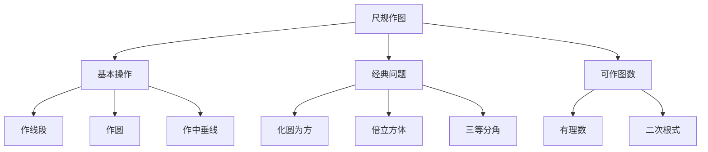
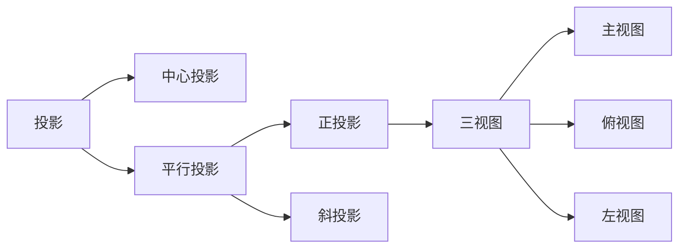
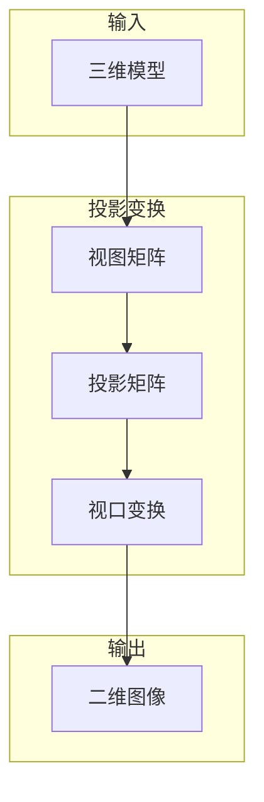

---
aliases:
  - 尺规作图
  - 投影
  - 三视图
  - Compass and Straightedge
  - Orthographic Projection
tags:
  - K12
  - JuniorHigh
  - Mathematics
  - Geometry
  - Construction
  - Projection
  - SpatialReasoning
---

# 尺规作图与投影

## 一、尺规作图基础

尺规作图（Compass and Straightedge Construction）是使用无刻度的直尺和圆规进行几何作图的经典方法。

### 基本作图操作

| 操作 | 描述 | 用途 |
|------|------|------|
| 作线段 | 连接两点作直线段 | 基本元素 |
| 作圆 | 以一点为圆心定长为半径作圆 | 确定等距 |
| 作中垂线 | 作线段的中垂线 | 找中点 |
| 作角平分线 | 平分已知角 | 等分角 |
| 作垂线 | 过点作直线的垂线 | 垂直关系 |
| 作平行线 | 过点作直线的平行线 | 平行关系 |

### 经典作图问题

古希腊三大几何难题（Three Classical Problems）：

1. **化圆为方（Squaring the Circle）**：求作一个正方形使其面积等于给定圆的面积
2. **倍立方体（Doubling the Cube）**：求作一个立方体使其体积等于给定立方体体积的两倍
3. **三等分角（Angle Trisection）**：将任意角三等分

---

## 二、正多边形作图

### 可作正多边形

高斯（Gauss）证明了正 n 边形可作图的充要条件：n 是 2 的幂与费马素数（Fermat Prime）的乘积。

$$ n = 2^k \cdot p_1 \cdot p_2 \cdots p_m $$

其中 $p_i$ 是形如 $F_j = 2^{2^j} + 1$ 的费马素数。

| n | 名称 | 可作图 | 说明 |
|---|------|--------|------|
| 3 | 正三角形 | √ | 基础作图 |
| 4 | 正方形 | √ | 基础作图 |
| 5 | 正五边形 | √ | 黄金比例 |
| 6 | 正六边形 | √ | 半径等于边长 |
| 7 | 正七边形 | ✗ | 不可作 |
| 8 | 正八边形 | √ | 2³ |
| 9 | 正九边形 | ✗ | 3² 非费马素数 |
| 17 | 正十七边形 | √ | 高斯发现 |

---

## 三、投影与三视图

投影（Projection）是将三维物体映射到二维平面上的方法。

### 投影分类

### 三视图（Three-View Drawing）

| 视图 | 方向 | 展示信息 |
|------|------|----------|
| 主视图（Front View） | 正面 | 高度与宽度 |
| 俯视图（Top View） | 上方 | 宽度与深度 |
| 左视图（Side View） | 左侧 | 高度与深度 |

**投影规律（Projection Rules）：**

- 主视图与俯视图：**长对正**（Length alignment）
- 主视图与左视图：**高平齐**（Height alignment）
- 俯视图与左视图：**宽相等**（Width equality）

---

## 四、空间几何体的投影

### 常见几何体的三视图

| 几何体 | 主视图 | 俯视图 | 左视图 |
|--------|--------|--------|--------|
| 立方体 | 正方形 | 正方形 | 正方形 |
| 圆柱 | 矩形 | 圆 | 矩形 |
| 圆锥 | 等腰三角形 | 圆（含圆心） | 等腰三角形 |
| 球体 | 圆 | 圆 | 圆 |
| 正三棱柱 | 矩形 | 正三角形 | 矩形 |

### 投影变换矩阵

平行投影到 $z=0$ 平面的变换矩阵：

$$ P = \begin{pmatrix} 1 & 0 & 0 & 0 \\ 0 & 1 & 0 & 0 \\ 0 & 0 & 0 & 0 \\ 0 & 0 & 0 & 1 \end{pmatrix} $$

透视投影（Perspective Projection）变换：

$$ P_{persp} = \begin{pmatrix} 1 & 0 & 0 & 0 \\ 0 & 1 & 0 & 0 \\ 0 & 0 & 0 & 0 \\ 0 & 0 & \frac{1}{d} & 1 \end{pmatrix} $$

---

## 五、视图推理与还原

由三视图还原几何体是培养空间想象能力（Spatial Visualization）的重要训练。

### 还原步骤

1. **分析轮廓**：确定每个视图的外围形状
2. **对应特征**：利用"长对正、高平齐、宽相等"找对应
3. **逐层构建**：从底面开始逐层叠加或切割
4. **验证检查**：检查还原后的几何体是否完全符合三视图

### 常见题型

| 题型 | 描述 | 解题策略 |
|------|------|----------|
| 补视图 | 已知两个视图补第三个 | 投影规律 |
| 还原立体 | 由三视图还原几何体 | 逐层构建法 |
| 计算体积 | 根据三视图求体积 | 先还原再计算 |
| 计算表面积 | 根据三视图求表面积 | 注意遮挡面 |

---

## 六、综合应用

### 尺规作图与投影在工程中的应用

- **建筑设计（Architectural Design）**：三视图是建筑施工图的基础
- **机械制图（Mechanical Drawing）**：零件图使用正投影法
- **计算机图形学（Computer Graphics）**：三维渲染使用投影矩阵

### 解题要点

1. 尺规作图的每一步都必须有明确的几何依据
2. 投影作图需注意可见与不可见部分的区分（实线/虚线）
3. 三视图还原时可使用"立方体切割法"辅助思考
4. 注意对称性（Symmetry）在作图和投影中的简化作用
