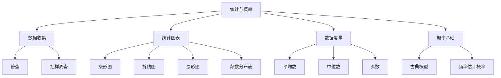
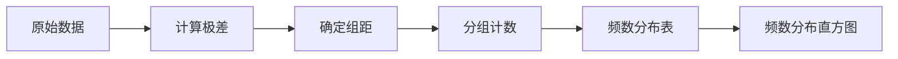
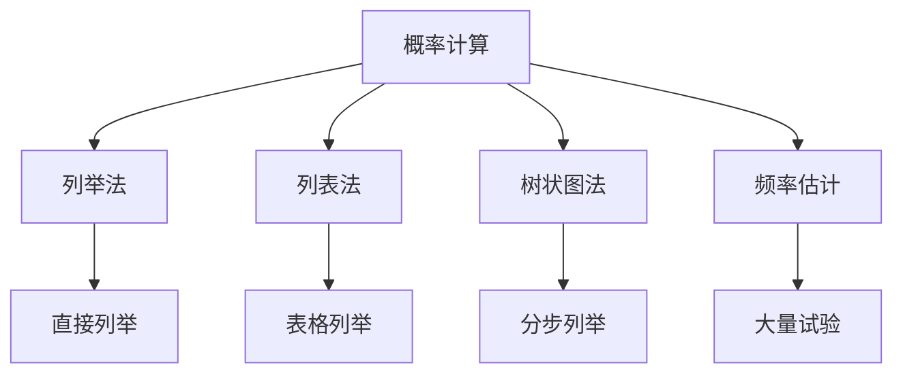
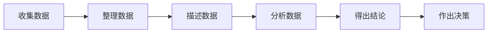

---
aliases:
  - 统计学
  - 概率论
  - 数据分析
  - 统计图表
tags:
  - K12
  - 初中数学
  - 统计
  - 概率
  - 数据
---

# 统计与概率 (Statistics and Probability)

## 概述 (Overview)

统计与概率是初中数学的重要模块，涵盖**数据收集 (Data Collection)**、**数据整理 (Data Organization)**、**统计图表 (Statistical Charts)**、**概率基础 (Probability Basics)** 和**抽样方法 (Sampling Methods)** 等核心内容。本模块强调培养学生的数据分析观念和随机意识。

---

## 一、数据收集与整理 (Data Collection and Organization)

### 1.1 数据收集方法

数据收集的两种基本方法：

| 方法 | 定义 | 优点 | 缺点 |
|------|------|------|------|
| 普查 (Census) | 对全体对象进行调查 | 结果准确， 全面可靠 | 工作量大， 成本高 |
| 抽样调查 (Sampling) | 抽取部分样本调查 | 省时省力， 效率高 | 存在抽样误差 |

### 1.2 总体与样本

- **总体 (Population)**：研究对象的全体
- **个体 (Individual)**：总体中的每一个对象
- **样本 (Sample)**：从总体中抽取的部分个体
- **样本容量 (Sample Size)**：样本中个体的数量

$$\text{样本容量} = n \quad (n \in \mathbb{Z}^+)$$

---

## 二、统计图表 (Statistical Charts)

### 2.1 常见统计图表类型

| 图表类型 | 适用场景 | 特点 |
|----------|----------|------|
| 条形统计图 (Bar Chart) | 比较不同类别数据 | 直观显示数量多少 |
| 折线统计图 (Line Chart) | 显示数据变化趋势 | 反映增减变化 |
| 扇形统计图 (Pie Chart) | 显示各部分占比 | 体现百分比关系 |
| 频数分布直方图 (Histogram) | 展示连续数据分布 | 显示频率分布 |

### 2.2 频数分布表与直方图

制作频数分布表的步骤：

1. **计算极差 (Range)**：最大值 - 最小值
2. **确定组距 (Class Width)** 和组数
3. **列频数分布表**
4. **绘制频数分布直方图**

### 2.3 统计图选择原则

选择统计图时需考虑：

- **比较数量** $\rightarrow$ 条形图
- **显示趋势** $\rightarrow$ 折线图
- **展示比例** $\rightarrow$ 扇形图
- **分布特征** $\rightarrow$ 直方图

---

## 三、数据度量 (Data Measures)

### 3.1 集中趋势度量

描述数据集中趋势的统计量：

| 统计量 | 定义 | 公式 | 特点 |
|--------|------|------|------|
| 平均数 (Mean) | 数据总和除以个数 | $$\bar{x} = \frac{1}{n}\sum_{i=1}^{n} x_i$$ | 受极端值影响 |
| 中位数 (Median) | 排序后中间位置的数 | 奇数取中间， 偶数取平均 | 不受极端值影响 |
| 众数 (Mode) | 出现次数最多的数 | - | 可能不止一个 |

### 3.2 离散程度度量

描述数据离散程度的基本概念：

- **极差 (Range)**：$R = x_{\max} - x_{\min}$
- **方差 (Variance)**：$s^2 = \frac{1}{n}\sum_{i=1}^{n}(x_i - \bar{x})^2$
- **标准差 (Standard Deviation)**：$s = \sqrt{s^2}$

方差和标准差越小，数据越稳定。

---

## 四、概率基础 (Probability Basics)

### 4.1 随机事件与概率

- **必然事件 (Certain Event)**：一定发生的事件，$P = 1$
- **不可能事件 (Impossible Event)**：一定不发生的事件，$P = 0$
- **随机事件 (Random Event)**：可能发生也可能不发生，$0 < P < 1$

### 4.2 概率计算方法

#### 4.2.1 古典概型 (Classical Probability)

$$P(A) = \frac{\text{事件}A\text{包含的基本事件数}}{\text{基本事件总数}}$$

适用条件：

- 基本事件有限
- 每个基本事件等可能发生

#### 4.2.2 频率估计概率

当试验次数 $n$ 很大时，事件 $A$ 发生的频率 $f_n(A)$ 趋近于其概率：

$$P(A) \approx f_n(A) = \frac{m}{n}$$

其中 $m$ 为事件 $A$ 发生的次数。

### 4.3 概率的基本性质

1. **非负性**：$P(A) \geq 0$
2. **规范性**：$P(\Omega) = 1$
3. **可加性**：若 $A$ 与 $B$ 互斥，则 $P(A \cup B) = P(A) + P(B)$

---

## 五、抽样方法 (Sampling Methods)

### 5.1 简单随机抽样

从总体中随机抽取样本，每个个体被抽到的概率相等。

### 5.2 抽样原则

- **代表性**：样本能反映总体特征
- **随机性**：每个个体有同等机会被抽取
- **广泛性**：样本容量要足够大

---

## 六、实际应用 (Practical Applications)

### 6.1 统计与日常生活的联系

统计与概率在现实生活中有广泛应用：

| 应用领域 | 具体示例 |
|----------|----------|
| 市场调查 | 产品满意度调查 |
| 质量检测 | 产品合格率估计 |
| 天气预报 | 降水概率预测 |
| 医学研究 | 药物有效性评估 |
| 体育比赛 | 胜率预测分析 |

### 6.2 数据分析的一般过程

### 6.3 易错点提醒

| 易错点 | 正确理解 |
|--------|----------|
| 概率大必然发生 | 概率大只说明可能性大， 不是必然发生 |
| 样本容量越大越好 | 需考虑成本和效率 |
| 频率等于概率 | 频率是估计值， 概率是理论值 |

---

## 参考文献 (References)

1. 义务教育数学课程标准（2022年版）
2. 初中数学统计与概率教学指南
3. 统计学基础教程
