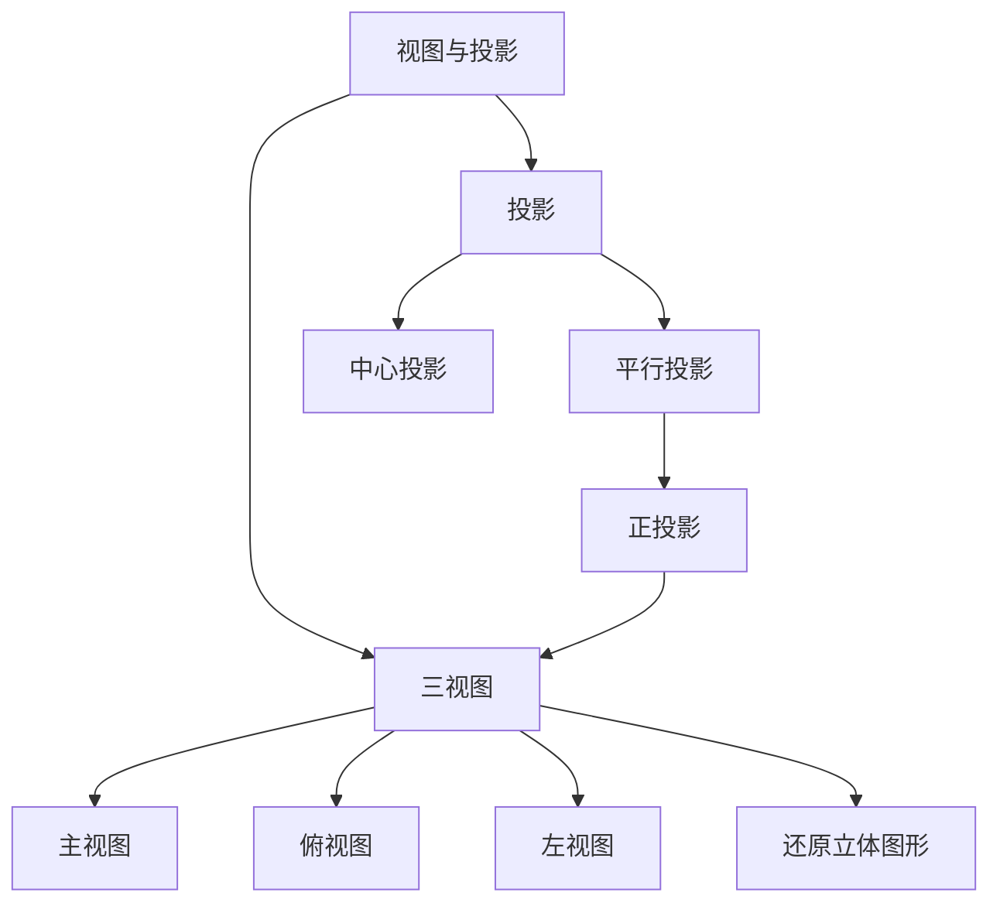
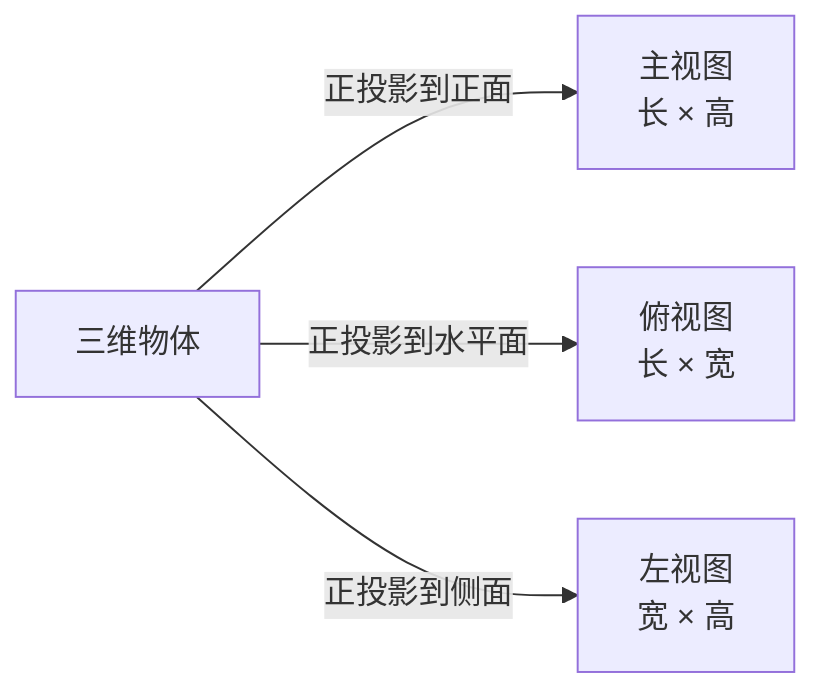

# 视图与投影

## 初中视图与投影概述

视图与投影是初中数学"图形与几何"领域的内容，培养空间想象能力。主要包括**三视图**和**投影**两部分。

### 知识结构



---

## 第一部分：投影

### 一、投影的概念

一般地，用光线照射物体，在某个平面（地面、墙壁等）上得到的影子叫做物体的**投影**，照射光线叫做**投影线**，投影所在的平面叫做**投影面**。

### 二、投影的分类

#### 1. 平行投影

- **平行光线**形成的投影
- 太阳光下的影子是典型的平行投影
- 特点：物体与投影面的相对位置不变时，投影的方向和大小与光照方向有关

**正投影**：
- 投影线**垂直于**投影面时的平行投影
- 三视图就是正投影

**性质**：
- 当线段平行于投影面时，投影等于线段本身长度
- 当线段倾斜于投影面时，投影小于线段本身长度
- 当线段垂直于投影面时，投影为一个点
- 当平面图形平行于投影面时，投影与原图形全等
- 当平面图形倾斜于投影面时，投影变小（相似但不全等）
- 当平面图形垂直于投影面时，投影为一条线段

#### 2. 中心投影

- **同一点**（点光源）发出的光线形成的投影
- 灯泡、蜡烛下的影子是中心投影
- 特点：物体距离光源越近，影子越大；距离光源越远，影子越小

**中心投影与平行投影的区别**：

| 特征 | 平行投影 | 中心投影 |
|------|---------|---------|
| 光源 | 太阳（平行光） | 灯泡/蜡烛（点光源） |
| 光线 | 互相平行 | 交于一点 |
| 影子大小 | 与物体大小比例固定 | 随距离变化 |
| 影子方向 | 统一方向 | 向四周放射 |

### 三、投影的应用

**日晷**：利用太阳投影的方向和长度变化计时

**影子长度计算**：

```
同一时刻，物高与影长成正比：物高₁/影长₁ = 物高₂/影长₂
```

**示例**：

```
同一时刻，身高1.6m的人影长0.8m，旁边树影长2.5m，求树高。
设树高为h m
1.6/0.8 = h/2.5
h = (1.6 × 2.5)/0.8 = 5m
树高5m
```

---

## 第二部分：三视图

### 一、三视图的概念

三视图是从**三个不同方向**观察同一个物体所看到的图形。

| 视图 | 方向 | 反映的信息 |
|------|------|-----------|
| **主视图**（正视图） | 从正面看 | 物体的长和高 |
| **俯视图** | 从上往下看 | 物体的长和宽 |
| **左视图**（侧视图） | 从左面看 | 物体的宽和高 |

### 二、三视图的画法

**位置关系**：

```
┌─────────┬─────────┐
│ 主视图  │ 左视图  │
├─────────┴─────────┤
│     俯视图        │
└───────────────────┘
```

- 主视图在左上，左视图在主视图右边，俯视图在主视图下方

**大小关系（长对正、高平齐、宽相等）**：

- **长对正**：主视图与俯视图的长度相等且上下对齐
- **高平齐**：主视图与左视图的高度相等且左右平齐
- **宽相等**：俯视图与左视图的宽度相等

**画图步骤**：
1. 确定主视图方向（一般选择最能反映物体形状特征的方向）
2. 画出主视图
3. 根据"长对正"画出俯视图
4. 根据"高平齐、宽相等"画出左视图
5. 检查各视图的对应关系

### 三、常见几何体的三视图

| 几何体 | 主视图 | 左视图 | 俯视图 |
|--------|--------|--------|--------|
| 正方体 | 正方形 | 正方形 | 正方形 |
| 圆柱 | 矩形 | 矩形 | 圆 |
| 圆锥 | 三角形 | 三角形 | 圆（含圆心） |
| 球 | 圆 | 圆 | 圆 |
| 正三棱柱 | 矩形 | 矩形 | 三角形 |
| 正四棱锥 | 三角形 | 三角形 | 正方形（含对角线） |
| 圆台 | 梯形 | 梯形 | 两个同心圆 |
| 长方体 | 矩形 | 矩形 | 矩形 |

**记忆口诀**：
- 三视图，位置定；主俯长对正，主左高平齐，俯左宽相等
- 看得见的轮廓画实线，看不见的轮廓画虚线

**三视图与投影的关系**：



### 四、由三视图还原几何体

**步骤**：
1. 根据三视图判断几何体的大致形状
2. 主视图反映物体的长和高，确定前方形状
3. 左视图反映物体的宽和高，确定左侧形状
4. 俯视图反映物体的长和宽，确定顶部形状
5. 综合考虑三个视图，确定几何体的完整形状

**示例**：

```
主视图是矩形，左视图是矩形，俯视图是圆，则这个几何体是圆柱。
```

**由三视图还原几何体的技巧**：
- 先看俯视图确定底面形状
- 结合主视图和左视图确定高度方向形状
- 注意虚线表示被遮挡的轮廓

### 五、组合体的三视图

对于由基本几何体组合而成的物体，画三视图时需要：
1. 将组合体分解为基本几何体
2. 画出每个基本几何体的三视图
3. 注意前后遮挡关系（被挡住的部分用虚线）

**示例**：

```
一个圆柱上面放一个球
主视图：矩形上面加半圆
左视图：矩形上面加半圆
俯视图：一个大圆（圆柱的俯视图）内含一个小圆（球的俯视图）
```

---

## 第三部分：表面展开图

### 常见几何体的展开图

| 几何体 | 展开图形 |
|--------|-----------|
| 正方体 | 6个正方形组成的多种展开图（11种） |
| 圆柱 | 2个圆 + 1个矩形 |
| 圆锥 | 1个圆 + 1个扇形 |
| 正三棱柱 | 2个三角形 + 3个矩形 |
| 正四棱锥 | 1个正方形 + 4个三角形 |

**正方体展开图记忆口诀**：
- 中间四个面，上下各一面（141型）
- 中间三个面，一二隔河见（231型）
- 中间两个面，楼梯天天见（222型）
- 中间没有面，三三连一线（33型）

### 表面展开图的应用

**最短路径问题**：
- 将立体图形展开为平面图形
- 在平面图形上连接两点（两点之间线段最短）
- 计算路径长度

**示例**：

```
圆柱侧面上的最短路径：
将圆柱侧面展开为矩形，
起点和终点在展开图中连线，
利用勾股定理计算长度
```

### 正方体展开图的判断方法

- 不能出现"田"字形
- 不能出现"凹"字形
- 相对的面不相邻
- 共点的三个面两两相邻
- 展开后每个顶点连接三条棱、三个面

## 常见公式汇总

**投影相关**：
- 同一时刻：$\frac{h_1}{l_1} = \frac{h_2}{l_2}$（物高与影长成正比）

**展开图面积**：
- 圆柱侧面积：$S = 2\pi rh$
- 圆锥侧面积：$S = \pi rl$（$l$为母线长）
- 圆柱表面积：$S = 2\pi r^2 + 2\pi rh$
- 圆锥表面积：$S = \pi r^2 + \pi rl$

## 相关条目

[[02_NaturalSciences/Mathematics/Algebra/INDEX|Algebra]], [[02_NaturalSciences/Mathematics/MathematicalAnalysis/INDEX|MathematicalAnalysis]], [[02_NaturalSciences/Mathematics/Geometry/INDEX|Geometry]], [[02_NaturalSciences/Mathematics/ProbabilityStatistics/INDEX|ProbabilityStatistics]]
