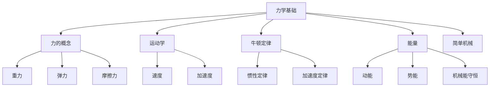
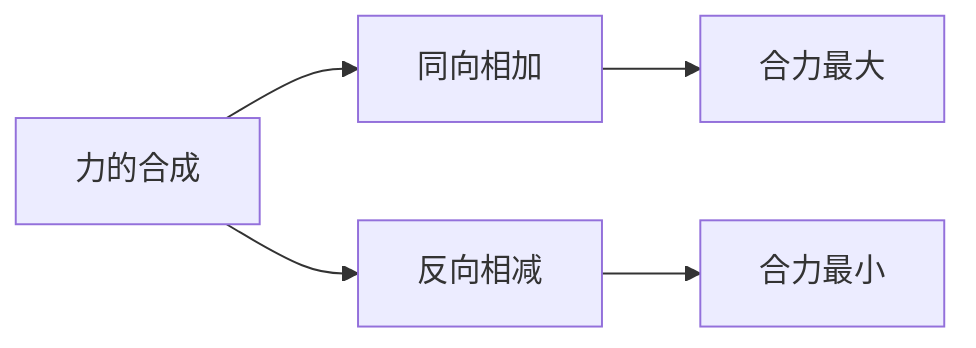
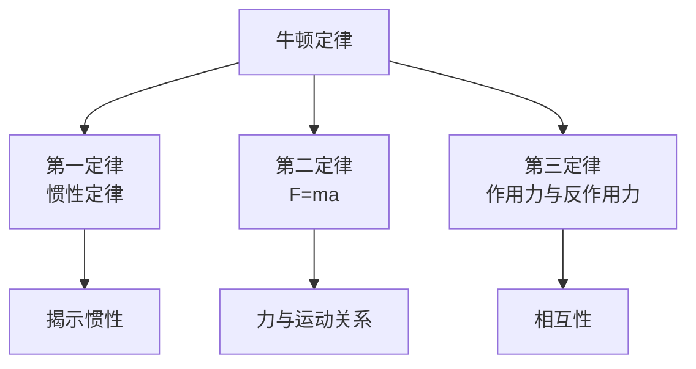
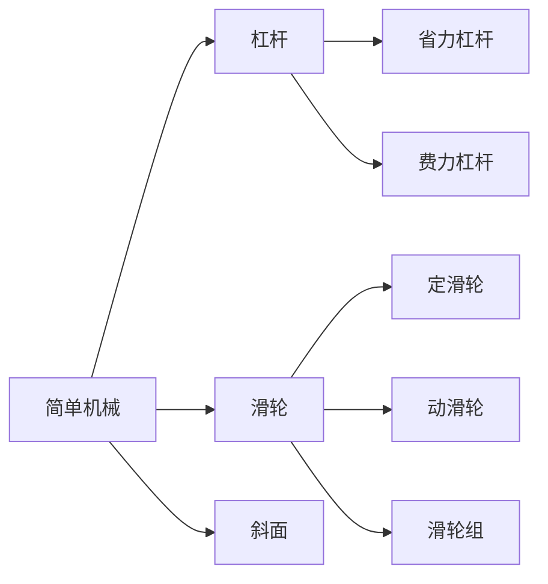

---
aliases:
  - 力学
  - 牛顿定律
  - 运动学
  - 机械能
tags:
created: 2026-05-17
updated: 2026-05-16
  - K12
  - 初中物理
  - 力学
  - 运动
  - 能量
---

# 力学基础 (Mechanics Basics)

## 概述 (Overview)

力学基础是初中物理的核心模块，涵盖**力的概念 (Concept of Force)**、**运动描述 (Description of Motion)**、**牛顿定律 (Newton's Laws)**、**能量转化 (Energy Transformation)**、**动量 (Momentum)** 和**简单机械 (Simple Machines)** 等基础内容。本模块为高中物理力学学习奠定坚实基础。

---

## 一、力的基本概念 (Basic Concepts of Force)

### 1.1 力的定义与性质

**力 (Force)** 是物体对物体的作用，单位是**牛顿 (Newton, N)**。

力的三要素：

| 要素 | 含义 | 表示方法 |
|------|------|----------|
| 大小 (Magnitude) | 力的强弱 | 线段长度 |
| 方向 (Direction) | 力的作用方向 | 箭头指向 |
| 作用点 (Point of Application) | 力作用的位置 | 线段起点 |

### 1.2 常见力的类型

| 力的类型 | 产生原因 | 方向 | 计算公式 |
|----------|----------|------|----------|
| 重力 (Gravity) | 地球吸引 | 竖直向下 | $G = mg$ |
| 弹力 (Elastic Force) | 物体形变 | 与形变方向相反 | $F = kx$ |
| 摩擦力 (Friction) | 接触面粗糙 | 与相对运动方向相反 | - |

其中 $g \approx 9.8 \, \text{N/kg}$，$k$ 为弹簧劲度系数。

### 1.3 力的合成与分解

**合力 (Resultant Force)** 与**分力 (Component Forces)**：

同一直线上二力合成：

$$F_{\text{合}} = F_1 + F_2 \quad (\text{方向相同})$$

$$F_{\text{合}} = |F_1 - F_2| \quad (\text{方向相反})$$

---

## 二、运动学基础 (Kinematics Basics)

### 2.1 机械运动

**机械运动 (Mechanical Motion)** 是物体位置随时间的变化。

运动的描述需要选定**参照物 (Reference Frame)**。

### 2.2 速度与加速度

| 物理量 | 定义 | 公式 | 单位 |
|--------|------|------|------|
| 速度 (Velocity) | 位移与时间的比值 | $v = \frac{s}{t}$ | m/s |
| 平均速度 | 总位移除以总时间 | $\bar{v} = \frac{\Delta s}{\Delta t}$ | m/s |
| 加速度 (Acceleration) | 速度变化率 | $a = \frac{\Delta v}{\Delta t}$ | m/s² |

### 2.3 匀速直线运动

**匀速直线运动 (Uniform Linear Motion)** 的速度公式：

$$s = vt$$

### 2.4 变速直线运动

对于匀变速直线运动：

$$v = v_0 + at$$

$$s = v_0t + \frac{1}{2}at^2$$

$$v^2 - v_0^2 = 2as$$

---

## 三、牛顿运动定律 (Newton's Laws of Motion)

### 3.1 牛顿第一定律（惯性定律）

**牛顿第一定律 (Newton's First Law)**：

> 一切物体在没有受到力的作用时，总保持静止状态或匀速直线运动状态。

**惯性 (Inertia)** 是物体保持原来运动状态的性质，只与质量有关：

$$\text{惯性大小} \propto m$$

### 3.2 牛顿第二定律

**牛顿第二定律 (Newton's Second Law)**：

$$F = ma$$

物体的加速度与所受合力成正比，与质量成反比。

### 3.3 牛顿第三定律

**牛顿第三定律 (Newton's Third Law)**：

> 两个物体之间的作用力和反作用力总是大小相等、方向相反、作用在同一条直线上。

$$F_{\text{作用}} = -F_{\text{反作用}}$$

---

## 四、功和能 (Work and Energy)

### 4.1 功的概念

**功 (Work)** 的定义：

$$W = Fs\cos\theta$$

其中 $\theta$ 为力与位移方向的夹角。

当力与位移同向时：$W = Fs$

单位：**焦耳 (Joule, J)**，$1 \, \text{J} = 1 \, \text{N} \cdot \text{m}$

### 4.2 功率

**功率 (Power)** 表示做功的快慢：

$$P = \frac{W}{t} = Fv$$

单位：**瓦特 (Watt, W)**，$1 \, \text{W} = 1 \, \text{J/s}$

### 4.3 机械能

| 能量形式 | 定义 | 公式 |
|----------|------|------|
| 动能 (Kinetic Energy) | 物体运动具有的能量 | $E_k = \frac{1}{2}mv^2$ |
| 重力势能 (Gravitational PE) | 被举高物体具有的能量 | $E_p = mgh$ |
| 弹性势能 (Elastic PE) | 弹性形变具有的能量 | $E_p = \frac{1}{2}kx^2$ |

### 4.4 机械能守恒定律

在只有重力或弹力做功的情况下：

$$E_{k1} + E_{p1} = E_{k2} + E_{p2}$$

或

$$\frac{1}{2}mv_1^2 + mgh_1 = \frac{1}{2}mv_2^2 + mgh_2$$

---

## 五、简单机械 (Simple Machines)

### 5.1 杠杆

**杠杆 (Lever)** 的五要素：支点、动力、阻力、动力臂、阻力臂。

杠杆平衡条件：

$$F_1 \cdot L_1 = F_2 \cdot L_2$$

| 杠杆类型 | 特点 | 实例 |
|----------|------|------|
| 省力杠杆 | $L_1 > L_2$，省力费距离 | 撬棍、羊角锤 |
| 费力杠杆 | $L_1 < L_2$，费力省距离 | 筷子、钓鱼竿 |
| 等臂杠杆 | $L_1 = L_2$，不省力不费力 | 天平 |

### 5.2 滑轮组

滑轮组的省力情况：

$$F = \frac{G}{n}$$

其中 $n$ 为承担重物的绳子段数。

### 5.3 机械效率

$$\eta = \frac{W_{\text{有用}}}{W_{\text{总}}} \times 100\%$$

---

## 六、实验方法 (Experimental Methods)

### 6.1 测量工具

| 工具 | 测量对象 | 分度值 |
|------|----------|--------|
| 弹簧测力计 | 力的大小 | 0.1 N 或 0.2 N |
| 刻度尺 | 长度 | 1 mm |
| 秒表 | 时间 | 0.1 s |

### 6.2 常见实验

- **测量物体的重力**：$G = mg$
- **探究杠杆平衡条件**
- **测量滑轮组的机械效率**

---

## 参考文献 (References)

1. 义务教育物理课程标准（2022年版）
2. 初中物理力学实验教程
3. 牛顿力学基础
