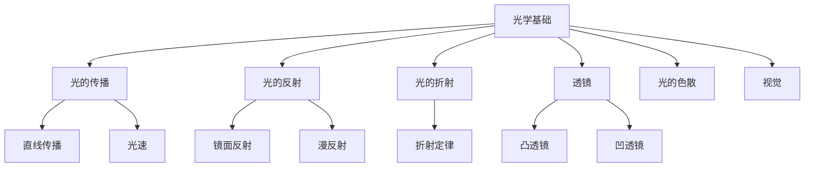
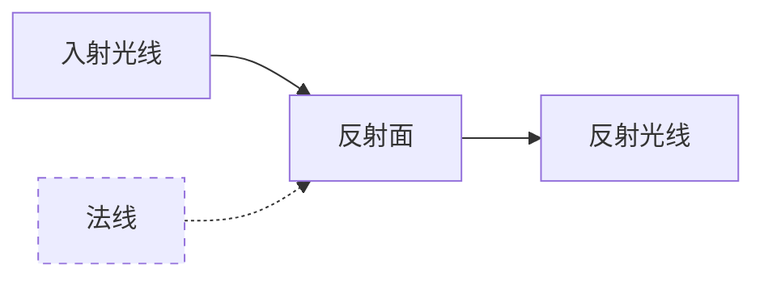
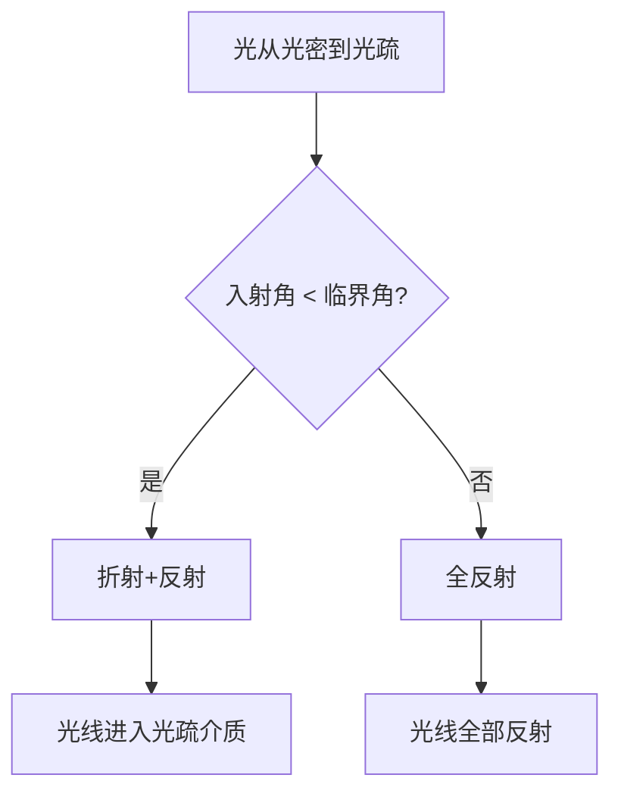
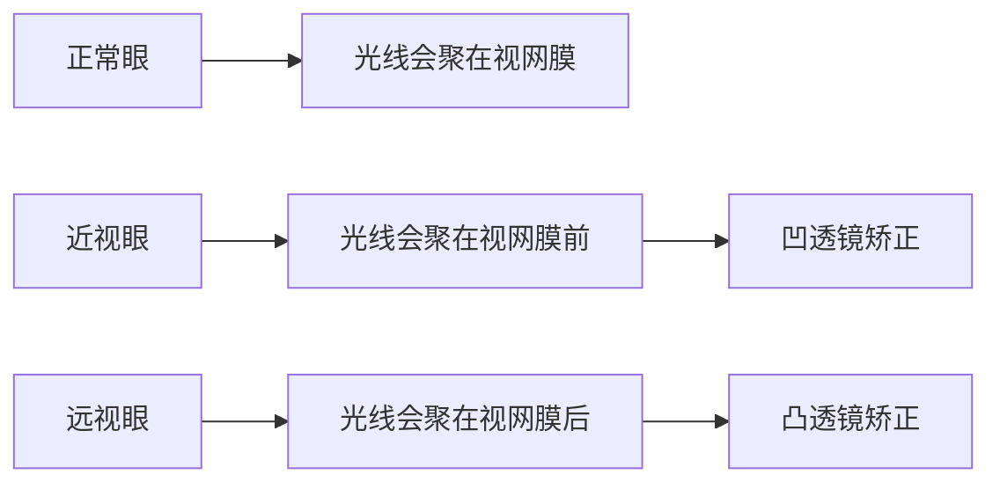

---
aliases:
  - 光学
  - 光的传播
  - 反射与折射
  - 透镜成像
tags:
created: 2026-05-17
updated: 2026-05-17
  - K12
  - 初中物理
  - 光学
  - 几何光学
  - 视觉
---

# 光学基础 (Optics Basics)

## 概述 (Overview)

光学基础是初中物理的重要组成部分，涵盖**光的传播 (Light Propagation)**、**光的反射 (Reflection)**、**光的折射 (Refraction)**、**透镜成像 (Lens Imaging)**、**光的色散 (Dispersion)** 和**视觉原理 (Vision)** 等核心内容。本模块以几何光学为主线，为高中物理光学学习奠定基础。

---

## 一、光的传播 (Light Propagation)

### 1.1 光源与光的直线传播

**光源 (Light Source)**：能够自行发光的物体。

**光的直线传播 (Rectilinear Propagation)**：光在同种均匀介质中沿直线传播。

光的直线传播现象：

| 现象 | 解释 |
|------|------|
| 影子形成 | 光被不透明物体阻挡 |
| 日食、月食 | 天体遮挡关系 |
| 小孔成像 | 光的直线传播形成倒立实像 |

### 1.2 光速

光在真空中的传播速度：

$$c = 3 \times 10^8 \, \text{m/s}$$

光在空气中的速度近似等于 $c$，在其他介质中的速度：

$$v = \frac{c}{n}$$

其中 $n$ 为介质的**折射率 (Refractive Index)**。

---

## 二、光的反射 (Reflection of Light)

### 2.1 反射定律

**光的反射定律 (Law of Reflection)**：

1. 反射光线、入射光线和法线在同一平面内
2. 反射光线和入射光线分居法线两侧
3. **反射角等于入射角**：$\theta_r = \theta_i$

### 2.2 镜面反射与漫反射

| 类型 | 特点 | 实例 |
|------|------|------|
| 镜面反射 (Specular) | 平行入射，平行反射 | 平面镜、平静水面 |
| 漫反射 (Diffuse) | 平行入射，向各个方向反射 | 书本、墙壁 |

### 2.3 平面镜成像

平面镜成像特点：

- 像与物大小相等
- 像与物到镜面距离相等
- 像与物的连线与镜面垂直
- 成**虚像 (Virtual Image)**

---

## 三、光的折射 (Refraction of Light)

### 3.1 折射定律

**光的折射定律 (Law of Refraction)**（斯涅尔定律 Snell's Law）：

$$n_1 \sin\theta_1 = n_2 \sin\theta_2$$

或

$$\frac{\sin\theta_1}{\sin\theta_2} = \frac{n_2}{n_1} = \frac{v_1}{v_2}$$

### 3.2 折射现象

| 现象 | 原理 |
|------|------|
| 水中筷子"弯折" | 光从水中射入空气发生折射 |
| 海市蜃楼 | 空气密度不均匀导致折射 |
| 彩虹 | 水滴折射与色散 |

### 3.3 全反射

当光从光密介质射向光疏介质时，若入射角大于**临界角 (Critical Angle)**：

$$\sin C = \frac{n_2}{n_1} \quad (n_1 > n_2)$$

发生**全反射 (Total Internal Reflection)**。

---

## 四、透镜及其应用 (Lenses and Applications)

### 4.1 透镜类型

| 透镜类型 | 特点 | 对光线作用 |
|----------|------|-----------|
| 凸透镜 (Convex) | 中间厚边缘薄 | 会聚光线 |
| 凹透镜 (Concave) | 中间薄边缘厚 | 发散光线 |

### 4.2 凸透镜成像规律

**透镜成像公式 (Lens Formula)**：

$$\frac{1}{u} + \frac{1}{v} = \frac{1}{f}$$

其中 $u$ 为物距，$v$ 为像距，$f$ 为焦距。

**放大率**：

$$m = \frac{v}{u} = \frac{h'}{h}$$

| 物距范围 | 像距范围 | 像的性质 | 应用 |
|----------|----------|----------|------|
| $u > 2f$ | $f < v < 2f$ | 倒立、缩小、实像 | 照相机 |
| $u = 2f$ | $v = 2f$ | 倒立、等大、实像 | 测焦距 |
| $f < u < 2f$ | $v > 2f$ | 倒立、放大、实像 | 投影仪 |
| $u = f$ | 不成像 | - | 探照灯 |
| $u < f$ | $|v| > u$ | 正立、放大、虚像 | 放大镜 |

### 4.3 眼睛与视力矫正

**眼睛 (Eye)** 的晶状体相当于凸透镜，视网膜相当于光屏。

| 视力问题 | 成因 | 矫正方法 |
|----------|------|----------|
| 近视眼 (Myopia) | 晶状体过凸或眼球前后径过长 | 凹透镜 |
| 远视眼 (Hyperopia) | 晶状体过平或眼球前后径过短 | 凸透镜 |

---

## 五、光的色散 (Dispersion)

### 5.1 光的色散现象

**光的色散 (Dispersion)**：白光通过棱镜分解为七色光的现象。

光谱顺序（从折射率小到大）：

$$\text{红} < \text{橙} < \text{黄} < \text{绿} < \text{蓝} < \text{靛} < \text{紫}$$

### 5.2 光的三原色

**光的三原色 (Primary Colors of Light)**：红、绿、蓝（RGB）。

颜料的三原色：红、黄、蓝。

### 5.3 物体的颜色

- **透明物体**：颜色由透过的色光决定
- **不透明物体**：颜色由反射的色光决定

---

## 六、光学实验 (Optical Experiments)

### 6.1 常用实验器材

| 器材 | 用途 |
|------|------|
| 光具座 | 研究透镜成像规律 |
| 平面镜 | 研究光的反射 |
| 玻璃砖 | 研究光的折射 |
| 三棱镜 | 研究光的色散 |

### 6.2 实验注意事项

1. **器材共轴调节**：蜡烛、透镜、光屏中心在同一高度
2. **缓慢调节**：移动蜡烛或光屏时动作要轻缓
3. **准确读数**：注意光具座刻度读数方法

---

## 参考文献 (References)

1. 义务教育物理课程标准（2022年版）
2. 初中物理光学实验指导
3. 几何光学基础教程

