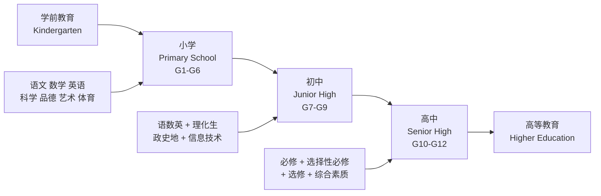
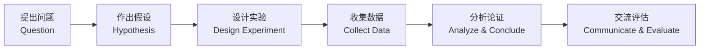

---
aliases: [LearningPath]
tags: ['LearningPath']
created: 2026-05-17
updated: 2026-05-17
---

# K12 学习路径 (K12 Learning Path)

## 概述

K12 学习路径 (K12 Learning Path) 涵盖从幼儿园 (Kindergarten) 到高中三年级 (Grade 12) 的基础教育全过程。在中国教育体系中，K12 包括小学 (Primary School, 6 年)、初中 (Junior High School, 3 年) 和高中 (Senior High School, 3 年) 三个阶段。本文档提供系统性的课程结构、学习规划、考试备考和技能发展指南，帮助学生、家长和教师建立清晰的学习发展蓝图。

基础教育阶段的核心目标是培养学生的核心素养 (Core Competencies)，包括文化基础、自主发展和社会参与三个维度。根据《中国学生发展核心素养》框架，学生应逐步发展人文底蕴、科学精神、学会学习、健康生活、责任担当和实践创新六大素养。

## 教育阶段结构

### 小学阶段 (Primary School)

| 年级 | 核心任务 | 学科重点 | 能力发展 |
|------|---------|---------|---------|
| 低年级 (G1-G2) | 适应学校生活、培养学习习惯 | 识字阅读、基础运算 | 专注力、自理能力 |
| 中年级 (G3-G4) | 夯实基础、拓展兴趣 | 阅读理解、写作入门、四则运算 | 逻辑思维、表达能力 |
| 高年级 (G5-G6) | 系统整合、预备小升初 | 综合阅读、分数小数、简单几何 | 自主学习能力、时间管理 |

**小学阶段关键指标**：
- 识字量：G6 达到 3000 个常用汉字
- 阅读量：年均课外阅读不少于 100 万字
- 英语：G6 达到二级水平，掌握 600~700 个词汇
- 数学：掌握整数、小数、分数四则运算，基础几何知识

### 初中阶段 (Junior High School)

初中是学科分化与思维转型的关键期，学生从小学的综合学习过渡到分科深度学习。

| 学科 | 核心内容 | 中考要求 |
|------|---------|---------|
| 语文 | 文言文阅读、现代文阅读、写作 | 基础知识、阅读理解、作文 |
| 数学 | 代数、几何、函数入门 | 运算能力、逻辑推理、应用题 |
| 英语 | 语法体系、阅读理解、书面表达 | 听力、阅读、写作、口语 |
| 物理 (G8-G9) | 力学、光学、电学基础 | 实验探究、计算分析 |
| 化学 (G9) | 物质构成、化学反应基础 | 基本概念、实验操作 |
| 生物 | 生命现象、生态系统 | 识图、实验分析 |
| 历史 | 中国古代史、近现代史、世界史 | 时空观念、史料实证 |
| 地理 | 自然地理、人文地理、区域地理 | 读图分析、综合思维 |
| 道德与法治 | 法律基础、国情教育 | 知识运用、价值判断 |

**初中学习策略**：
- **建立错题本**：系统整理各科错题，定期回顾
- **思维导图**：用可视化工具梳理知识体系
- **时间管理**：制定周计划与日计划，合理分配各科学习时间
- **主动提问**：课堂上积极思考，课后及时解决疑问

### 高中阶段 (Senior High School)

高中是知识体系构建和升学准备的核心阶段。新高考改革后，全国多数省份实行"3+1+2"或"3+3"选科模式。

**"3+1+2"模式**：
- "3"：语文、数学、外语（必考）
- "1"：物理或历史（首选科目）
- "2"：化学、生物、政治、地理中任选两门（再选科目）

| 年级 | 学习重点 | 关键事件 |
|------|---------|---------|
| 高一 (G10) | 适应高中节奏、完成选科 | 选科分班、学业水平合格考 |
| 高二 (G11) | 深度学习、构建知识网络 | 学业水平等级考、竞赛准备 |
| 高三 (G12) | 系统复习、高考冲刺 | 一轮/二轮/三轮复习、高考 |

**高中核心能力要求**：
- **语文**：思辨性阅读、议论文写作、古诗文鉴赏
- **数学**：函数与导数、解析几何、概率统计、数列
- **英语**：学术阅读、高级语法、书面表达（议论文/应用文）
- **理科综合**：物理建模、化学实验设计、生物信息分析
- **文科综合**：历史解释、地理综合思维、政治论证

## 学科学习指南

### 语文学习路径

| 阶段 | 重点能力 | 学习方法 |
|------|---------|---------|
| 小学 | 大量阅读、规范书写、口头表达 | 绘本阅读、背诵经典、日记写作 |
| 初中 | 文言文基础、阅读理解策略、记叙文写作 | 精读名著、文言文翻译训练、仿写 |
| 高中 | 批判性阅读、议论文写作、古诗文深度鉴赏 | 整本书阅读、时评写作、古汉语语法 |

**推荐书目**：
- 小学：《西游记》（少儿版）、《草房子》、《小王子》
- 初中：《朝花夕拾》、《骆驼祥子》、《傅雷家书》
- 高中：《红楼梦》、《乡土中国》、《百年孤独》

### 数学学习路径

数学学习强调概念理解、逻辑推理和问题解决能力的递进发展。

$$\text{数学能力} = f(\text{概念理解}, \text{运算技能}, \text{逻辑推理}, \text{数学建模})$$

| 阶段 | 核心内容 | 思维要求 |
|------|---------|---------|
| 小学 | 数与代数、图形与几何、统计与概率 | 具体运算思维 |
| 初中 | 方程与不等式、函数、平面几何、统计 | 抽象逻辑思维 |
| 高中 | 函数与导数、立体几何、解析几何、概率统计 | 形式运算思维、数学抽象 |

### 英语学习路径

| 阶段 | 语言技能 | 词汇量目标 | 考试对标 |
|------|---------|----------|---------|
| 小学 G6 | 听说为主，读写入门 | 600~700 | 二级 |
| 初中 G9 | 四项技能均衡发展 | 1500~1600 | 五级 |
| 高中 G12 | 学术英语能力 | 3000~3500 | 六级/高考 |

**英语学习建议**：
- 小学阶段注重听力输入和口语表达
- 初中阶段系统学习语法，扩大阅读量
- 高中阶段加强学术阅读和议论文写作

## 考试与升学规划

### 中考 (High School Entrance Examination)

中考是初中升高中的选拔性考试，由各省市自主命题或统考。

| 项目 | 说明 |
|------|------|
| 考试科目 | 语文、数学、英语、物理、化学（部分地区含体育、实验操作） |
| 考试形式 | 笔试为主，部分科目机考 |
| 录取方式 | 统招、指标到校、特长生、自主招生 |
| 备考时间 | 初三下学期系统复习，约 3~4 个月 |

**中考备考策略**：
1. **一轮复习 (G9 上学期~寒假)**：梳理教材，夯实基础
2. **二轮复习 (寒假~4 月)**：专题突破，攻克难点
3. **三轮复习 (5 月~考前)**：模拟训练，调整心态

### 高考 (National College Entrance Examination, Gaokao)

高考是中国大陆普通高等学校招生全国统一考试，是高中升大学的最主要途径。

| 项目 | 说明 |
|------|------|
| 考试科目 | "3+1+2" 或 "3+3" 模式，总分 750 |
| 考试时间 | 每年 6 月 7~9 日（传统高考），新高考省份 3~4 天 |
| 录取批次 | 提前批、本科一批、本科二批、专科批（新高考为分段录取） |
| 特殊招生 | 强基计划、综合评价、高水平艺术团/运动队 |

**高考复习规划**：

| 阶段 | 时间 | 重点任务 |
|------|------|---------|
| 一轮复习 | 高三上学期 | 全面梳理教材知识点，建立知识框架 |
| 二轮复习 | 寒假~4 月 | 专题突破，强化综合能力，刷真题 |
| 三轮复习 | 5 月~考前 | 保温训练，错题回顾，心理调适 |

## 核心素养与技能发展

### 信息素养 (Information Literacy)

| 年级 | 技能目标 |
|------|---------|
| 小学 | 基本操作、打字、简单编程思维（Scratch） |
| 初中 | Office 办公、网络信息检索与甄别、Python 基础 |
| 高中 | 数据处理、信息可视化、算法与程序设计 |

### 科学探究能力

科学探究遵循以下流程：

### 批判性思维 (Critical Thinking)

批判性思维是 21 世纪核心技能之一，培养路径：
- **质疑精神**：不盲从权威，敢于提问
- **证据意识**：观点需有事实和数据支撑
- **逻辑分析**：识别论证中的前提、假设和结论
- **多角度思考**：理解不同立场的合理性

### 社会情感学习 (Social-Emotional Learning, SEL)

| 维度 | 能力 |
|------|------|
| 自我认知 | 了解自身情绪、优势与局限 |
| 自我管理 | 调节情绪、设定目标、自我激励 |
| 社会认知 | 理解他人观点、认识社会规范 |
| 人际关系 | 建立积极关系、有效沟通、合作 |
| 决策能力 | 负责任地做出决策、解决问题 |

## 综合素质评价

新高考改革强调"两依据一参考"：依据统一高考成绩、依据高中学业水平考试成绩，参考学生综合素质评价。

**综合素质评价内容**：

| 维度 | 记录内容 |
|------|---------|
| 思想品德 | 党团活动、公益活动、志愿服务 |
| 学业水平 | 课程成绩、研究性学习、学科竞赛 |
| 身心健康 | 体质测试、心理健康、运动特长 |
| 艺术素养 | 艺术课程、艺术活动、艺术特长 |
| 社会实践 | 研学旅行、社会调查、职业体验 |

## 学习资源推荐

### 教材与课程标准

- 国家统编教材（语文、历史、政治）
- 人教版、北师大版、苏教版等各科教材
- 《义务教育课程标准》(2022 版)
- 《普通高中课程标准》(2017 版，2020 修订)

### 在线学习平台

| 平台 | 特点 | 适用 |
|------|------|------|
| 国家中小学智慧教育平台 | 官方资源，覆盖全学科全学段 | 全阶段 |
| Khan Academy | 英文原版，数学科学可视化 | 英语能力强者 |
| 可汗学院中文版 | 中文翻译，免费学习 | 数学、科学 |
| 中国大学 MOOC | 大学先修课程 | 高中拓展 |

### 竞赛与拓展

| 竞赛类型 | 代表竞赛 | 适合学生 |
|---------|---------|---------|
| 数学竞赛 | 全国高中数学联赛 | 数学特长，目标强基计划 |
| 物理竞赛 | 全国中学生物理竞赛 (CPhO) | 物理特长 |
| 信息学竞赛 | NOIP / NOI | 编程特长 |
| 科技创新 | 青少年科技创新大赛 | 科研兴趣浓厚 |

## 相关条目

- [[PrimarySchool]]
- [[JuniorHigh]]
- [[SeniorHigh]]
- [[ExamPreparation]]
- [[STEMEducation]]
- [[00_KnowledgeFramework/Methodology/CriticalThinking|CriticalThinking]]
- [[INDEX|K12 索引]]

