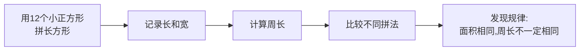

# 数学实验与探究

## 概述

数学实验与探究（Math Experiments and Exploration）通过动手操作、观察发现、合作讨论的方式，帮助学生理解数学概念，培养逻辑思维和问题解决能力。

---

## 一、数与运算实验

### 1. 百数表探秘

| 1 | 2 | 3 | 4 | 5 | 6 | 7 | 8 | 9 | 10 |
|---|---|---|---|---|---|---|---|---|---|
| 11 | 12 | 13 | 14 | 15 | 16 | 17 | 18 | 19 | 20 |
| 21 | 22 | 23 | 24 | 25 | 26 | 27 | 28 | 29 | 30 |
| 31 | 32 | 33 | 34 | 35 | 36 | 37 | 38 | 39 | 40 |
| 41 | 42 | 43 | 44 | 45 | 46 | 47 | 48 | 49 | 50 |
| 51 | 52 | 53 | 54 | 55 | 56 | 57 | 58 | 59 | 60 |
| 61 | 62 | 63 | 64 | 65 | 66 | 67 | 68 | 69 | 70 |
| 71 | 72 | 73 | 74 | 75 | 76 | 77 | 78 | 79 | 80 |
| 81 | 82 | 83 | 84 | 85 | 86 | 87 | 88 | 89 | 90 |
| 91 | 92 | 93 | 94 | 95 | 96 | 97 | 98 | 99 | 100 |

**探究活动**：

- 圈出所有偶数，观察分布规律
- 用彩色笔标记3的倍数，发现对角线规律
- 找一找：每一行相邻两个数相差多少？每一列呢？

### 2. 数的拆分与组合

用实物（积木、豆子、硬币）进行拆分实验：

$$10 = 1 + 9 = 2 + 8 = 3 + 7 = 4 + 6 = 5 + 5$$

$$10 = 10 - 0 = 9 - (-1) = \cdots$$

**动手操作**：用10个小圆片，分成两堆，记录所有分法。

### 3. 估算实验

| 物品 | 估计值 | 实际值 | 误差 |
|------|--------|--------|------|
| 教室长度（步） | | | |
| 一本书的页数 | | | |
| 一袋糖果的数量 | | | |

**方法**：先猜测，再验证，分析为什么有误差。

---

## 二、图形与几何实验

### 1. 周长与面积的探究

用方格纸探究长方形周长与面积的关系：



**实验记录表**：

| 长 | 宽 | 面积 | 周长 |
|---|---|------|------|
| 12 | 1 | 12 | 26 |
| 6 | 2 | 12 | 16 |
| 4 | 3 | 12 | 14 |

**发现**：面积相等时，长和宽越接近，周长越小。

### 2. 图形密铺实验

探究哪些正多边形可以密铺（Tessellation）：

| 图形 | 内角度数 | 能否密铺 | 原因 |
|------|---------|---------|------|
| 正三角形 | 60° | 能 | 6个拼成360° |
| 正方形 | 90° | 能 | 4个拼成360° |
| 正五边形 | 108° | 不能 | 不能整除360° |
| 正六边形 | 120° | 能 | 3个拼成360° |

### 3. 对称图形制作

**活动步骤**：

1. 将纸对折
2. 沿折痕剪出图形的一半
3. 展开得到完整对称图形
4. 标记对称轴

---

## 三、测量实验

### 1. 长度的测量

| 测量对象 | 估计长度 | 测量工具 | 实际长度 |
|---------|---------|---------|---------|
| 课桌高度 | cm | 直尺 | cm |
| 铅笔长度 | cm | 直尺 | cm |
| 操场一圈 | m | 卷尺 | m |

**单位换算**：

$$1\text{km} = 1000\text{m}, \quad 1\text{m} = 10\text{dm} = 100\text{cm} = 1000\text{mm}$$

### 2. 时间与速度实验

**实验**：测量走路速度

1. 测量50米距离
2. 用秒表计时走路所需时间
3. 计算速度：

$$v = \frac{s}{t}$$

其中 $v$ 是速度，$s$ 是路程，$t$ 是时间。

**比较**：慢走vs快走vs跑步的速度差异。

### 3. 容量与体积实验

用不同形状的容器比较容量：

```
一个高瘦的瓶子和一个矮胖的瓶子
到底哪个装的水更多？
——通过倒水实验来验证
```

---

## 四、统计与概率实验

### 1. 掷骰子实验

**理论概率**：

掷一个标准骰子，每个数字朝上的概率：

$$P(\text{每个数字}) = \frac{1}{6}$$

**实验记录**：

| 数字 | 出现次数 | 频率 |
|------|---------|------|
| 1 | | |
| 2 | | |
| 3 | | |
| 4 | | |
| 5 | | |
| 6 | | |

**发现**：投掷次数越多，频率越接近理论概率。

### 2. 摸球实验

在不透明袋中放入不同颜色的球，记录摸出结果。

| 球的组成 | 摸10次结果 | 摸50次结果 | 理论概率 |
|---------|-----------|-----------|---------|
| 3红+2蓝 | | | 红: 3/5, 蓝: 2/5 |
| 5黄+5绿 | | | 黄: 1/2, 绿: 1/2 |

### 3. 数据收集与图表制作

**活动**：调查全班同学的身高


**分析角度**：
- 最高和最矮相差多少（极差）
- 大多数同学的身高范围
- 平均身高是多少

---

## 五、找规律（Patterns）

### 1. 数列规律

**等差数列**：

$$2, 4, 6, 8, 10, \dots$$

规律：每次增加2，通项公式为 $a_n = 2n$

**等比数列**：

$$1, 2, 4, 8, 16, \dots$$

规律：每次乘以2，通项公式为 $a_n = 2^{n-1}$

**斐波那契数列（Fibonacci Sequence）**：

$$1, 1, 2, 3, 5, 8, 13, 21, \dots$$

规律：每一项等于前两项之和，即 $F_n = F_{n-1} + F_{n-2}$

### 2. 图形规律

**探究活动**：观察图形序列中的模式

```
图案1: ■
图案2: ■ ■
图案3: ■ ■ ■
图案4: ■ ■ ■ ■

第n个图案有 n 个方块
```

### 3. 生活中的规律

| 场景 | 规律描述 | 数学表达 |
|------|---------|---------|
| 年月日 | 每年12个月 | 周期性 |
| 钟表 | 每60分钟1小时 | 60进制 |
| 年轮 | 每圈代表1年 | 一一对应 |

---

## 六、逻辑推理

### 1. 分类与归纳

**活动**：将以下物品分类

```
苹果、香蕉、白菜、萝卜、橘子、菠菜、草莓、土豆
```

- 水果：苹果、香蕉、橘子、草莓
- 蔬菜：白菜、萝卜、菠菜、土豆

### 2. 找不同

找出下列各组中不同的一个，并说明理由：

- 3, 6, 9, 12, 15, 18 （都是3的倍数）
- 2, 4, 8, 16, 32, 64 （都是2的乘方）
- 1, 4, 9, 16, 25, 36 （都是完全平方数）

### 3. 简单推理题

**例题**：三个小朋友比身高，已知：
- 小明比小红高
- 小红比小刚高
- 请问谁最高？谁最矮？

**推理**：小明 > 小红 > 小刚
- 最高：小明
- 最矮：小刚

---

## 七、综合实践活动

### 1. 小小商店

模拟购物活动，练习加减法和人民币换算。

| 商品 | 价格 |
|------|------|
| 铅笔 | 1元 |
| 橡皮 | 2元 |
| 尺子 | 3元 |
| 笔记本 | 5元 |
| 书包 | 30元 |

**问题**：用50元买一个书包和一本笔记本，还剩多少钱？

$$50 - (30 + 5) = 50 - 35 = 15\text{元}$$

### 2. 校园测量

测量校园中以下物体的数据：

| 物体 | 测量结果 | 单位 |
|------|---------|------|
| 旗杆高度 | | 米 |
| 花坛周长 | | 米 |
| 篮球场面积 | | 平方米 |

### 3. 数学日记

记录一天中遇到的数学问题：

```
早上7:00起床（时间）
早餐花了12元（人民币）
从家到学校走了15分钟（时间）
数学课学了分数的加减法
```

## 相关条目

[[Arithmetic]], [[GeometryBasics]], [[WordProblems]], [[练习题与解析]]
