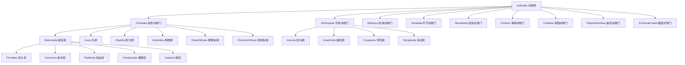

# 动物分类学

动物分类学（Animal Taxonomy / Systematics）是研究动物多样性及演化关系的科学，旨在对动物进行鉴定（Identification）、描述（Description）、命名（Nomenclature）和分类（Classification），从而建立能够反映自然演化历史的分类系统。这是生物学研究的基础性学科。

## 分类学的基本层次

按照林奈分类法（Linnaean Taxonomy）的惯例，生物的分类阶元从大到小排列为：

$$ \text{界（Kingdom）} \rightarrow \text{门（Phylum）} \rightarrow \text{纲（Class）} \rightarrow \text{目（Order）} \rightarrow \text{科（Family）} \rightarrow \text{属（Genus）} \rightarrow \text{种（Species）} $$

记忆口诀："King Philip Came Over For Good Soup"（王 菲利普 来 要 好 汤）

### 动物分类层次树



## 双名法（Binomial Nomenclature）

由瑞典植物学家卡尔·林奈（Carl Linnaeus）系统化推广的命名规则：

$$ \text{Homo sapiens} \quad (\text{智人}) $$

- **属名（Genus）**：首字母大写，斜体
- **种名（Species epithet）**：首字母小写，斜体
- **命名人**：可加在种名后（通常缩写，非斜体）

完整引用示例：

$$ \text{Canis lupus Linnaeus, 1758} $$

**分类学命名规则要点**：
- 属级以上名称首字母大写，正体
- 属和种级名称必须斜体
- 种级以下（亚种）用三名法：Canis lupus familiaris
- 首次描述后可在种名后加命名人和年份
- 同物异名（Synonym）和异物同名（Homonym）需优先律处理

## 物种概念（Species Concept）

### 生物学物种概念（BSC）

$$ \text{物种} = \text{能够相互交配并产生可育后代的最大自然群体} $$

（Mayr, 1942）

### 其他物种概念

| 概念 | 核心标准 | 局限性 |
|------|---------|--------|
| 形态学物种（MSC） | 形态特征差异 | 隐存种（Cryptic Species）无法区分 |
| 系统发育物种（PSC） | 最小单系群（基于 DNA） | 数据需求高，谱系分选问题 |
| 生态学物种（ESC） | 生态位差异 | 生态位难以精确量化 |
| 进化物种概念 | 独立进化历史 | 时间尺度难以界定 |

## 无脊椎动物主要类群

| 门 | 代表动物 | 关键特征 | 已知种数 |
|----|---------|---------|---------|
| 海绵动物门（Porifera） | 海绵 | 固着生活、无组织分化 | 约 9000 |
| 刺胞动物门（Cnidaria） | 水母、珊瑚、海葵 | 刺细胞、辐射对称 | 约 11000 |
| 扁形动物门（Platyhelminthes） | 涡虫、绦虫、吸虫 | 三胚层、两侧对称 | 约 20000 |
| 线虫动物门（Nematoda） | 蛔虫、钩虫 | 假体腔、细胞数量固定 | 约 25000 |
| 环节动物门（Annelida） | 蚯蚓、沙蚕、水蛭 | 真体腔、体节分节 | 约 17000 |
| 软体动物门（Mollusca） | 蜗牛、蛤蜊、章鱼 | 外套膜、贝壳 | 约 85000 |
| 节肢动物门（Arthropoda） | 昆虫、蜘蛛、虾蟹 | 外骨骼、分节附肢 | 约 120万+ |
| 棘皮动物门（Echinodermata） | 海星、海胆、海参 | 五辐对称、水管系统 | 约 7000 |

## 脊椎动物演化脉络

$$ \text{鱼类（无颌→有颌→软骨→硬骨）} \rightarrow \text{两栖类} \rightarrow \text{爬行类} \rightarrow \begin{cases} \text{鸟类} \\ \text{哺乳类} \end{cases} $$

### 脊椎动物五大纲的比较

| 特征 | 鱼类 | 两栖类 | 爬行类 | 鸟类 | 哺乳类 |
|------|------|--------|--------|------|--------|
| 皮肤 | 鳞片 | 湿润无鳞 | 角质鳞片 | 羽毛 | 毛发 |
| 呼吸 | 鳃 | 肺 + 皮肤 | 肺（不发达） | 肺（气囊） | 肺（膈肌） |
| 心脏 | 2腔 | 3腔 | 3腔（不完全隔） | 4腔 | 4腔 |
| 温度 | 变温 | 变温 | 变温 | 恒温 | 恒温 |
| 繁殖 | 卵生 | 卵生 | 卵生（羊膜卵） | 卵生 | 胎生（多数） |
| 受精 | 体外 | 体外 | 体内 | 体内 | 体内 |
| 四肢 | 鳍 | 四肢 | 四肢 | 前肢为翼 | 四肢 |

## 现代分类学方法

### 系统发育（Phylogenetics）

通过 DNA 序列数据重建物种间的演化关系，使用最大简约法（Maximum Parsimony）、最大似然法（Maximum Likelihood）或贝叶斯推断（Bayesian Inference）。

$$ \text{DNA 序列差异} \rightarrow \text{遗传距离} \rightarrow \text{系统发育树} $$

**系统发育树的解读**：
- 分支点（node）表示共同祖先
- 分支长度表示演化距离
- 单系群（monophyly）包含共同祖先及其所有后代
- 并系群（paraphyly）包含共同祖先但缺少部分后代
- 多系群（polyphyly）不包含最近共同祖先

### 分子钟（Molecular Clock）

$$ K = 2\mu T $$

其中 $K$ 为两个物种间的同义替换数，$\mu$ 为每单位时间的突变率，$T$ 为分歧时间。

### 分支分类学（Cladistics）

- 共近裔性状（Synapomorphy）：用于定义单系群
- 共近祖性状（Symplesiomorphy）：不能用于分类
- 外群比较（Outgroup comparison）：确定性状极性

## 高中考点

1. 分类阶元的层次排序
2. 双名法的书写规范
3. 脊椎动物各纲的特征对比
4. 无脊椎动物主要门类的代表动物和关键特征
5. 检索表的编制与使用
6. 脊椎动物的演化趋势
7. 恒温动物与变温动物的区别与适应意义

## 检索表的类型

- **二歧检索表**（Dichotomous Key）：最常见的类型，每一步提供两个对立特征选项
- **多歧检索表**（Polytomous Key）：每个节点有多于两个选项
- **图形检索表**：使用图片和流程图辅助识别

**二歧检索表示例**：

```
1a. 有脊椎骨 ………………………… 脊椎动物
1b. 无脊椎骨 ………………………… 无脊椎动物
    2a. 体节分节 ……………………… 环节动物
    2b. 体节不分节
        3a. 有外骨骼 ………………… 节肢动物
        3b. 无外骨骼 ………………… 软体动物
```

## 相关条目

- [[动物行为学]]
- [[INDEX|当前目录索引]]
